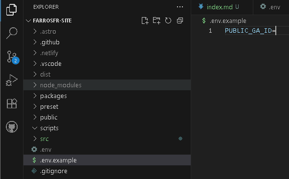
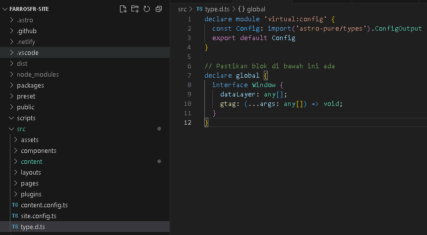
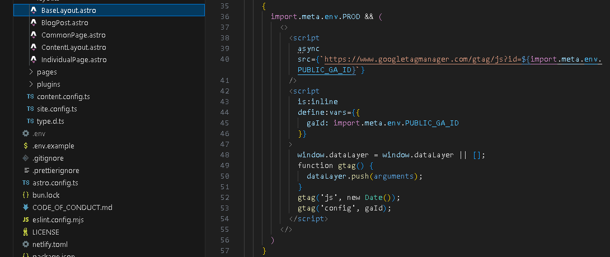
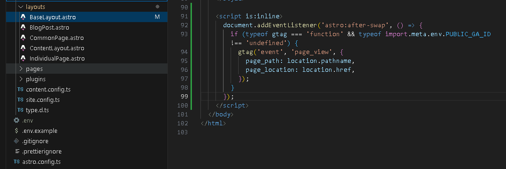
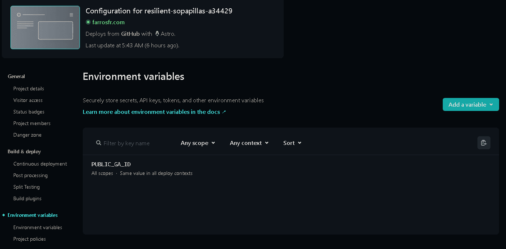
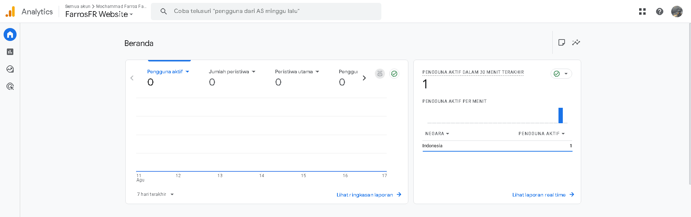

Hello everyone, in this article, we'll cover how to integrate Google Analytics into your Astro project.

Here, we'll discuss how to leverage Astro's features: **centralized layouts**, **environment variables**, and handling **View Transitions**. Let's get started!

-----

## **Prerequisites**

Before proceeding, ensure you have the following:

1. An existing Astro project.
2. A Google Analytics (GA4) account.
3. Your **Measurement ID** (typically in the `G-XXXXXXXXXX` format).

-----

## **Step 1: Configure Environment Variables for Security**

Hardcoding sensitive keys or IDs directly into your source code is poor practice. Instead, we'll use environment variables.

1. Create a new file in your project's root directory (at the same level as `package.json`) and name it `.env`.

2. Add your Measurement ID to this file in the following format:

    ```ini
    # .env
    PUBLIC_GA_ID=G-XXXXXXXXXX
    ```

    Replace `G-XXXXXXXXXX` with your actual ID. The `PUBLIC_` prefix is a specific Astro instruction that makes the variable accessible on the client-side (in the browser).

3. Remember to add `.env` to your `.gitignore` file to prevent it from being committed to your Git repository.



-----

## **Step 2: Add Global Types for TypeScript**

If your project uses TypeScript (as most Astro projects do), you need to inform the TypeScript compiler about the global variables (`gtag` and `dataLayer`) that the Google script will create. This prevents errors during development.

Open your `src/env.d.ts` or `src/types.d.ts` file and add the following global declaration:

```typescript
// src/env.d.ts or src/types.d.ts

declare global {
  interface Window {
    dataLayer: any[];
    gtag: (...args: any[]) => void;
  }
}
```



-----

## **Step 3: Implement in the Base Layout (`BaseLayout.astro`)**

A core principle of Astro is DRY (*Don't Repeat Yourself*). Therefore, we will add the Google Analytics script **only once** in a base layout file that is used by all pages. Typically, this file is `src/layouts/BaseLayout.astro`.

Open your `BaseLayout.astro` file and add the following code block inside the `<head>` tag:

```astro
---
// BaseLayout.astro frontmatter
---
<html lang="en">
  <head>
    {/* ...other head tags... */}

    {/* ===== Google Analytics Script Block ===== */}
    {
      import.meta.env.PROD && (
        <>
          <script
            async
            src={`https://www.googletagmanager.com/gtag/js?id=${import.meta.env.PUBLIC_GA_ID}`}
          />
          <script
            is:inline
            define:vars={{
              gaId: import.meta.env.PUBLIC_GA_ID,
            }}
          >
            window.dataLayer = window.dataLayer || [];
            function gtag() {
              dataLayer.push(arguments);
            }
            gtag("js", new Date());
            gtag("config", gaId);
          </script>
        </>
      )
    }
    {/* ======================================= */}
  </head>
  <body>
    {/* ...body content... */}
  </body>
</html>
```

**Code Explanation:**

- `import.meta.env.PROD && (...)`: Ensures the script only runs when the project is built for production, not during local development.
- `import.meta.env.PUBLIC_GA_ID`: Retrieves the ID from the `.env` file we created earlier.
- `is:inline`: An essential Astro attribute that prevents Astro from processing the script, injecting it directly into the final HTML.



-----

## **Step 4: Handle Modern Navigation (View Transitions)**

Many modern Astro sites use View Transitions for smoother navigation without full page reloads. This can prevent Google Analytics from tracking page changes. The solution is to listen for Astro's navigation events.

Add the following script inside the `<body>` tag of your `BaseLayout.astro` file (placing it just before the closing `</body>` tag is good practice):

```astro
{/* ...inside the <body>... */}

<script is:inline>
  document.addEventListener('astro:after-swap', () => {
    if (typeof gtag === 'function' && typeof import.meta.env.PUBLIC_GA_ID !== 'undefined') {
      gtag('event', 'page_view', {
        page_path: location.pathname,
        page_location: location.href,
      });
    }
  });
</script>
```

This script manually sends a `page_view` event to Google Analytics every time an Astro page transition completes.



-----

## **Step 5: Configure Your Hosting Platform (Netlify Example)**

Since `.env` is not committed, how does the live server know your Analytics ID? You need to add it to your hosting platform's settings. Here’s how to do it on Netlify:

1. Log in to your Netlify dashboard.
2. Select your site, then navigate to **Site configuration > Build & deploy > Environment variables**.
3. Click **"Add a variable"**.
4. Fill in the *Key* as `PUBLIC_GA_ID` and the *Value* with `G-XXXXXXXXXX`.
5. Save and trigger a new deploy to apply the changes.



-----

## **Verification**

After deploying your site, don't panic if the standard reports in Google Analytics are empty. It can take up to 48 hours for data to appear.

Use the **Realtime** report for instant verification:

1. Open Google Analytics > **Reports > Realtime**.
2. Open your live site in another browser tab and navigate through a few pages.
3. You should see your activity appear in the Realtime report within seconds. If so, congratulations, your installation is successful!



-----

## **Conclusion**

By following these steps, you have successfully integrated Google Analytics into your Astro project in a clean, secure, and maintainable way. This method not only ensures accurate data tracking but also keeps your codebase professional and tidy.

> Alhamdulilah. Hope it useful!

## Image Source

[developer.google.com](https://developers.google.com/analytics/images/landing-page/Rectangular-16x9/E02877824-GMP-Google-Analytics-Help-Center-Assets-Apr23-Graphic-1.1@300x.svg)
