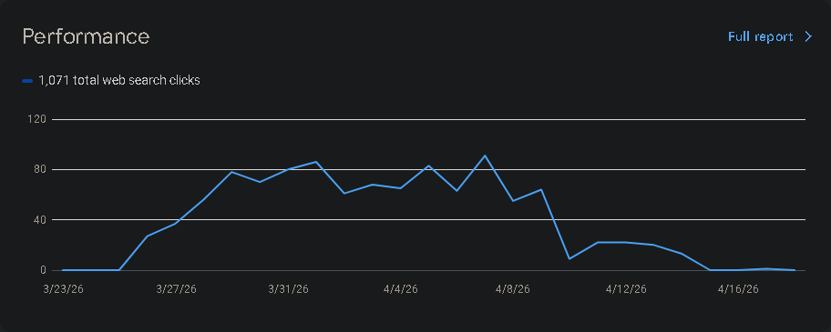
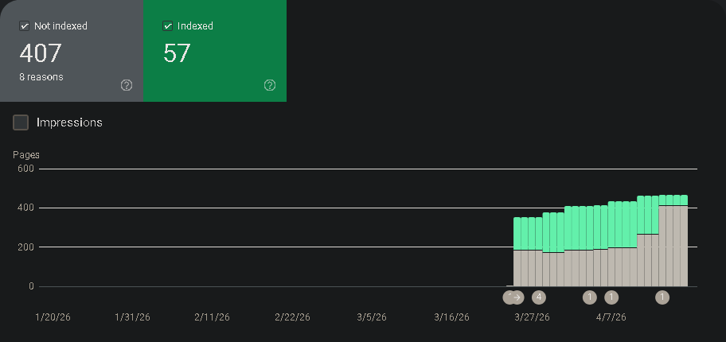
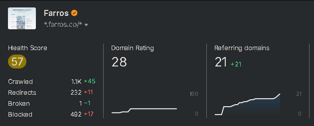
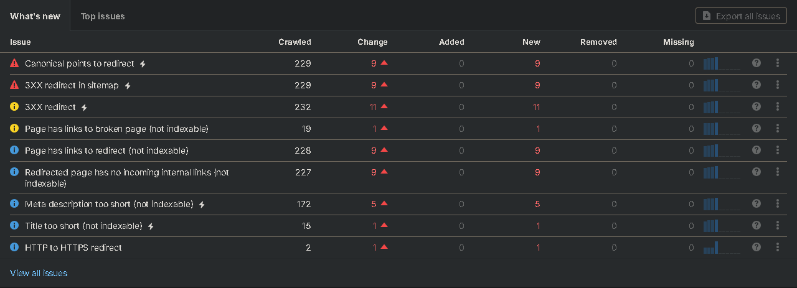
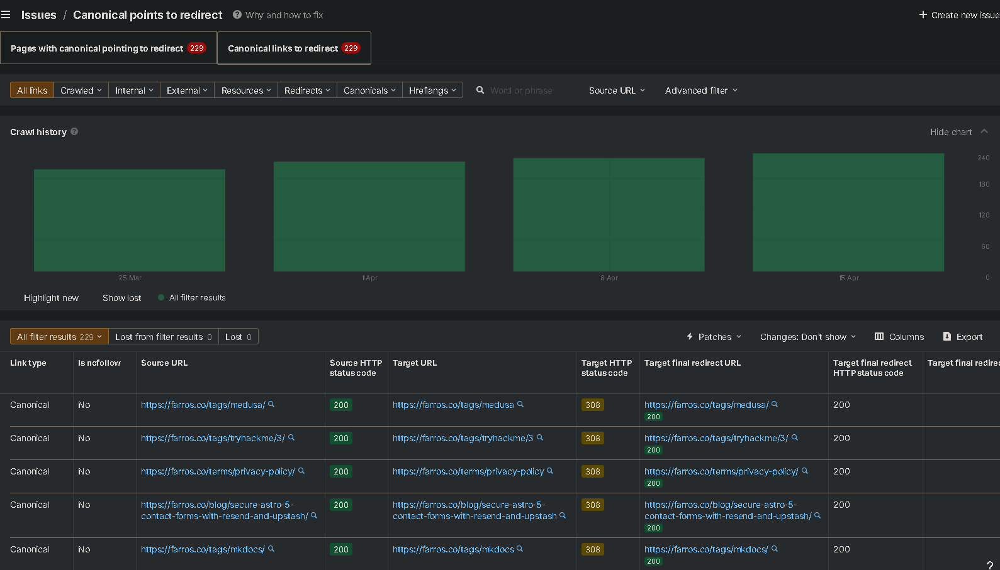
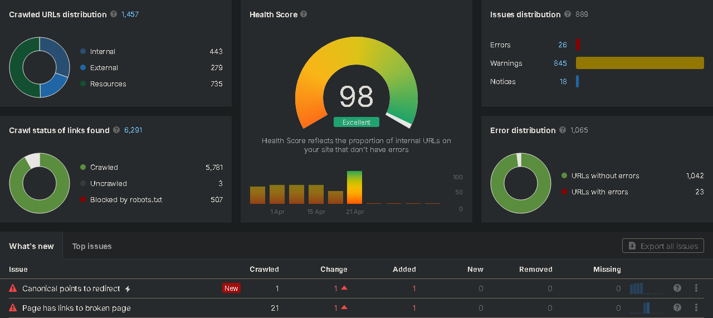

## The Shock: A Near-Zero Performance Drop

It started with a routine check of Google Search Console (GSC). What I saw was developer’s nightmare: a performance graph that looked like a cliff. After a steady climb to over 1,000 clicks, the traffic suddenly cratered to near zero.



At first, I was confused. I hadn't changed any content, and there were no security manual actions or server errors. However, when I looked at the **Indexing** report, the truth came out. My indexed pages had plummeted from over 200 down to just 57.



## The Context: Migrating from GitHub Pages to Cloudflare

The timing of this drop aligned with my migration from GitHub Pages to **Cloudflare Pages**. I made the move because I needed more advanced features, better edge performance, and higher bandwidth for my research lab, `farrosfr.com`.

On GitHub Pages, my setup worked well with `trailingSlash: false` in my Astro config. But Cloudflare Pages handles URLs differently.

## The Investigation: Hunting the "Blocked" URLs

I turned to Ahrefs to get a deeper look at the site's health. The dashboard confirmed: a **Health Score of 57** and nearly 500 "Blocked" or redirect-heavy URLs.



When I dug into the "What's New" section of the audit, two errors were screaming for attention:

1. **Canonical points to redirect** (229 instances)
2. **3XX redirect in sitemap** (229 instances)



This was the "smoking gun." So many of my blog posts and category tags was stuck in a redirect loop.

## The Root Cause: The "Trailing Slash Bounce"

By looking at the Ahrefs crawl details, I found the "bounce" pattern. It was a conflict between the application logic (Astro) and the hosting provider (Cloudflare).



### How the conflict happened

1. **Astro Config:** I had `trailingSlash: 'never'` in my `astro.config.ts`.
2. **Canonical Tag:** Astro generated canonical links like `https://farrosfr.com/p/my-post` (no slash).
3. **Cloudflare Hosting:** Cloudflare Pages uses "Pretty URLs" by default. When it sees a directory-based build (which Astro uses for SSG), it **enforces** a trailing slash.
4. **The Loop:**
    - Googlebot visits `https://farrosfr.com/p/my-post/` (with slash).
    - The HTML says: *"The official (canonical) version is `https://farrosfr.com/p/my-post` (no slash)."*
    - Googlebot tries to go to the no-slash version.
    - Cloudflare catches the request and says: *"Nope, we use slashes here!"* and sends a **308 Permanent Redirect** back to the slash version.

Google sees this as a site that doesn't know where its own pages are, so it stops indexing them to avoid "Redirect Loops."

## The Fix: Synchronizing Astro with Cloudflare

The solution was to stop fighting the server and align Astro with Cloudflare's behavior. I modified the `astro.config.ts` to force trailing slashes:

```typescript
// astro.config.ts
export default defineConfig({
  site: 'https://farrosfr.com',
  trailingSlash: 'always', // Changed from 'never'
  // ...
})
```

I also updated the RSS feed configuration to ensure the `rss.xml` generated URLs that matched the new standard:

```typescript
// src/pages/rss.xml.ts
return rss({
  trailingSlash: true,
  // ...
})
```

## The Role of Astro Pure in the Architecture

My site is built using the [Astro Pure](https://github.com/cworld1/astro-theme-pure) integration, which provides a robust set of SEO and performance tools out of the box.

### Why this migration was tricky

Astro Pure is designed to be a "plug-and-play" solution for technical bloggers. It handles:

- **Automatic Schema.org Generation:** It builds a complex JSON-LD `@graph` for search engines.
- **Dynamic Metadata:** It manages OpenGraph and Twitter cards automatically.

However, because Astro Pure dynamically generates canonical URLs based on your `astro.config.ts`, the `trailingSlash: 'never'` setting was being "baked into" every single piece of metadata on the site. Astro Pure was well doing its job—it was just being told the wrong information by the framework configuration.

**The Insight:** When using an advanced theme like Astro Pure, your framework settings are more critical. The theme's automation will amplify your configuration choices (good or bad) across every page of your site.

## The Result: A Near-Perfect 98 Health Score

After applying the trailing slash fixes across the configuration and internal links, I triggered a next crawl. The results were immediate as well. My Ahrefs Health Score jumped from a "Weak" 57 to an **"Excellent" 98**. Alhamdulillah



### What changed?

- **Canonical Errors:** Reduced to zero.
- **Orphan Pages:** Resolved by updating internal links.
- **Redirects:** Internal links now point directly to 200 OK pages, eliminating the 308 "bounce."

## Lessons Learned

Moving from one host to another isn't just about moving files; it's about understanding how the new environment handles path normalization.

- **GitHub Pages** is flexible and doesn't usually force redirects, making `trailingSlash: 'never'` safe.
- **Cloudflare Pages** is stricter with its "Pretty URLs" feature, making `trailingSlash: 'always'` the best practice for SEO consistency.

### References

- [Astro: Trailing Slash Configuration](https://docs.astro.build/en/reference/configuration-reference/#trailingslash)
- [Cloudflare Pages: Pretty URLs Documentation](https://developers.cloudflare.com/pages/configuration/serving-pages/#pretty-urls)
- [Google Search Central: Canonicalization Guide](https://developers.google.com/search/docs/crawling-indexing/canonicalization)

This case study proves that even small architectural conflicts between your framework and your host can have massive consequences for your search presence. Try to verify your trailing slash behavior when migrating platforms!
