This is my write-up for the TryHackMe room on [Authentication Bypass](https://tryhackme.com/room/authenticationbypass). Written in 2026, I hope this write-up helps others learn and practice cybersecurity.

## Task 1: Brief

This room covers various methods to bypass, defeat, or break website authentication. These vulnerabilities are highly critical as they frequently lead to the leakage of personal customer data.

**I have started the machine.**

> No answer needed

---

## Task 2: Username Enumeration

Username enumeration is the process of creating a list of valid usernames to use in further attacks. This is often done by exploiting website error messages. For example, if a signup page returns the error "An account with this username already exists," you can use a tool like `ffuf` combined with a wordlist to automate the process of finding registered users based on that specific error response.

Run the provided script, for example:

```bash
ffuf -w valid_usernames.txt:W1,/usr/share/wordlists/SecLists/Passwords/Common-Credentials/10-million-password-list-top-100.txt:W2 -X POST -d "username=W1&password=W2" -H "Content-Type: application/x-www-form-urlencoded" -u http://10.48.164.113/customers/login -fc 200
```

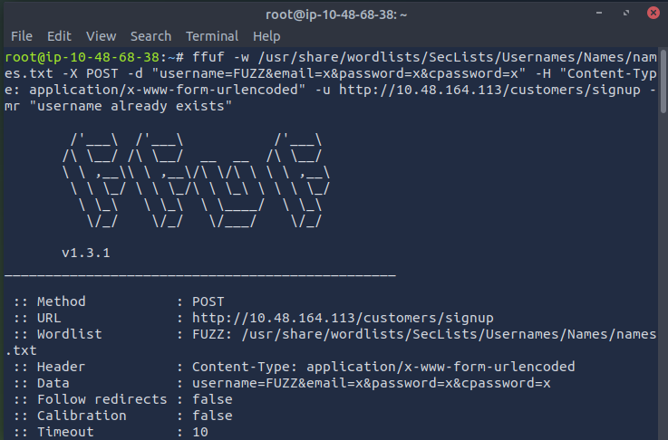

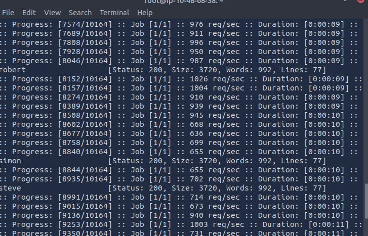

**What is the username starting with si?**

> simon

**What is the username starting with st?**

> steve

**What is the username starting with ro?**

> robert

---

## Task 3: Brute Force

Once a list of valid usernames is obtained, a brute-force attack can be launched against the login page. This automated process tests a list of commonly used passwords against your enumerated usernames. By using tools like `ffuf` with multiple wordlists (one for usernames, one for passwords), you can systematically check combinations and identify successful logins by filtering for specific HTTP status codes.

**What is the valid username and password (format: username/password)?**

First, create a `valid_usernames.txt` file containing the four valid names we found: admin, robert, simon, and steve.

```bash
nano valid_usernames.txt
```

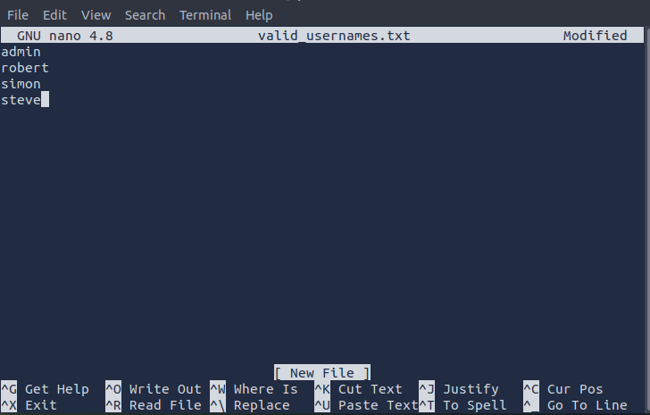

Then save and run the script:

```bash
ffuf -w valid_usernames.txt:W1,/usr/share/wordlists/SecLists/Passwords/Common-Credentials/10-million-password-list-top-100.txt:W2 -X POST -d "username=W1&password=W2" -H "Content-Type: application/x-www-form-urlencoded" -u http://10.48.164.113/customers/login -fc 200
```

We found a valid username and password.

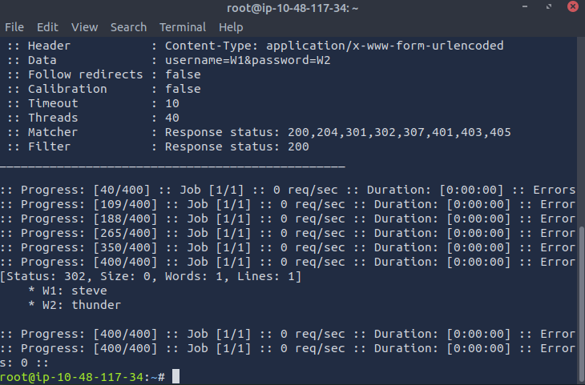

> steve/thunder

---

## Task 4: Logic Flaw

A logic flaw occurs when the intended logical path of an application is bypassed or manipulated. In authentication, this can happen through improper validation or variable handling. For example, if a PHP application uses the `$_REQUEST` variable for a password reset, it may prioritize POST data over GET data. An attacker can exploit this by putting the victim's username in the GET request and their own email in the POST data, tricking the server into sending the victim's password reset link to the attacker's email address.

**What is the flag from Robert's support ticket?**

First, navigate to the `/customers/reset` path on the target IP.
*
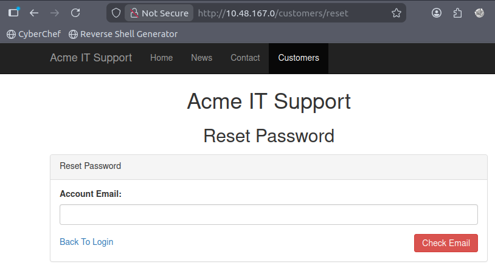

In the TryHackMe room, it's explained that the email used is `robert@acmeitsupport.thm` for the account 'robert'.

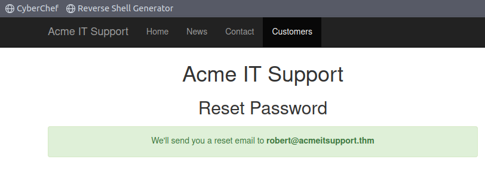

Next, run the script:

```bash
curl 'http://10.49.133.187/customers/reset?email=robert%40acmeitsupport.thm' -H 'Content-Type: application/x-www-form-urlencoded' -d 'username=robert'
```

This is equivalent to viewing the page source.

Now, go to the sign-up page at `/customers/signup`.

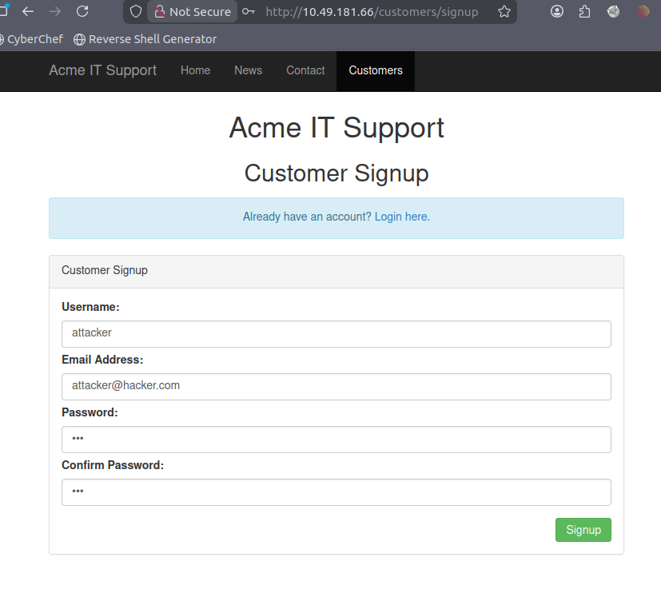

Use the attacker's username and email here; the password can be any 8 characters.

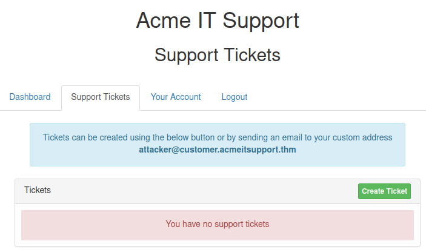

Run the script to send Robert's password reset code to the attacker's email: `attacker@customer.acmeitsupport.thm`.

```bash
curl 'http://10.49.181.66/customers/reset?email=robert@acmeitsupport.thm' -H 'Content-Type: application/x-www-form-urlencoded' -d 'username=robert&email={username}@customer.acmeitsupport.thm'
```


We received the password reset message.

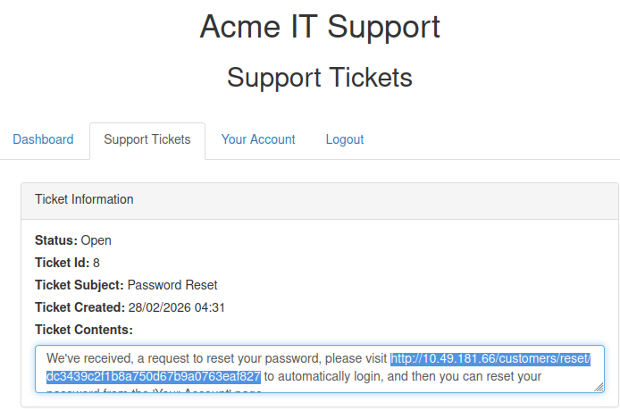

Open that link to access Robert's dashboard and view his support ticket.

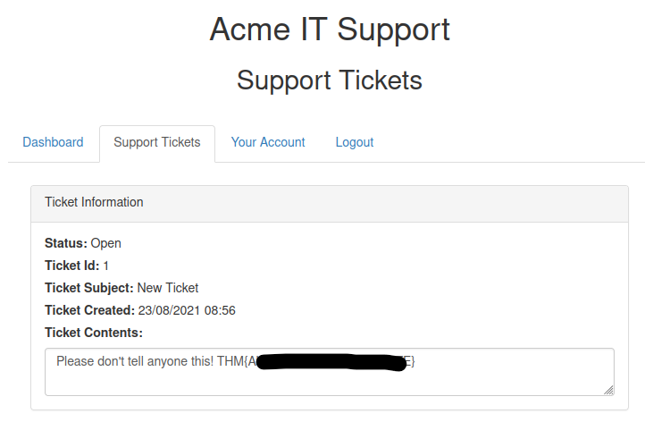

We found the flag.

> THM{REDACTED}

---

## Task 5: Cookie Tampering

Examining and modifying session cookies can lead to unauthorized access or privilege escalation.

* **Plain Text Cookies:** Sometimes cookies are stored in plain text and explicitly control access (e.g., `logged_in=true` or `admin=false`). Simply changing these values in your HTTP request can grant admin access.
* **Hashing:** Hashes (like MD5 or SHA-256) are irreversible representations of text. However, if simple strings are hashed, attackers can often look up the original values in massive precomputed databases (like CrackStation).
* **Encoding:** Encoding (like Base32 or Base64) converts data into a safe format for transmission and *is* reversible. If a cookie contains a Base64 encoded JSON object (e.g., `{"id":1,"admin":false}`), an attacker can easily decode it, change the `admin` value to `true`, re-encode it, and send the tampered cookie back to the server.

**What is the flag from changing the plain text cookie values?**

Run the final script provided by THM:

```bash
curl -H "Cookie: logged_in=true; admin=true" http://IP_MACHINE/cookie-test
```

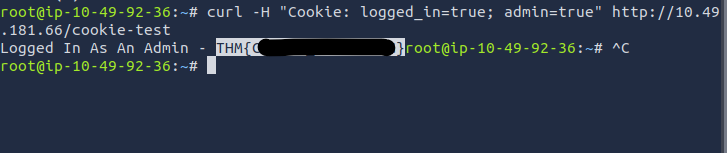

> THM{REDACTED}

**What is the value of the md5 hash 3b2a1053e3270077456a79192070aa78 ?**

You can use <https://crackstation.net>.

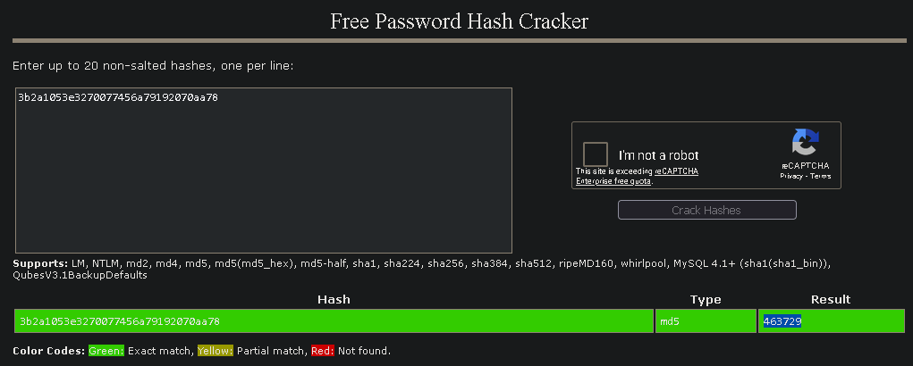

> 463729

**What is the base64 decoded value of VEhNe0JBU0U2NF9FTkNPRElOR30= ?**

You can use <https://www.base64decode.org/>.

> THM{REDACTED}

**Encode the following value using base64 {"id":1,"admin":true}**

To encode the value, you can use <https://www.base64encode.org/>.

> eyJpZCI6MSwiYWRtaW4iOnRydWV9

Thanks for reading. See you in the next lab.
