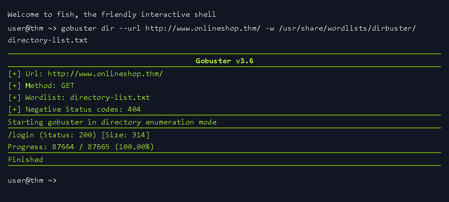
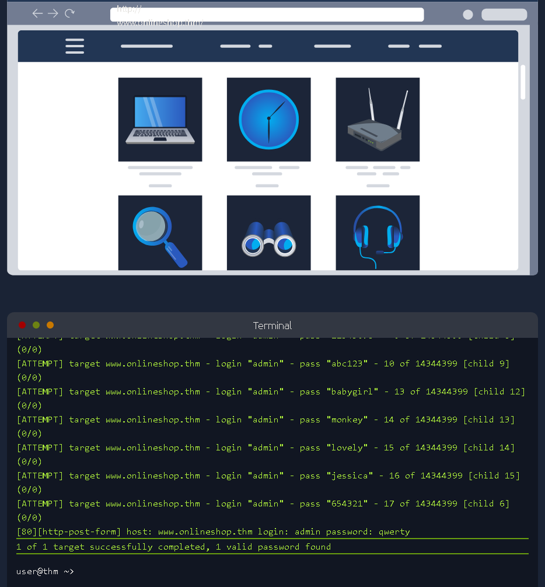
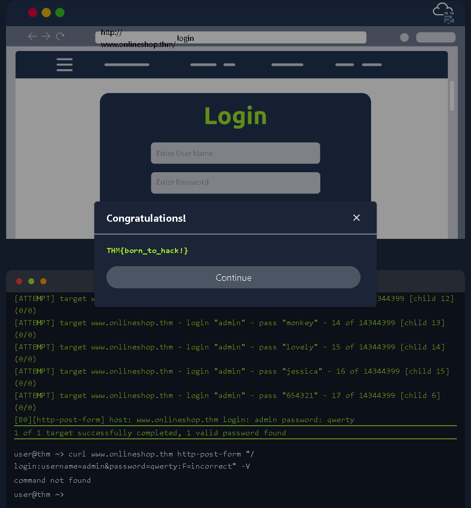

This is my write-up for the TryHackMe room on [Become a Hacker](https://tryhackme.com/room/becomeahacker). Written in 2026, I hope this write-up helps others learn and practice cybersecurity.

## Task 1: What Is Offensive Security?

**Summary:**
Offensive security involves proactively testing systems to identify and fix weaknesses before malicious attackers can exploit them. Unlike regular users, ethical hackers (or penetration testers) systematically observe how systems handle unexpected inputs and attempt to chain weaknesses together. This task sets the foundation, explaining that ethical hacking is always permission-based, structured, and legal.

### Prerequisites

- [Inside a Computer System](https://tryhackme.com/room/insideacomputer)
- [Linux CLI Basics](https://tryhackme.com/room/linuxclibasics)

**I understand the learning objectives and am ready to learn about Offensive Security!**
> No answer needed

---

## Task 2: Finding Weaknesses

**Summary:**
This task introduces core offensive security terminology: Red Teaming, Penetration Test, Vulnerability, Exploit, and Scope. The most important rule in ethical hacking is having explicit **permission** to test a system within a defined scope. In the hands-on scenario, you are tasked with finding exposed hidden pages on a target website (`http://www.onlineshop.thm/`). You can discover these directories manually by guessing URLs or by using automated discovery tools like **Gobuster** to run a dictionary-based directory brute-force attack.

**Using the manual or automated methods described above, what hidden web page did you discover?**

Just run this script in terminal to find informative paths

```bash
gobuster dir --url http://www.onlineshop.thm/ -w /usr/share/wordlists/dirbuster/directory-list.txt
```



> /login

**Based on your Gobuster scan results, what status code is returned when accessing the hidden page?**

> 200

---

## Task 3: Exploiting Weaknesses

**Summary:**
Ethical hackers often find success by chaining multiple small weaknesses together to create a significant impact (like a domino effect). To be successful, you must think like an adversary: question assumptions, test unexpected inputs, and identify valuable targets (sensitive data, admin features, etc.). In the practical exercise, you exploit the hidden login page discovered in Task 2. You use a dictionary attack to guess the `admin` password, both manually and by leveraging an automated password-cracking tool called **Hydra** (`hydra -l admin -P passlist.txt...`).

**Using either manual testing or an automated dictionary attack, what password did you discover for the admin user?**

Just run this script in terminal to find the password:  

```bash
hydra -l admin -P passlist.txt <www.onlineshop.thm> http-post-form "/login:username=^USER^&password=^PASS^:F=incorrect" -V
```



> qwerty

**After logging in using the password found, what secret message is displayed on the page?**

Go to the /login directory, then log in with the username admin and password qwerty as usual.



> THM{born_to_hack!}

**Review the output of your Hydra dictionary attack. How many failed password attempts were made before the correct password was found?**
> 17

---

## Task 4: Where to Go From Here

**Summary:**
This final task reviews the key terminology learned throughout the room, including Scope, Vulnerability, Exploit, Enumeration, Credentials, Authentication, and Dictionary Attack. It also outlines potential career paths in offensive security, such as Penetration Tester/Ethical Hacker, Vulnerability Researcher, and Red Team Operator. Finally, it recommends continuous practice and provides links to further learning paths like Cyber Security 101, Jr Penetration Tester, and SOC Level 1.

**Complete the room and continue on your cyber learning journey!**
> No answer needed

Thanks for reading. See you in the next lab.
