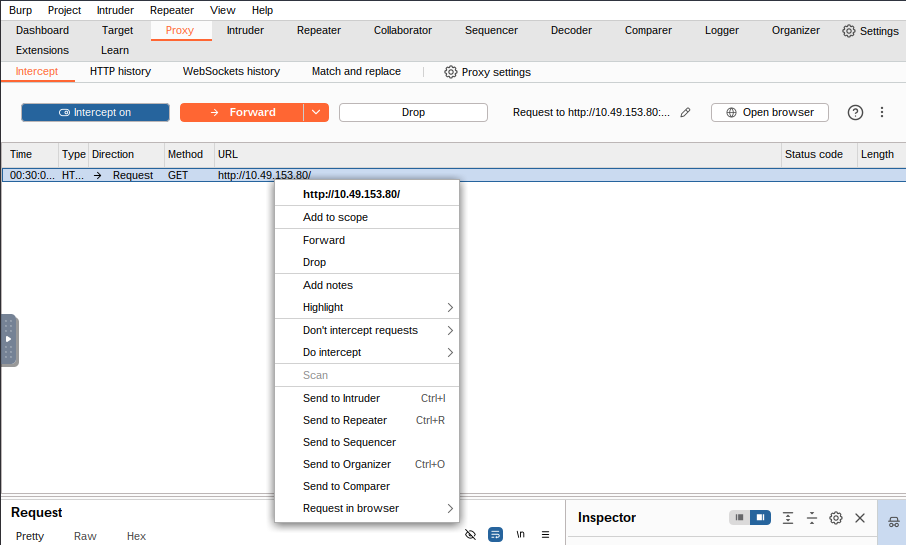
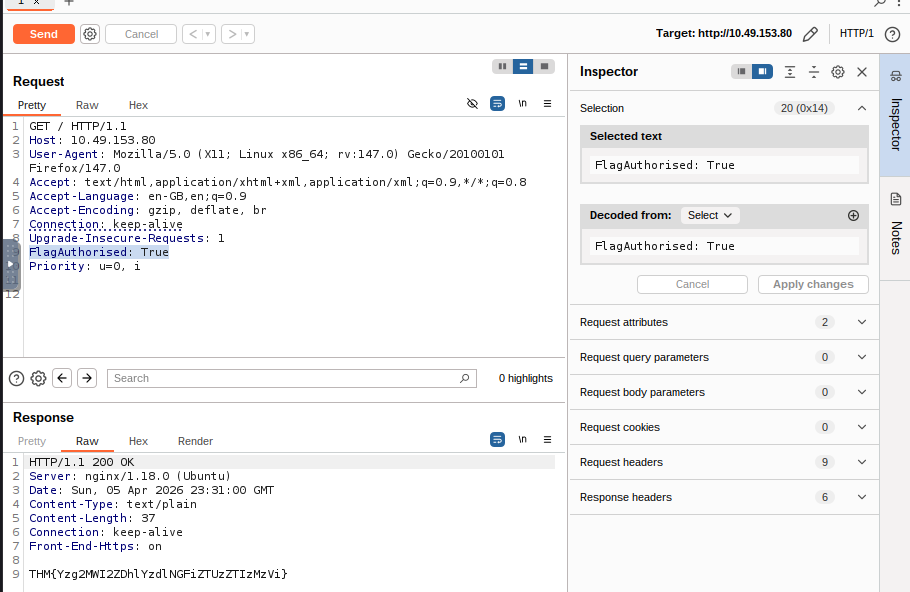
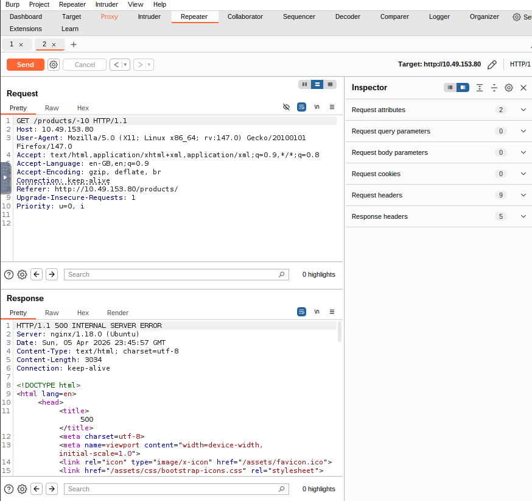
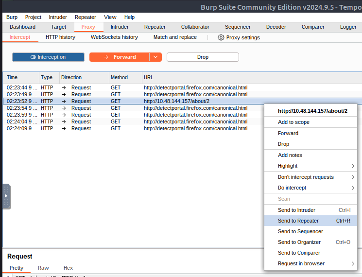
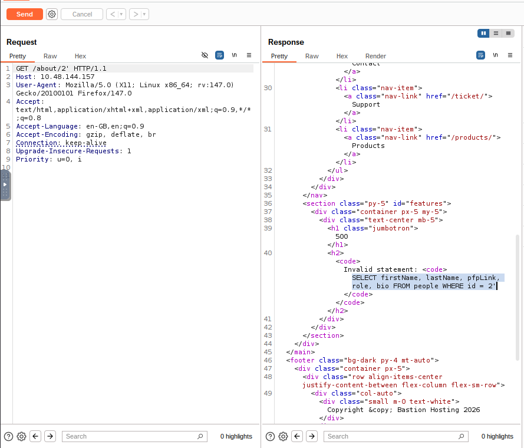
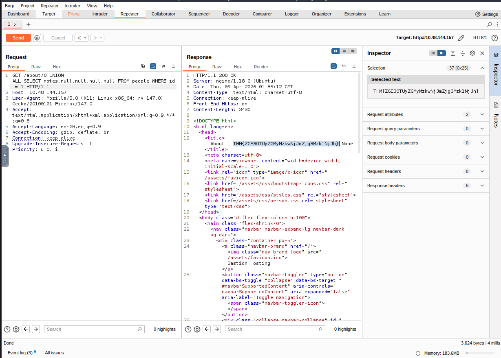

This is my write-up for the TryHackMe room on [Burp Suite: Repeater](https://tryhackme.com/room/burpsuiterepeater). Written in 2026, I hope this write-up helps others learn and practice cybersecurity.

## Task 1: Introduction

This room explores the advanced capabilities of the Burp Suite Repeater module, building upon the foundations of the Burp Basics room. You will learn how to manipulate and resend captured requests for manual testing. To follow along, you need to deploy the target VM and start your AttackBox or personal environment.

**Let's get started!**
> No answer needed

---

## Task 2: What is Repeater?

Burp Suite Repeater allows us to modify and resend intercepted requests to a target for manual exploration and endpoint testing. The interface consists of six main sections: Request List, Request Controls, Request and Response View, Layout Options, Inspector (which provides a user-friendly way to analyze/modify requests), and Target.

**Which sections gives us a more intuitive control over our requests?**
> Inspector

---

## Task 3: Basic Usage

To use Repeater, you first capture a request in the Proxy module and send it over (using right-click or `Ctrl + R`). Once sent, the request populates the Request view. Clicking "Send" will execute the request and populate the Response view on the right. You can freely edit the request text and use the history buttons to navigate back and forth through your modifications.

**Which view will populate when sending a request from the Proxy module to Repeater?**
> Request

---

## Task 4: Message Analysis Toolbar

Repeater offers four presentation options for analyzing responses: Pretty (the default, slightly formatted view), Raw (unmodified response), Hex (byte-level representation), and Render (visualized as a web browser page). There is also a "Show non-printable characters" button (`\n`) to display carriage returns and newlines, which is useful for interpreting HTTP headers.

**Which option allows us to visualize the page as it would appear in a web browser?**
> Render

---

## Task 5: Inspector

The Inspector is a supplementary tool on the right-hand side of the screen that breaks down requests and responses into a visually organized, tabular format. It allows you to easily view, add, edit, or remove components like Request Attributes, Query Parameters, Body Parameters (specific to POST requests), Cookies, and Headers without manually typing them in the raw editor.

**Which section in Inspector is specific to POST requests?**
> Body Parameters

---

## Task 6: Practical Example

Repeater shines when you need to repeatedly send similar requests with minor tweaks, such as testing for SQL injection or bypassing firewalls. In this practical example, the goal is to capture a simple request to the root directory, send it to Repeater, and manually add a custom header (`FlagAuthorised: True`) to manipulate the server into returning a flag.

**What is the flag you receive?**

Okay, set the IP target to Mozilla Firefox, but first don't forget to enable FoxyProxy for Burp and enable the intercept feature in Burp.

Then the burp will be the response and just right click then select send to repeater. After that right click, select "send to repeater", next add this parameter: FlagAuthorized: True, finally click send.

> THM{Yzg2MWI2ZDhlYzdlNGFiZTUzZTIzMzVi}

---

## Task 7: Challenge

This task requires you to test the input validation of a specific endpoint. By navigating to `/products/` and clicking a link, you are taken to a numeric endpoint (e.g., `/products/3`). You need to intercept this request, forward it to Repeater, and test what happens when you alter the ID parameter to an extreme or invalid input to force a server error.

**Enable intercept again and capture a request to one of the numeric products endpoints in the Proxy module, then forward it to Repeater.**
> No answer needed

**See if you can get the server to error out with a "500 Internal Server Error" code by changing the number at the end of the request to extreme inputs.**
**What is the flag you receive when you cause a 500 error in the endpoint?**

In this section. First, use the numeric path like /products/1 and then send to repeater.

After that, you can try entering any number in the path. At extreme positive numbers, I only see a "page not found" error like 999999, but when I try with negative numbers, I get a 500 internal error. Allright, and we'll get to the flag.

> THM{N2MzMzFhMTA1MmZiYjA2YWQ4M2ZmMzhl}

---

## Task 8: Extra-mile Challenge

This challenge requires you to manually exploit a Union SQL Injection vulnerability on the `/about/ID` endpoint. By submitting an invalid ID with a single quote (`/about/2'`), the server leaks the SQL query structure in a 500 Error. Using this leaked information, you can craft a `UNION ALL` payload to extract column names from the `information_schema` and ultimately query the `notes` column for the CEO (ID `1`) to retrieve the final flag.

**Exploit the union SQL injection vulnerability in the site.**
**What is the flag?**

First of all we need to intercept this path first /about/2 and send to repeater (Ctrl + R).

Then, add ' after the path to display the error. After that, we can see the 500 internal server error. And we can see about the SQL request in the response.

This is an extremely useful error message that the server should absolutely not be sending us, but the fact that we have it makes our job significantly more straightforward.

run this sql payload to get the flag /about/0 UNION ALL SELECT notes,null,null,null,null FROM people WHERE id = 1

* **`/about/0`**: The `0` is likely an intentionally invalid ID meant to make the original database query return an empty result.
* **`UNION ALL`**: This SQL command combines the results of the application's original query with the attacker's new, injected query.
* **`SELECT notes, null, null, null, null`**: The attacker is attempting to steal data from a column named `notes`. The four `null` values are necessary because a `UNION` operation requires both combined queries to have the exact same number of columns.
* **`FROM people`**: This targets a specific table in the database named `people`.
* **`WHERE id = 1`**: This filters the requested data, specifically aiming to extract the `notes` belonging to the user with an ID of `1`

---

## Task 9: Conclusion

You have successfully completed the Burp Suite Repeater room and learned how to edit, manipulate, and resend requests manually. The next step in your learning path is the Burp Suite Intruder room, which focuses on automating these customized attacks.

**I can use Burp Suite Repeater!**
> No answer needed

Thanks for reading. See you in the next lab.
