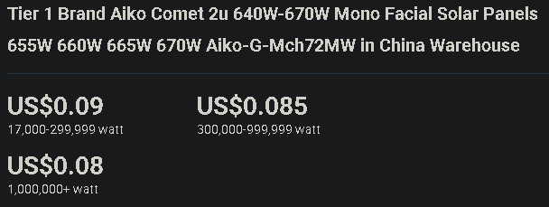
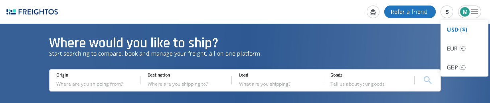
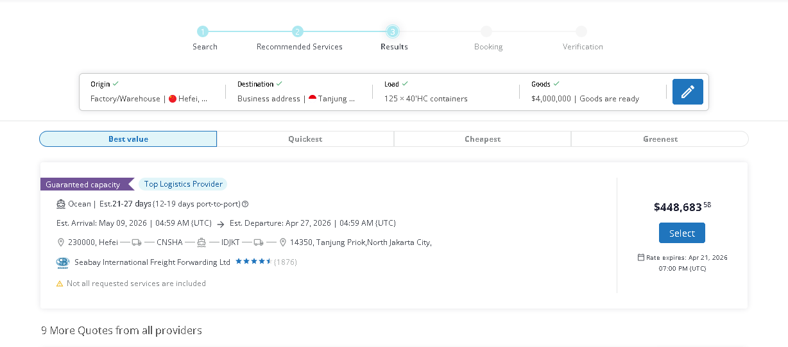

When importing industrial products from the global market, the price you see on a B2B website is only the beginning. To determine the true "landed cost," you must account for logistics, duties, and local taxes.

This guide comes from my real experience managing a **B2B e-commerce platform** for electrical and renewable energy products. One of the biggest challenges in this business process is the "Pricing Gap." In the industrial sector, prices are rarely static or real-time. Producers often don't update their own websites, leaving platform managers in a constant struggle to find competitive, accurate base prices for products like PV modules.

In this guide, I will demonstrate how to calculate the pricing flow using **PV Modules (Solar Panels)** imported from China to Indonesia as a case study.

## 1. Understanding Product Pricing (EXW)

Most industrial suppliers quote prices based on **EXW (Ex Works)**, meaning the price only covers the goods at the factory door. Shipping and handling are your responsibility.

### The "Price Trap": Web Listing vs. Actual Quote

In the B2B world, the price you see on Alibaba or Google Shopping is often a "teaser" price. As a platform manager, I've found that even producers often do not update their websites in real-time. This reveals a critical industry truth: **B2B pricing is often a private market.** Many competitive rates are never published openly; they are hidden behind direct negotiations and volume commitments.

For a 50MWp project, the gap between what is listed and what is finally quoted in a private chat can be massive:

| Type | Unit Price | Total EXW Cost (50MWp) | Gap |
| :--- | :--- | :--- | :--- |
| **Web Listing** | $0.08 / Wp | $4,000,000 | - |
| **Market Reality** | **$0.12 / Wp** | **$6,000,000** | **+$2,000,000** |

**Example Project Details (Theoretical Example):**

* **Project Size:** 50 MWp (50,000,000 Wp)
* **Module Capacity:** 650 Wp per panel
* **Theoretical Unit Price:** $0.08 / Wp

**Cost of Goods Calculation:**

* **Total Panels:** 50,000,000 Wp ÷ 650 Wp = **76,924 panels**
* **Total EXW Cost:** 50,000,000 Wp × $0.08 = **$4,000,000.00**

## 2. Logistics & Container Calculation

Industrial orders are shipped in containers. For PV modules, we typically use 40'HC (High Cube) containers.

* **Load per Container:** 31 panels per pallet × 20 pallets = 620 panels
* **Total Containers Required:** 76,924 panels ÷ 620 = **125 x 40'HC containers**

### Origin Handling (The "EXW" Burden)

Since our pricing is EXW, we must account for:

* **Inland China Transport:** Moving 125 containers from the factory to the port (e.g., Ningbo/Shanghai).
* **Origin Port Charges:** Terminal Handling Charges (THC) and export documentation.

To estimate sea freight costs, you can use platforms like [Freightos](https://ship.freightos.com). Register an account and input your details:

You can choose your preferred currency (USD, EUR, or GBP) and then fill in these four key fields:

* **Origin**
* **Destination**
* **Load**
* **Goods**

**Estimated Shipping Cost:** ~$448,683.58 (based on current market rates).

> **Disclaimer:** *Logistics and tax calculations in this guide are based on the $4,000,000 theoretical EXW value. In a real scenario using the $0.12/Wp market price, costs like insurance and financial fees will increase proportionally.*

## 3. Adding Duties and Taxes (The "Hidden" Costs)

This is where many calculations fail. For Indonesia, you must consider the **HS Code (8541.43.00)** for PV modules and the mandatory **Form E** for duty exemption.

| Component | Rate | Calculation Base | Estimated Cost |
| :--- | :--- | :--- | :--- |
| **Marine Insurance** | 0.2% | EXW Value | $8,000 |
| **Import Duty** | 0% | CIF (Goods + Ins + Freight) | $0 (ACFTA w/ Form E) |
| **VAT (PPN)** | 11% | CIF + Duty | ~$490,235 |
| **Income Tax (PPh 22)** | 2.5% | CIF + Duty | ~$111,417 |

*Note: PPh 22 is 2.5% for owners of an API (Import Identification Number) and 7.5% without one. To achieve 0% duty, your supplier must provide a **Form E (Certificate of Origin)**.*

## 4. Final Landed Cost

To get your final price per unit, sum all costs including the "last mile" handling in Indonesia:

1. **EXW Cost:** $4,000,000
2. **Sea Freight & Insurance:** $456,683
3. **Taxes (VAT + PPh 22):** $601,652
4. **Local Handling (PPJK + 125 Trucks):** ~$72,500
5. **Total Landed Cost:** **$5,130,835**

**Final Unit Price:** $5,130,835 ÷ 50,000,000 Wp = **$0.1026 / Wp**

## 5. The Regulatory Finish Line (Indonesia)

Price is only half the battle. In Indonesia, two factors can stop your project entirely:

* **SNI Certification:** PV modules must have the SNI (Standar Nasional Indonesia) mark. Without it, Customs will not release the goods. This applies to **both** private and government projects.
* **TKDN (Local Content):** This is the "make or break" factor for **Government-linked projects (Instansi/BUMN)**. These projects require a high percentage of local content. Even if importing is cheaper, you may be legally required to source from local factories to meet the regulatory threshold.
* **The Private Sector (Swasta) Advantage:** For purely private projects, there is typically no strict minimum TKDN requirement. This allows private developers more flexibility to import Tier 1 modules directly from global manufacturers to achieve the best price-to-performance ratio.

By following this flow, you can accurately predict whether your project is financially viable before signing any contracts. Always remember that the "Cheap" price online is just the first step in a very long journey!
