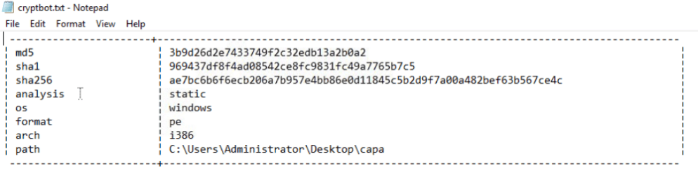
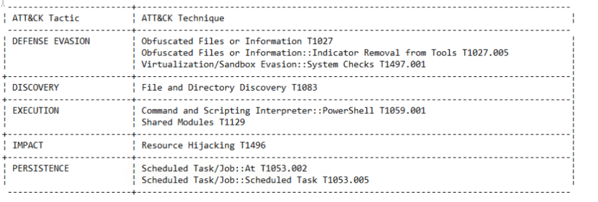

Here i want to share about my write-up for the room [CAPA: The Basics](https://tryhackme.com/room/capabasics) (Premium Room), learn to use CAPA to identify malicious capabilities. I wrote this in 2025 and hope it is useful for learning about cybersecurity.

## Task 1: Introduction

CAPA is a tool designed to identify the capabilities present in executable files. It analyzes a file and applies a set of rules that describe common behaviors, allowing it to determine what the program is capable of doing, such as network communication, file manipulation, or process injection. The tool encapsulates years of reverse engineering knowledge, allowing analysts to quickly understand a program's functionality without manually reverse engineering the code.

I'm excited to learn more about CAPA!
>No answer needed

## Task 2: Tool Overview: How CAPA Works

The two most used parameters are **-v** (verbose) and **-vv** (very verbose), which give a more detailed result but increase processing time.

The output of the command includes tables showing the file's hashes (MD5, SHA1, SHA256) and mappings to frameworks like **ATT&CK** and **MBC**, followed by a detailed list of the program's **Capabilities**.

What command-line option would you use if you need to check what other parameters you can use with the tool? Use the shortest format.
>-h

What command-line options are used to find detailed information on the malware's capabilities? Use the shortest format.
>-v

What command-line options do you use to find very verbose information about the malware's capabilities? Use the shortest format.
>-vv

What PowerShell command will you use to read the content of a file?
>Get-Content

## Task 3: Dissecting CAPA Results Part 1: General Information, MITRE and MAEC

This text dissects the results of running CAPA on the `cryptbot.bin` file.

The **first block** contains basic information about the file, including its cryptographic hashes (md5, sha1, sha256), the analysis type (`static`), the OS (`windows`), format (`pe`), architecture (`i386`), and the file path.S

The **second block** maps the file's capabilities to the **MITRE ATT&CK** framework, a knowledge base that documents the tactics and techniques used by threat actors. This helps analysts map the file's behavior to an adversary's playbook.

The **third block** uses **MAEC** (Malware Attribute Enumeration and Characterization), a specialized language for describing malware. The text highlights two common MAEC values used by CAPA:

What is the sha256 of cryptbot.bin?
>ae7bc6b6f6ecb206a7b957e4bb86e0d11845c5b2d9f7a00a482bef63b567ce4c

What is the Technique Identifier of Obfuscated Files or Information?
>T1027

## Task 4: Dissecting CAPA Results Part 2: Malware Behavior Catalogue

The **Malware Behavior Catalogue (MBC)** serves as a catalogue of malware objectives and behaviors to support malware analysis, labelling, and reporting. It can link to ATT&CK methods but does not duplicate ATT&CK information.

MBC content is represented in two formats:

1. `OBJECTIVE::Behavior::Method[Identifier]`
2. `OBJECTIVE::Behavior::[Identifier]`

The components are defined as follows:

* **Objective**: Based on ATT&CK tactics but tailored for malware analysis, with additions like `Anti-Behavioral Analysis` and `Anti-Static Analysis`.
* **Micro-Objective**: Associated with micro-behaviors—actions that aren't necessarily malicious on their own but are often abused. Examples include `PROCESS`, `MEMORY`, `COMMUNICATION`, and `DATA`.
* **MBC Behaviors**: A list of behaviors (e.g., `Virtual Machine Detection`) and micro-behaviors (e.g., `Create Process`).
* **Methods**: Details tied to behaviors, which can be considered sub-techniques (e.g., `Stack Strings` is a method for `Executable Code Obfuscation`).

What serves as a catalogue of malware objectives and behaviours?
>Malware Behavior Catalogue

Which field is based on ATT&CK tactics in the context of malware behaviour?
>Objective

What is the Identifier of "Create Process" micro-behavior?
>C0017

What is the behaviour with an Identifier of B0009?
>Virtual Machine Detection

Malware can be used to obfuscate data using base64 and XOR. What is the related micro-behavior for this?
>Encode Data

Which micro-behavior refers to "Malware is capable of initiating HTTP communications"?
>HTTP Communication

## Task 5: Dissecting CAPA Results Part 3: Namespaces

CAPA uses **namespaces to group items with the same purpose**. The output shows a table with two columns: **Capability** and **Namespace**. The namespace has a hierarchical format, consisting of a **Top-Level Namespace (TLN)** and a more specific namespace. For example, `anti-analysis` is a TLN, and `anti-vm/vm-detection` is a namespace under it.

* **`anti-analysis`**: Contains rules to detect behaviors used by malware to evade analysis, such as obfuscation, packing, and anti-debugging.
* **`host-interaction`**: Contains rules related to interactions with the host system, like file system or process manipulation.
* **`persistence`**: Contains rules for behaviors associated with maintaining access on a compromised system.
* **`nursery`**: A staging ground for rules that are not quite polished.

Which top-level Namespace contains a set of rules specifically designed to detect behaviours, including obfuscation, packing, and anti-debugging techniques exhibited by malware to evade analysis?
>anti-analysis

Which namespace contains rules to detect virtual machine (VM) environments? Note that this is not the TLN or Top-Level Namespace.
>anti-vm/vm-detection

Which Top-Level Namespace contains rules related to behaviours associated with maintaining access or persistence within a compromised system? This namespace is focused on understanding how malware can establish and maintain a presence within a compromised environment, allowing it to persist and carry out malicious activities over an extended period.
>persistence

Which namespace addresses techniques such as String Encryption, Code Obfuscation, Packing, and Anti-Debugging Tricks, which conceal or obscure the true purpose of the code?
>obfuscation

Which Top-Level Namespace Is a staging ground for rules that are not quite polished?
>Nursery

Proceed to the next task for the 2nd part of the discussion!
>No answer needed

## Task 6: Dissecting CAPA Results Part 4: Capability

What rule yaml file was matched if the Capability or rule name is check HTTP status code?
>check-http-status-code.yml

What is the name of the Capability if the rule YAML file is reference-anti-vm-strings.yml?
>reference anti-VM strings

Which TLN or Top-Level Namespace includes the Capability or rule name run PowerShell expression?
>load-code

Check the conditions inside the check-for-windows-sandbox-via-registry.yml rule file from this link. What is the value of the API that ends in Ex is it looking for?
>RegOpenKeyEx

## Task 7: More Information, more fun

To determine the reason for triggering CAPA's rules and the conditions involved, we can use the **-vv** (very verbose) parameter.

Since the output is vast and challenging to analyze in a terminal, a two-step process is used:

1. First, use the **-j** and **-vv** parameters to direct the output to a `.json` file. The command is `capa.bin -j -vv .\cryptbot.bin > cryptbot_vv.json`. A pre-processed file named `cryptbot_vv.json` is provided.
2. Second, upload the generated `.json` file to the **CAPA Web Explorer**. An offline version is available on the virtual machine.

Which parameter allows you to output the result of CAPA into a .json file?
-j

What tool allows you to interactively explore CAPA results in your web browser?
CAPA Web Explorer
>CAPA Web Explorer

Which feature of this CAPA Web Explorer allows you to filter options or results?
>Global Search Box

## Task 8: Conclusion

>No answer needed
