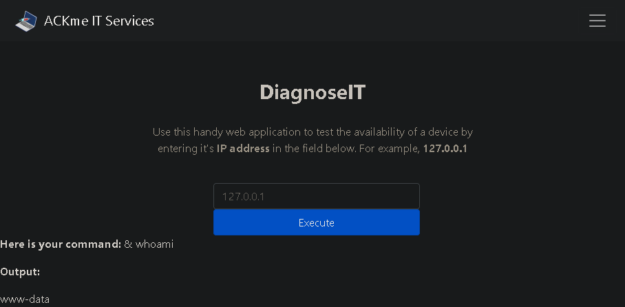
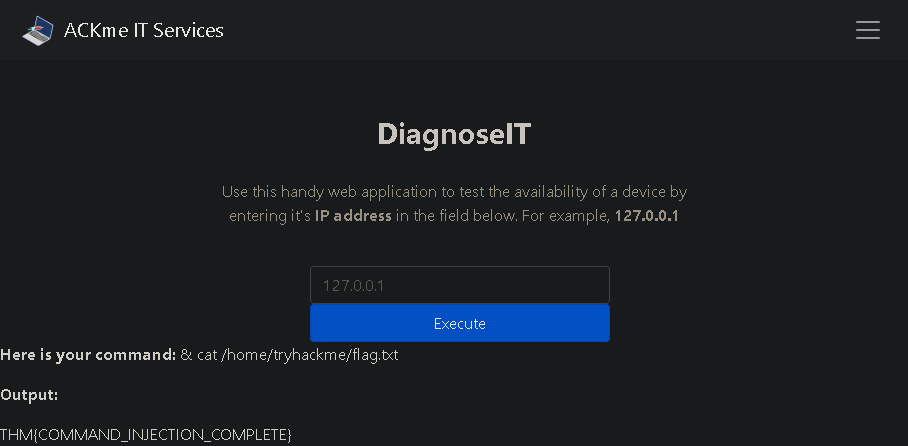

This is my write-up for the TryHackMe room on [Command Injection](https://tryhackme.com/room/oscommandinjection). Written in 2026, I hope this write-up helps others learn and practice cybersecurity.

## Task 1: Introduction (What is Command Injection?)

Command injection (also known as Remote Code Execution or RCE) is a severe vulnerability where an attacker abuses an application's behavior to execute operating system commands. These commands run with the same privileges as the application, allowing the attacker to directly interact with the system, read sensitive files, and obtain permissions associated with the application's user account.

**Read me!**
> No answer needed

---

## Task 2: Discovering Command Injection

This vulnerability occurs when applications pass user input to system calls without proper checks. For example, if an application uses a search query to run a command like `grep` on the OS, an attacker can inject additional commands instead of a normal search term. This flaw can exist in any programming language (such as PHP, Python, or NodeJS) as long as user input is processed and executed by the operating system.

**What variable stores the user's input in the PHP code snippet in this task?**
> $title

**What HTTP method is used to retrieve data submitted by a user in the PHP code snippet?**
> GET

**If I wanted to execute the `id` command in the Python code snippet, what route would I need to visit?**
> /id

---

## Task 3: Exploiting Command Injection

Attackers exploit this vulnerability by using shell operators (like `;`, `&`, and `&&`) to chain multiple commands together. Command injection is generally identified in two ways:

1. **Verbose Command Injection:** The application directly displays the output of the executed command (e.g., seeing the username when running `whoami`).
2. **Blind Command Injection:** The application provides no direct output. Attackers must use commands that cause a time delay (like `ping` or `sleep`) or force an interaction (like `curl`) to verify if the injection was successful.

**What payload would I use if I wanted to determine what user the application is running as?**
> whoami

**What popular network tool would I use to test for blind command injection on a Linux machine?**
> ping

**What payload would I use to test a Windows machine for blind command injection?**
> timeout

---

## Task 4: Remediating Command Injection

Preventing command injection involves minimizing the use of dangerous functions (such as `exec`, `passthru`, and `system` in PHP) and strictly filtering user input. A highly effective method is "input sanitisation," which involves cleaning the data by restricting it to expected formats (e.g., only allowing numbers) or removing special characters. However, developers must be careful, as attackers constantly find creative ways (like using hexadecimal values) to bypass basic filters.

**What is the term for the process of "cleaning" user input that is provided to an application?**
> sanitisation

---

## Task 5: Practical: Command Injection (Deploy)

This task requires deploying a vulnerable target machine to apply the learned theory. The goal is to experiment with various command injection payloads on the provided web application to successfully read a hidden flag file located on the server.

**What user is this application running as?**

try typing this payload: & whoami

> www-data

**What are the contents of the flag located in /home/tryhackme/flag.txt?**

Since we know that the previous payload used "&" then we can continue using it again to get the flag with this payload: & cat /home/tryhackme/flag.txt

---

## Task 6: Conclusion

This room provided a comprehensive overview of command injection, covering how to discover the vulnerability, exploit it across different operating systems (Linux and Windows), and secure applications against it. There are often multiple ways to exploit these vulnerabilities, so experimenting with different payloads is highly encouraged.

**Terminate the vulnerable machine from task 5.**
> No answer needed

Thanks for reading. See you in the next lab.
