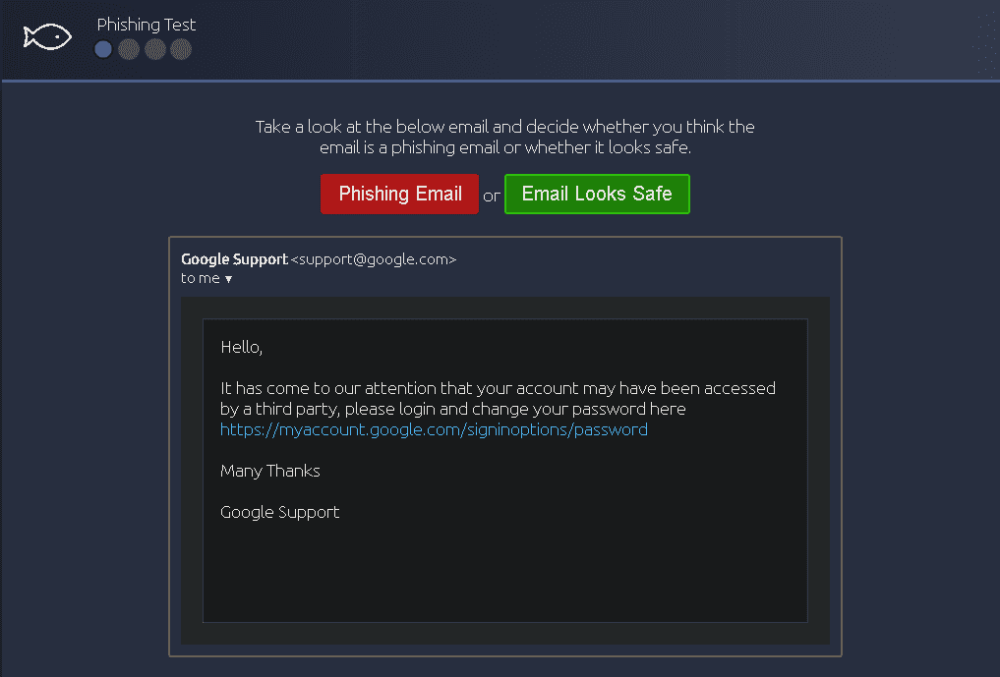
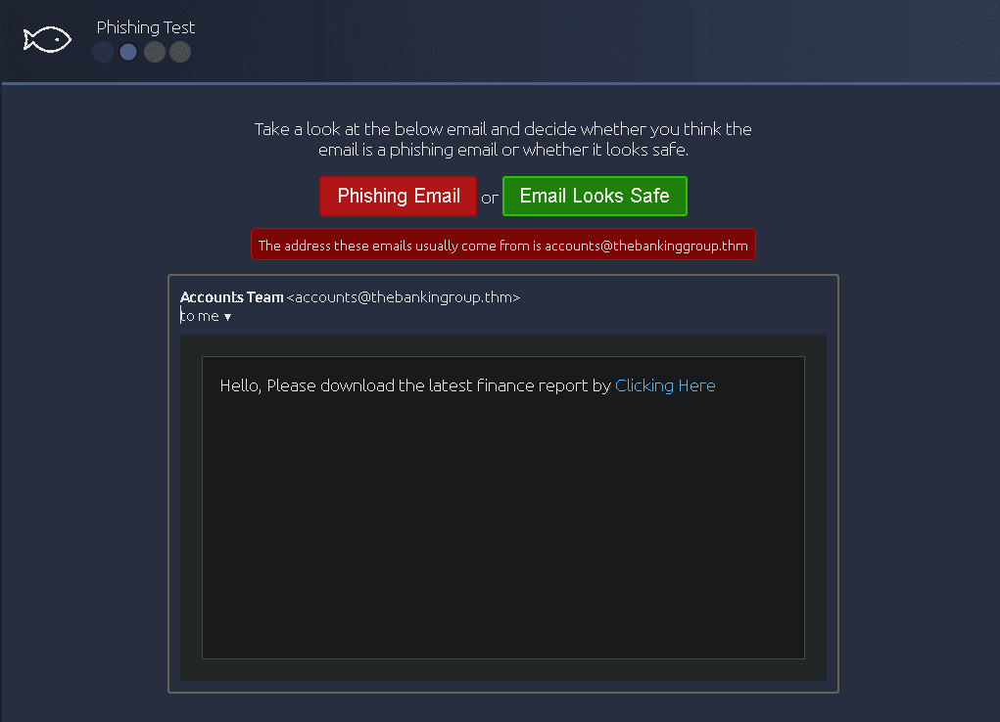
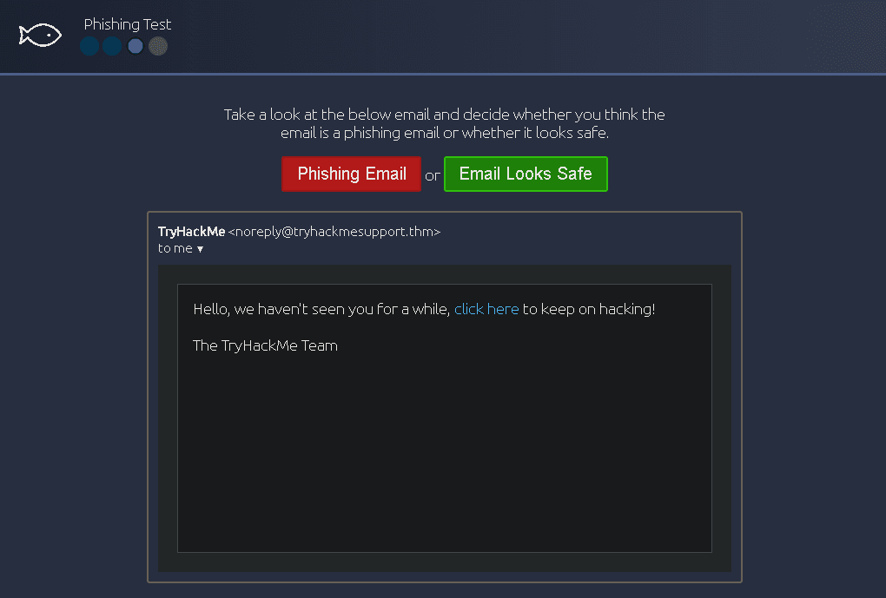
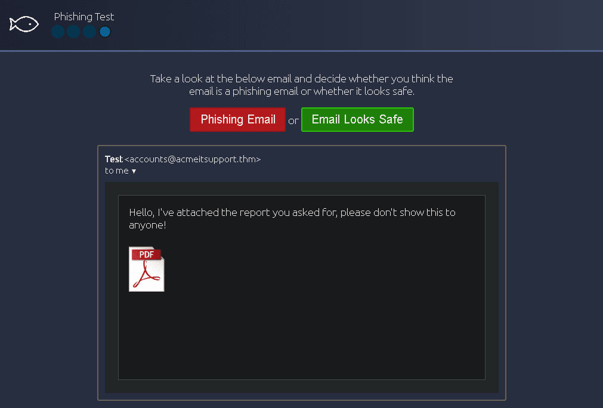
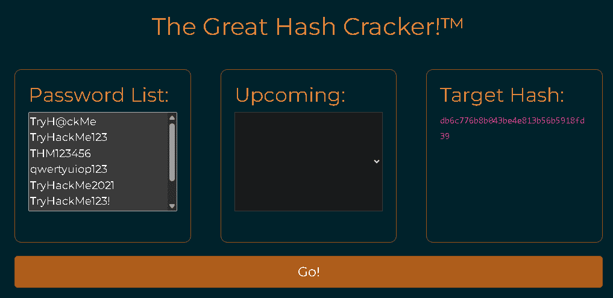
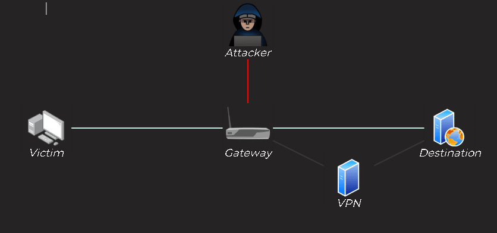

Here i want to share about my write-up for the room [Common Attacks](https://tryhackme.com/room/commonattacks), with practical exercises see how common attacks occur, and improve your cyber hygiene to stay safer online. I wrote this in 2025 and hope it is useful for learning about cybersecurity.

## Task 1: Introduction

Let's get started!
>No Answer Needed

## Task 2: Social Engineering

Social Engineering is the term used to describe any cyberattack where a human is the target, sometimes referred to as "People Hacking". These attacks can become very complex, are often multi-layered, and escalate due to the snowball effect, potentially leading to an attacker gaining control over a target's life.

Other forms of social engineering include dropping USB storage devices in public or leaving malicious "charging cables" in the hope that someone will plug them into a computer. The Stuxnet virus, for example, originally infected its target by having workers plug in malicious USB devices they found.

To stay safe, you should:

- Set up multiple forms of authentication.
- Never plug external media into a computer you care about.
- Always insist on proof of identity when a stranger calls or messages you claiming to work for a company.

Read the task information and watch the attached videos
>No answer needed

What was the original target of Stuxnet?
>The Iran Nuclear Programme

## Task 3: Social Engineering: Phishing

Phishing is a sub-section of social engineering where an attacker tricks a victim into opening a malicious webpage by sending them a text message, email, or other online correspondence. The victim is then often asked to enter sensitive information, like login details or credit card information.

There are three primary types of phishing attacks: General Phishing, Spearphishing, and Whaling.

To identify phishing, look for poor grammar, similar but not identical domain names, and suspicious "From" email addresses.

To stay safe:

- Delete unknown or untrusted emails.
- Never open attachments from untrusted emails.
- Do not click on embedded links in emails or messages.

>Phising Email (The link actually goes to a different website than advertised.)

>Phising Email (There is a misspelling in the domain name of the sender. It only contains one g instead of two.)

>Email Looks Safe

\
>Phising Email (Don't trust pdf file attachments that are not from a trusted source or unexpected as they could contain malware .)

What is the flag?
>THM{I_CAUGHT_ALL_THE_PHISH}

## Task 4: Malware and Ransomware

Malware is any software designed to perform malicious actions on behalf of an attacker, such as to steal information, cause damage, or execute arbitrary commands.

Ransomware is a specialised class of malware used to infect as many systems as possible, encrypting the data on the devices and holding it to ransom.

Delivery methods often revolve around social engineering or phishing attacks, such as sending an email containing a file with a malicious macro.

To stay safe:

- Always accept updates and patches.
- Never click on suspicious links or open file attachments.
- Always back up important data.
- Make sure antivirus software is always up-to-date.
- If infected with ransomware, do not pay the ransom; instead, call your local authorities.

[Research] What currency did the Wannacry attackers request payment in?
>Bitcoin

## Task 5: Passwords and Authentication

Passwords are an integral part of most authentication systems, but even a robust password is useless if the same password is used for more than one service.

Current best practices for strong passwords lean more towards length than complexity. The most secure option is using long, completely random passwords, which is mitigated by using a password manager. A weak password is any password that could easily be guessed. Of equal importance to password strength is password reuse.

The industry-standard password storage method is password hashing. If a service gets hacked and passwords are leaked, attackers can perform "credential stuffing" attacks — using your stolen username and password pair against other services.

Put yourself in the shoes of a malicious hacker. You have managed to dump the password database for an online service, but you still have to crack those hashes!

Click the green button at the start of the task to deploy the interactive hash brute-forcer!
>No Answer Needed

Based on the content of the website, you have generated a list of likely passwords, which is as follows:

- TryH@ckMe
- TryHackMe123
- THM123456
- qwertyuiop123
- TryHackMe2021
- TryHackMe123!
- TryHackMe345
- TryHackM3!

Copy the list of passwords into the "Password List" field of the hash cracker, then click "Go"!

>No Answer Needed

Look at the "Current Word / Hash" section of the hash cracker.

Notice that for each word in the list you entered, the cracker is creating an MD5 hash of the word then comparing it to the Target Hash. If the two hashes match then the password has been found!

The hash cracker should find the password that matches the target hash very quickly.

What is the password?
>TryHackMe123!

This is a very simple, browser-based example; however, in reality local hash cracking with a wordlist isn't any more complex from a high-level perspective — it's the same technique, but with a lot more potential passwords!

Hopefully this example illustrates why it is so important to choose a strong password — even if the passwords are hashed appropriately.

In the next task we will look at some of the common account protection measures, as well as how to generate secure passwords.
>No Answer Needed

## Task 6: Multi-Factor Authentication and Password Managers

Multi-Factor Authentication (MFA) is any authentication process where you need more than one thing to log in. You should always activate multi-factor authentication where available, using an "Authenticator App".

Password Managers provide a safe space to store your passwords in encrypted "vaults" accessed using a master password. They are the recommended way to handle authentication for your many accounts and can be used to generate long, completely random passwords.

Where you have the option, which should you use as a second authentication factor between SMS based TOTPs or Authenticator App based TOTPs (SMS or App)?
>App

## Task 7: Public Network Safety

Public WiFi gives an attacker ideal opportunities to intercept and record traffic to steal sensitive information; this is referred to as a "man-in-the-middle" attack.

The ideal solution is simply not connecting to untrusted networks. When that is not feasible, Virtual Private Networks (VPNs) encrypt all traffic, rendering any interception techniques useless.

All websites should use an encrypted HTTPS connection, represented by a padlock. The presence of the padlock indicates that the connection is secure; it does not guarantee that the website itself is safe. If you are accessing a website without the padlock symbol, never enter any credentials or sensitive information.

Deploy the interactive content by clicking the green button at the top of the task.
>No Answer Needed

The interactive content for this task demonstrates what can happen if information is sent over a potentially unsafe network with various types of encryption (or lack thereof). There is no flag for this task, but you are encouraged to try each of the different scenarios, mixing and matching the options provided in the control box at the bottom right of the screen.
>No Answer Needed

## Task 8: Backups

Backups are arguably the single most important defensive measure you can take to protect your data.

The golden standard for taking backups is the "3,2,1 rule", which specifies that you should always keep at least three up-to-date copies of your data, stored on at least two different storage mediums, with one backup stored "off-site".

Of equal importance is the frequency at which you take backups, which usually depends on the sensitivity of the data.

What is the minimum number of up-to-date backups you should make?
>3

What is the minimum number of up-to-date backups you should make?
>1

## Task 9: Updates and Patches

When vulnerabilities are discovered in software, developers release special updates called patches. It is imperative that you update software whenever possible.

Despite a patch having been made available, the Wannacry ransomware was still able to attack millions of unpatched systems. When software becomes EOL (End Of Life), it must be replaced as soon as possible.

Antivirus software works using a local database of known exploit signatures, which must be kept up-to-date. If antivirus software is not allowed to update, the local signature database will quickly become outdated, resulting in malicious software potentially falling through the gaps.

(Optional) Complete the [Blue](https://tryhackme.com/room/blue) room on TryHackMe to see the brutal effects of the Eternal Blue exploit in action against an unpatched machine for yourself!
>No Answer Needed

## Task 10: Conclusion

I have completed the Common Attacks room!
>No answer needed

---

>Alhamdulilah, hope it useful
