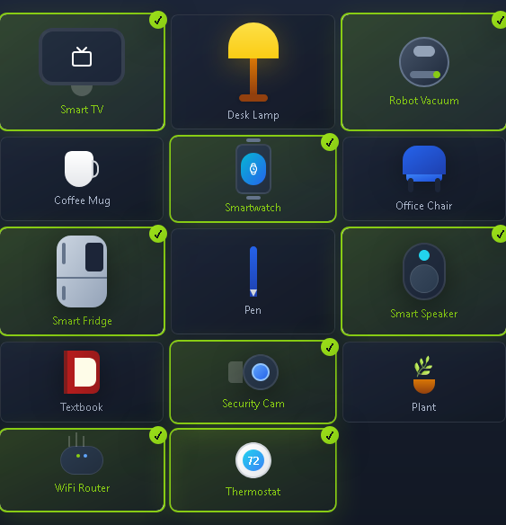
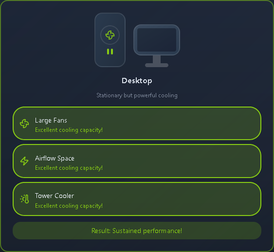
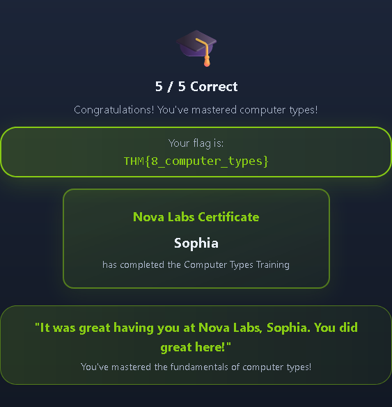

This is my write-up for the TryHackMe room on [Computer Types](https://tryhackme.com/room/computertypes). Written in 2026, I hope this write-up helps others learn and practice cybersecurity.

## Task 1: Introduction

Sophia discovers that computers are not limited to traditional laptops and phones; they are also hidden inside everyday objects like smart refrigerators. The goal of this section is to help you identify and differentiate between direct-use computers (laptops, smartphones) and indirect ones (servers, IoT devices, embedded systems) based on their purposes.

**Ready to find the hidden computers?**
> No answer needed

---

## Task 2: Sophia’s Summer of Hidden Computers – Month 1

Sophia learns that computers are built differently depending on their intended use. Laptops offer portability but struggle with sustained performance due to cooling limitations. Desktops provide steady, sustained performance at a fixed location. Workstations are specialized for precision and reliability in professional tasks. Finally, Servers operate entirely without screens or keyboards, running continuously to provide services to multiple users over a network.

**Which computer type usually runs without a dedicated screen and keyboard?**
> Server

**What kind of computer with specialized components would one buy to carry out precision work?**
> Workstation

---

## Task 3: Sophia’s Summer of Hidden Computers – Month 2

Millions of computers hide in plain sight inside everyday objects. Smartphones are the most popular pocket-sized computers, while tablets offer a touch-first experience. The main difference between IoT and Embedded systems is connectivity: IoT devices (like smart doorbells) connect to a network for single-purpose tasks, whereas embedded computers (found inside coffee machines or automatic doors) operate silently inside a machine and often never connect to the internet.

**What is the currently most popular pocket-sized computer?**
> Smartphone

**What kind of computer would you expect to find in a coffee machine?**
> Embedded computer

---

## Task 4: Why Computers Come in Different Flavors

Computers come in different types because every design involves trade-offs. Making a device mobile means sacrificing sustained power, while making a system highly reliable increases the cost due to redundancy (extra power supplies and disks). There is no single "best" computer; the design is entirely shaped by its specific purpose.

**Go through the attached static site and get the flag.**

- **Workstation: edit 4K video all day.**

- **Server: Host a website 24/7.**

- **Embedded: Ring when button pressed.**

Why do laptops throttle more than desktops?

> Less cooling space

What does server redundancy prevent?

> Single point of failure

Why do smartphones last longer on battery than laptops?

> Optimized for efficiency

Which feature is more common in workstations?

> ECC RAM and certified drivers

In many smart homes, what coordinates devices?

> Hub or cloud service

> THM{8_computer_types}

---

## Task 5: Summary

Sophia concludes her internship by realizing that computers are everywhere, often running silently in the background to keep daily life functioning (like opening doors or flying planes). The module covered eight distinct types of computers and the specific trade-offs involved in choosing the right tool for a given job.

**Room complete!**
> No answer needed

Thanks for reading. See you in the next lab.
