This is my write-up for the Content Discovery room on TryHackMe:  
<https://tryhackme.com/room/contentdiscovery>

## Task 1: What Is Content Discovery?

Content discovery in web application security is the process of finding hidden or unintended public content, such as staff portals, backup files, configuration files, or admin panels. There are three main methods for discovering this content: Manually, Automated, and OSINT (Open-Source Intelligence).

**What is the Content Discovery method that begins with M?**

> Manually

**What is the Content Discovery method that begins with A?**

> Automated

**What is the Content Discovery method that begins with O?

> OSINT

---

## Task 2: Manual Discovery - Robots.txt

The `robots.txt` file is used to instruct search engine crawlers on which pages they are allowed or forbidden to index. For penetration testers, checking this file manually is an excellent way to discover restricted directories or hidden pages (like administration portals) that the website owners want to keep hidden from public search engine results.

**What is the directory in the robots.txt that isn't allowed to be viewed by web crawlers?**

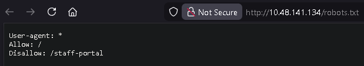

> /staff-portal

---

## Task 3: Manual Discovery - Favicon

A favicon is a small brand icon displayed in the browser tab. When developers build websites using frameworks and forget to change the default favicon, it can reveal the underlying framework stack being used. By downloading the favicon and generating its MD5 hash, you can compare it against the OWASP Favicon Database to identify the framework.

**What framework did the favicon belong to?**

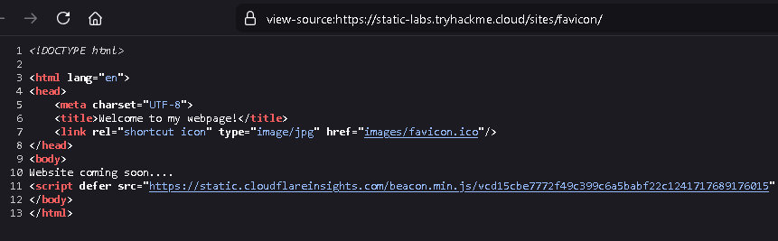

First, we open the page source to obtain the favicon URL.

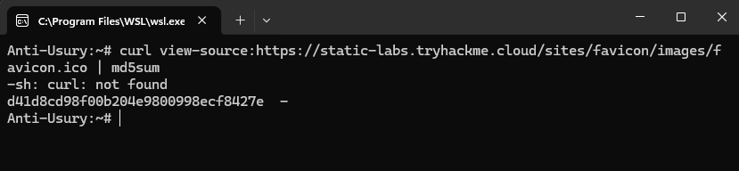

Next, we run the following script to generate the MD5 hash of the favicon:

```bash
curl https://static-labs.tryhackme.cloud/sites/favicon/images/favicon.ico | md5sum
```

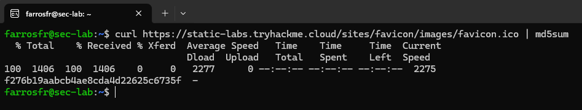

After that, we obtain this hash: f276b19aabcb4ae8cda4d22625c6735f

We can then search for this hash in the OWASP favicon database: <https://owasp.org/www-community/favicons_database>

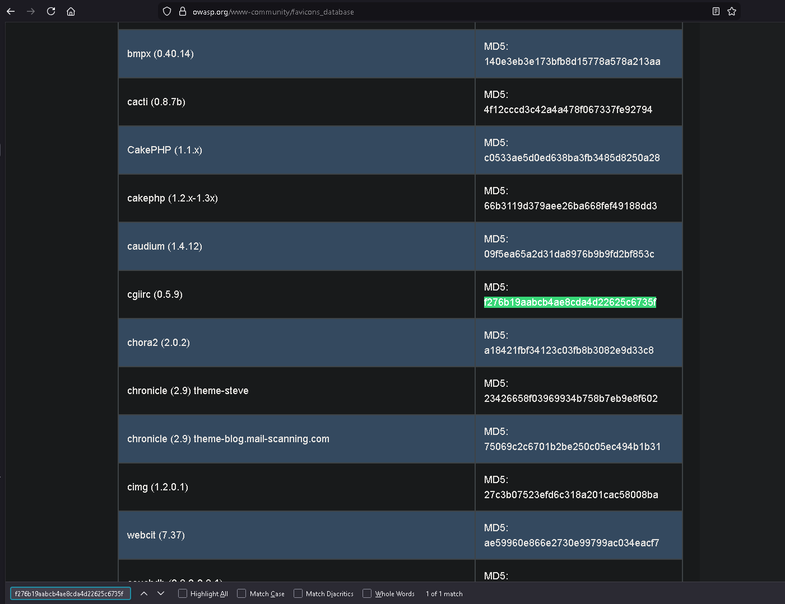

> cgiirc

---

## Task 4: Manual Discovery - Sitemap.xml

Unlike `robots.txt` which restricts access, the `sitemap.xml` file provides a list of all the pages and files a website owner explicitly wants search engines to index. Exploring the sitemap can map out the site's structure and occasionally reveal old, hidden, or hard-to-navigate pages that are still active behind the scenes.

**What is the path of the secret area that can be found in the sitemap.xml file?**

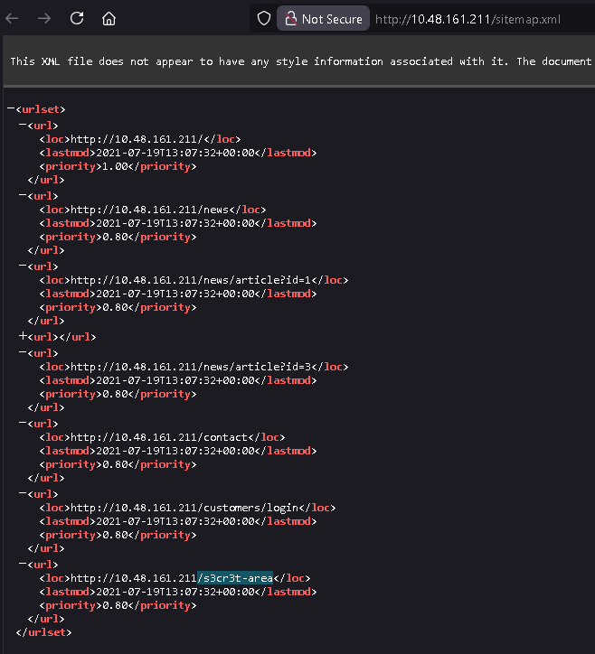

> /s3cr3t-area

---

## Task 5: Manual Discovery - HTTP Headers

When a web server responds to a request, it returns HTTP headers that can expose sensitive information about the underlying technologies, such as the web server software (e.g., NGINX) or programming language versions (e.g., PHP). Running a verbose HTTP request (like a `curl -v` command) allows you to inspect these headers for potential vulnerabilities.

**What is the flag value from the X-FLAG header?**

Here we just run curl http://IP_MACHINE -v

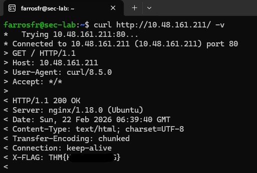

and we get the flag

> THM{REDACTED}

---

## Task 6: Manual Discovery - Framework Stack

Discovering the framework a website uses—whether through favicons, page source comments, or copyright notices—allows you to research its official documentation. Exploring the framework's documentation can reveal default administration paths, configuration files, or other endpoints that might lead to hidden content.

**What is the flag from the framework's administration portal?**

we open the view page source and find information below that we can change

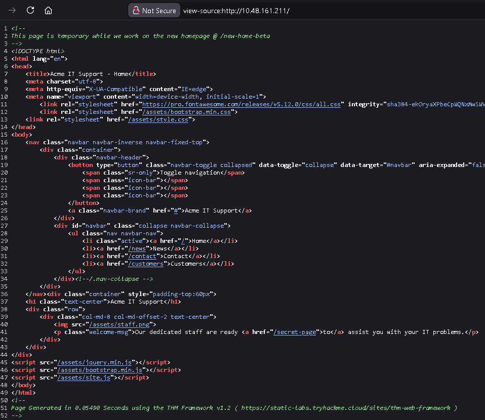

<https://static-labs.tryhackme.cloud/sites/thm-web-framework>

and we get information about the path /thm-framework-login which can be tried with username and password admin admin

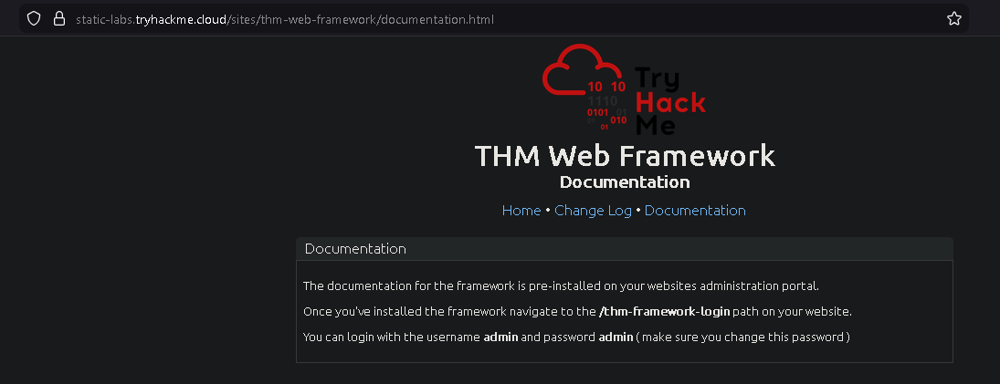

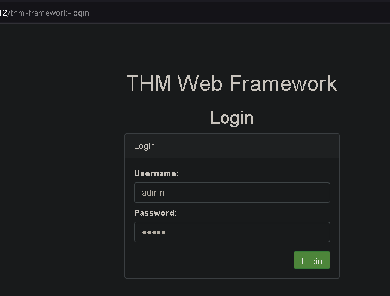

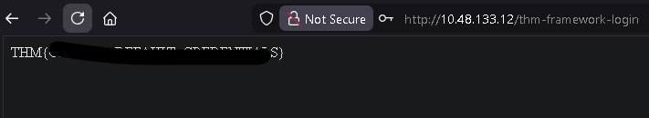

and we get the flag

> THM{REDACTED}

---

## Task 7: OSINT - Google Hacking / Dorking

Google Hacking (or Dorking) utilizes advanced Google search operators to uncover specific, often sensitive, content. By combining filters like `site:` (to target a specific domain), `inurl:`, `filetype:`, and `intitle:`, you can pinpoint exposed files, admin portals, or hidden directories directly from the search engine results.

**What Google dork operator can be used to only show results from a particular site?**

> site:

---

## Task 8: OSINT - Wappalyzer

Wappalyzer is an online tool and browser extension designed to profile websites. It actively identifies the technologies powering a site, including its Content Management System (CMS), underlying frameworks, payment processors, analytics tools, and even specific software version numbers.

**What online tool can be used to identify what technologies a website is running?**

> Wappalyzer

---

## Task 9: OSINT - Wayback Machine

The Wayback Machine is a digital archive of the internet that takes snapshots of web pages over time, dating back to the late 90s. It can be used to view historical versions of a website, helping penetration testers uncover old, unlinked, or forgotten pages that might still be active on the target's current server.

**What is the website address for the Wayback Machine?**

> [https://archive.org/web/](https://archive.org/web/)

---

## Task 10: OSINT - GitHub

Git is a version control system used by developmentteams to track project changes, and GitHub is a cloud-based hosting platform for these Git repositories. Searching GitHub for a target company's name or domain can occasionally reveal public repositories containing sensitive source code, hardcoded passwords, or other overlooked digital assets.

**What is Git?**

> version control system

---

## Task 11: OSINT - S3 Buckets

Amazon S3 Buckets are cloud storage containers provided by AWS, used to host files or static websites. If their access permissions are improperly configured, they can unintentionally expose private files to the public. They can often be discovered by searching for URLs following the standard S3 format or automating keyword searches using the company name (e.g., `{name}-assets`).

**What URL format do Amazon S3 buckets end in?**

> <https://www.google.com/search?q=.s3.amazonaws.com>

---

## Task 12: Automated Discovery

Automated discovery involves using specialized tools to rapidly send hundreds or thousands of requests to a web server to verify the existence of hidden files or directories. This process is typically powered by pre-compiled wordlists (like SecLists) containing common file names, and executed using automated directory brute-forcing tools such as ffuf, dirb, or gobuster.

**What is the name of the directory beginning "/mo...." that was discovered?**

in the attack box, we can run this script according to the instructions:

```bash
ffuf -w /usr/share/wordlists/SecLists/Discovery/Web-Content/common.txt -u http://IP_MACHINE/FUZZ
```

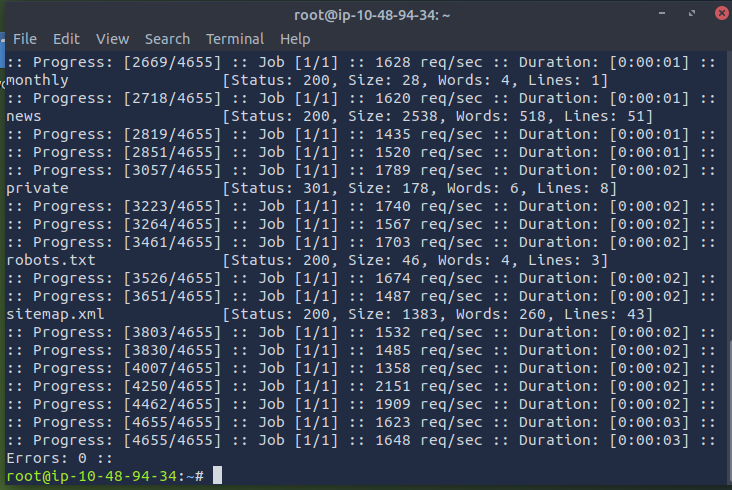

then we try to find the directory using:

```bash
dirb http://IP_MACHINE/ /usr/share/wordlists/SecLists/Discovery/Web-Content/common.txt
```

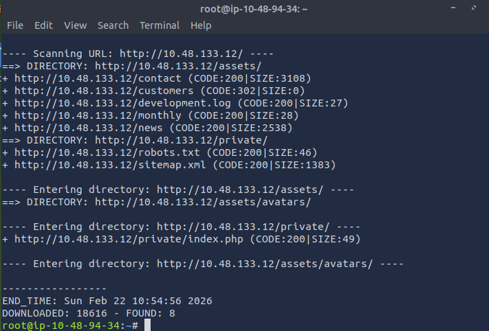

> /monthly

**What is the name of the log file that was discovered?**

run gobuster with this script

```bash
gobuster dir --url http://IP_MACHINE/ -w /usr/share/wordlists/SecLists/Discovery/Web-Content/common.txt
```

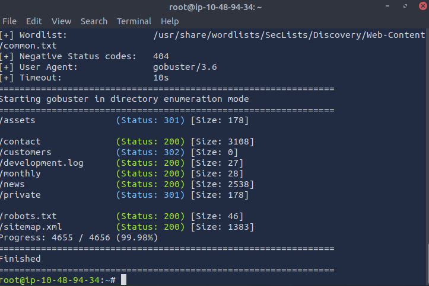

> /development.log
