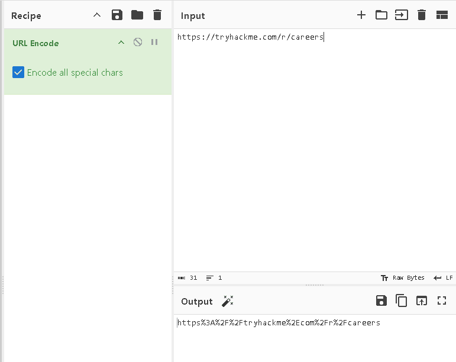
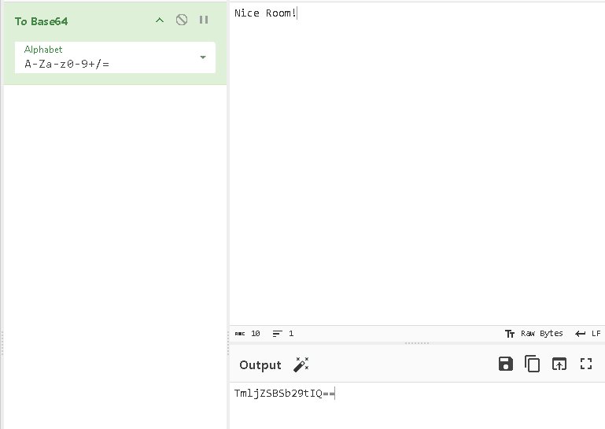
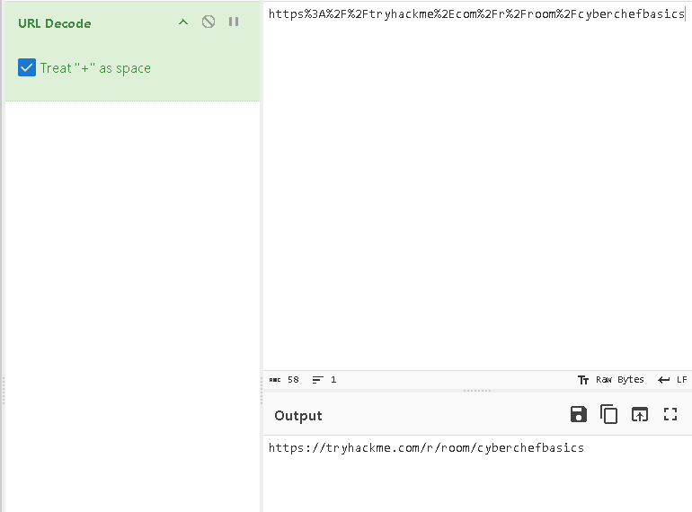
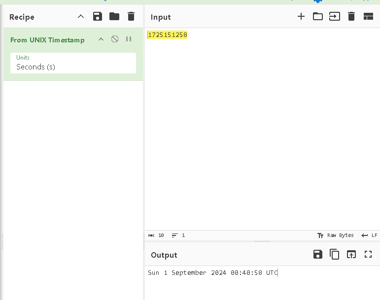
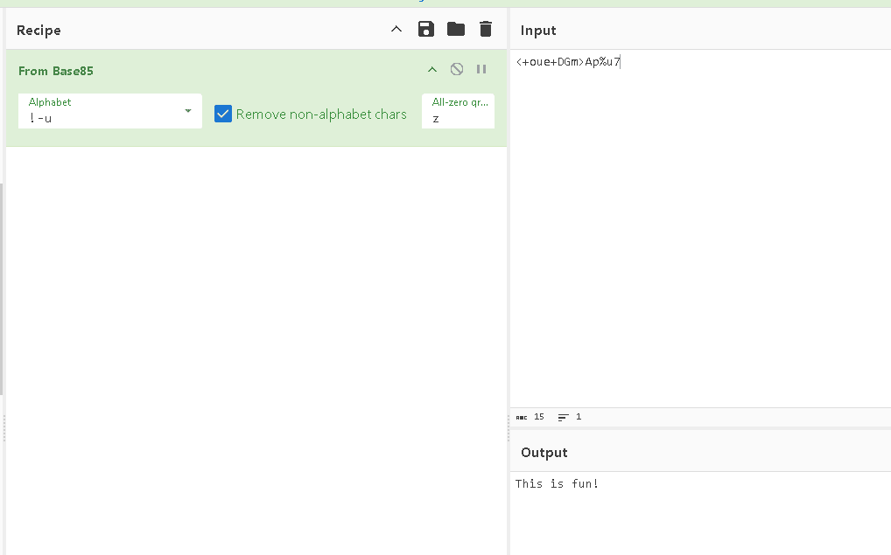

Here i want to share about my write-up for the room [CyberChef: The Basics](https://tryhackme.com/room/cyberchefbasics), this room is an introduction to CyberChef, the Swiss Army knife for cyber security professionals. I wrote this in 2025 and hope it is useful for learning about cybersecurity.

## Task 1: Introduction

CyberChef is a simple, intuitive web-based application designed to help with various “cyber” operation tasks within our web browser.

Proceed with the next tasks to learn more!
>No answer needed

## Task 2: Accessing the Tool

There are different ways to access and run CyberChef.

- Online Access
- Offline or Local Copy

<https://gchq.github.io/CyberChef/>

I have access to CyberChef and I’m ready to dive into it.
>No answer needed

## Task 3: Navigating the Interface

CyberChef consists of four areas. Each consists of different components or features.

1. Operations
2. Recipe
3. Input
4. Output

In which area can you find "From Base64"?
>operations

Which area is considered the heart of the tool?
>Recipe

## Task 4: Before Anything Else

The thought process when using CyberChef consists of four different steps:

1. Setting a clear objective
2. Put your data into the input area
3. Select the Operations you want to use
4. Check the output to see if it is the intended result

At which step would you determine, "What do I want to accomplish?
>1

## Task 5: Practice, Practice, Practice

This text explores commonly used operation categories: Extractors, Date / Time, and Data format.

- **Extractors**: This category includes operations to `Extract IP addresses`, `Extract URLs`, and `Extract email addresses` from input.
- **Date / Time**: This category includes operations to convert `From UNIX Timestamp` to a datetime string and `To UNIX Timestamp` from a datetime string.
- **Data Format**: This category includes base encodings like `From Base64`, `From Base85`, `From Base58`, `To Base62`, and the `URL Decode` operation.

What is the hidden email address?
><hidden@hotmail.com>

What is the hidden IP address that ends in .232?
>102.20.11.232

Which domain address starts with the letter "T"?
>TryHackMe.com

To convert a decimal number to its binary equivalent, we can use the repeated division-by-2 method. We continuously divide the decimal number by 2 and record the remainder until the result is 0. The binary number is then formed by reading the remainders in reverse order (from bottom to top).

Here’s the step-by-step conversion for the number 78:

1. **78** ÷ 2 = 39 with a remainder of **0**
2. **39** ÷ 2 = 19 with a remainder of **1**
3. **19** ÷ 2 = 9 with a remainder of **1**
4. **9** ÷ 2 = 4 with a remainder of **1**
5. **4** ÷ 2 = 2 with a remainder of **0**
6. **2** ÷ 2 = 1 with a remainder of **0**
7. **1** ÷ 2 = 0 with a remainder of **1**

Reading the remainders from the bottom up gives you **1001110**. For 8-bit is **01001110**.

What is the binary value of the decimal number 78?
>01001110

What is the URL encoded value of <https://tryhackme.com/r/careers>?
>https%3A%2F%2Ftryhackme.com%2Fr%2Fcareers%3F

## Task 6: Your First Official CookURL Decode

Using the file you downloaded in Task 5, which IP starts and ends with "10"?
>10.10.2.10

What is the base64 encoded value of the string "Nice Room!"?
>TmljZSBSb29tIQ==

What is the URL decoded value for https%3A%2F%2Ftryhackme%2Ecom%2Fr%2Froom%2Fcyberchefbasics?
><https://tryhackme.com/r/room/cyberchefbasics>

What is the datetime string for the Unix timestamp 1725151258?
>Sun 1 September 2024 00:40:58 UTC

What is the Base85 decoded string of the value <+oue+DGm>Ap%u7?
>This is fun!

## Task 7: Conclusion

I will have CyberChef, the Swiss Army knife of cyber security, ready for my upcoming journeys!
>No answer needed
