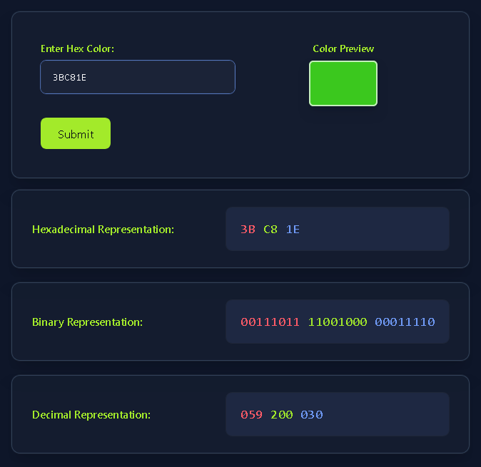
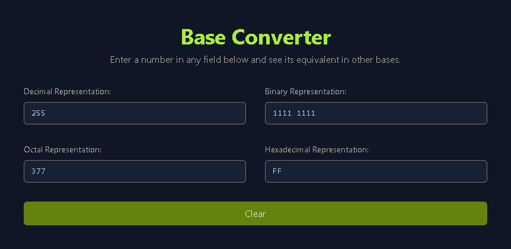

This is my write-up for the TryHackMe room on [Data Representation](https://tryhackme.com/room/datarepresentation). Written in 2026, I hope this write-up helps others learn and practice cybersecurity.

## Task 1: Introduction

This section introduces the foundational concept of how computers use the binary system (0s and 1s) to represent data, in contrast to the decimal system (0-9) used by humans. The learning objectives cover how computers represent colors (from 8 basic colors to over 16 million) and understand various numerical systems, including binary, hexadecimal, and octal numbers.

**It is time to dive into computer colors!**
> No answer needed

## Task 2: Representing Colors

This section explains how computer screens generate colors using Red, Green, and Blue (RGB) light. It starts with a simple 3-bit system (yielding 8 basic colors) and scales up to a 24-bit system where each color gets a full byte (8 bits), creating over 16.7 million possible color combinations. To make these long 24-bit binary strings easier to read and write, the hexadecimal system is used, where every 4 bits are grouped into a single hex digit (e.g., `#A3EA2A`).

**Preview the color `#3BC81E`. In one word, what does this color appear to be?**
> Green

**What is the binary representation of the color `#EB0037`?**
> 11101011 00000000 00110111

**What is the decimal representation of the color `#D4D8DF`?**
> 212 216 223

## Task 3: Numbers: From Decimal to Hexadecimal

This task breaks down the mathematics behind different number bases. It explains that the decimal system (base-10) uses powers of 10, while digital systems rely on binary (base-2) using powers of 2. It demonstrates how to mathematically convert binary strings into decimal numbers. Furthermore, it details the hexadecimal (base-16, digits 0-F) and octal (base-8, digits 0-7) systems, providing formulas and examples for converting them back to our standard decimal format.

**What is the hexadecimal `FF` in binary?**

In this section, we only need to fill in the values ​​of the questions in the hexadecimal representation column. And next too.

> 1111 1111

**What is the hexadecimal `AB` in decimal?**
> 171

**Convert the hexadecimal `FF FF FF` to decimal. After you round up the decimal value to the nearest million, how many millions is that?**
> 17

## Task 4: Conclusion

The final section summarizes the core concepts covered in the room, recapping the four main number systems: Decimal (Base-10), Binary (Base-2), Hexadecimal (Base-16), and Octal (Base-8). It also reviews the basic units of digital data—bits and bytes (octets)—and how they combine to represent millions of hex colors. Finally, it sets the stage for the next topic on how text and emojis are encoded.

**It is time to join the Data Encoding room and dive deeper into bits.**
> No answer needed

Thanks for reading. See you in the next lab.
