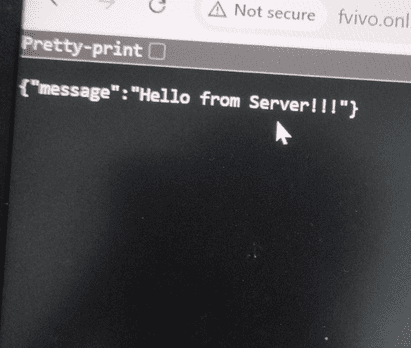

Deploying a face recognition attendance device sounds simple—connect it to WiFi, point it to the server, and you're done.

In reality? Network policies can turn a 30-minute setup into a full debugging session.

This article documents a real-world deployment of a cloud-connected attendance device, the network issues encountered, and the technical reasoning behind the final diagnosis.

## 1. Device Overview

The deployed device is a **face recognition attendance terminal** with:

- WiFi (2.4G)
- HTTP / HTTPS support
- Push SDK integration
- Local Web UI configuration
- Cloud server connectivity via custom port

### Network Capabilities

- DHCP or Static IP
- DNS configuration
- Custom HTTP push port
- Push SDK server configuration

This type of device behaves similarly to an IoT endpoint rather than a traditional PC client.

---

## 2. Deployment Architecture

### Cloud Setup

The device was configured with:

- **Domain**: `fvivo.online`
- **Protocol**: HTTP
- **Port**: 8001
- **Push SDK**: Enabled

The cloud endpoint responded successfully via browser:



Response:

```json
{"message":"Hello from Server!!!"}
````

So the server was confirmed operational.

---

## 3. Initial Symptoms

When connected to:

### ✅ Mobile Hotspot

- Push SDK → Online
- Cloud sync → Working

### ❌ Office WiFi

- Push SDK → Offline
- Internet available
- DNS resolving
- Port reachable from PC

This discrepancy was the key clue.

---

## 4. Network Testing & Validation

### 4.1 Basic Connectivity

From office WiFi:

```powershell
ping 8.8.8.8
```

Internet reachable.

---

### 4.2 Port Test

```powershell
Test-NetConnection fvivo.online -Port 8001
```

Result:

```powershell
TcpTestSucceeded : True
```

So:

- Port 8001 NOT globally blocked
- DNS working
- Outbound TCP allowed

Yet the device still showed:

```powershell
Push SDK Status: Offline
```

---

## 5. Why PC Works but Device Fails

This is where deeper network behavior matters.

Enterprise WiFi networks often apply:

- MAC-based policy rules
- VLAN segmentation
- IoT isolation
- Layer 7 filtering
- Deep Packet Inspection (DPI)
- Application-based firewall rules

PC traffic is recognized as normal browser/client behavior.

IoT traffic (like Push SDK HTTP posts) may be:

- Classified differently
- Subject to stricter outbound filtering
- Blocked by security profile

Even when the port is technically open.

This explains why:

- PC → can access port 8001
- Device → cannot establish session

Hotspot works because:

- No L7 inspection
- No security policy
- No device classification

---

## 6. Why It Was NOT a Port Issue

Many assume port blocking first.

However:

- Port 8001 reachable from PC
- Server confirmed live
- DNS resolving
- HTTP response verified

Therefore, traditional firewall port block was ruled out.

The issue was **policy-level filtering**, not transport-level blocking.

---

## 7. The Most Likely Root Causes

Based on behavior:

1. IoT isolation profile applied to unknown MAC
2. VLAN separation for non-registered devices
3. Application filtering for non-browser HTTP clients
4. Security rule limiting outbound traffic by device type

In enterprise networks, security layers are often invisible to end users.

---

## 8. How to Communicate With IT (Best Practice)

Instead of saying:

> “Port 8001 is blocked.”

A better technical request is:

> The attendance device cannot establish outbound TCP session to `fvivo.online:8001` when connected to office WiFi, but works via mobile hotspot.
> PC connectivity test to the same endpoint succeeds.
> Please check if there is any MAC-based policy, VLAN isolation, or application filtering affecting this device.

This approach avoids blame and invites structured investigation.

---

## 9. Lessons Learned

### 🔹 1. IoT devices are treated differently

Enterprise WiFi does not treat all clients equally.

### 🔹 2. Port open ≠ Traffic allowed

Firewall inspection can allow a port while still blocking specific traffic patterns.

### 🔹 3. Always compare environments

If hotspot works and office WiFi does not:
The network is the variable—not the device.

### 🔹 4. Push SDK over HTTPS is safer

Using HTTPS (443) significantly reduces filtering issues in enterprise environments.

---

## 10. Recommended Best Practices

- Use HTTPS (443) whenever possible
- Ask IT to whitelist device MAC address
- Document server IP and domain
- Keep network architecture diagrammed
- Avoid custom ports if corporate firewall policies are unknown

---

## Final Opinion

Deploying biometric attendance devices is no longer just a hardware task—it is a networking task.

Modern enterprise networks prioritize security, often at the expense of IoT compatibility.

Understanding network layers (L3 vs L7 filtering) is critical for successful deployment.

If a device works on hotspot but fails on corporate WiFi, the network policy is almost always the hidden variable.

---

If this case study helped you, feel free to share it or follow for more real-world deployment insights.
