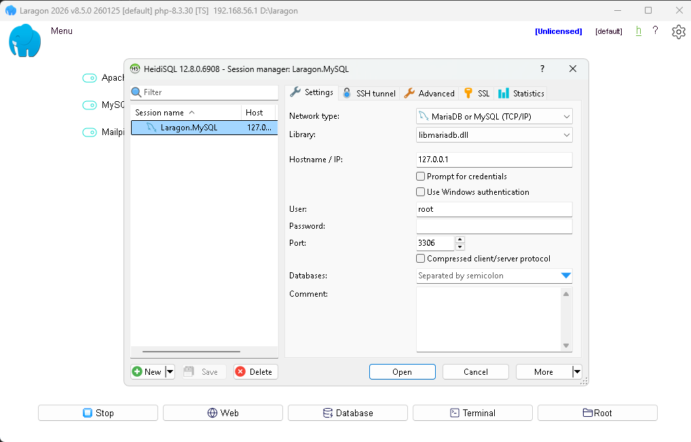
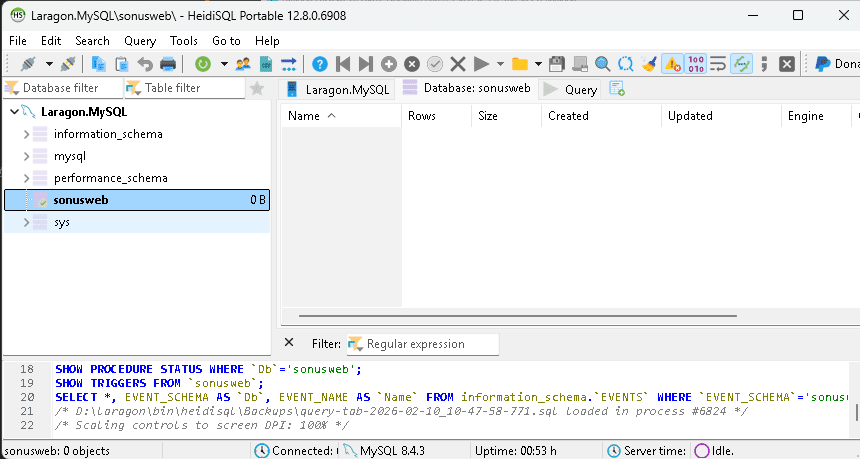
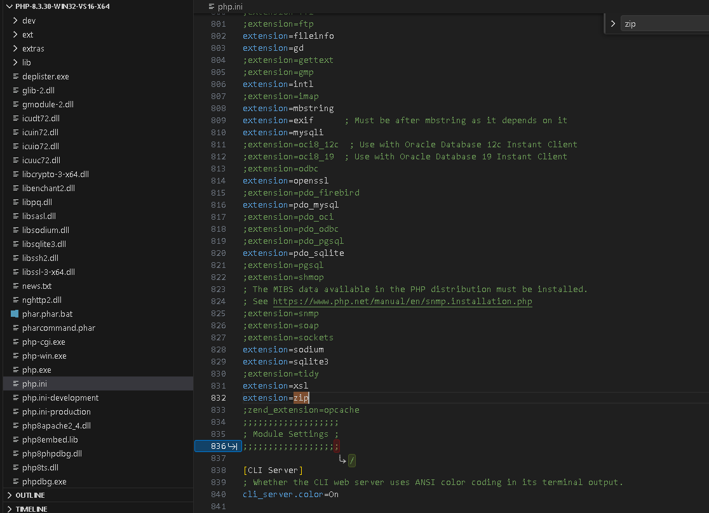
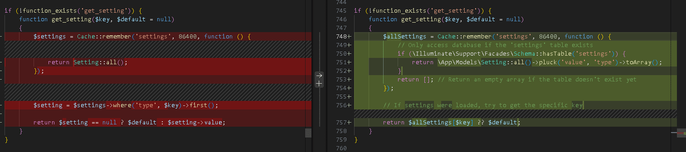
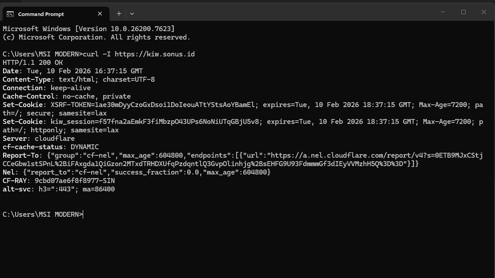
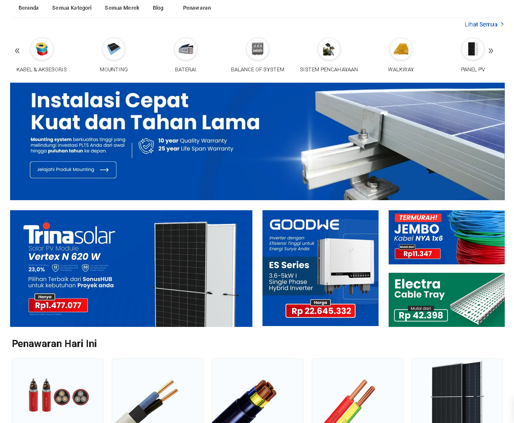

This document outlines the development process for a single-vendor e-commerce website using a Laravel backend, MySQL database, and Vue.js for the frontend. Initially, three potential tech stacks were considered: Medusa.js, Saleor, and Laravel + Vue.js 3.

The initial local development phase involved:

- Installing Laragon and setting up the project in `C:\laragon\www\sonusweb`.
- Creating a MySQL database named `sonusweb`.





The `.env` configuration during local setup:

```env
APP_NAME="sonusweb"
APP_URL="http://localhost"
APP_ENV=local
APP_KEY=
APP_DEBUG=true
APP_TIMEZONE="Asia/Jakarta"

ASSET_URL="http://localhost"

DEMO_MODE="Off"

LOG_CHANNEL=stack

DB_CONNECTION=mysql
DB_HOST=127.0.0.1
DB_PORT=3306
DB_DATABASE=sonusweb
DB_USERNAME=root
DB_PASSWORD=
```

Challenges encountered during local setup included:

- Issues with the PHP zip extension not being enabled.
- Deciding not to enable Redis locally, leading to `.env` modifications:
  `CACHE_DRIVER=file`
  `SESSION_DRIVER=file`
  `QUEUE_CONNECTION=sync`
- An error related to a missing 'settings' table, which required adjusting helper configurations to conditionally access the database only if the table exists.


- Further errors prompted disabling Redis service providers in `app.php` (`Illuminate\Redis\RedisServiceProvider::class`) and commenting out Redis cache configurations in `cache.php`.

Due to persistent local development issues, the strategy shifted to duplicating an existing Laravel source code from a VPS:

- Duplicating the MySQL database to a new one using an Aapanel VPS.
- Configuring a new DNS for the new domain with PHP version 8.3.
- Copying project files to a new directory.
- Updating the `.env` file with production settings for the new deployment:

```env
APP_NAME="NEW_APP"
APP_URL="NEW_URL"
APP_ENV=production
APP_KEY=
APP_DEBUG=false
APP_TIMEZONE="Asia/Jakarta"

ASSET_URL="NEW_URL"

DEMO_MODE="Off"

LOG_CHANNEL=stack

DB_CONNECTION=mysql
DB_HOST="localhost"
DB_PORT="3306"
DB_DATABASE="NEW_DB_NAME"
DB_USERNAME="NEW_DB_USER"
DB_PASSWORD=
```

- Finally, running `php artisan config:clear` and `php artisan cache:clear` successfully launched the website.





## What I’d Do Differently Next Time

Looking back, I wouldn’t spend too much time fixing local environment issues.

For Laravel projects with real deployment targets,
it’s often faster to:

- validate directly on a clean VPS,
- align PHP extensions with production from day one,
- and avoid local-only optimizations that won’t ship.

Local dev is still important — but only when it mirrors production closely.

## Why I Finally Chose Laravel Over Medusa & Saleor

- Medusa: great architecture, but ecosystem still evolving
- Saleor: solid GraphQL core, heavier infra footprint
- Laravel: fastest path to production with full control

For this project, speed-to-production mattered more than architectural purity.

---
**Need help with Laravel e-commerce or VPS deployment?**

DM me on **[LinkedIn](https://www.linkedin.com/in/farrosfr/)** or email **[hello@farrosfr.com](mailto:hello@farrosfr.com)** 🚀
