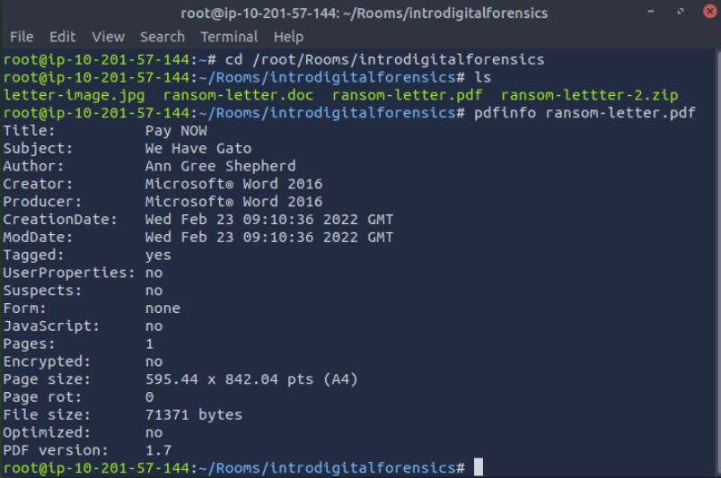
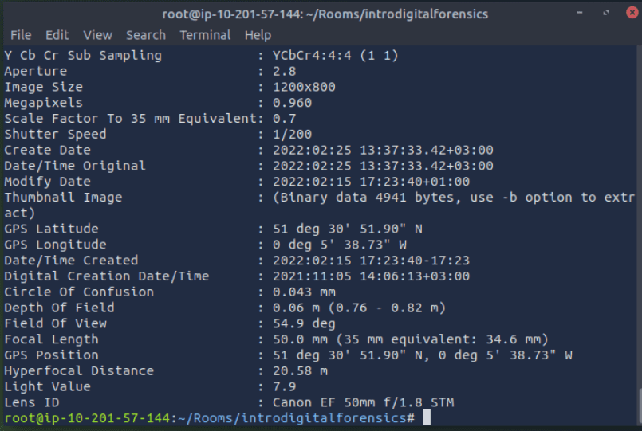
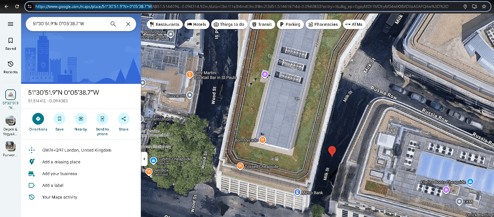
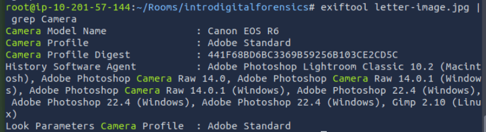

Here i want to share about my write-up for the room [Digital Forensics Fundamentals](https://tryhackme.com/room/digitalforensicsfundamentals) (Premium Room), learn about digital forensics and related processes and experiment with a practical example. I wrote this in 2025 and hope it is useful for learning about cybersecurity.

## Task 1: Introduction to Digital Forensics

**Forensics** is the application of methods and procedures to investigate and solve crimes. The branch of forensics that investigates cyber crimes is known as **digital forensics**. Cyber crime is any criminal activity conducted on or using a digital device.

Digital forensics teams follow procedures for collecting, storing, analyzing, and reporting evidence.

Which team was handed the case by law enforcement?
>digital forensics

## Task 2: Digital Forensics Methodology

NIST defines a process of digital forensics in four phases:

- Collection
- Examination
- Analysis
- Reporting

Which phase of digital forensics is concerned with correlating the collected data to draw any conclusions from it?
>Analysis

Which phase of digital forensics is concerned with extracting the data of interest from the collected evidence?
>Examination

## Task 3: Evidence Acquisition

Acquiring evidence is a critical job. Some general practices must be followed while the evidence is acquired.

- Proper Authorization
- Chain of Custody
- Use of Write Blockers

Which tool is used to ensure data integrity during the collection?
>write blocker

What is the name of the document that has all the details of the collected digital evidence?
>chain of custody

## Task 4: Windows Forensics

- **Disk Images:**
  - **FTK Imager** is a widely used tool for taking disk images.
  - **Autopsy** is a popular open-source platform for conducting extensive analysis of an acquired disk image.

- **Memory Images:**
  - **DumpIt** offers the utility of taking a memory image from a Windows operating system
  - **Volatility** is a powerful open-source tool for analyzing memory images.

Which type of forensic image is taken to collect the volatile data from the operating system?
>Memory Image

## Task 5: Practical Example of Digital Forensics

Everything we do on our digital devices leaves traces.

In this scenario, a kidnapper has sent a document. We can learn from the file's metadata.

### PDF Metadata Analysis

Much information gets kept within a file’s metadata when you use a more advanced editor, such as MS Word. We can try to read the metadata using the program **pdfinfo**, which displays various metadata related to a PDF file, such as the author, creator, and creation date.

### Photo EXIF Data

**EXIF** is a standard for saving metadata to image files. Because smartphones are equipped with a GPS sensor, finding **GPS coordinates** embedded in the image is highly probable. One command-line tool is **exiftool**, which is used to read and write metadata in various file types, such as JPEG images.

Using pdfinfo, find out the author of the attached PDF file, ransom-letter.pdf.
>Ann Gree Shepherd

The GPS coordinates we get from exiftool should be written as 51°30'51.9"N 0°05'38.7"W and then we can search in google maps like this: <https://www.google.com/maps/place/51%C2%B030'51.9%22N+0%C2%B005'38.7%22W>

Using exiftool or any similar tool, try to find where the kidnappers took the image they attached to their document. What is the name of the street?
>milk street

We can run this following command: exiftool PHOTO.jpg | grep Camera

What is the model name of the camera used to take this photo?
>canon eos r6
