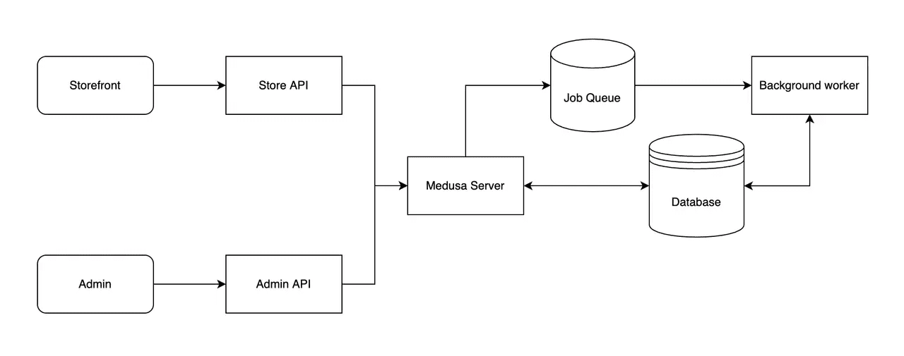
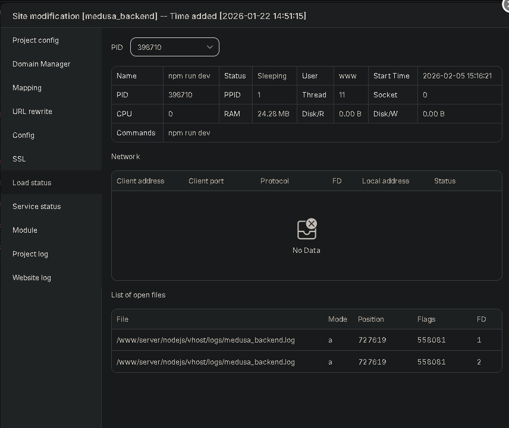

## Why I’m Looking Beyond Traditional Platforms

When building a **B2B e-commerce platform**, the challenges are usually not about themes or plugins, but about **architecture**:

* Custom pricing logic2
* Flexible product structures
* Integration with internal systems
* Scalability without vendor lock-in

Popular platforms like Magento are mature and powerful, but also come with **complexity and operational overhead**. For newer projects where flexibility and long-term maintainability matter, I started exploring **Medusa JS**.

---

## What Is Medusa JS?

Medusa JS is an **open-source, headless commerce backend**.
Conceptually, it sits in a similar space to Shopify—but instead of a hosted SaaS, Medusa is **self-hosted and API-first**.

In practice, this means:

* You own the backend
* You control the data
* You design the frontend freely

This makes it particularly interesting for **custom B2B workflows**.

---

## Architecture Overview

At a high level, the setup looks like this:

* **Backend**: Medusa JS (Node.js)
* **Database**: PostgreSQL
* **Frontend**: Next.js (or any framework consuming APIs)
* **Optional**: Redis for caching and background jobs

The backend exposes clean APIs, while business logic is organized into **services, entities, subscribers, and plugins**.
From an architectural standpoint, this separation is a big plus for long-term maintenance.

---

## Early Observations (Pros & Cons)

### What Looks Promising

* **JavaScript-first stack**: Easier onboarding for modern web teams
* **API-driven design**: Clean separation between frontend and backend
* **Modular extensibility**: Plugins and custom services feel natural
* **PostgreSQL as a core dependency**: Solid choice for transactional systems

### Things to Be Careful About

* The ecosystem is still **young compared to Magento**
* Documentation is good, but **real-world examples are limited**
* Requires more architectural decisions upfront
* Not ideal for teams looking for a “click-and-deploy” solution

---

## Current Status: Testing & Validation

Right now, I’m still in the **early-stage testing phase**, running Medusa on a VPS and validating:

* Deployment stability
* Data modeling for B2B use cases
* Integration patterns with a custom frontend
* Operational complexity in real environments

This is not about replacing mature platforms blindly, but about **understanding where Medusa fits best**.

---

## Final Thoughts

Medusa JS is **not a silver bullet**, but for teams that:

* need full control,
* value open-source,
* and are comfortable designing their own architecture,

…it’s a very compelling option.

I’ll be sharing more findings once the testing phase progresses.

---

### Resources

* Docs & Quick Start: [https://docs.medusajs.com](https://docs.medusajs.com)
* GitHub: [https://github.com/medusajs/medusa](https://github.com/medusajs/medusa)
