This is my write-up for the TryHackMe room on [File Inclusion](https://tryhackme.com/room/fileinc). Written in 2026, I hope this write-up helps others learn and practice cybersecurity.]

## Task 1: Introduction

This section introduces File Inclusion vulnerabilities, specifically Local File Inclusion (LFI), Remote File Inclusion (RFI), and Directory Traversal. These vulnerabilities typically occur in web applications (often written in PHP) due to poor input validation, allowing users to manipulate URL parameters. If exploited, attackers can leak sensitive data or achieve Remote Command Execution (RCE).

**Let's continue to the next section to deploy the attached VM.**

> No answer needed

---

## Task 2: Deploy the VM

Instructions are provided to deploy the target virtual machine. You need to connect to the TryHackMe network via OpenVPN or use the in-browser AttackBox to access the machine's IP address and view the vulnerable web application.

**Once you've deployed the VM, please wait a few minutes for the webserver to start, then progress to the next section!**

> No answer needed

---

## Task 3: Path Traversal

Path Traversal (or Directory Traversal) allows an attacker to access files or directories outside the web application's root folder. By manipulating URL parameters with "dot-dot-slash" (`../`) payloads, attackers can navigate up the directory tree to read sensitive OS files like `/etc/passwd` on Linux or `c:\boot.ini` on Windows. This usually happens when user input is passed unsanitized into functions like `file_get_contents` in PHP.

**What function causes path traversal vulnerabilities in PHP?**

> file_get_contents

---

## Task 4: Local File Inclusion - LFI

LFI occurs when a web application includes local files using unsanitized user input, commonly through PHP functions like `include`, `require`, `include_once`, and `require_once`. Even if a developer specifies a directory prefix in the code (e.g., `include("languages/" . $_GET['lang']);`), an attacker can still bypass it by using path traversal payloads (like `../../../../etc/passwd`) to break out of the intended folder and read system files.

**Give Lab #1 a try to read /etc/passwd. What would the request URI be?**

First, let's open the website.

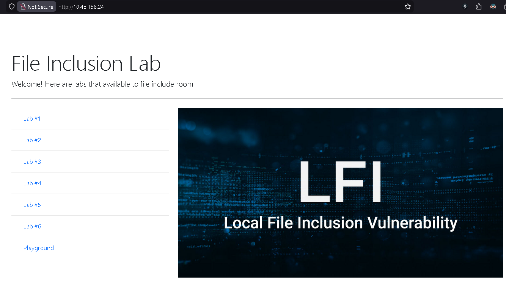

Then, click on Lab #1 first. In the question, we are given this hint:

example: /index.php?lang=EN.php

So we try to input `/etc/passwd` and then extract it from the URL. The URL appears like this: `http://IP_MACHINE/lab1.php?file=etc%2Fpasswd`

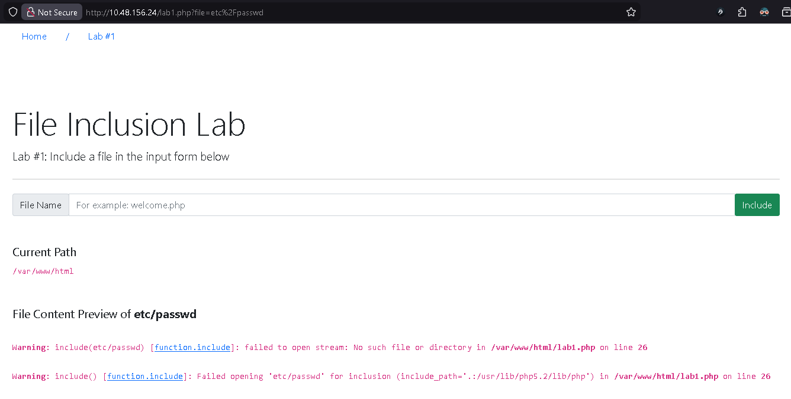

> /index.php?lang=/etc/passwd

**In Lab #2, what is the directory specified in the include function?**

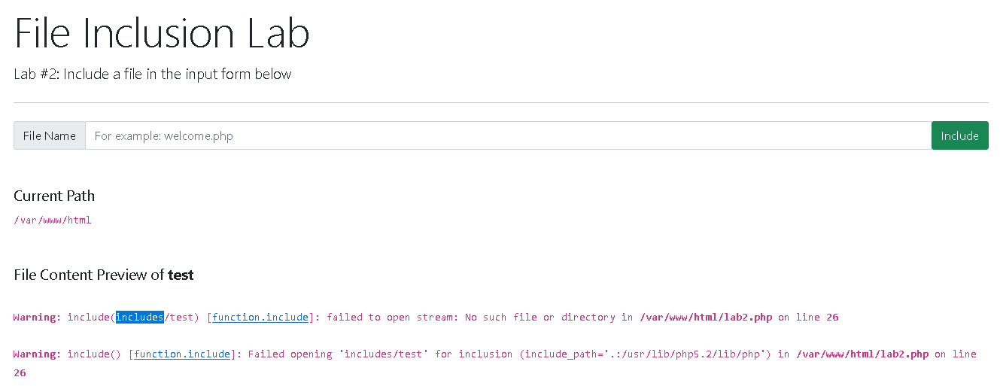

In this second lab, we try to perform a random input, for example "test", and the path that appears is "includes".

## Task 5: Local File Inclusion - LFI Continued

This task covers advanced techniques to bypass LFI filters when performing black-box testing:

1. **Null Byte Injection (`%00`)**: Tricks the application into ignoring appended file extensions (like `.php`). Note: This only works on PHP versions below 5.3.4.
2. **Current Directory Trick (`/.`)**: Used to bypass keyword filters. Adding `/.` at the end resolves to the exact same file path without triggering simple string filters.
3. **Double Traversal (`....//`)**: Bypasses basic replacement filters that strip `../` strings. When the application removes the first `../`, the remaining characters form a valid `../` payload.
4. **Forced Prefix Bypassing**: If the app forces the input to start with a specific directory name, you simply include it at the start of your payload (e.g., `languages/../../../../../etc/passwd`).

**Give Lab #3 a try to read /etc/passwd. What is the request look like?**

Okay, here's a tip: Don't trust the input form. Insert directly into the browser's address bar!

We want to read the sensitive file: `/etc/passwd`

So we use directory traversal to break out of the "languages" folder: `../../../../etc/passwd`

The problem is that the application appends `.php` at the end, so it attempts to read: `/etc/passwd.php`, which does not exist.

The solution is to use a Null Byte (`%00`) so that the `.php` extension is ignored: `../../../../etc/passwd%00`

> /index.php?lang=../../../../etc/passwd%00

**Which function is causing the directory traversal in Lab #4?**

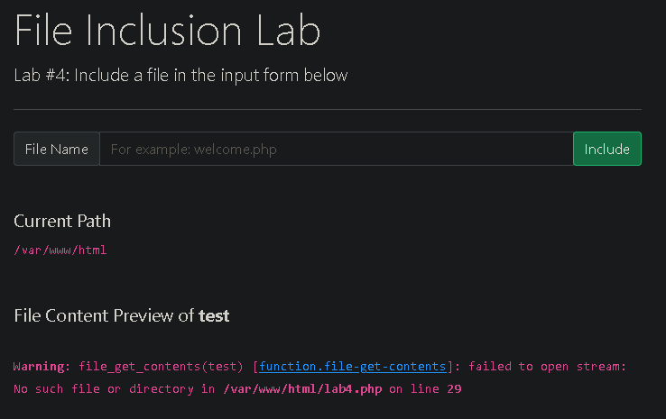

When trying a test input, a warning appears showing the function:

> file_get_contents

**Try out Lab #6 and check what is the directory that has to be in the input field?**

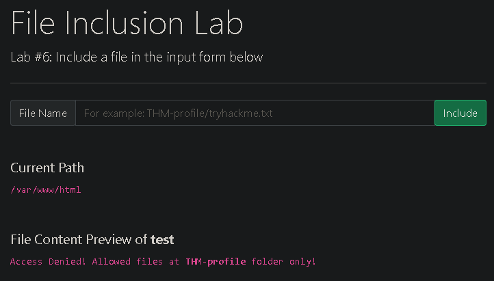

When trying to enter the text "test", the only allowed folder is "THM-profile".

> THM-profile

**Try out Lab #6 and read /etc/os-release. What is the VERSION_ID value?**

Since we are in Lab #6, where we must use the "THM-profile" path at the beginning, we use: `THM-profile/../../../../etc/os-release`

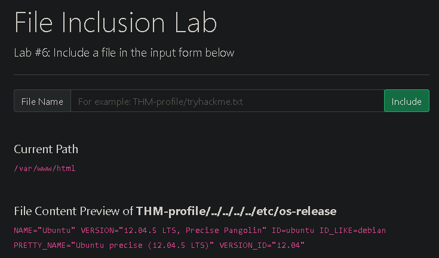

---

## Task 6: Remote File Inclusion - RFI

RFI allows an attacker to include and execute a remotely hosted file into the vulnerable application. It usually requires the `allow_url_fopen` setting to be enabled in PHP. Because attackers can host malicious PHP code (like a reverse shell) on their own server and inject its URL into the vulnerable parameter, RFI poses a much higher risk than LFI, reliably leading to Remote Command Execution (RCE), Cross-Site Scripting (XSS), or Denial of Service (DoS).

**We showed how to include PHP pages via RFI. Do research on how to get remote command execution (RCE), and answer the question in the challenge section.**

> No answer needed

---

## Task 7: Remediation

To prevent file inclusion vulnerabilities, developers should practice defense-in-depth:

1. Keep systems, frameworks, and services updated.
2. Disable PHP errors to prevent path disclosure.
3. Implement a Web Application Firewall (WAF).
4. Turn off `allow_url_fopen` and `allow_url_include` if not needed.
5. Strictly validate and sanitize all user input.
6. Use strong whitelisting for file names and locations instead of relying on blacklisting.

**Ready for the challenges?**

> No answer needed

---

## Task 8: Challenge

This final section is a practical assessment where you apply all the LFI and RFI techniques learned. Testing steps include finding the entry point (via GET, POST, headers, or cookies), fuzzing the input parameters, analyzing error messages for directory paths, understanding filters, and successfully injecting payloads to extract flags or gain RCE.

### Capture Flag1 at /etc/flag1

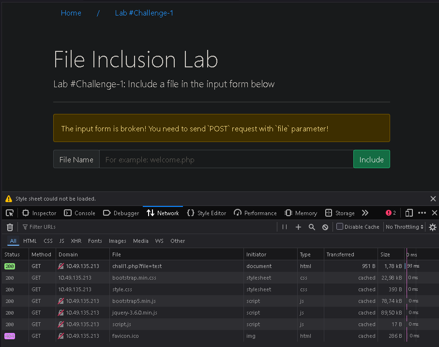

Here we try to test using the input "test".

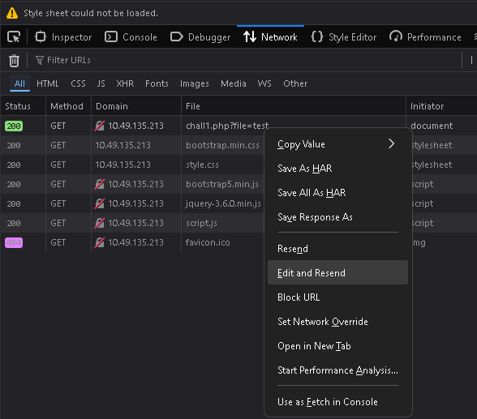

Then right-click and select "Edit and Resend" to perform a POST request.

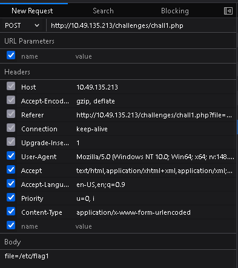

POST to `http://IP_MACHINE/challenges/chall1.php`

with the payload `file=/etc/flag1`

And don't forget to set the `Content-Type: application/x-www-form-urlencoded`.

Reference for this: <https://developer.mozilla.org/en-US/docs/Web/HTTP/Reference/Headers/Content-Type>

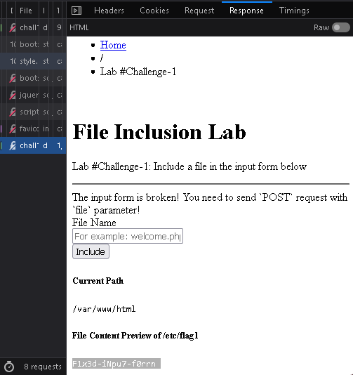

Click on the response section, and we get the first flag.

> F1x3d-iNpu7-f0rrn

### Capture Flag2 at /etc/flag2

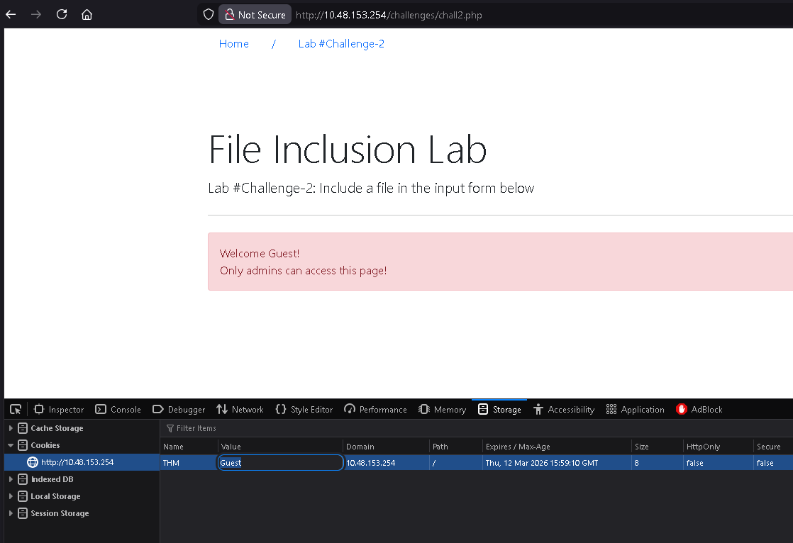

Go ahead and open Lab #Challenge-2 and refresh the page until the message "Welcome Guest!. Only admins can access this page!" appears.

From there, we can directly try changing the cookies via Inspect, then select the Storage tab and choose Cookies.

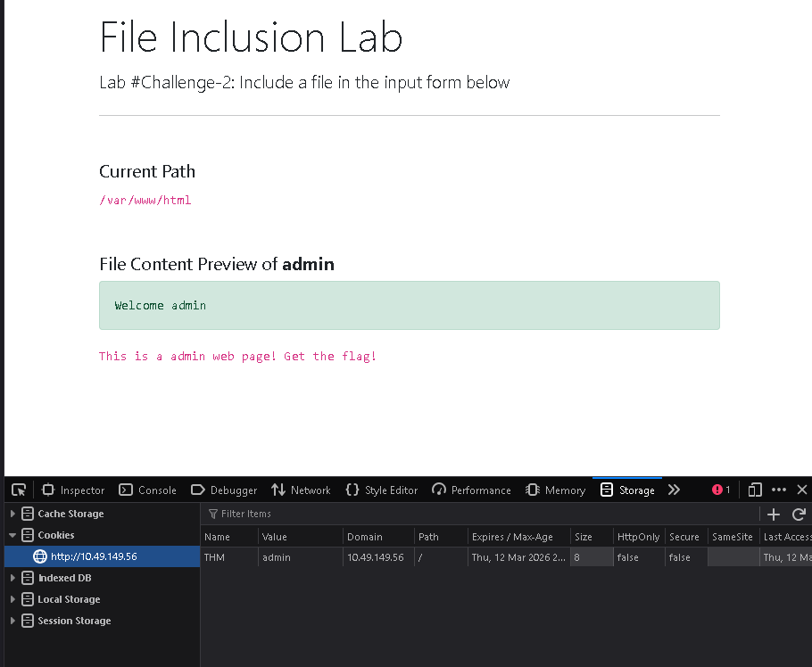

If we try to change it to "admin", we don't find much, just a message:

"File Content Preview of admin
Welcome admin
This is a admin web page! Get the flag!"

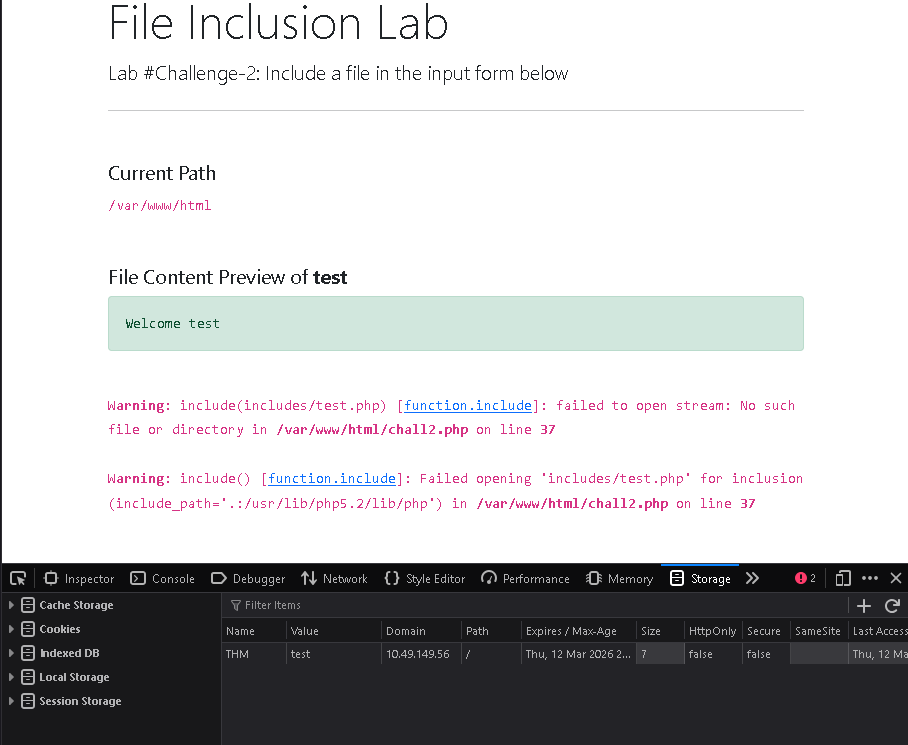

Then we try using the keyword "test", and we can find an insight into the path that appears:

Warning: include(includes/test.php) [function.include]: failed to open stream: No such file or directory in /var/www/html/chall2.php on line 37

So we just use `../../../../etc/flag2%00`, where `%00` is used to bypass the PHP extension (only works for PHP versions below 5.3.4), to retrieve the flag.

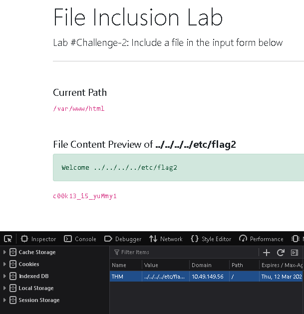

> c00k13_i5_yuMmy1

### Capture Flag3 at /etc/flag3

On the Challenge 3 page, when testing with "test", two warning responses appear:

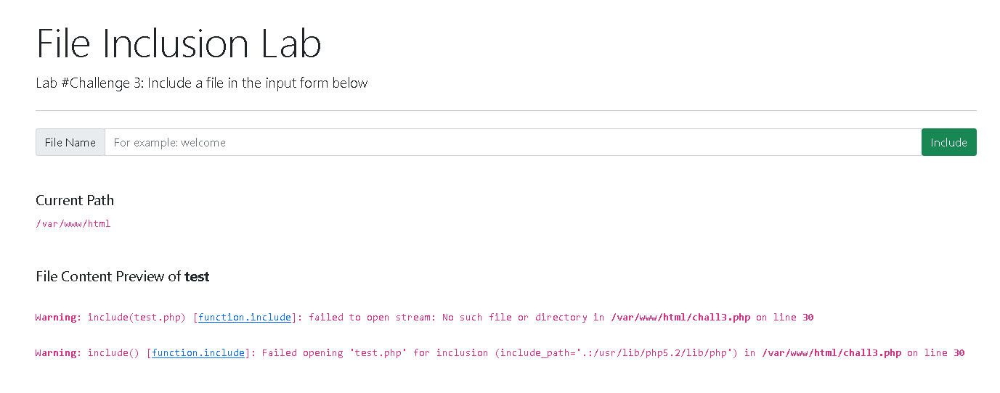

Warning: include(test.php) [function.include]: failed to open stream: No such file or directory in /var/www/html/chall3.php on line 30

Warning: include() [function.include]: Failed opening 'test.php' for inclusion (include_path='.:/usr/lib/php5.2/lib/php') in /var/www/html/chall3.php on line 30

Then, when trying `etc/passwd`:

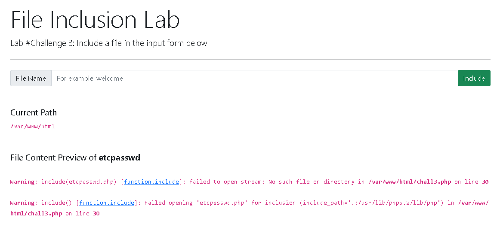

It turns out to be filtered; however, after reading the hint, it seems not everything is filtered.

The hint states:
[Hint #1] Not everything is filtered!
[Hint #2] The website uses $_REQUESTS to accept HTTP requests. Do research to understand it and what it accepts!

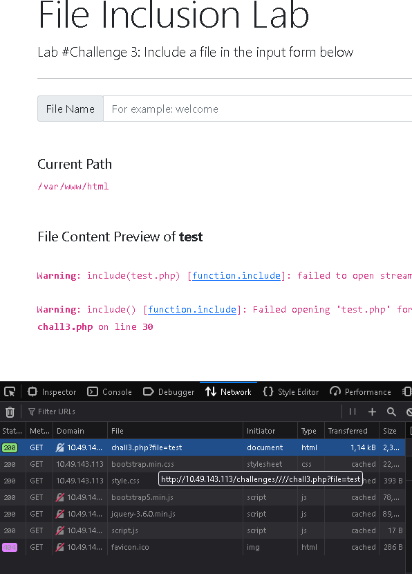

So we try using POST and don't forget to add `Content-Type: application/x-www-form-urlencoded`.

And when testing `file=etc/passwd`, it was successful.

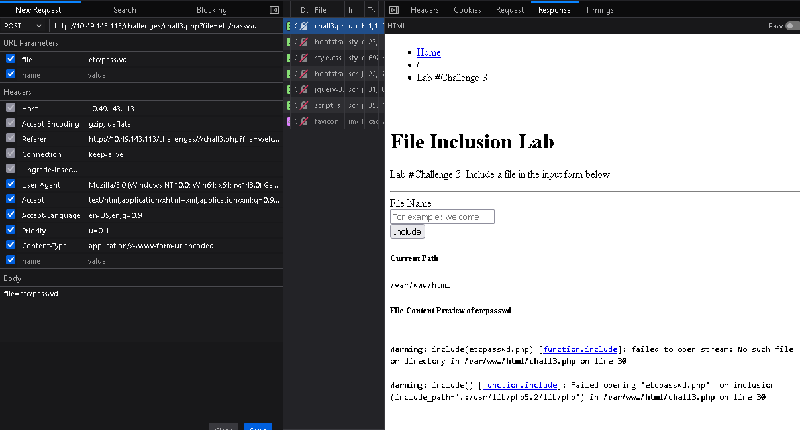

So we use the body `file=../../../../etc/flag3%00` to retrieve the flag.

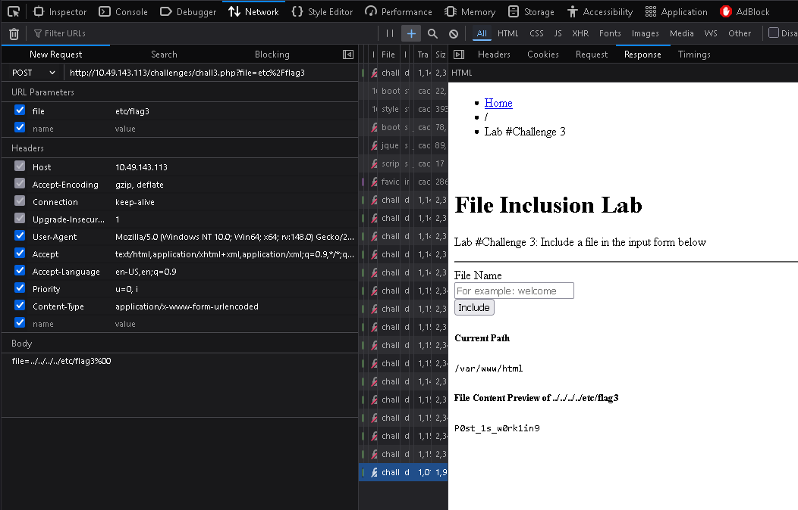

> P0st_1s_w0rk1in9

**Gain RCE in Lab #Playground /playground.php with RFI to execute the hostname command. What is the output?**

Let's head over to `IP_MACHINE/playground.php`.

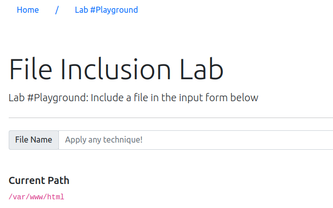

We open: `IP_MACHINE/playground.php`

On the page, there is a "File Name" input and the message:

Current Path
/var/www/html

When we try a payload such as:

../../../../etc/passwd

the server displays the file content. This indicates the presence of Local File Inclusion (LFI), as the backend likely executes:

include($_GET['file']);

This means the value of the "file" parameter is directly included by PHP without any sanitization.

After that, we create a file, for example `payload.php`, with the following content:

```php
<?php
echo "<pre>";
system($_GET['cmd']);
?>
```

Then simply run it to retrieve the flag:

```bash
data://text/plain,<?php system("hostname"); ?>
```

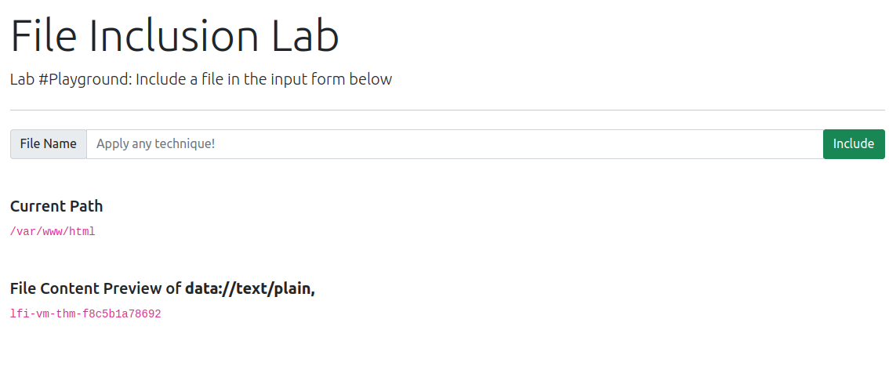

> lfi-vm-thm-f8c5b1a78692

Thanks for reading. See you in the next lab.
