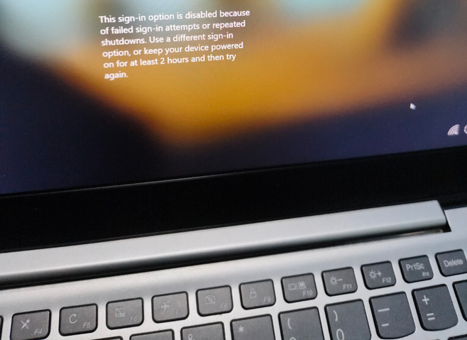
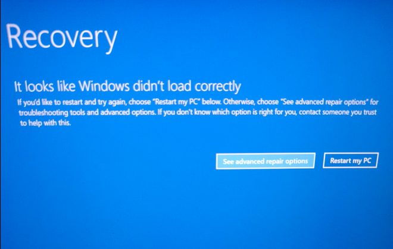
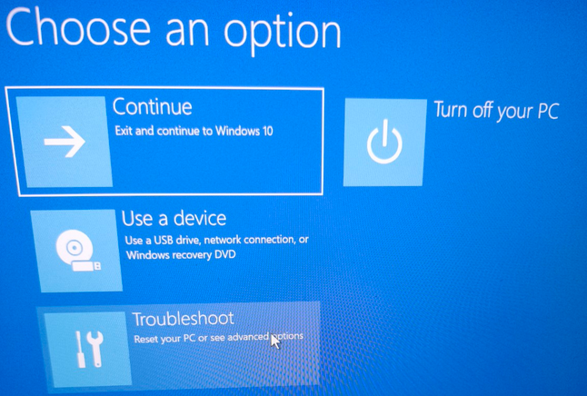
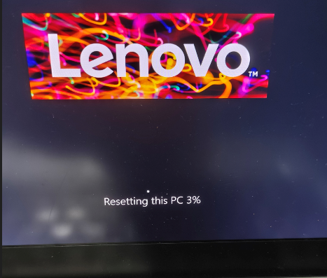

It started with a simple request from my manager:

“Can you fix my laptop? I forgot the PIN. If the disk gets wiped, it’s fine.”

Classic situation. Forgotten PIN, locked login screen, mild panic.

At that moment, I didn’t even know what exact Windows version it was. It *looked* like Windows 11, but I didn’t check the version explicitly. The laptop wasn’t brand new, so it could have been upgraded at some point. Either way, the core issue was the same: we couldn’t get past the login screen.

---

## Forcing Recovery Mode

Since we were stuck at login, I triggered Windows Recovery by forcing shutdown three times in a row. That’s actually a built-in behavior: Windows detects repeated failed boots and loads the recovery environment.

Soon, the blue **Recovery** screen appeared.

From there:

* Troubleshoot
* Reset this PC

That’s where things got interesting.

---

## The Temptation of the Old Way

My first instinct?

“Should I just grab a flash drive and use Rufus like the old days?”

Honestly, I was ready to go the classic route:

* Download ISO
* Create bootable USB with Rufus
* Enter BIOS
* Boot from USB
* Clean install

But then I thought… do I really want to go through all that setup again? Drivers, updates, extra configuration. It works, sure. But it’s tedious. And I wasn’t exactly in the mood for a full ritual reinstall.

Sometimes laziness is just efficiency in disguise.

---

## The License Clue

While checking the device, I noticed the Windows logo on the back of the laptop. That usually indicates an embedded OEM license.

That changed my mindset.

If the device already had a valid Windows license tied to the hardware, there was no strong reason to go full USB reinstall. The built-in recovery should handle everything cleanly and reactivate automatically.

So instead of overengineering the solution, I chose the practical path.

---

## The Reset Decision

Inside **Reset this PC**, Windows offered:

* Keep my files
* Remove everything

I initially tried the “Keep my files” route. It required Microsoft account authentication. But because of earlier connectivity limitations and the locked state, it wasn’t the smoothest path.

Since my manager had already said wiping the disk was fine, I chose:

**Remove files (standard reset)**
—not the deep, fully secure wipe that takes much longer.

Shortly after confirming, the screen showed the Lenovo logo with the word:

> Resetting

That’s the point of no return.

---

## Back to First-Time Setup

After the reset, the laptop booted into the familiar first-time Windows setup flow:

* Region selection
* Keyboard layout
* Network connection
* Microsoft account login

At that point, it became clear that the device was actually running Windows 10, but I didn’t double-check the exact version number.

Activation happened automatically, no product key drama. That confirmed the license was indeed embedded in the device.

We signed back into the Microsoft account, set a new PIN, and within a short time, everything was working again.

---

## What This Small Task Revealed

This wasn’t a complex IT project. But it was a reminder:

* Not every problem requires the most technical solution.
* Built-in recovery tools are more powerful than we assume.
* USB reinstall is reliable—but often unnecessary.
* Sometimes the “lazy” path is actually the most efficient one.

In the end, what started as a locked laptop turned into a simple reset and clean setup. No Rufus. No BIOS tweaking. No overkill.

Just practical problem-solving.

---

👋 If you enjoy real-world tech stories like this, follow for more practical lessons from everyday troubleshooting
