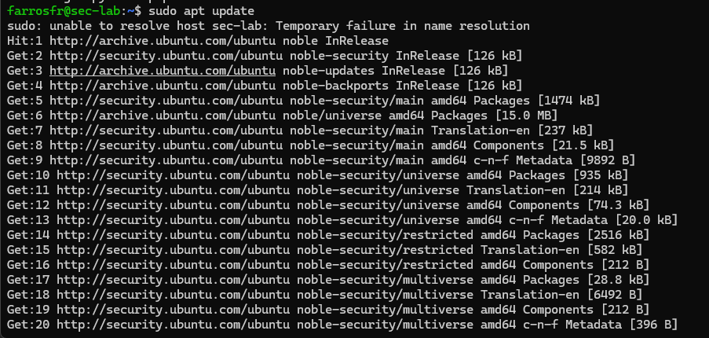
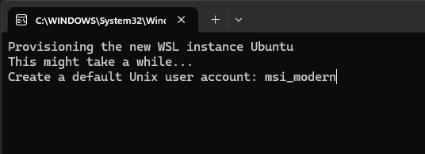

With Windows Subsystem for Linux (WSL), running a Linux environment on Windows is no longer complicated. The setup is usually smooth until a small configuration detail, like a hostname mismatch, suddenly throws an unexpected and confusing error such as:



```bash
sudo: unable to resolve host <hostname>: Temporary failure in name resolution
```

In this guide, I’ll walk through:

* Installing Ubuntu on WSL
* Setting it as the default distribution
* Creating a proper user
* Changing the hostname cleanly
* Fixing the “unable to resolve host” error
* And finally: why I use WSL instead of Kali Linux in VirtualBox — including the downsides.

---

## 1. Installing Ubuntu on WSL

First, check existing WSL distributions:

```powershell
wsl -l -v
```

If Ubuntu is not installed:

```powershell
wsl --install -d Ubuntu
```

After installation completes, launch it:

```powershell
wsl
```

or open via windows start.

You’ll be prompted to create a default Unix user account.
Choose a clean and professional username (for example, your GitHub handle). This becomes your Linux home directory:



```bash
/home/yourusername
```

---

## 2. Setting Ubuntu as Default

If Docker Desktop is currently your default WSL distro:

```powershell
wsl -s Ubuntu
```

Verify:

```powershell
wsl -l -v
```

The asterisk (*) should now be next to Ubuntu.

---

## 3. Changing the Hostname Properly

To rename your machine, example:

```bash
sudo hostnamectl set-hostname sec-lab
```

Restart WSL:

```powershell
wsl --shutdown
```

Reopen WSL and your prompt should look like:

```bash
username@sec-lab:~$
```

---

## 4. Fixing the “Unable to Resolve Host” Error

After changing the hostname, you may see:

```bash
sudo: unable to resolve host sec-lab: Temporary failure in name resolution
```

This happens because `/etc/hosts` still contains the old hostname.

Edit it:

```bash
sudo nano /etc/hosts
```

You might see:

```bash
127.0.0.1    localhost
127.0.1.1    Old-Hostname
```

Replace the second line with, example:

```bash
127.0.1.1    sec-lab
```

Save, then restart WSL:

```powershell
wsl --shutdown
```

The error should now be gone.

---

## Installing Essential Security Tools

After setup, install a minimal but powerful toolkit, like:

```bash
sudo apt update
sudo apt install -y \
curl wget git unzip \
net-tools dnsutils \
nmap python3-pip
```

---

## Why I Use WSL Instead of Kali in VirtualBox

Many people in cybersecurity default to Kali Linux inside VirtualBox. I did too. But over time, my workflow changed.

Here’s why I prefer WSL for daily use.

### 1. Performance

WSL 2 runs with near-native performance.
No heavy VM overhead.
No manually allocating RAM and CPU.

VirtualBox always feels heavier.

### 2. Workflow Integration

WSL integrates seamlessly with:

* Windows filesystem
* VS Code
* Docker
* Git
* Windows Terminal

You can develop in Windows while running Linux tools in parallel smoothly.

### 3. Minimalist and Intentional

Kali comes with hundreds of preinstalled tools.

WSL + Ubuntu forces you to:

* Install only what you need
* Understand your environment
* Build your own stack

That’s better for learning and discipline.

---

## But WSL Is Not Perfect (The Cons)

In security communities, WSL often gets criticized and many of it is valid.

Here are the most common concerns:

### 1. Limited Hardware-Level Capabilities

WSL does **not** support:

* Native Wi-Fi monitor mode
* USB wireless injection
* Direct hardware access like a real Linux system

If you’re doing wireless attacks or hardware exploitation, Kali in a VM or bare metal is still necessary.

### 2. Networking Quirks

WSL networking can be confusing:

* Changing IP addresses
* Port forwarding edge cases
* localhost behavior differences

It works but sometimes troubleshooting feels non-intuitive.

### 3. Not Fully Isolated

A VM provides clear isolation from your host OS.

WSL is more integrated. That’s great for productivity, but:

* Mistakes can affect your Windows filesystem
* It’s not as sandboxed as a traditional VM

For risky malware analysis, a dedicated VM is safer.

---

## Final Thoughts

To be honest, I prefer Linux.

If I had the choice, I would run Linux as my primary system. I appreciate its philosophy, control, and engineering mindset. However, professional demands often require Windows, and that’s where WSL becomes a practical bridge.

WSL is not a full replacement for native Linux or Kali in a VM, especially for hardware-level testing or isolated lab environments. But for development, automation, CTFs, and daily security work, it provides a fast and efficient workflow.
