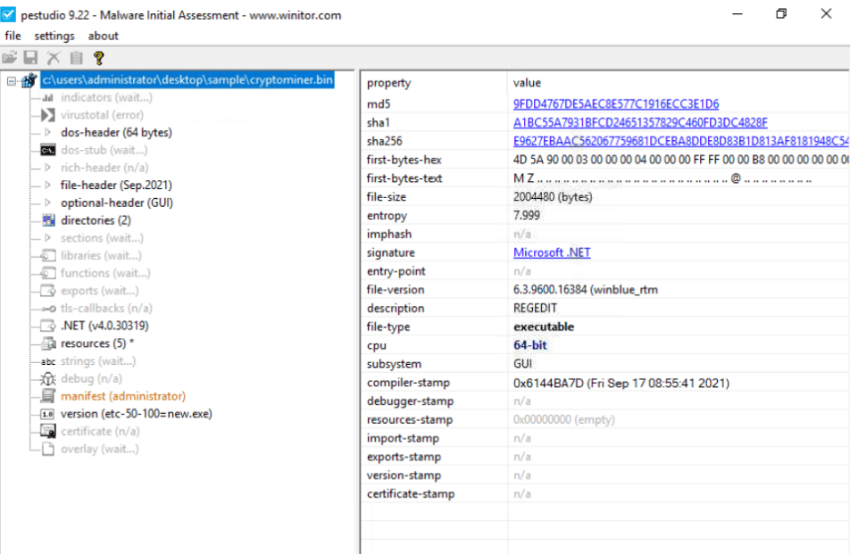
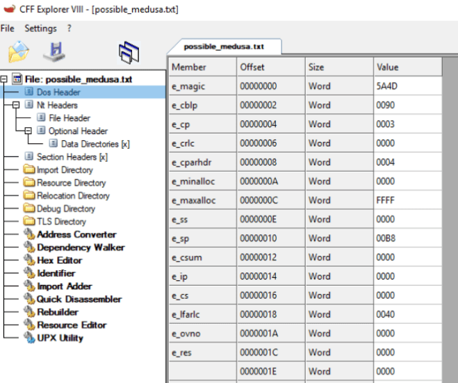
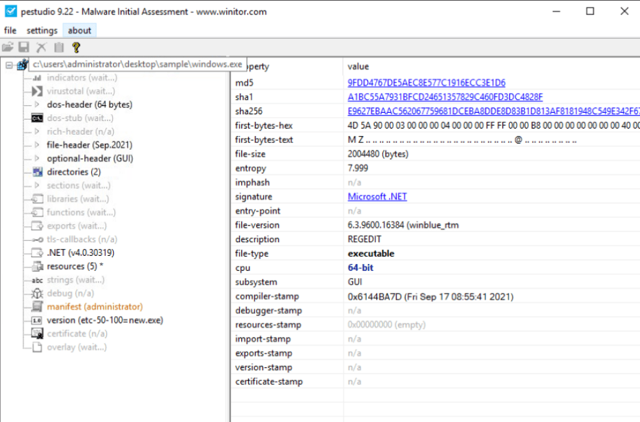
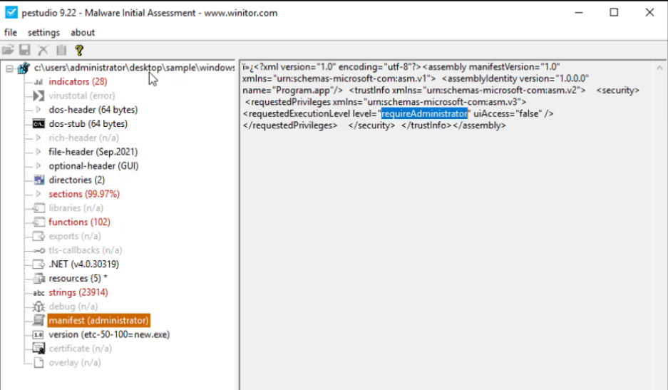
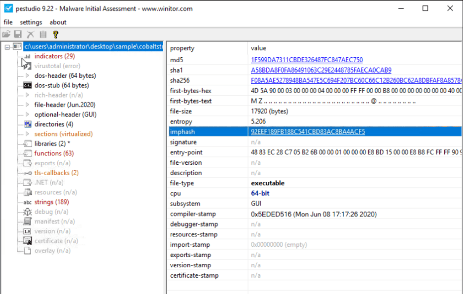
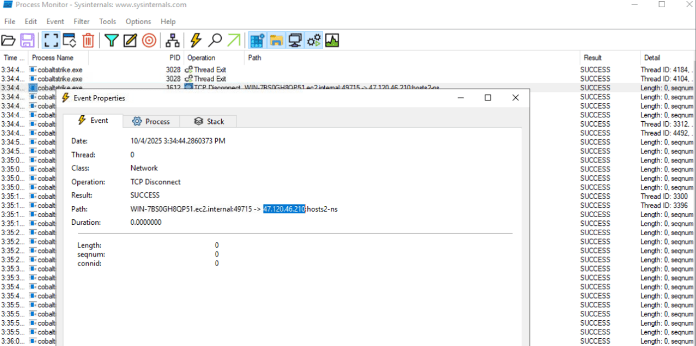
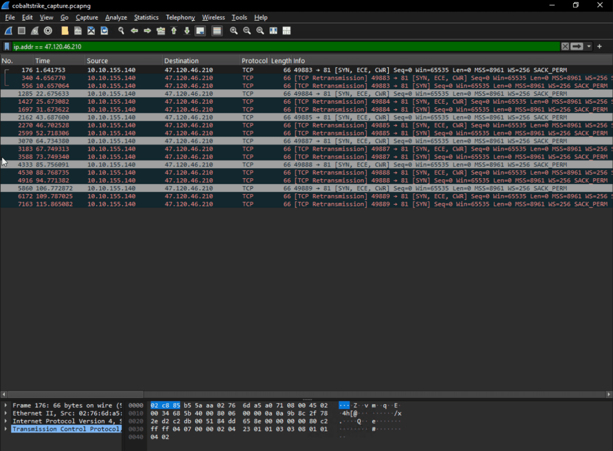

Here i want to share about my write-up for the room [FlareVM: Arsenal of Tools](https://tryhackme.com/room/flarevmarsenaloftools) (Premium Room), learn the arsenal of investigative tools in FlareVM. I wrote this in 2025 and hope it is useful for learning about cybersecurity.

## Task 1: Introduction

FlareVM, which stands for "Forensics, Logic Analysis, and Reverse Engineering," is a curated collection of specialized tools designed for reverse engineers, malware analysts, incident responders, forensic investigators, and penetration testers, created by the FLARE Team at FireEye.

I'm ready to learn more about FlareVM!
>No answer needed

## Task 2: Arsenal of Tools

Introduces specialized forensics, incident response, and malware investigation tools found inside the **FlareVM**. The tools are grouped by their category.

* **Reverse Engineering & Debugging**: Includes tools like **Ghidra**, **x64dbg**, **OllyDbg**, and Radare2.
* **Disassemblers & Decompilers**: Includes CFF Explorer and RetDec.
* **Static & Dynamic Analysis**: Includes **Process Hacker**, PEview, and Dependency Walker.
* **Forensics & Incident Response**: Includes **Volatility**, Rekall, and FTK Imager.
* **Network Analysis**: Includes **Wireshark**, Nmap, and Netcat.
* **File Analysis**: Includes FileInsight and HxD.
* **Scripting & Automation**: Includes Python and PowerShell Empire.
* **Sysinternals Suite**: A collection of utilities including **Autoruns**, **Process Explorer**, and **Process Monitor**.

Which tool is an Open-source debugger for binaries in x64 and x32 formats?
>x64dbg

What tool is designed to analyze and edit Portable Executable (PE) files?
>CFF Explorer

Which tool is considered a sophisticated memory editor and process watcher?
>Process Hacker

Which tool is used for Disc image acquisition and analysis for forensic use?
>FTK Imager

What tool can be used to view and edit a binary file?
>HxD

## Task 3: Commonly Used Tools for Investigation: Overview

Introduces several basic tools used for initial digital forensics and malware investigations.

* **Procmon (Process Monitor)**: Tool for tracking system activity in real-time, including the **file system, registry, and thread/process activity**.
* **Process Explorer**: Allows you to see the **process parent-child relationship**, DLLs loaded, and its path.
* **HxD**: Xex editor used to examine or alter malicious files. An example shows how it can identify an executable by its starting bytes (**4D 5A**).
* **Wireshark**: Used for **observing and investigating network traffic** to look for unusual activity.
* **CFF Explorer**: Can generate **file hashes** for integrity verification and validate system files.
* **PEStudio**: Used for **static analysis**, which is studying executable file properties without running the files. It can show information like a file's **entropy**.
* **FLOSS (FLARE Obfuscated String Solver)**: **Extracts and de-obfuscates all strings** from malware programs using advanced static analysis techniques.

Which tool was formerly known as FireEye Labs Obfuscated String Solver?
>FLOSS

Which tool offers in-depth insights into the active processes running on your computer?
>Process Explorer

By using the Process Explorer (procexp) tool, under what process can we find smss.exe?
>System

Which powerful Windows tool is designed to help you record issues with your system's apps?
>Procmon

Which tool can be used for Static analysis or studying executable file properties without running the files?
>PEStudio

Using the tool PEStudio to open the file cryptominer.bin in the Desktop\Sample folder, what is the sha256 value of the file?
>E9627EBAAC562067759681DCEBA8DDE8D83B1D813AF8181948C549E342F67C0E

Using the tool PEStudio to open the file cryptominer.bin in the Desktop\Sample folder, how many functions does it have?
>102

What tool can generate file hashes for integrity verification, authenticate the source of system files, and validate their validity?
>CFF Explorer

Using the tool CFF Explorer to open the file possible_medusa.txt in the Desktop\Sample folder, what is the MD5 of the file?
>646698572AFBBF24F50EC5681FEB2DB7

Use the CFF Explorer tool to open the file possible_medusa.txt in the Desktop\Sample folder. Then, go to the DOS Header Section. What is the e_magic value of the file?
>5A4D

## Task 4: Analyzing Malicious Files

This task involves performing an analysis on a suspicious `windows.exe` file, beginning with **static analysis**.

Using **PEStudio**, several suspicious indicators are identified:

* The file's metadata, claiming it's the "Windows Registry Editor (REGEDIT)," is suspicious due to its download location and the presence of Russian text.
* The **absence of a rich header** indicates the file is potentially packed or obfuscated.
* The **functions** tab lists blacklisted API calls related to process execution (`set_UseShellExecute`) and cryptography (`CryptoStream`, `RijndaelManaged`).

Using **FLOSS** with the command `FLOSS.exe .\windows.exe > windows.txt`, the extracted strings confirm the presence of the same functions found by PEStudio.

The text then demonstrates dynamic analysis on a different file, `cobaltstrike.exe`.

* **Process Explorer** is used to find the running process and check its `TCP/IP` properties tab to identify network connections.
* **Procmon** is used with a filter to verify the connection. It confirms the binary was making a connection to an unknown IP address, `47.120.46.210`.

Using PEStudio, open the file windows.exe. What is the entropy value of the file windows.exe?
>7.999

Using PEStudio, open the file windows.exe, then go to manifest (administrator section). What is the value under requestedExecutionLevel?
>requireAdministrator

Which function allows the process to use the operating system's shell to execute other processes?
>set_UseShellExecute

Which API starts with R and indicates that the executable uses cryptographic functions?
>RijndaelManaged

What is the Imphash of cobaltstrike.exe?
>92EEF189FB188C541CBD83AC8BA4ACF5

What is the defanged IP address to which the process cobaltstrike.exe is connecting?
>47[.]120[.]46[.]210

Let's open file .pcapng and apply the filter ip.addr == [IP_ADDRESS]

What is the destination port number used by cobaltstrike.exe when connecting to its C2 IP Address?
>81

During our analysis, we found a process called cobaltstrike.exe. What is the parent process of cobaltstrike.exe?
>explorer.exe

## Task 5: Conclusion

Fantastic Room!
No answer needed
