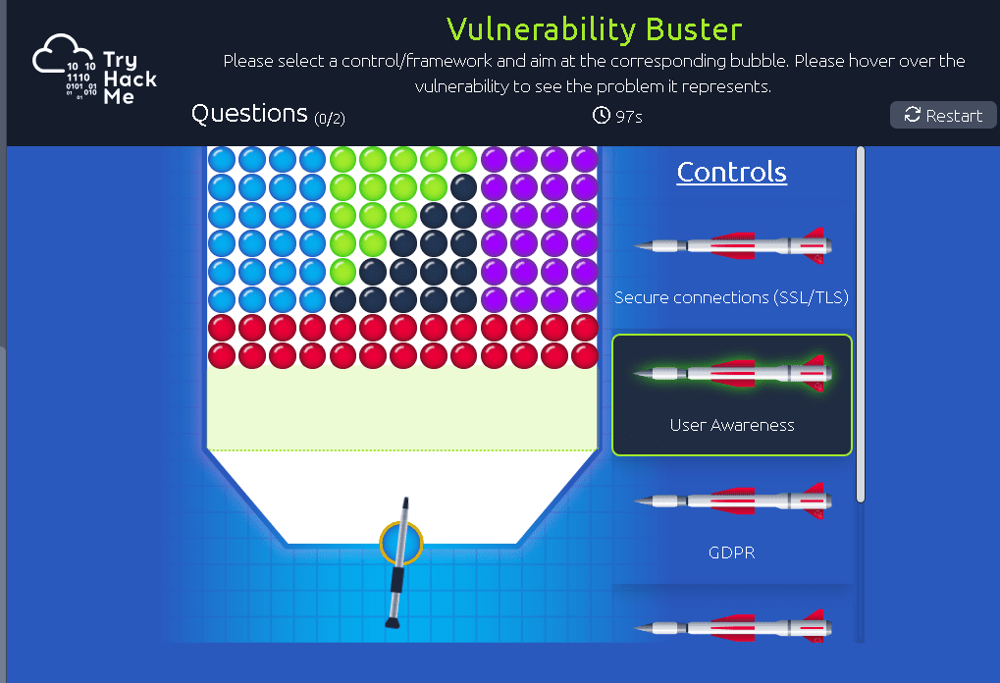
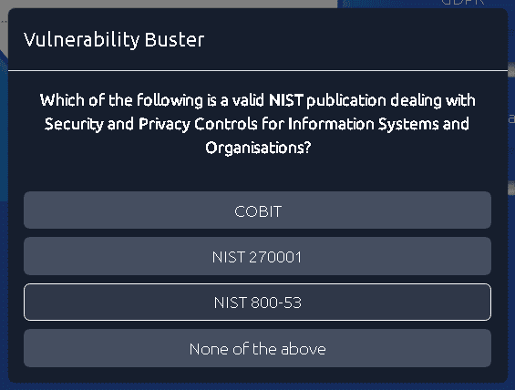
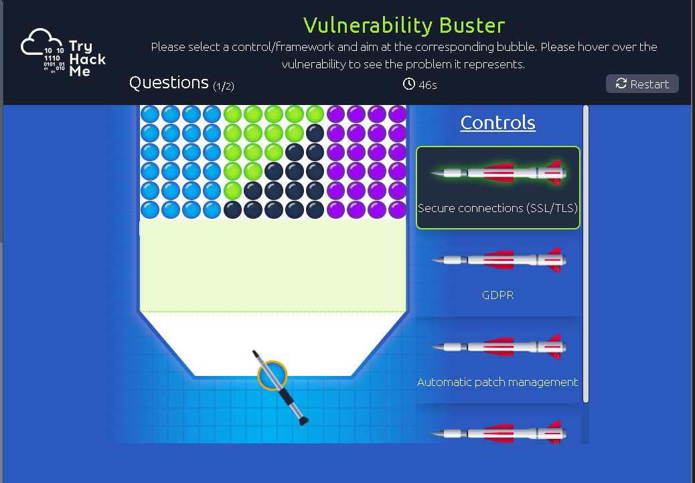
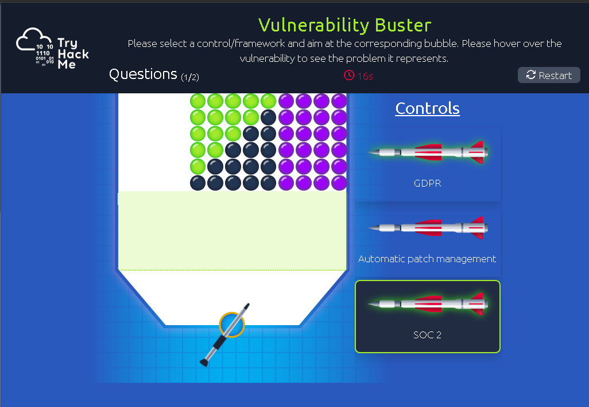
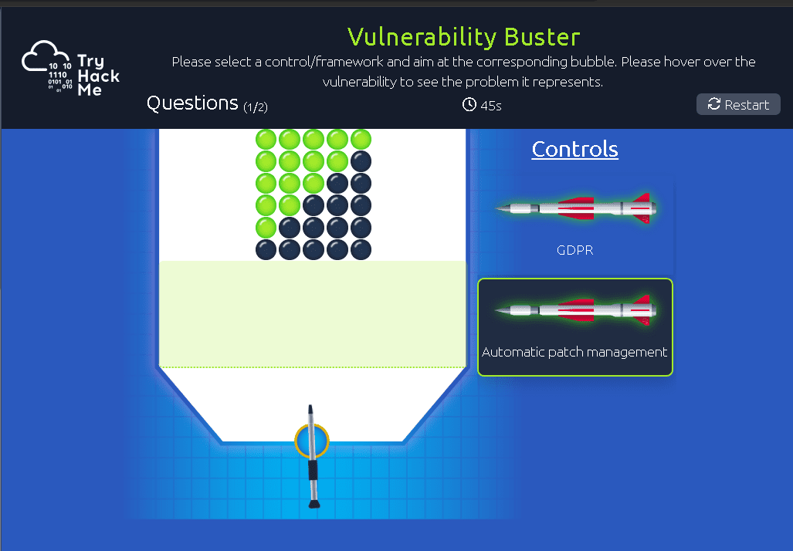
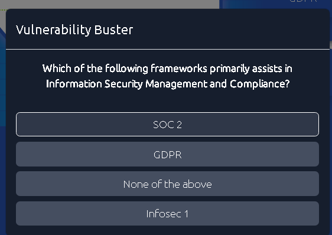

Here i want to share about my write-up for the room [Governance & Regulation](https://tryhackme.com/room/cybergovernanceregulation). Explore policies and frameworks vital for regulating cyber security in an organisation. I wrote this in 2025 and hope it is useful for learning about cybersecurity.

## Task 1: Introduction

Cybersecurity is a rapidly evolving landscape where malicious actors constantly exploit vulnerabilities to cause damage and steal data. To combat this, a comprehensive approach to **information security governance and regulation** is essential, involving robust policies, monitoring, and enforcement. This room aims to teach the importance of GRC (Governance, Risk Management & Compliance), relevant international laws and standards (ISO 27001, NIST 800-53), and how to improve security posture.

**I am ready to start the room.**
> No answer needed

## Task 2: Why is it important?

This section defines key terminologies: **Governance** (managing systems to achieve objectives), **Regulation** (rules enforced by governing bodies), and **Compliance** (adhering to laws). It details Information Security Governance processes such as Strategy, Policies, Risk Management, and Performance Measurement. It also lists key benefits like a robust security posture and stakeholder confidence, and provides examples of regulations like GDPR (Data Privacy), HIPAA (Healthcare), PCI-DSS (Financial), and GLBA.

**A rule or law enforced by a governing body to ensure compliance and protect against harm is called?**
> Regulation

**Health Insurance Portability and Accountability Act (HIPAA) targets which domain for data protection?**
> Healthcare

## Task 3: Information Security Frameworks

Information security frameworks consist of documents that govern how security is managed. These include **Policies** (high-level goals), **Standards** (mandatory requirements), **Guidelines** (recommendations), **Procedures** (step-by-step tasks), and **Baselines** (minimum security levels). The development process involves identifying scope, research, drafting, review, implementation, and periodic updates. Real-world examples include creating Password Policies and Incident Response Procedures.

**The step that involves monitoring compliance and adjust the document based on feedback and changes in the threat landscape or regulatory environment is called?**
> Review and update

**A set of specific steps for undertaking a particular task or process is called?**
> Procedure

## Task 4: Governance Risk and Compliance (GRC)

GRC is a holistic framework integrating **Governance** (strategy/direction), **Risk Management** (identifying and mitigating risks), and **Compliance** (meeting legal obligations). Developing a GRC program involves defining scope, conducting risk assessments, establishing governance processes, implementing controls (like Firewalls, IPS, IDS), and continuously monitoring and improving performance. In the financial sector, this includes Anti-Money Laundering policies and fraud risk management.

**What is the component in the GRC framework involved in identifying, assessing, and prioritising risks to the organisation?**
> Risk Management

**Is it important to monitor and measure the performance of a developed policy?** (yea/nay)
> yea

## Task 5: Privacy and Data Protection

This section covers regulations protecting Personally Identifiable Information (PII).

* **GDPR**: An EU regulation requiring prior approval for data collection, data minimization, and protection. It has tiered fines for non-compliance (Tier 1 can be up to 4% of revenue).
* **PCI DSS**: A standard for securing card transactions (Visa, MasterCard, etc.), requiring strict access control and encryption for Cardholder Data (CHD).

[Image of GDPR Key Principles]

**What is the maximum fine for Tier 1 users as per GDPR (in terms of percentage)?**
> 4

**In terms of PCI DSS, what does CHD stand for?**
> cardholder data

## Task 6: NIST Special Publications

* **NIST 800-53**: A catalog of security and privacy controls for information systems (e.g., Program Management). Compliance best practices include Discovery, Mapping controls to assets, and Governance.
* **NIST 800-63B**: Guidelines for digital identity practices, focusing on authentication, verification, and credential management (passwords, biometrics).

**Per NIST 800-53, in which control category does the media protection lie?**
> Physical

**Per NIST 800-53, in which control category does the incident response lie?**
> Administrative

**Which phase (name) of NIST 800-53 compliance best practices results in correlating identified assets and permissions?**
> Map

## Task 7: Information Security Management and Compliance

This task contrasts IS Management (planning/execution of security) with Compliance.

* **ISO/IEC 27001**: An international standard for Information Security Management Systems (ISMS). Key components include Risk Assessment, Risk Treatment, and the Statement of Applicability (SoA).
* **SOC 2**: An auditing framework by AICPA for service organizations, assessing controls based on the CIA triad and privacy. It assures clients that their data is handled securely.

**Which ISO/IEC 27001 component involves selecting and implementing controls to reduce the identified risks to an acceptable level?**
> Risk treatment

**In SOC 2 generic controls, which control shows that the system remains available?**
> Availability

## Task 8: Conclusion

The room provided a comprehensive overview of governance and regulation frameworks used to protect organizational assets. It covered laws like GDPR and PCI DSS, the GRC framework, and enablers like ISO/IEC 27001 and NIST 800-53. The key takeaway is that while 100% security is unrealistic, robust policies and continuous improvement are essential for risk mitigation.

**Click the View Site button at the top of the task to launch the static site in split view. What is the flag after completing the exercise?**
> THM{REDACTED}
