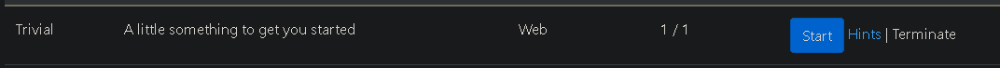
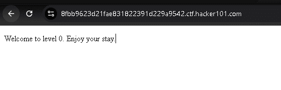
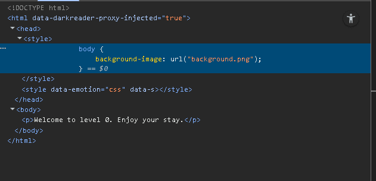
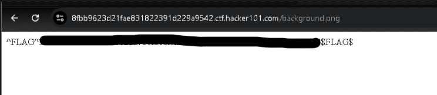

## CTF Begin

First, you can start the CTF and then you will wait to be redirected to a new URL.

Then you can see in the image below that the CTF has started.

We can check the developer tools (Ctrl + Shift + I) and then we find an image, even though we do not find any images on the page.

We can try to open the URL path and then, yes, we find the flag.

## Why Is This a Vulnerability?

This type of flaw is categorized as **Information Disclosure** or **Improper Asset Management**. It's considered a vulnerability because the application exposes sensitive information or resources that should not be publicly accessible.

Even though it's "hidden" from the main view, any user can easily discover it using standard browser tools.

**Use Case in the Real World:**

In a real-world scenario, instead of a CTF flag, an attacker might find:

* **API Keys:** Secret keys for services like AWS, Google Maps, or Stripe, leading to unauthorized access and financial loss.
* **Internal URLs:** Paths to admin panels, internal dashboards, or backup files (`.bak`, `.config`) that were never meant to be public.
* **Developer Comments:** Snippets of code, old passwords, or business logic left in HTML/CSS/JS comments.

An attacker can use this leaked information as a foothold to launch more severe attacks on the system.

>Alhamdulillah. Hope it useful.
