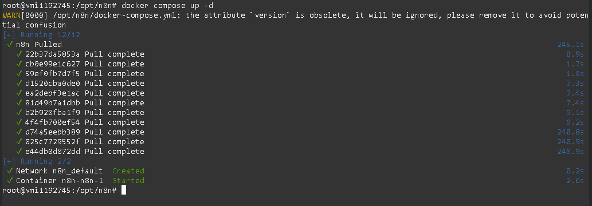
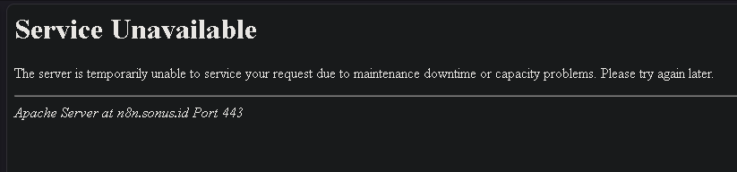
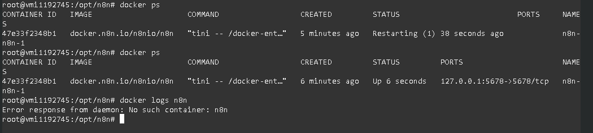
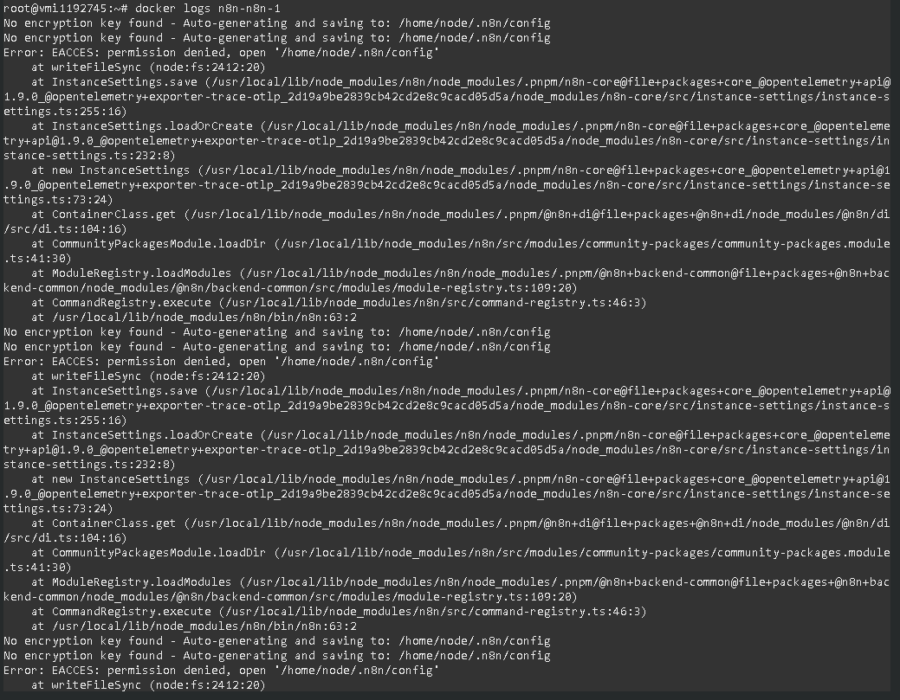
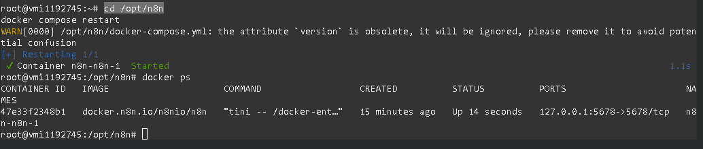
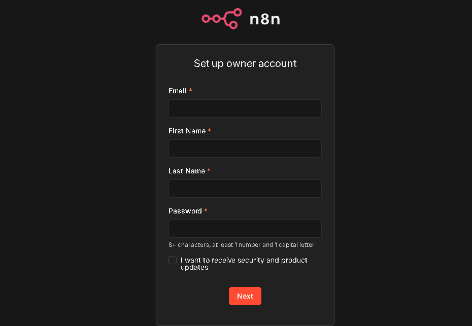

Self-hosting n8n is an incredible way to build powerful automations without worrying about execution limits. The most reliable way to install n8n on a VPS is using Docker. However, the setup doesn't always go perfectly on the first try.

In this guide, I will walk you through the standard Docker installation for n8n, how to spot a common failure point, and how to fix the "503 Service Unavailable" error if your container gets stuck in a crash loop.

## Step 1: Preparing the Directory and Docker Compose File

First, we need to create a dedicated directory on our server to store n8n's persistent data. This ensures that if the server restarts or the container is rebuilt, you don't lose your workflows.

Connect to your server via SSH and run the following commands:

```bash
mkdir -p /opt/n8n/data
cd /opt/n8n
```

Next, create the configuration file:

```bash
nano docker-compose.yml
```

Paste the following configuration into the file. Make sure to adjust the N8N_HOST, WEBHOOK_URL, and GENERIC_TIMEZONE variables to match your specific setup.

```yaml
version: '3.8'

volumes:
  n8n_data:

services:
  n8n:
    image: docker.n8n.io/n8nio/n8n
    restart: always
    ports:
      - "127.0.0.1:5678:5678"
    environment:
      - N8N_HOST=n8n.domain.com
      - N8N_PORT=5678
      - N8N_PROTOCOL=https
      - NODE_ENV=production
      - WEBHOOK_URL=https://n8n.domain.com/
      - GENERIC_TIMEZONE=GMT+7 # Change to your timezone
    volumes:
      - /opt/n8n/data:/home/node/.n8n
```

Save and exit the file.

## Step 2: Starting the Container (And Hitting a Wall)

With the configuration ready, it is time to spin up the container in the background:

```bash
docker compose up -d
```



Normally, you would now set up your reverse proxy, attach an SSL certificate, and navigate to your domain. But sometimes, you are greeted with this instead:

If you see a **Service Unavailable** error, it usually means your web server (like Apache or Nginx) is working fine, but it cannot communicate with the internal n8n container on port `5678`.



Let's find out why.

## Step 3: Troubleshooting the Crash Loop

When a reverse proxy fails to connect, the first thing to check is if the Docker container is actually running.

Run the following command to check your active containers:

```bash
docker ps
```



If you look at the `STATUS` column and see `Restarting`, it means n8n is trying to boot up, crashing, and trying again.

To see exactly why it is crashing, we need to check the logs. Be careful here—if you just type `docker logs n8n`, you might get an error saying `No such container: n8n`. This is because Docker Compose automatically prefixes container names based on the directory.

Check the `NAMES` column from your `docker ps` output. In this case, the container is actually named `n8n-n8n-1`.

Let's pull the correct logs:

```bash
docker logs n8n-n8n-1
```



## Step 4: The Fix (Folder Permissions)

Looking at the logs, the culprit reveals itself: `Error: EACCES: permission denied, open '/home/node/.n8n/config'`.

Because we manually created the `/opt/n8n/data` folder as the `root` user on the host machine, the n8n Docker container (which runs internally as user `1000`) does not have the correct permissions to read or write files to it.

The fix is a simple, single command to change the ownership of that specific folder:

```bash
chown -R 1000:1000 /opt/n8n/data
```

Once the permissions are updated, navigate back to your n8n directory (if you aren't there already) and restart the container so it can try booting up again:

```bash
cd /opt/n8n
docker compose restart
```

## Step 5: Verification

Finally, let's verify that the container is stable. Run:

```bash
docker ps
```



If the status now says `Up` and stays up for more than a few seconds, you have successfully fixed the issue\!

Give n8n about 30 seconds to initialize its internal database, then refresh your web browser.



The 503 error should be completely gone, and you will be greeted by the n8n setup screen. Happy automating\!

---
