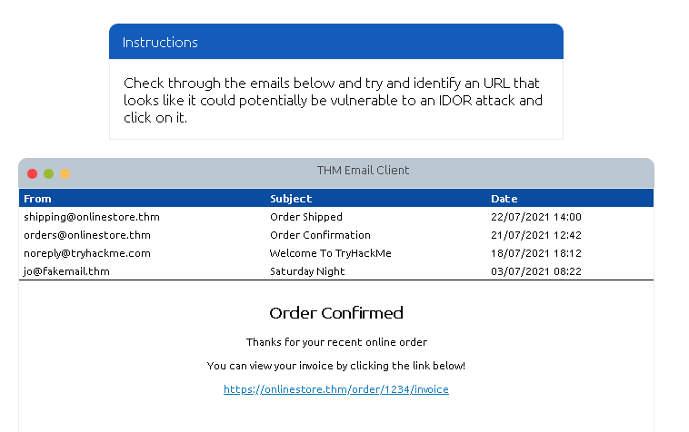
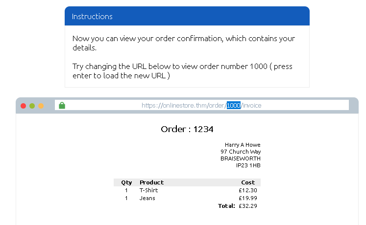
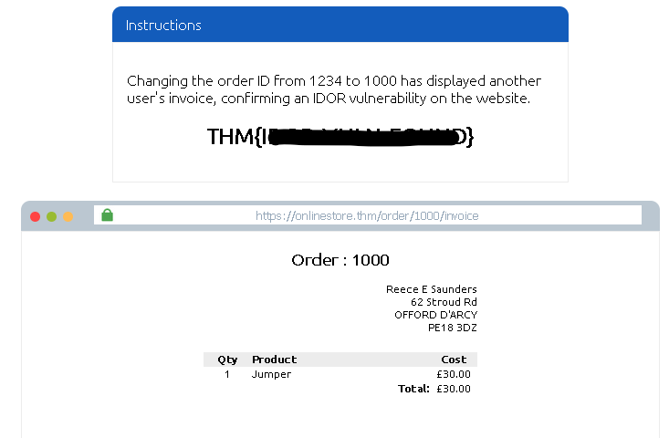
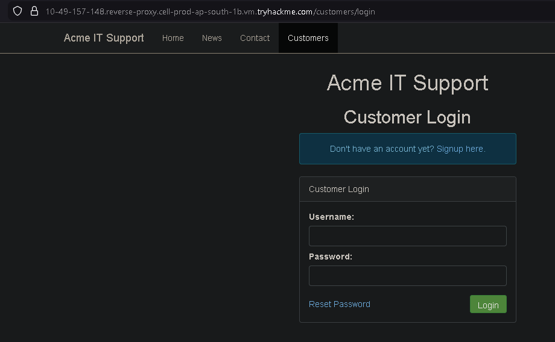
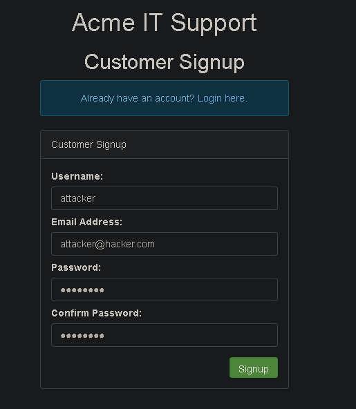
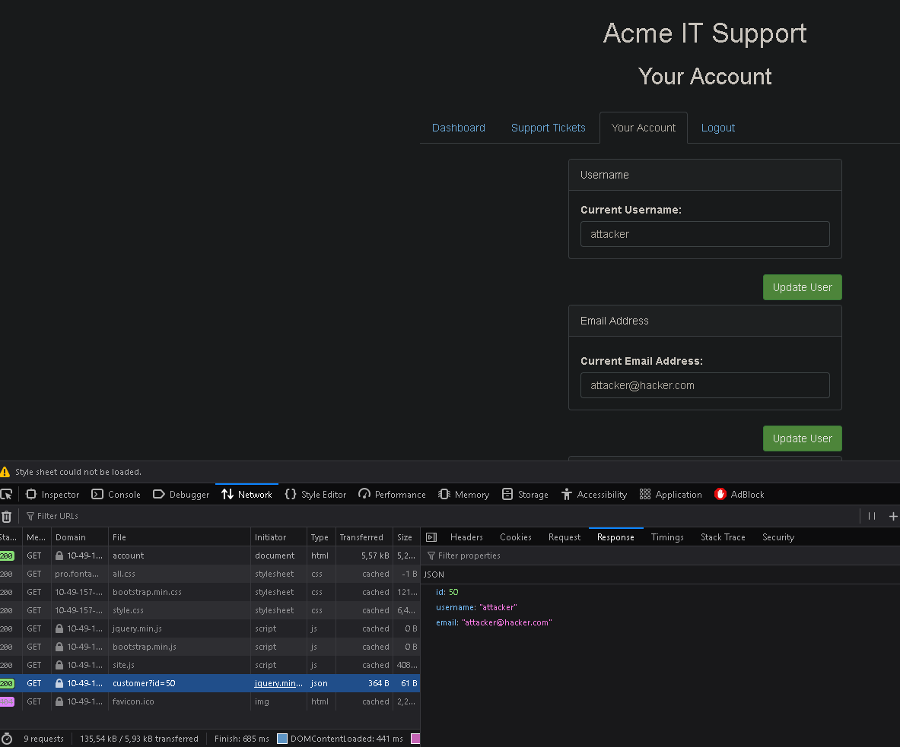
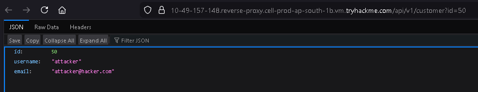
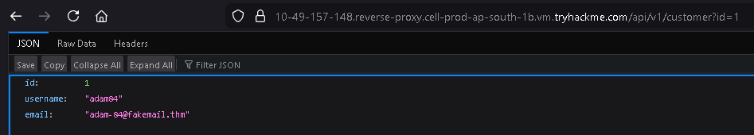
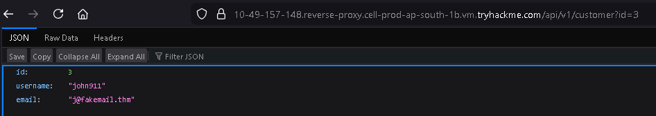

This is my write-up for the TryHackMe room on [IDOR](https://tryhackme.com/room/idor). Written in 2026, I hope this write-up helps others learn and practice cybersecurity.

## Task 1: An What is an IDOR?

An **IDOR** is an access control vulnerability that happens when a server trusts user input to access objects (like files or data) without verifying proper authorization, allowing unauthorized access by modifying request parameters.

**What does IDOR stand for?**

>Insecure Direct Object Reference

## Task 2: An IDOR Example

Insecure Direct Object Reference (IDOR) is a vulnerability that occurs when a website does not properly check if a user is authorized to access specific data. For example, if a profile URL uses a parameter like `user_id=1305`, an attacker might simply change that number to `1000` to view another user's private information.

**What is the Flag from the IDOR example website?**

Try opening the link provided in the email.

Following the instructions, let's change it to 1000.

> THM{REDACTED}

## Task 3: Finding IDORs in Encoded IDs

Web developers often encode data (like changing binary data into an ASCII string) when passing it between pages or in cookies to ensure the web server can read it. You can often spot these encoded strings, decode them using tools online, modify the underlying ID, re-encode it, and submit the request again to find IDOR vulnerabilities.

**What is a common type of encoding used by websites?**

> base64

## Task 4: Finding IDORs in Hashed IDs

Sometimes IDs are hashed instead of just encoded. While hashes are more complicated, they can still be predictable if the developer just hashed the integer value of the ID. You can use online databases and cracking services like CrackStation to reverse the hash and reveal the original ID value.

**What is a common algorithm used for hashing IDs?**

> md5

## Task 5: Finding IDORs in Unpredictable IDs

When IDs are completely unpredictable and cannot be decoded or cracked, the best way to test for IDOR is to create multiple accounts. By logging into one account and trying to access the endpoint using the ID of your second account, you can verify if the system actually checks for authorization.

**What is the minimum number of accounts you need to create to check for IDORs between accounts?**

> 2

## Task 6: Where are IDORs located

IDOR vulnerabilities are not always visible in the main URL address bar. They can be hidden in AJAX requests made by the browser in the background, referenced inside JavaScript files, or discovered via "parameter mining"—where you manually add unreferenced parameters (like `?user_id=123`) to an endpoint to see if it responds with unauthorized data.

**Read the above.**

> No answer needed

## Task 7: A Practical IDOR Example

This practical task demonstrates how to find IDORs by monitoring background network traffic. By registering an account and inspecting the Network tab in your browser's developer tools, you can discover hidden API endpoints (e.g., `/api/v1/customer?id={user_id}`) that fetch user data. Modifying this ID parameter in the request allows you to test if you can access other users' data.

Navigate to the URL provided in TryHackMe, then go to the customers page.

Here, simply click sign up to create a new account.

You can fill in any details, for example `<attacker@hacker.com>`, then click sign up.

Then go to the "Your Account" page, right-click on the page and select "Inspect" to open the developer tools.

Click on the Network tab, then refresh the page. You will see a request for `customer?id=50` at the bottom. You can double-click it to open the JSON response in a new tab.

From that URL, we can try changing the ID to test for IDOR.

**What is the username for user id 1?**

> adam84

**What is the email address for user id 3?**

> <j@fakemail.thm>

Thanks for reading. See you in the next lab.
