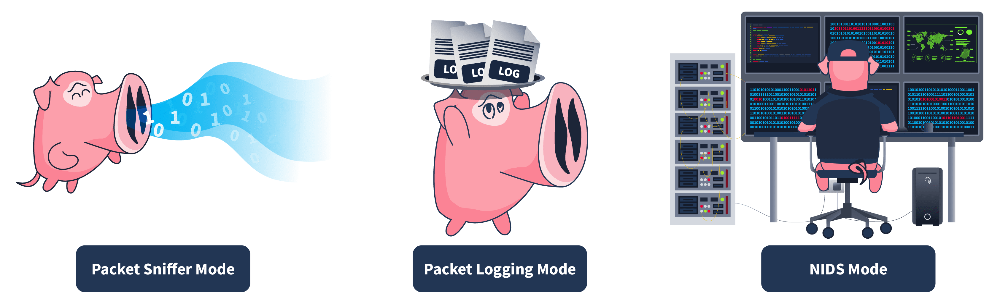
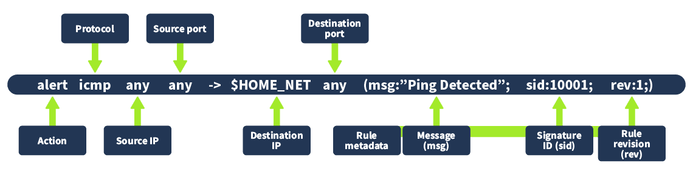
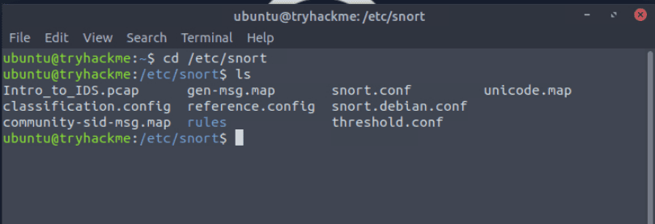
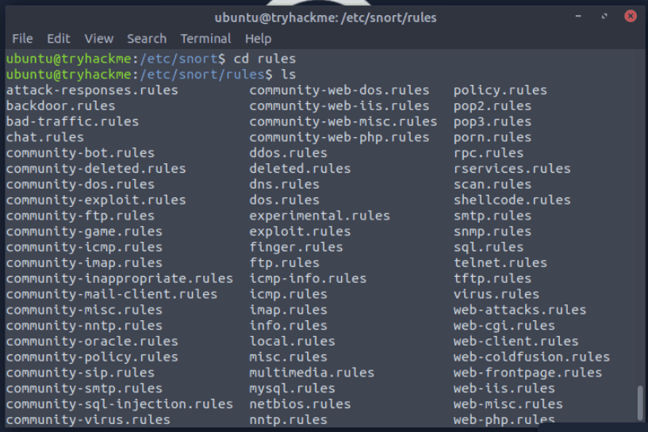
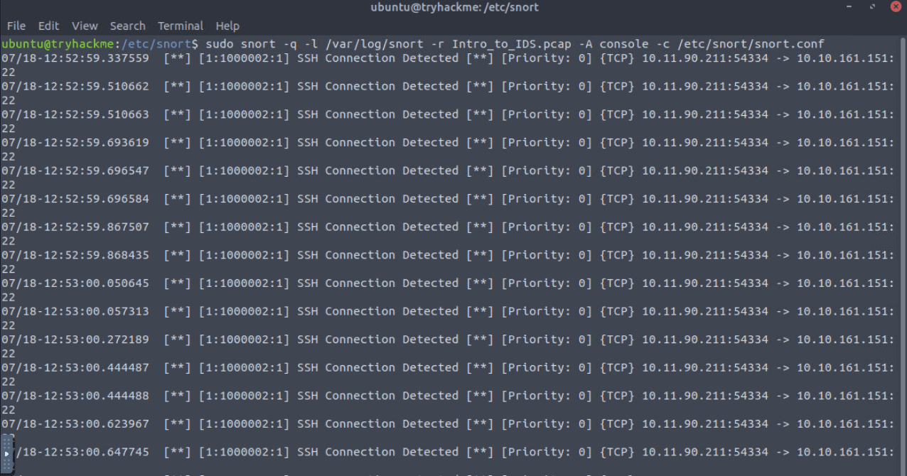
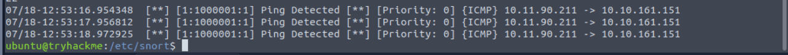

Here i want to share about my write-up for the room [IDS Fundamentals](https://tryhackme.com/room/idsfundamentals) (Premium Room), learn the fundamentals of IDS, along with the experience of working with Snort. I wrote this in 2025 and hope it is useful for learning about cybersecurity.

## Task 1: What Is an IDS

If an attacker successfully bypasses a firewall and performs malicious activities inside the network, there should be something to detect it timely. This solution is known as an **Intrusion Detection System (IDS)**.

Can an intrusion detection system (IDS) prevent the threat after it detects it? Yea/Nay
>Nay

## Task 2: Types of IDS

An IDS’s main categorization depends on its deployment and detection modes.

### Deployment Modes

- **Host Intrusion Detection System (HIDS)**
- **Network Intrusion Detection System (NIDS)**

### Detection Modes

- **Signature-Based IDS**
- **Anomaly-Based IDS**
- **Hybrid IDS**

Which type of IDS is deployed to detect threats throughout the network?
?Network Intrusion Detection System

Which IDS leverages both signature-based and anomaly-based detection techniques?
>Hybrid IDS

## Task 3: IDS Example: Snort

Snort is one of the most widely used open-source IDS solutions that uses signature-based and anomaly-based detections to identify known threats.

### Modes of Snort

- **Packet sniffer mode**
- **Packet logging mode**
- **Network Intrusion Detection System mode**

Which mode of Snort helps us to log the network traffic in a PCAP file?
>packet logging mode

What is the primary mode of Snort called?
>Network Intrusion Detection System Mode

## Task 4: Snort Usage

### Rule Format

- **Action**: Specifies which action to take when the rule triggers.
- **Protocol**: Refers to the protocol that matches this rule.
- **Source/Destination IP & Port**: Determines the origin and destination of the traffic.
- **Rule metadata**: Defined at the end of the rule in parentheses, including Message (msg), Signature ID (sid), and Rule revision (rev).

Where is the main directory of Snort that stores its files?
>/etc/snort

Which field in the Snort rule indicates the revision number of the rule?
>rev

Which protocol is defined in the sample rule created in the task?
>tcmp

What is the file name that contains custom rules for Snort?
>local.rules

## Task 5: Practical Lab

The task is to run Snort on this PCAP file. The PCAP file is placed in the `/etc/snort/` directory.

What is the IP address of the machine that tried to connect to the subject machine using SSH?
>10.11.90.211

What other rule message besides the SSH message is detected in the PCAP file?
>Ping Detected

What is the sid of the rule that detects SSH?
>1000002
