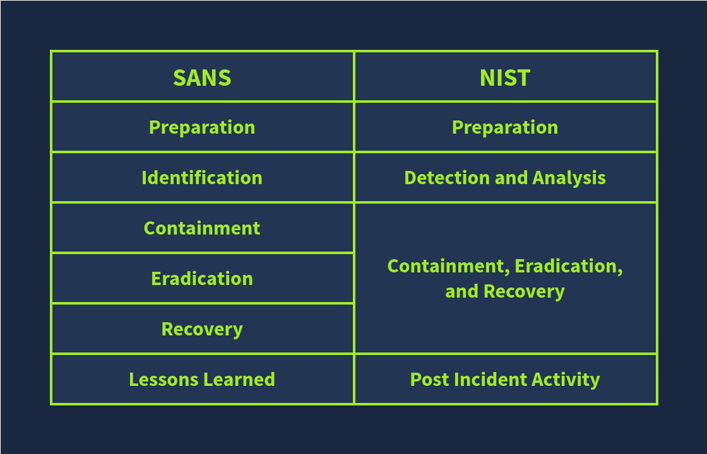
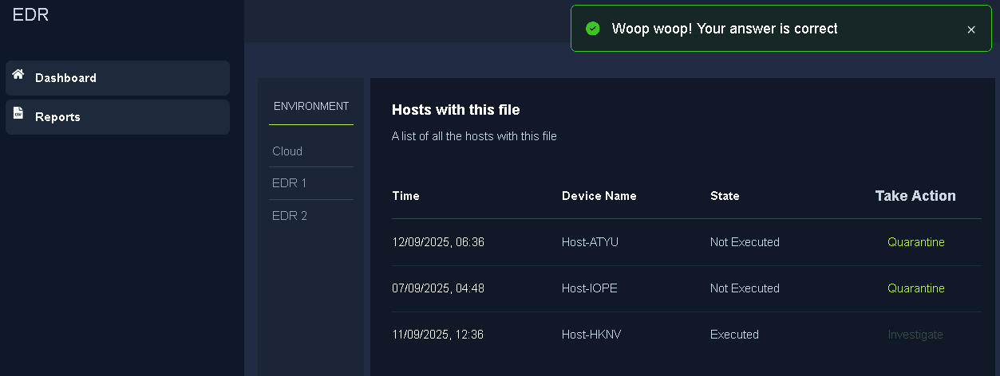
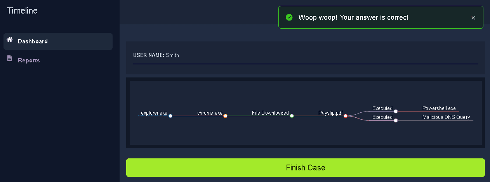

Here i want to share about my write-up for the room [Digital Forensics Fundamentals](https://tryhackme.com/room/digitalforensicsfundamentals) (Premium Room), learn about digital forensics and related processes and experiment with a practical example. I wrote this in 2025 and hope it is useful for learning about cybersecurity.

## Task 1: Introduction to Incident Response

**Incident Response** handles an incident from its start to end. From deploying security in several areas to prevent incidents to fighting with them and minimizing their impact, incident response is a thorough guideline.

### Learning Objectives

- Overview of what are incidents and their severity levels
- Common types of incidents
- Phases of Incident Response from SANS and NIST Frameworks
- Tools for Incident Detection and Response along with the role of PlayBooks
- Incident Response Plan

### Room Pre-Requisites

- [Intro to Defensive Security](https://tryhackme.com/r/room/defensivesecurityintro)

Click me to proceed to the next task.
>No answer needed

## Task 2: What are Incidents?

The security team analyzes these alerts.

- **False positives** are alerts that point to something dangerous but are not harmful.
- **True positives** are alerts that point to something harmful and are actually dangerous.

What is triggered after an event or group of events point at a harmful activity?
>Alert
If a security solution correctly identifies a harmful activity from a set of events, what type of alert is it?
>true positive

If a fire alarm is triggered by smoke after cooking, is it a true positive or a false positive?
>false positive

## Task 3: Types of Incidents

A short summary of the text is provided below.

## Types of Security Incidents

There are several types of security incidents that can occur independently or altogether within the same victim. These incidents include:

- Malware Infections
- Security Breaches
- Data Leaks
- Insider Attacks
- Denial Of Service (DoS) Attacks

A user's system got compromised after downloading a file attachment from an email. What type of incident is this?
>malware infection

What type of incident aims to disrupt the availability of an application?
>Denial of service

## Task 4: Incident Response Process

Incident Response Frameworks are the generic approaches to follow in any incident for effective response. The two widely used incident response frameworks are **SANS** and **NIST**.

The SANS incident Response framework has 6 phases:

- **Preparation:** Building the necessary resources to handle an incident.
- **Identification:** Looking for any abnormal behavior that may indicate an incident.
- **Containment:** Minimizing the impact of the attack.
- **Eradication:** Removing the threat from the attacked environment.
- **Recovery:** Recovering the affected systems from backup or rebuilding them.
- **Lessons Learned:** Gaps in the detection and analysis of the incident are identified and documented.

The Security team disables a machine's internet connection after an incident. Which phase of the SANS IR lifecycle is followed here?
>containment

Which phase of NIST corresponds with the lessons learned phase of the SANS IR lifecycle?
>Post Incident Activity

## Task 5: Incident Response Techniques

There are multiple security solutions that serve unique roles in detecting incidents.

- **SIEM**: Collects important logs in one centralized location and correlates them to identify incidents.
- **AV**: Antivirus detects known malicious programs in a system and regularly scans system.
- **EDR**: Endpoint Detection and Response is deployed on every system, protecting it against some advanced-level threats and can also contain and eradicate the threat.

**Playbooks** are the guidelines for a comprehensive incident response and provide step-by-step instructions to deal with each kind of incident.

**Runbooks**, on the other hand, are the detailed, step-by-step execution of specific steps during different incidents.

Step-by-step comprehensive guidelines for incident response are known as?
>Playbooks

## Task 6: Lab Work Incident Response

Click on the View Site button below to display the lab on the right side of the screen.

What was the name of the malicious email sender?
>Jeff Johnson

What was the threat vector?
>Email Attachment

How many devices downloaded the email attachment?
>3

How many devices executed the file?
>1

What is the flag found at the end of the exercise?
>THM{__________________________}

## Task 7: Conclusion

Complete the room.
>No answer needed
