This is my write-up for the TryHackMe room on [Inside a Computer System](https://tryhackme.com/room/insideacomputer). Written in 2026, I hope this write-up helps others learn and practice cybersecurity.

## Task 1: Introduction

**Summary:**
This task introduces the importance of learning computer fundamentals before jumping into cybersecurity. Using the analogy of defending a castle, it emphasizes that you cannot protect a system if you don't understand how it works, what its building blocks are, and how they interact. The main objective is to recognize and understand the functions of various computing components.

**Let's get started!**
> No answer needed

---

## Task 2: Inside a Computer System

**Summary:**
This section explains that nearly every computer system consists of the same fundamental building blocks, each with a specific job. To make it easier to understand, the lesson uses an analogy comparing PC components to parts of the human body. An interactive static site is provided to explore these components and retrieve a flag.

**Give in the flag you received after completing the exercise on the static site.**

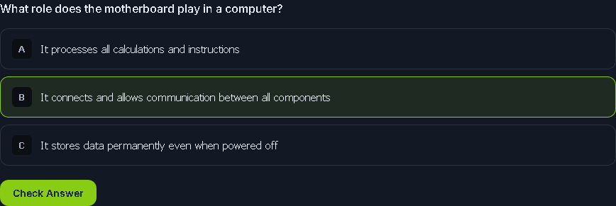

The motherboard is like the skeleton and nervous system, connecting everything together.

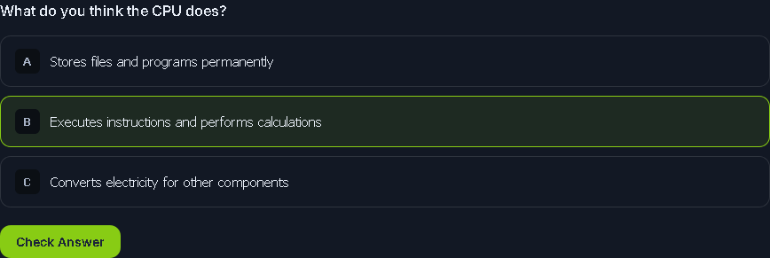

The CPU is the brain of the computer, constantly executing instructions.

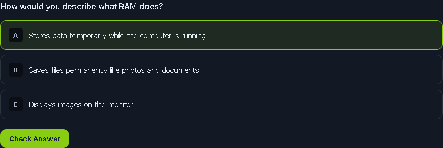

RAM is like short-term memory - fast but temporary.

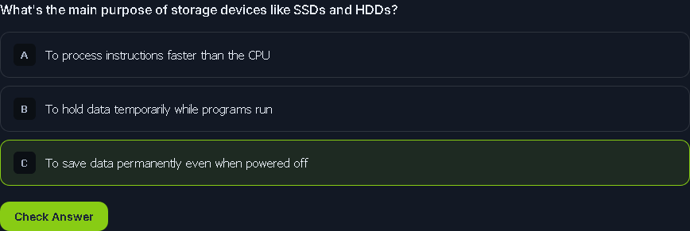

Storage devices are for long-term data retention.

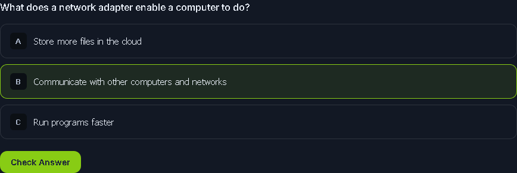

Network adapters let your computer talk to other systems.

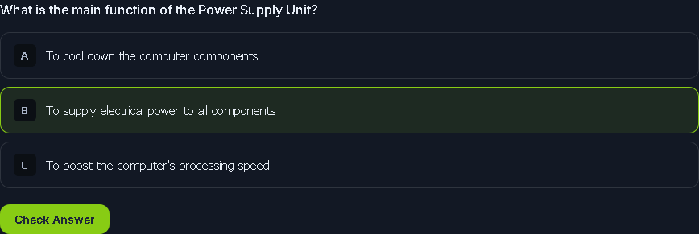

The PSU is like the heart, pumping power to everything.

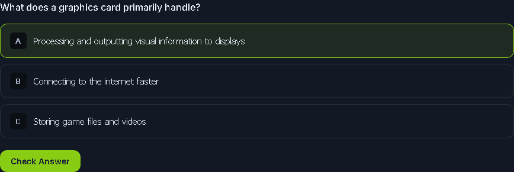

The graphics card processes visuals for your monitor.

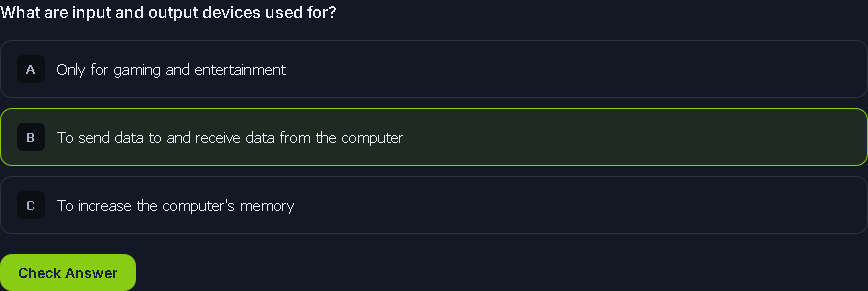

I/O devices are how we interact with computers.

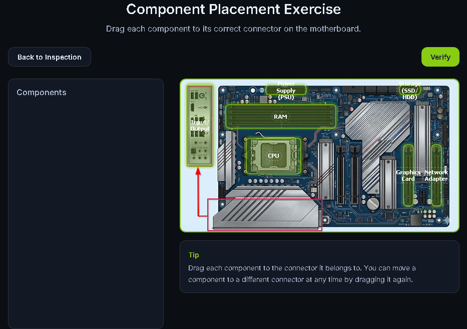

> THM{4llpccomp0n3nts1d3nt1f13d}

---

## Task 3: What Happens When You Press the Start Button?

**Summary:**
This task details the 5-step boot sequence a computer goes through before loading the Operating System, continuing the human body analogy:

1. **Press the Power Button:** Sends a signal to the Power Supply Unit (PSU) to allow power to flow.
2. **Firmware Starts:** The Unified Extensible Firmware Interface (UEFI), which has largely replaced BIOS, starts up the components.
3. **Power-On Self Test (POST):** The UEFI tests if all required components are present and functioning correctly.
4. **Select Boot Device:** The UEFI checks its prioritized list to find the device containing the OS bootup routine.
5. **Initiate Bootloader:** The bootloader transfers the Operating System from the boot device into the RAM and hands over control to the OS.

**What is the flag that you received after completing the exercise?**

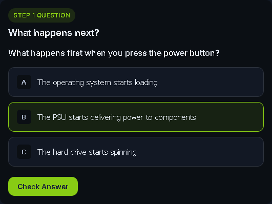

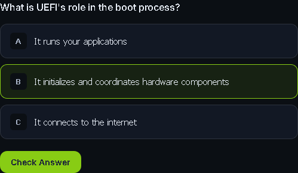

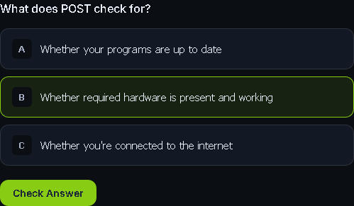

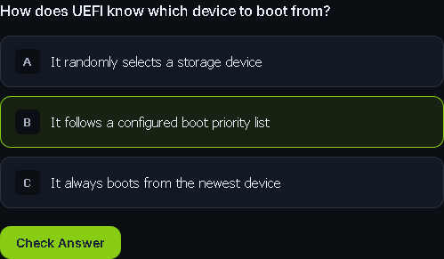

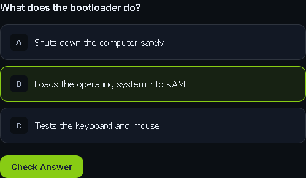

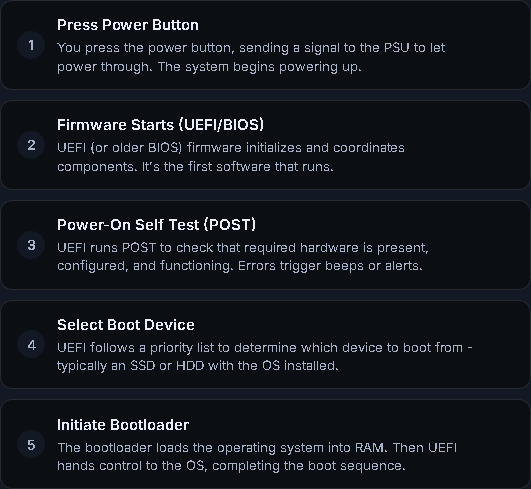

> THM{pc5ucce55fully5t4rt3d}

---

## Task 4: Conclusion

**Summary:**
The final task wraps up the module by reminding you that understanding core components and the boot process is crucial for future cybersecurity concepts, as hackers frequently target these areas. It also sets the stage for the next room, which will cover how different combinations of these components create diverse types of computer systems.

**I am ready to discover the different types of computer systems and their function!**
> No answer needed

---

Thanks for reading. See you in the next lab.
