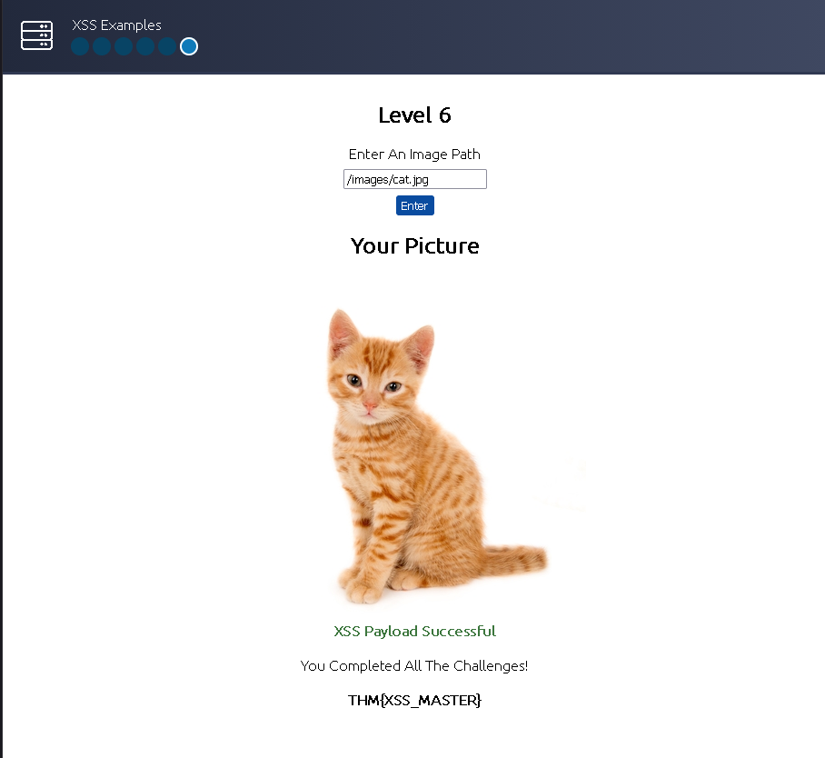
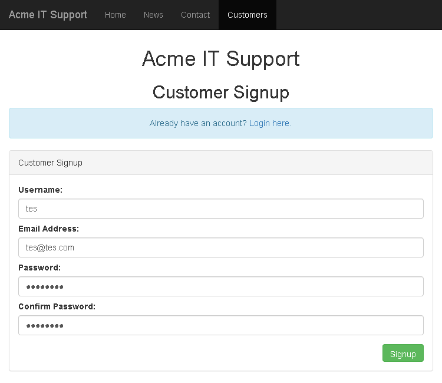
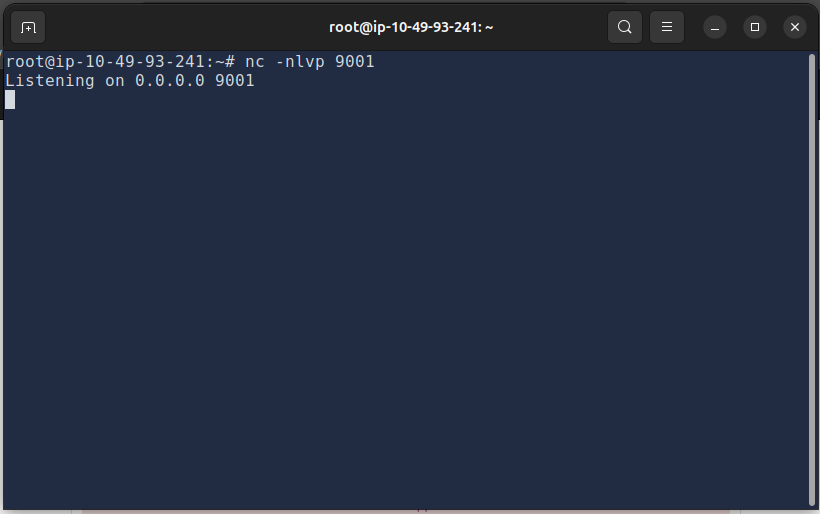
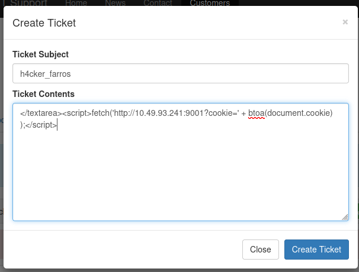
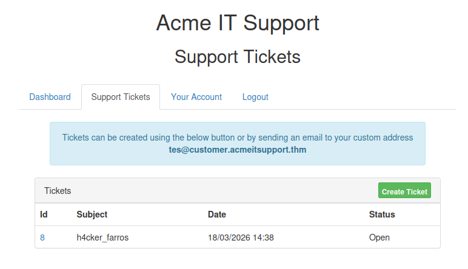
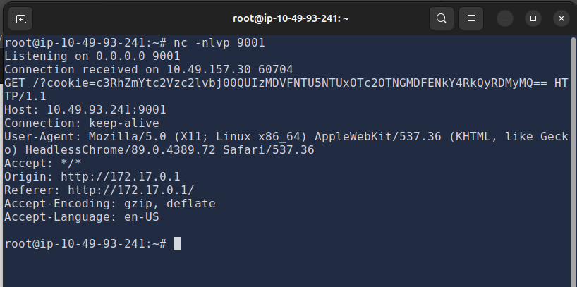
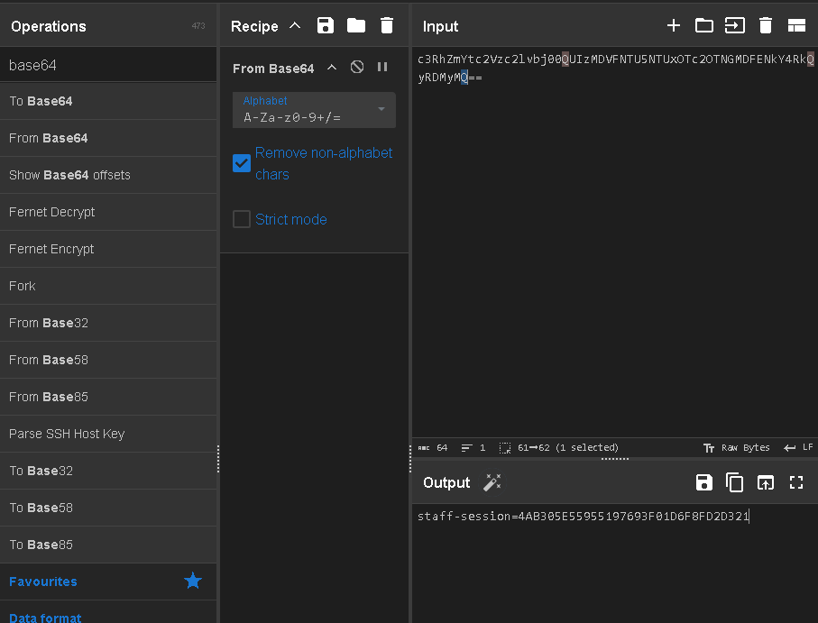

This is my write-up for the TryHackMe room on [Intro to Cross-site Scripting](https://tryhackme.com/room/xss). Written in 2026, I hope this write-up helps others learn and practice cybersecurity.

## Task 1: Room Brief

This room introduces Cross-Site Scripting (XSS), a common injection attack where malicious JavaScript is injected into a web application to be executed by other users. You will learn about different XSS types, how to create and modify payloads to bypass filters, and apply these skills in a practical lab.

**What does XSS stand for?**

> Cross-Site Scripting

---

## Task 2: XSS Payloads

A payload in XSS is the JavaScript code intended to execute on the target's computer. It consists of the "intention" (what you want the script to do, like stealing sessions or logging keystrokes) and the "modification" (how you adapt the code to run in a specific scenario). Common intentions include Proof of Concept (PoC) alerts, session stealing, keyloggers, and exploiting business logic.

**Which document property could contain the user's session token?**

> document.cookie

**Which JavaScript method is often used as a Proof Of Concept?**

> alert

---

## Task 3: Reflected XSS

Reflected XSS occurs when unvalidated user input is immediately included in the webpage source via an HTTP request. Attackers can craft malicious links and send them to victims. When the link is clicked, the script runs in the victim's browser. Testing points typically include URL query parameters, URL file paths, and sometimes HTTP headers.

**Where in an URL is a good place to test for reflected XSS?**

> parameters

---

## Task 4: Stored XSS

Stored XSS happens when a malicious payload is saved directly onto the web application (e.g., in a database) and executes when other users visit the affected page. Common entry points include blog comments, user profiles, and website listings. This is highly dangerous as it requires no direct social engineering once the payload is planted.

**How are stored XSS payloads usually stored on a website?**

> database

---

## Task 5: DOM Based XSS

DOM (Document Object Model) Based XSS executes JavaScript directly in the browser without loading new pages or sending data to the backend. It occurs when a website's JavaScript acts unsafely on user input (like `window.location.hash`) and writes it into the webpage's DOM or passes it to unsafe functions like `eval()`.

**What unsafe JavaScript method is good to look for in source code?**

> eval()

---

## Task 6: Blind XSS

Blind XSS is a variant of stored XSS where the payload is saved on the server, but the attacker cannot see it execute. A common example is injecting code into a contact form that is later viewed by a staff member on a private support portal. Attackers typically use payloads with callbacks (HTTP requests) and tools like XSS Hunter Express to capture execution details.

**What tool can you use to test for Blind XSS?**

> XSS Hunter Express

**What type of XSS is very similar to Blind XSS?**

> Stored XSS

---

## Task 7: Perfecting your payload

This task covers adapting your payload to match how it is reflected in the target's HTML source code. Techniques include escaping HTML attributes (e.g., `">`), closing existing tags (e.g., `</textarea>`), breaking out of JavaScript variables (e.g., `';`), bypassing simple word filters by nesting strings (e.g., `<sscriptcript>`), and utilizing HTML event attributes like `onload`. It also introduces XSS Polyglots, which are complex strings designed to bypass multiple contexts and filters at once.

**What is the flag you received from level six?**

Okay, the method here is quite simple; just follow the instructions from level one to level 6 until you eventually get the flag once completed.

```html
Level 1: <script>alert('THM');</script>
Level 2: "><script>alert('THM');</script>
Level 3: </textarea><script>alert('THM');</script>
Level 4: ';alert('THM');//
Level 5: <sscriptcript>alert('THM');</sscriptcript>
Level 6: /images/cat.jpg" onload="alert('THM');
```



> THM{XSS_MASTER}

---

## Task 8: Practical Example (Blind XSS)

In this practical scenario, you exploit a Blind XSS vulnerability within a support ticketing system. By escaping a `<textarea>` tag, you inject a JavaScript payload designed to steal a staff member's session cookie. The payload uses `document.cookie`, encodes it in base64 using `btoa()`, and exfiltrates it via an HTTP `fetch()` request to an attacker-controlled Netcat listener.

**What is the value of the staff-session cookie?**



In this instance, on the Acme IT Support page via the provided link, we simply go to the customers tab and sign up for a new account; for example, I used a "test" account.

Then, we run a listener on port 9001 on the attack box: `nc -nlvp 9001`



After that, we create a ticket with a payload to redirect the cookie to the attacker's IP.





Then, simply click it and check the listener output.



Once we receive the encoded string, we attempt to decode it from Base64. We can use CyberChef with the "From Base64" tool as shown below.



And we obtain the staff-session:

> 4AB305E55955197693F01D6F8FD2D321

Thanks for reading. See you in the next lab.
