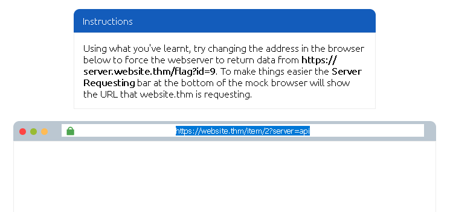
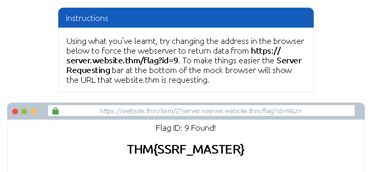
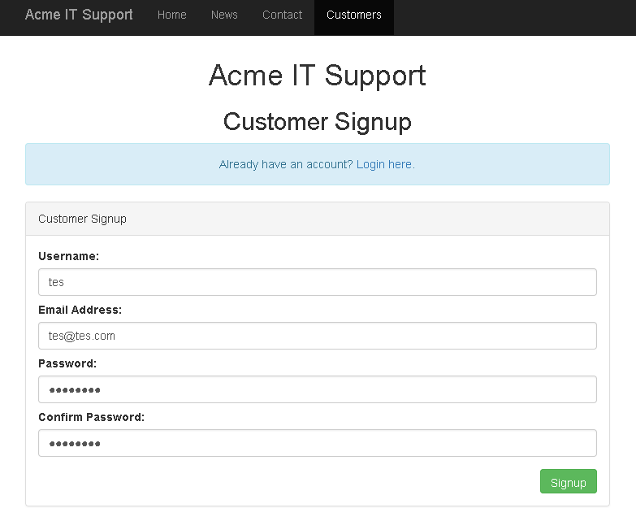
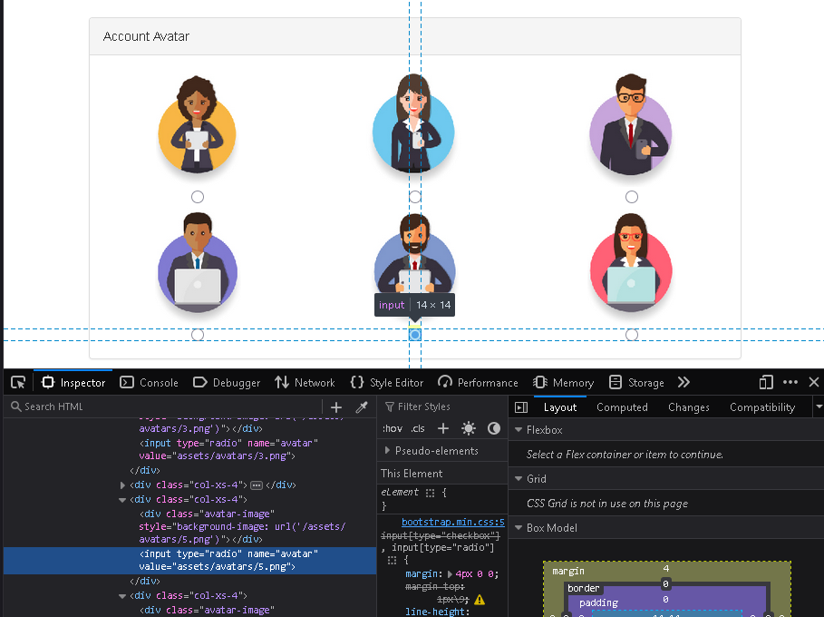
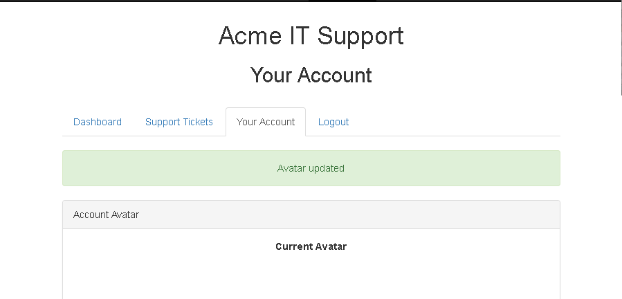
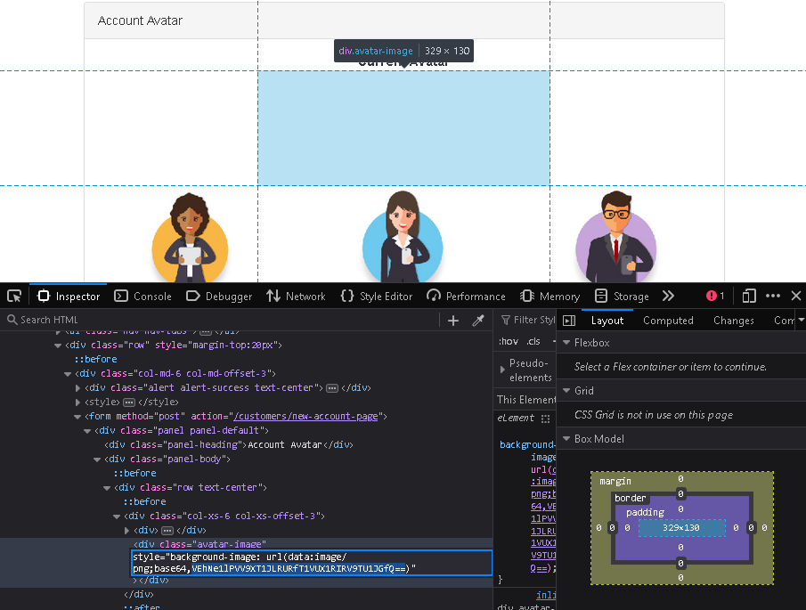
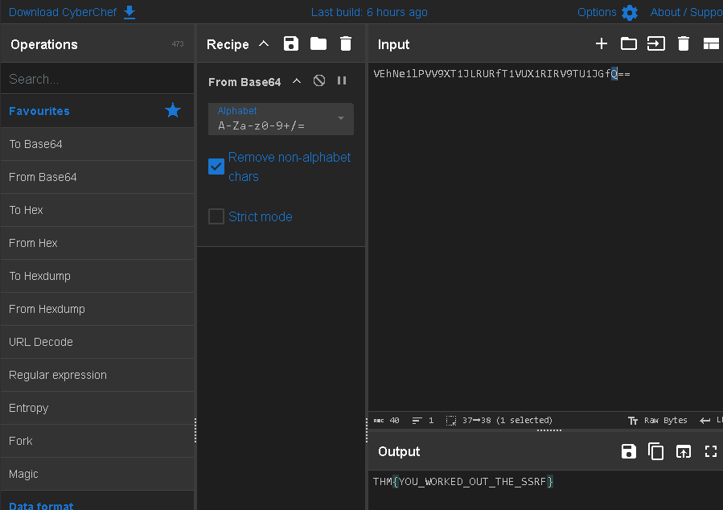

This is my write-up for the TryHackMe room on [Intro to SSRF](https://tryhackme.com/room/ssrfqi). Written in 2026, I hope this write-up helps others learn and practice cybersecurity.
Here is the extracted and summarized content formatted in English according to your rules:

## Task 1: What is an SSRF?

Server-Side Request Forgery (SSRF) is a vulnerability that allows a malicious user to manipulate a web server into making an additional or edited HTTP request to a resource of their choosing. There are two main types: Regular SSRF (where data is returned to the attacker's screen) and Blind SSRF (where the request occurs, but no information is returned). A successful SSRF attack can lead to unauthorized access to restricted areas, exposure of sensitive customer or organizational data, the ability to pivot into internal networks, and the revelation of authentication tokens or credentials.

**What does SSRF stand for?**

> Server-Side Request Forgery

**As opposed to a regular SSRF, what is the other type?**

> Blind

---

## Task 2: SSRF Examples

This task involves interacting with an external site to view common SSRF examples and learn how to exploit them. It includes a simulation exercise where you can test your newfound knowledge to uncover a hidden flag.

**What is the flag from the SSRF Examples site?**

  

kita bisa lihat bahwa url awal yang di berikan adalah <https://website.thm/item/2?server=api>

parameter penting: server=api

Kemungkinan besar backend membuat request seperti ini: <https://api.website.thm/item/2>

Karena server langsung dimasukkan ke URL, kita bisa mengontrol request yang dilakukan server.

kita harus membuat backend request ke: <https://server.website.thm/flag?id=9>

maka kita menggunakan payload: server=server.website.thm/flag?id=9&z=

menjadi <https://website.thm/item/2?server=server.website.thm/flag?id=9&z=>

di mana &z= digunakan untuk:

- Menghindari error parsing URL
- Menangkap tambahan path /item/2
- Membuat query tetap valid

> THM{SSRF_MASTER}

---

## Task 3: Finding an SSRF

SSRF vulnerabilities can be spotted in web applications in several common places: full URLs used in address bar parameters, hidden fields in forms, partial URLs (like hostnames), or specific URL paths. Discovering a working payload often requires trial and error. When dealing with Blind SSRFs, since no output is reflected, you must use external HTTP logging tools (like RequestBin, your own HTTP server, or Burp Suite's Collaborator) to monitor and catch the out-of-band requests.

**Based on simple observation, which of the following URLs is more likely to be vulnerable to SSRF?**
**1. `https://website.thm/index.php**`
**2. `https://website.thm/list-products.php?categoryId=5325**`
**3. `https://website.thm/fetch-file.php?fname=242533.pdf&srv=filestorage.cloud.thm&port=8001**`
**4. `https://website.thm/buy-item.php?itemId=213&price=100&q=2**`

> 3

---

## Task 4: Defeating Common SSRF Defenses

Developers often implement defenses against SSRF, primarily using Deny Lists or Allow Lists.

- **Deny Lists** block specific sensitive locations (like `localhost` or `127.0.0.1`). Attackers can bypass these using alternative IP representations (e.g., `0.0.0.0`, `127.1`) or custom DNS records. In cloud environments, the IP `169.254.169.254` is often targeted for sensitive metadata.
- **Allow Lists** strictly permit only approved inputs (e.g., URLs starting with a specific domain). Attackers can bypass this by creating a subdomain on their own server that matches the allowed string.
- **Open Redirects** can be used as a last resort if other bypasses fail. An attacker can use a legitimate open redirect endpoint on the target server to forward the internal HTTP request to a domain of their choosing.

**What method can be used to bypass strict rules?**

> Open Redirect

**What IP address may contain sensitive data in a cloud environment?**

> 169.254.169.254

**What type of list is used to permit only certain input?**

> Allow List

**What type of list is used to stop certain input?**

> Deny List

---

## Task 5: SSRF Practical

This practical scenario targets the Acme IT Support website. During content discovery, a restricted `/private` endpoint and a new `/customers/new-account-page` with an avatar selection feature are found. By inspecting the avatar form, you can see it uses a file path to load the image. Directly changing the form value to `private` is blocked by a deny list. However, you can bypass this defense using a directory traversal trick (`x/../private`). Once successfully bypassed, the web application updates the avatar with the base64 encoded contents of the restricted `/private` directory, which can be decoded to reveal the final flag.

**What is the flag from the /private directory?**

pertama kita coba bikin akun dulu

lalu arahkan ke link untuk membuat avatar

<https://IP_MACHINE.reverse-proxy.cell-prod-ap-south-1b.vm.tryhackme.com/customers/new-account-page>

lalu di halaman update avatar kita gunakan inspect unutk merubah value misal menjadi "x/../private"

setelah berhasil maka kita lakukan juga inspect di bagian current avatar

di sini kita meneukan kode base64

bisa gunakan cyberchef: <https://gchq.github.io/CyberChef/> dan gunakan base64 dan kita mendapat flagnya

> THM{YOU_WORKED_OUT_THE_SSRF}

Thanks for reading. See you in the next lab.
