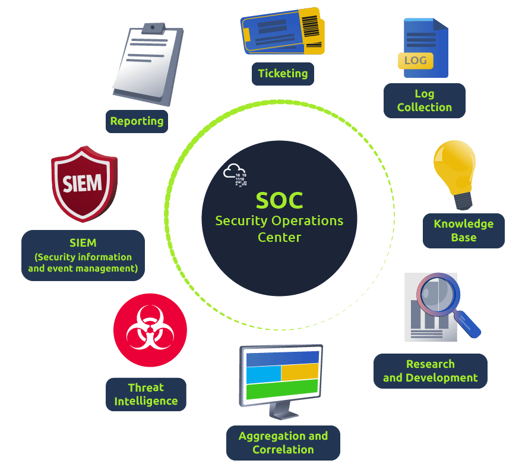
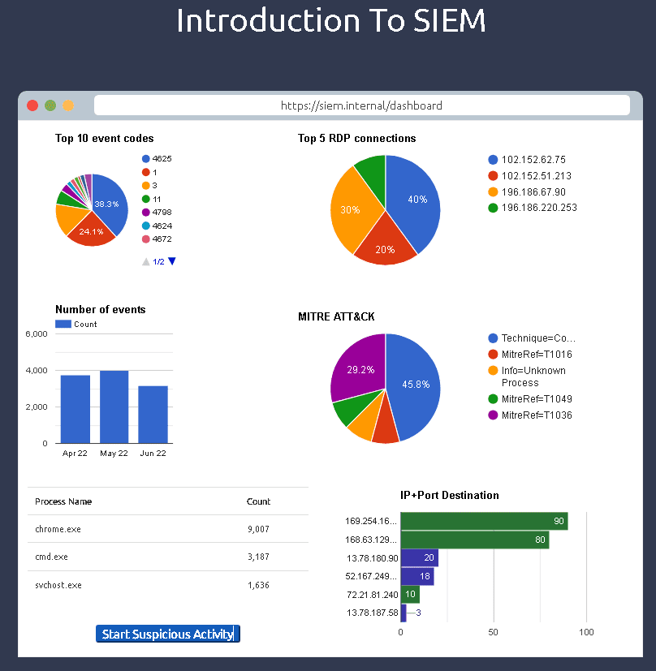
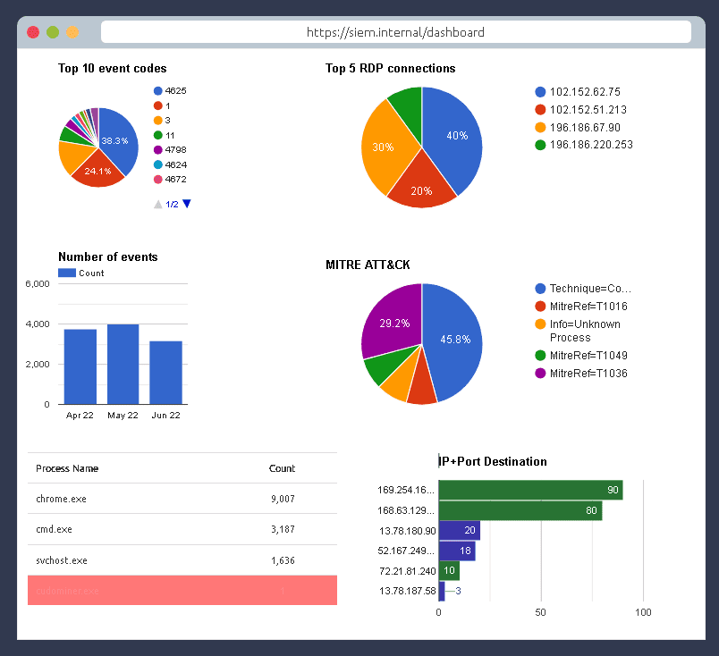
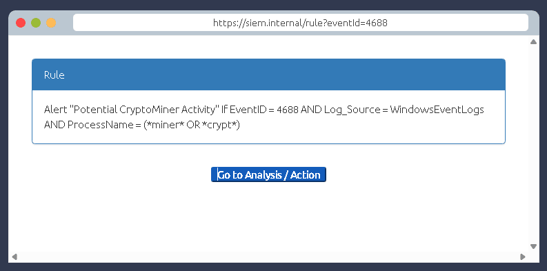

Here i want to share about my write-up for the room [Introduction to SIEM](https://tryhackme.com/room/logsfundamentals), an introduction to Security Information and Event Management. I wrote this in 2025 and hope it is useful for learning about cybersecurity.

## Task 1: Introduction

SIEM stands for Security Information and Event Management system. It is a tool that collects data from various endpoints/network devices across the network, stores them at a centralized place, and performs correlation on them.

What does SIEM stand for?
>Security Information and Event Management system

## Task 2: Network Visibility through SIEM

Network log sources can be divided into two logical parts: Host-Centric Log Sources and Network-Centric Log Sources.

- **Host-Centric Log Sources** capture events that occurred within or related to the host.
- **Network-Centric Log Sources** are generated when the hosts communicate with each other or access the internet.

Some key features provided by SIEM are:

- Real-time log Ingestion
- Alerting against abnormal activities
- 24/7 Monitoring and visibility
- Ability to investigate past incidents

Is Registry-related activity host-centric or network-centric?
>host-centric

Is VPN related activity host-centric or network-centric?
>network-centric

## Task 3: Log Sources and Log Ingestion

### Common Devices

- **Windows Machine**: Windows records that can be viewed through the **Event Viewer** utility.
- **Linux Workstation**: Linux OS stores related logs in common locations such as `/var/log/httpd`, `/var/log/auth.log`, and `/var/log/kern`.
- **Web Server**: It is important to keep an eye on all the requests/responses coming in and out of the webserver.

### Log Ingestion

Some common methods used by SIEM solutions for ingesting logs are:

- Agent / Forwarder
- Syslog
- Manual Upload
- Port-Forwarding

In which location within a Linux environment are HTTP logs stored?
>`/var/log/httpd`

## Task 4: Why SIEM

Read the task above.
>No answer needed

## Task 5: Analysing Logs and Alerts

Which Event ID is generated when event logs are removed?
>104

What type of alert may require tuning?
>False Alarm

## Task 6: Lab Work

Click on Start Suspicious Activity, which process caused the alert?
>cudominer.exe

Find the event that caused the alert, which user was responsible for the process execution?
>chris.fort

What is the hostname of the suspect user?
>HR_02

Examine the rule and the suspicious process; which term matched the rule that caused the alert?
>miner

What is the best option that represents the event? Choose from the following:

- False-Positive
- True-Positive

>True-Positive

Selecting the right ACTION will display the FLAG. What is the FLAG?
>THM{000_SIEM_INTRO}

## Task 7: Conclusion

Complete this room.
>No answer needed
