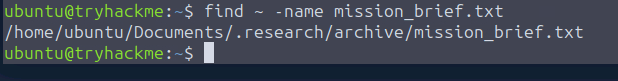
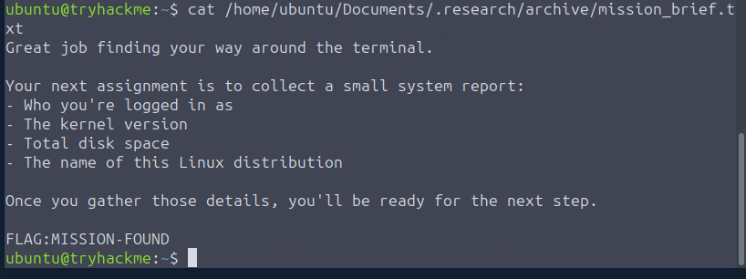
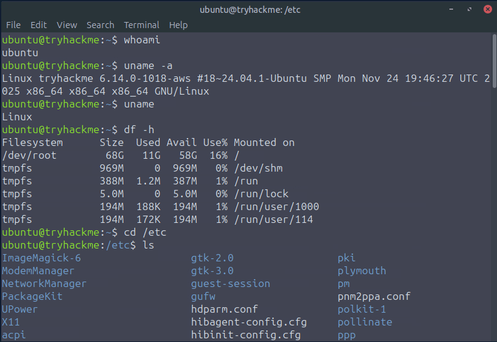
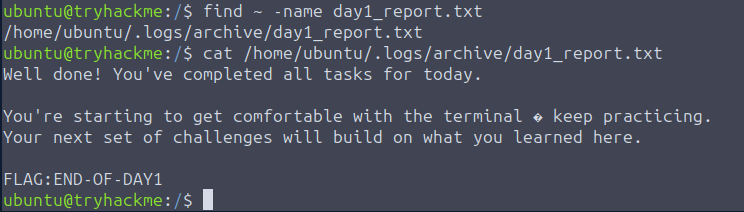

This is my write-up for the TryHackMe room on [Linux CLI Basics](https://tryhackme.com/room/linuxclibasics). Written in 2026, I hope this write-up helps others learn and practice cybersecurity.

## Task 1: Introduction

**Summary:** This task introduces the Linux Command-Line Interface (CLI) as an essential tool for navigating servers, using security tools, and setting up hacking environments. It establishes a storyline where you play a new IT Support Engineer tasked with learning basic terminal navigation to find your supervisor's notes.

### Prerequisites

- [Operating Systems: Introduction](https://tryhackme.com/room/operatingsystemsintroduction)
- [Windows Basics](https://tryhackme.com/room/windowsbasics)

**What does "CLI" stand for?**
> Command-Line Interface

---

## Task 2: Navigation Mission: "Find the Missing Notes"

**Summary:** This section teaches the fundamental commands for navigating the Linux filesystem. You learn `pwd` to print your current directory, `ls` (along with `-l` and `-al` flags) to list files including hidden ones, and `cd` to change directories. It also introduces the `find` command to locate specific files across the system and the `cat` command to read their contents, culminating in finding a file named `mission_brief.txt`.

**What is the full path of the mission_brief.txt file found on the system using the find command?**

Just run and wait for the complete path to appear.

> /home/ubuntu/Documents/.research/archive/mission_brief.txt

**What is the flag hidden inside the mission_brief.txt file?**

then run the script to the full path with the cat command

> MISSION-FOUND

---

## Task 3: Investigating the System

**Summary:** Here, the focus shifts to gathering system information to understand the environment you are operating in. You are introduced to `whoami` to check your current user, `uname -a` to get kernel and architecture details, and `df -h` to check disk space in a human-readable format. Additionally, you learn to explore the `/etc` directory to read configuration files like `os-release`. The task ends with a mini-challenge to find and read a file called `day1_report.txt`.

**What is the username returned by the `whoami` command?**
> ubuntu

**What is the kernel version shown by `uname -a`?**

> 6.14.0-1018-aws

**How much free disk space does `df -h` report?**
> 58G

**What is the message written inside day1_report.txt?**

We can run this script first to find the file path: find ~ -name day1_report.txt

Once found, it's at this path: /home/ubuntu/.logs/archive/day1_report.txt

Just run it with the cat command: cat /home/ubuntu/.logs/archive/day1_report.txt

> END-OF-DAY1

---

## Task 4: Conclusion

**Summary:** This final task summarizes the skills acquired during your "first day" on the job. It recaps that you have successfully learned to navigate the filesystem, search for files, inspect system info, and read configs. These basics serve as the foundation for learning more advanced Linux topics like file permissions, processes, and security tooling.

**Continue to complete the room.**
> No answer needed

Thanks for reading. See you in the next lab.
