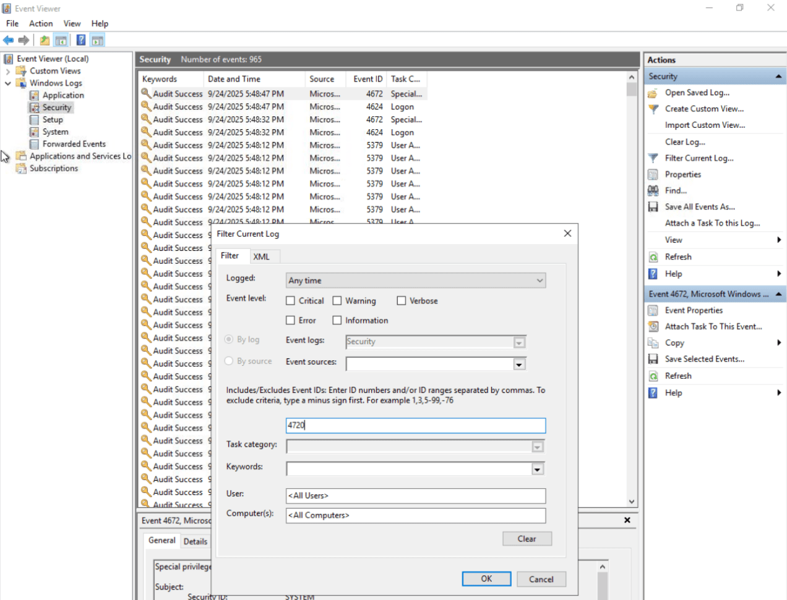
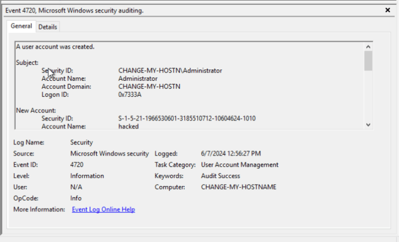
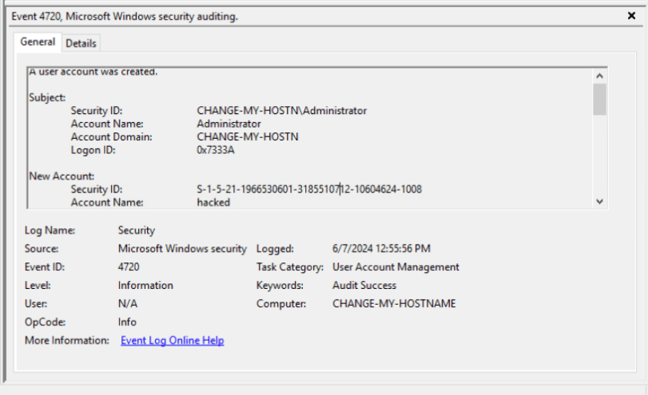
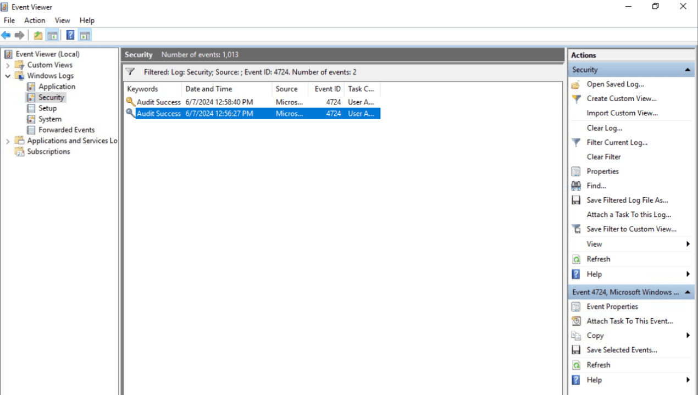

Here i want to share about my write-up for the room [Logs Fundamentals](https://tryhackme.com/room/logsfundamentals) (Premium Room), learn what logs are and how to analyze them for effective investigation. I wrote this in 2025 and hope it is useful for learning about cybersecurity.

## Task 1: Introduction to Logs

Logs are the digital footprints left behind by any activity. Tracing down the activity and the individual behind the execution of that activity becomes easier through logs.

Logs play an integral role in several key areas:

- Security Events Monitoring
- Incident Investigation and Forensics
- Troubleshooting
- Performance Monitoring
- Auditing and Compliance

Where can we find the majority of attack traces in a digital system?
>logs

## Task 2: Types of Logs

Logs are segregated into multiple categories according to the type of information they provide, so you just need to look into the specific log file for which the issue relates.

- **System Logs:** Helpful in troubleshooting running issues in the OS.
- **Security Logs:** Help detect and investigate security-related incidents.
- **Application Logs:** Contain specific events related to an application.
- **Audit Logs:** Provide detailed information on system changes and user events.
- **Network Logs:** Provide information on the network’s outgoing and incoming traffic.
- **Access Logs:** Provide detailed information about access to different resources.

Which type of logs contain information regarding the incoming and outgoing traffic in the network?
>Network Logs

Which type of logs contain the authentication and authorization events?
>Security Logs

## Task 3: Windows Event Logs Analysis

Windows OS logs many activities in log files. Some crucial types of logs are **Application**, **System**, and **Security**.

Based on the table of important Event IDs from the previous task, the event we are looking for is:

- Event ID 4720: A user account was created.

What is the name of the last user account created on this system?
>hacked

Which user account created the above account?
>administrator

On what date was this user account enabled? Format: M/D/YYYY
>6/7/2024

Based on the information from the previous task, the relevant Event ID is:
Event ID 4724: An attempt was made to reset an account’s password.

Did this account undergo a password reset as well? Format: Yes/No
>yes

## Task 4: Web Server Access Logs Analysis

All requests we make to a website are logged and stored in a log file on the web server. This log file contains all the requests made to the website along with information such as:

- **IP Address**
- **Timestamp**
- **Request** (HTTP Method, URL, Status Code)
- **User-Agent**

We can perform manual log analysis by using some command line utilities in the Linux operating system.

- **`cat`**: for displaying the contents of a text file.
- **`grep`**: allows us to search for strings and patterns inside a log file.
- **`less`**: handling multiple log files and helps us view one page at a time.

`10.0.0.1 - - [06/Jun/2024:13:54:44] "GET /contact HTTP/1.1" 500 "-" "Mozilla/5.0 (Macintosh; Intel Mac OS X 10_12_3) AppleWebKit/537.36 (KHTML, like Gecko) Chrome/58.0.3029.110 Safari/537.36"`

What is the IP which made the last GET request to URL: “/contact”?
>10.0.0.1

When was the last POST request made by IP: “172.16.0.1”?
>06/Jun/2024:13:55:44

Based on the answer from question number 2, to which URL was the POST request made?
>/contact

## Task 5: Conclusion

Complete the room.
>No answer needed
