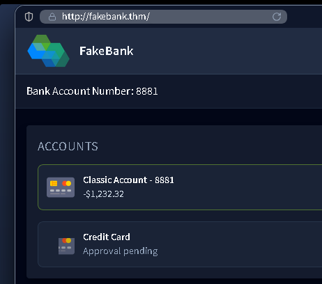
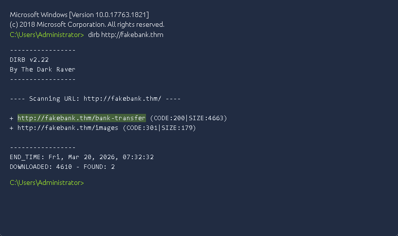
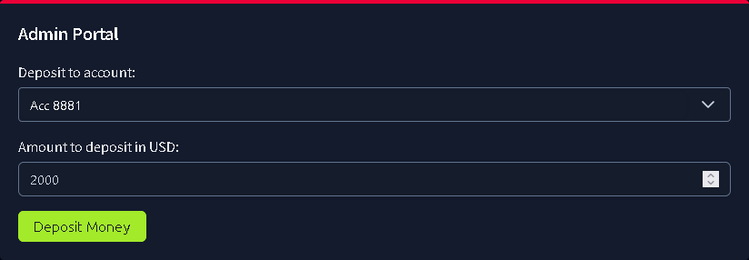

This is my write-up for the TryHackMe room on [Offensive Security Intro](https://tryhackme.com/room/offensivesecurityintrokKx12). Written in 2026, I hope this write-up helps others learn and practice cybersecurity.

## Task 1: Think like a Hacker

Offensive Security involves thinking like an attacker to identify and fix vulnerabilities before malicious hackers can exploit them. In this exercise, you will practice hacking a simulated website to understand the methods used by ethical hackers.

**Which term describes simulating a hacker's actions to find weaknesses?**
> Offensive Security

---

## Task 2: Starting the Lab

This task introduces the virtual desktop environment used for the simulation. You will be targeting a simulated banking application called FakeBank, which automatically opens in the lab's browser.

**What is the bank account number in the FakeBank application?**

> 8881

---

## Task 3: Find Hidden Pages

A common web vulnerability is leaving hidden administrative pages accessible. You will use a terminal-based hacking tool called `dirb` to find these pages. By running the command `dirb http://fakebank.thm`, the tool will scan the website and reveal hidden directories marked with a `+`.

**Dirb found one URL, `http://fakebank.thm/images`. What is the other hidden URL?**

> <http://fakebank.thm/bank-transfer>

---

## Task 4: Attack the Admin Page

Using the hidden URL discovered in the previous task, you can access an admin panel that allows you to transfer funds. By navigating to the `/bank-transfer` page, you can input your account number (8881) and deposit $2000 to successfully manipulate your account balance.

**When your balance turns positive, a pop-up with green text appears. Enter the green words as the answer** (ALL CAPS)

> BANK HACKED

Thanks for reading. See you in the next lab.
