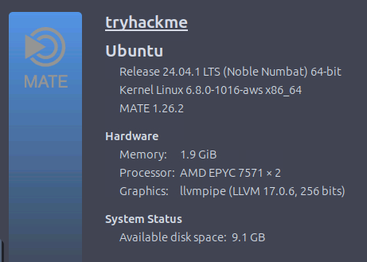
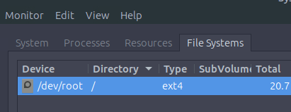
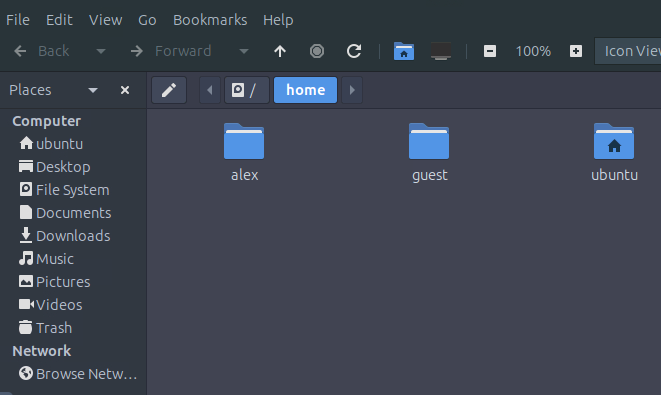
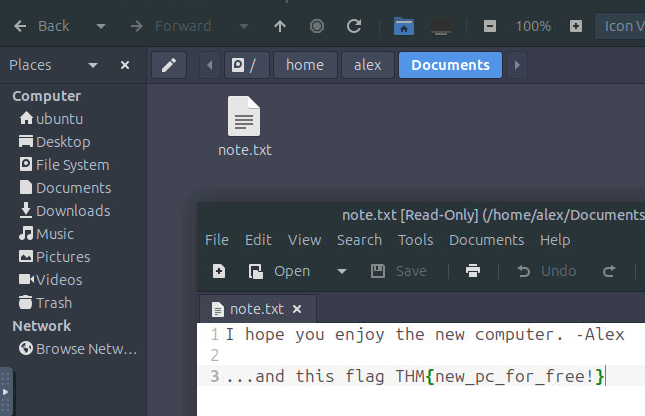

This is my write-up for the TryHackMe room on [Operating Systems: Introduction](https://tryhackme.com/room/operatingsystemsintroduction). Written in 2026, I hope this write-up helps others learn and practice cybersecurity.

## Task 1: Introduction

This section introduces the concept of an Operating System (OS) as the invisible foundational layer that connects a computer's physical hardware with its applications. Through a scenario involving a gifted old computer, the task outlines the learning objectives: understanding the core duties of an OS, identifying common OS types, and practicing basic OS interaction to gather system specifications.

### Prerequisites

- [Inside a Computer System](https://tryhackme.com/room/insideacomputer)
- [Computer Types](https://tryhackme.com/room/computertypes)

**I understand the learning objectives and am ready to learn about operating systems!**
> No answer needed

---

## Task 2: The Invisible Manager

An Operating System acts as the central manager of a computer, functioning much like air traffic control at an airport to prevent conflicts and ensure smooth operations. It separates system privileges into two layers: the highly-privileged **Kernel space** (direct hardware access) and the restricted **User space** (where standard apps run and must request permissions). The core duties of an OS include managing processes, memory, file systems, users, and devices, while also providing foundational security features like authentication, permissions, and isolation.

**Which OS space has unrestricted access to your computer's hardware?**
> Kernel space

**Which OS responsibility manages user accounts, authentication, and permissions?**
> User Management

**After opening the `About This Computer` shortcut, you are greeted with an overview of the system's specifications.**
**What version of Ubuntu Mate is your computer running?**

From here we know whether the version of Ubuntu used is MATE 1.26.2.
> 1.26.2

**Check out the `Hardware` section of the `System` tab.**
**How much memory is allocated to your machine?**
> 1.9 GiB

---

## Task 3: OS Interaction and Landscape

Users typically interact with an OS through two main interfaces: a Graphical User Interface (GUI), which uses visual elements like icons and windows, or a Command-Line Interface (CLI), which relies on precise text-based commands for control. Operating systems vary widely based on their environment and are categorized into Desktop (Windows, macOS, Linux), Server (Linux, Windows Server), Mobile (Android, iOS), Embedded/IoT (Embedded Linux, RTOS), and Virtual/Cloud environments. This diverse landscape exists because different devices require unique balances of user-friendliness, stability, efficiency, and resource management.

**Open the `File Systems` tab in `System Monitor`.**
**What `Type` is listed for the `/dev/root` device?**

standard Ubuntu VM environment

> ext4

**After opening the `Home` directory on the Desktop, how many user directories exist?**

> 3

**Navigate to Alex's home directory and explore the `Documents` folder.**
**What is the flag value contained in `note.txt`?**

> THM{new_pc_for_free!}

---

## Task 4: Conclusion

This concluding section wraps up the module by reviewing the core concepts of what an operating system manages behind the scenes. It provides a quick recap of essential terminology, including the definitions of an OS, Kernel space, User space, GUI, and CLI. Finally, it offers suggestions for further learning paths, encouraging students to dive deeper into Windows and Linux CLI basics.

**Complete the room and continue on your cyber learning journey!**
> No answer needed

Thanks for reading. See you in the next lab.
