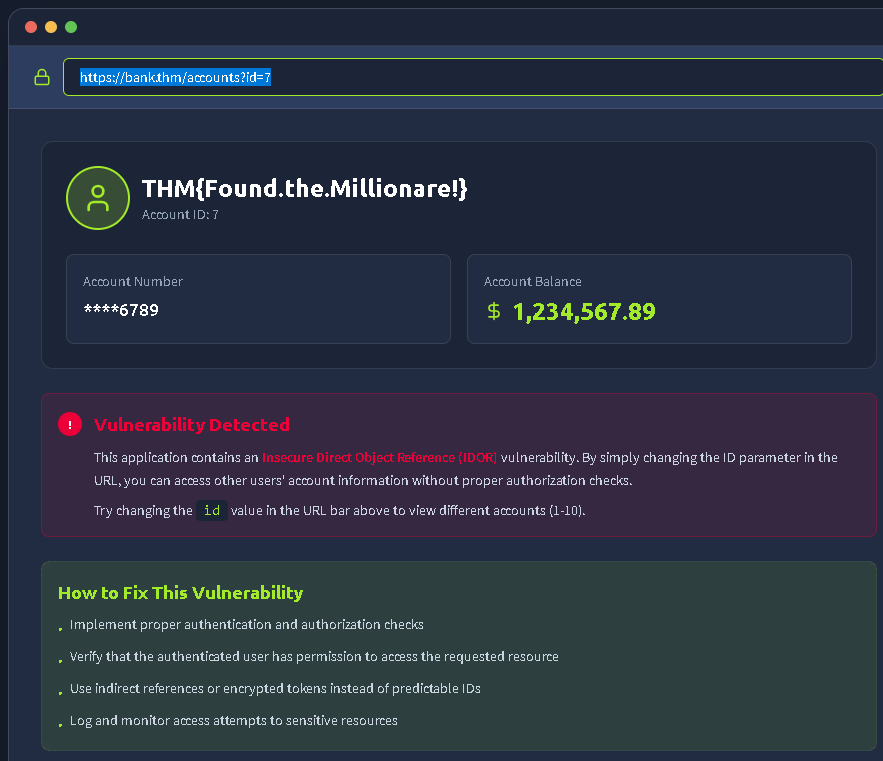
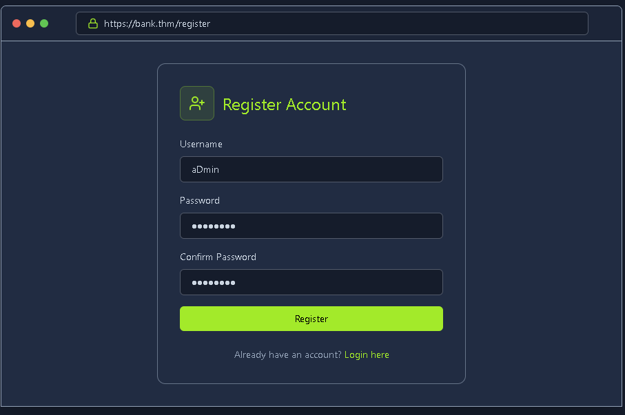
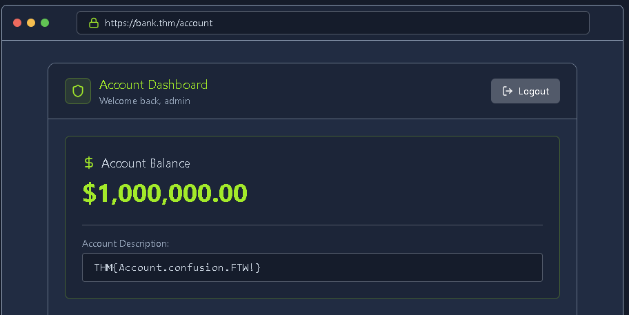
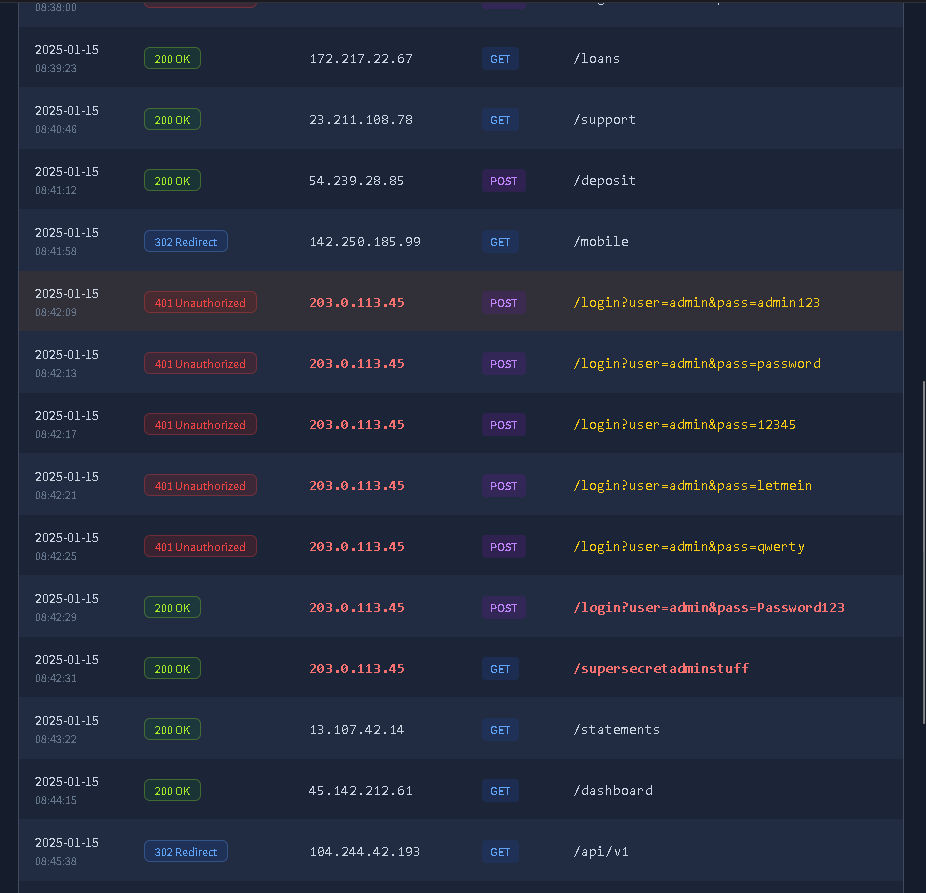
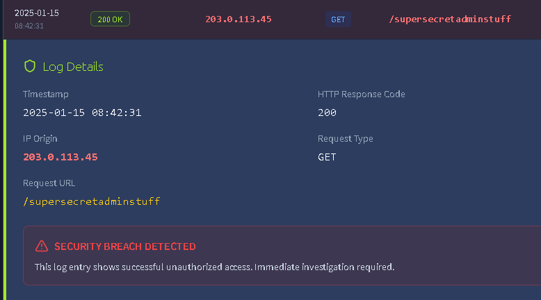

This is my write-up for the TryHackMe room on [OWASP Top 10 2025: IAAA Failures](https://tryhackme.com/room/owasptopten2025one). Written in 2026, I hope this write-up helps others learn and practice cybersecurity.

## Task 1: Introduction

In this room, we are introduced to three specific categories from the OWASP Top 10 2025 that deal with failures in the IAAA framework (Identity, Authentication, Authorisation, and Accountability). Designed for beginners, this room covers practical exercises focusing on A01: Broken Access Control, A07: Authentication Failures, and A09: Logging & Alerting Failures.

**I am ready to learn about IAAA failures!**

> No answer needed

## Task 2: What is IAAA?

IAAA is a sequential framework used to verify users and their actions within an application. You cannot skip any step in this flow. It consists of **Identity** (who the user claims to be), **Authentication** (proving that identity), **Authorisation** (determining what they are allowed to do), and **Accountability** (logging their actions for tracking). Weaknesses in any of these areas can lead to severe security breaches.

**What does IAAA stand for?**

> Identity, Authentication, Authorisation, Accountability

## Task 3: A01: Broken Access Control

Broken Access Control happens when an application fails to properly verify server-side permissions on user requests. A prime example is IDOR (Insecure Direct Object Reference), where an attacker can simply change an ID parameter in a URL (like `?id=1` to `?id=2`) to view another user's data (horizontal privilege escalation) or access admin-level functions (vertical privilege escalation).

**If you don't get access to more roles but can view the data of another users, what type of privilege escalation is this?**

> Horizontal

**What is the note you found when viewing the user's account who had more than $ 1 million?**

You can just keep trying different IDs until you find the one containing the flag, which is <https://bank.thm/accounts?id=7>

> THM{Found.the.Millionare!}

## Task 4: A07: Authentication Failures

Authentication failures occur when an application's login or registration mechanics are flawed, allowing attackers to hijack identities. Common vulnerabilities include username enumeration, weak password policies without rate limiting, and broken logic flows. For example, poor implementation might allow an attacker to bypass security simply by registering an account with a case variation, like "aDmiN" instead of "admin".

**What is the flag on the admin user's dashboard?**

Simply register with a different account name variation, for example, aDmin

and we will gain access to the admin account.

> THM{Account.confusion.FTW!}

## Task 5: A09: Logging & Alerting Failures

Without proper logging and alerting, an application lacks accountability, leaving security teams completely blind to active attacks. Failures in this category include missing authentication logs, vague error messages, or failing to monitor for brute-force attempts and suspicious privilege escalations. Good logging requires centralized, untamperable records of all critical lifecycle events.

**It looks like an attacker tried to perform a brute-force attack, what is the IP of the attacker?**

Here we can see the various login attempts.

> 203.0.113.45

**Looks like they were able to gain access to an account! What is the username associated with that account?**

> admin

**What action did the attacker try to do with the account? List the endpoint the accessed.**

This is the path that the attacker appears to be trying to breach.

> /supersecretadminstuff

## Task 6: Conclusion

Wrapping up, we've learned how critical the IAAA framework is to application security. To prevent these OWASP Top 10 vulnerabilities, developers must enforce strict server-side access checks on every request, secure authentication flows against brute-forcing and account confusion, and ensure robust, off-host logging to detect and investigate anomalies.

**I understand the importance of a secure IAAA implementation in my application!**

> No answer needed

Thanks for reading. See you in the next lab.
