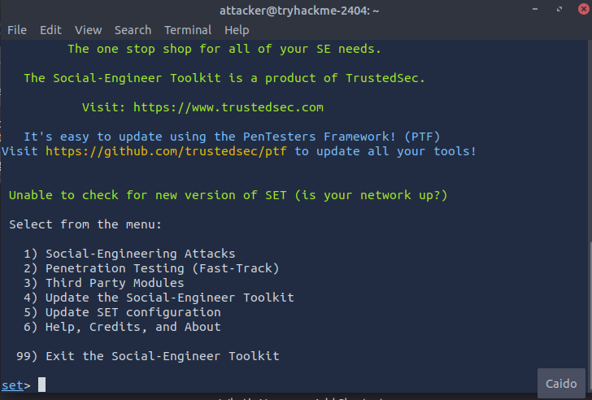
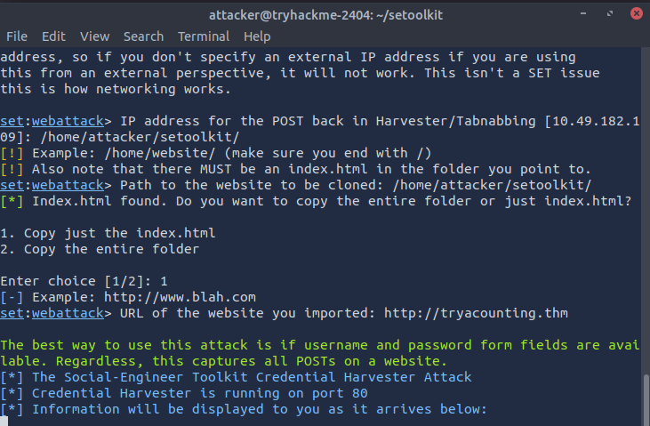
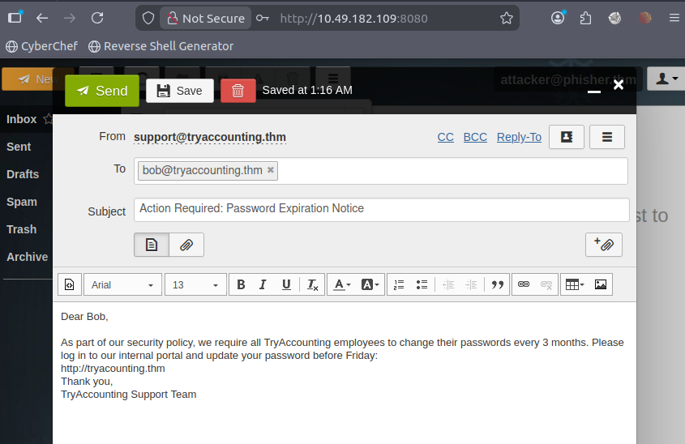
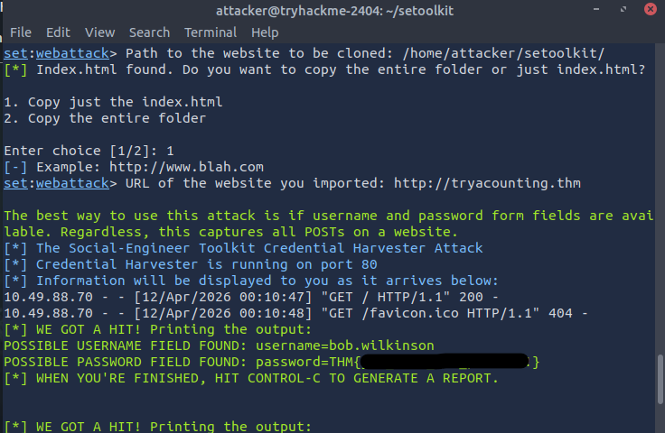

This is my write-up for the TryHackMe room on [Phishing Basics](https://tryhackme.com/room/phishingbasics). Written in 2026, I hope this write-up helps others learn and practice cybersecurity.

## Task 1: Introduction

This section introduces phishing as a powerful tool in a penetration tester's arsenal. Unlike technical vulnerabilities, phishing targets the human element, exploiting psychology to bypass robust technical defenses. A successful phishing attack can lead to initial network access, malware deployment, or credential theft.

**Are you ready?**
> No answer needed

## Task 2: Phishing 101

Phishing is a social engineering attack used to trick individuals into revealing sensitive data or executing malware by impersonating legitimate entities. There are three main types discussed: generic Phishing (a broad attack sent to many), Spear Phishing (a highly targeted attack on a specific individual), and Whaling (spear phishing targeting high-level executives like CEOs). Ethical hackers use these techniques to evaluate and strengthen an organization's security posture.

**What is the primary channel used during a smishing attack?**
> sms

**You are a CEO and have just received a phishing email sent only to you. What type of phishing is this?**
> Whaling

## Task 3: Psychology of Phishing

Phishing relies heavily on psychological manipulation. It utilizes several core social engineering principles to bypass logical thinking: Scarcity (FOMO), Urgency (time pressure), Authority (compliance with perceived leaders), Fear (anxiety over security alerts), Curiosity (desire to know secrets), and Trust (familiarity with brands or colleagues). The material also highlights cognitive biases that make people susceptible, such as overconfidence bias, confirmation bias, and authority bias.

**You receive an email stating that a special offer for the new iPhone will expire in 24 hours if you don't act now. Which principle is being used?**
> Urgency

**An executive requests sensitive data via email, emphasising their position within the company. Which principle is being used?**
> Authority

**You receive a message promising exclusive access to a new product no one else knows about if you click on a link. Which principle is being used?**
> Curiosity

**You receive an email claiming that your account credentials were found in a recent data breach. Which principle is being used?**
> Fear

## Task 4: Phishing Techniques

This task details the technical methods used to deceive victims. It covers URL manipulation (URL masking, homograph attacks, and typosquatting) to hide malicious links. It explains email spoofing, where attackers manipulate SMTP headers to fake the sender's identity, which organizations combat using SPF, DMARC, and DKIM. Additionally, it introduces credential harvesting via cloned login pages and payload delivery using malicious document macros. Popular phishing tools like GoPhish, EvilNginx, and The Social Engineering Toolkit (SET) are also highlighted.

**Which technique relies on users making a typo?**
> Typosquatting

**Which three security measures help organisations defend against email spoofing?** Answer format: Alphabetical order, separated by commas
> DKIM, DMARC, SPF

## Task 5: Anatomy of a Phishing Campaign

A successful phishing campaign follows a structured lifecycle: Planning & Scoping (defining goals and rules of engagement), Reconnaissance (gathering OSINT), Scenario & Payload Development (crafting realistic lures and benign payloads), Exploitation & Post-Exploitation (executing the attack and monitoring metrics), and Reporting & Debriefing (analyzing data and providing actionable recommendations). The task includes a benchmarking table to map metrics (like Click Rate and Credential Entry Rate) to specific security recommendations.

**Your campaign shows a credential entry rate of 6%. According to the benchmarks, what risk level does this represent?**
> High risk

**Which metric measures the percentage of users who open an attachment?**
> Attachment Detonation Rate

**A client has a click rate of 10%. Which single recommendation from the table would you give them?**
> Focused security awareness training

## Task 6: The Social Engineering Toolkit

This hands-on scenario involves using the Social Engineering Toolkit (SET) to perform a spear-phishing attack against a target named Bob. The process includes starting a credential harvester listener by cloning a target webpage (typosquatting the domain). Then, using an email client (Rainloop) to spoof an internal support email address, bypassing standard email security measures. Once the target interacts with the cloned site, the terminal captures and displays the harvested credentials.

**What is the password flag?**

First, we need to connect to the attacker via SSH and start SET (Social Engineer Toolkit) then select this:

1. Social-Engineering Attacks
2. Website Attack Vectors
3. Credential Harvester Attack Method
4. Custom Import

Then, provide the following path for index.html /home/attacker/setoolkit/ and choose the first option, Copy just the index.html. And finally, enter the following URL: <http://tryacounting.thm>

Go to attacker mail inbox and fill it out like this:
from: <support@tryaccounting.thm>
to: <bob@tryaccounting.thm>

Fill in the subject line and the body of the email, then send the email.

Finally, we get the flag from the terminal response

## Task 7: Conclusion

The room wraps up by summarizing the key concepts learned from a pentester's perspective, including the psychological principles of social engineering, technical manipulation techniques like typosquatting and spoofing, and the deployment of actual phishing tools. It provides a solid foundation for evaluating an organization's susceptibility to human-based attacks.

**Well done on completing this room! If you're looking for a challenge, try out our You Got Mail room.**
> No answer needed

Thanks for reading. See you in the next lab.
