This is my write-up for the TryHackMe room on [Race Conditions](https://tryhackme.com/room/raceconditionsattacks). Written in 2026, I hope this write-up helps others learn and practice cybersecurity.

## Task 1: Introduction

This task introduces the concept of a race condition vulnerability. A race condition occurs when the timing or sequence of events influences a program's behavior, typically happening when multiple threads access and modify a variable without proper synchronization locks. This flaw can allow attackers to abuse systems, such as applying a single discount multiple times or spending beyond their account balance.

### Prerequisites

- [How the Web Works](https://tryhackme.com/module/how-the-web-works)
- [Packets and Frames](https://tryhackme.com/room/packetsframes)
- [Burp Suite: The Basics](https://tryhackme.com/r/room/burpsuitebasics)

**I know all the prerequisites. Let the race begin!**
> No answer needed

## Task 2: Multi-Threading

This section breaks down the core concepts of computer execution. A **Program** is a static set of instructions (like a recipe). A **Process** is a program in active execution, holding memory and moving through various states (New, Ready, Running, Waiting, Terminated). A **Thread** is a lightweight execution unit within a process. Multi-threading allows a single process (like a web server) to handle multiple user requests simultaneously by spawning threads instead of forcing users to wait in a single-file line.

**You downloaded an instruction booklet on how to make an origami crane. What would this instruction booklet resemble in computer terms?**
> program

**What is the name of the state where a process is waiting for an I/O event?**
> waiting

## Task 3: Race Conditions

Race conditions are explained using a real-world analogy of two people trying to reserve the same restaurant table at the exact same time. In software, this is known as a Time-of-Check to Time-of-Use (TOCTOU) vulnerability. If two concurrent threads check a bank balance of $100 and both try to withdraw $50 simultaneously, the lack of proper synchronization might allow both withdrawals to process before the system updates the final balance. This occurs frequently due to parallel execution, concurrent database operations, or poorly designed third-party API integrations.

**Does the presented Python script guarantee which thread will reach 100% first?** (Yea/Nay)
> Nay

**In the second execution of the Python script, what is the name of the thread that reached 100% first?**
> Thread-1

## Task 4: Web Application Architecture

Web applications typically use a multi-tier architecture (Presentation, Application, and Data tiers) running on a client-server model. When a system processes logic—like applying a coupon—it doesn't just instantly flip from "not applied" to "applied." It goes through multiple intermediate states (e.g., checking validity, checking constraints, recalculating total). These intermediary steps create a split-second "window of opportunity." By using tools like Burp Suite, an attacker can send simultaneous requests that hit the server within that tiny window, tricking the application into processing the same action multiple times.

**How many states did the original state diagram of “validating and conducting money transfer” have?**

Two-step process: either the Amount is not sent or the Amount is sent.

> 2

**How many states did the updated state diagram of “validating and conducting money transfer” have?**

The server doesn't instantly send the money. It first needs to query the database to verify if you have enough funds. This introduces a third, hidden intermediate state: Checking account balance/limits.

> 3

**How many states did the final state diagram of “validating coupon codes and applying discounts” have?**

1. Coupon not applied
2. Checking coupon validity
3. Checking coupon constraints (e.g., is it expired?)
4. Recalculating the total
5. Coupon applied.

> 5

## Task 5: Exploiting Race Conditions

This practical task focuses on using Burp Suite Repeater to actively exploit a race condition in a mock mobile operator web app. By capturing a valid `POST` request (like a money transfer), duplicating it multiple times in a Repeater Tab Group, and sending them in parallel, you can force the requests to arrive at the server within a 0.5-millisecond window. To achieve this synchronization, Burp Suite uses a single TCP packet for HTTP/2 or a "last-byte synchronization" technique for HTTP/1.

**You need to get either of the accounts to get more than $100 of credit to get the flag. What is the flag that you obtained?**

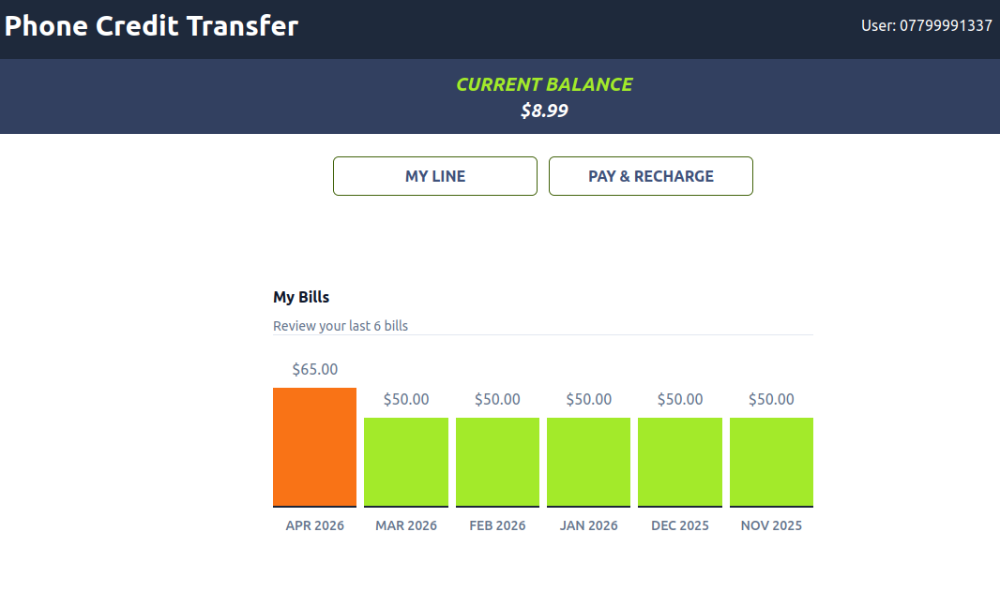

First, we try to log in as user 07799991337

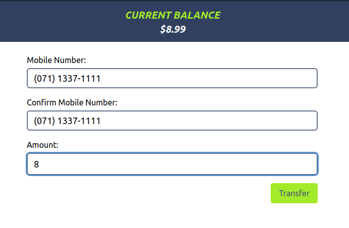

Then we try to transfer with $8 because the current balance is $8.99. Don't forget to turn on the foxyproxy and burp suite to intercept.

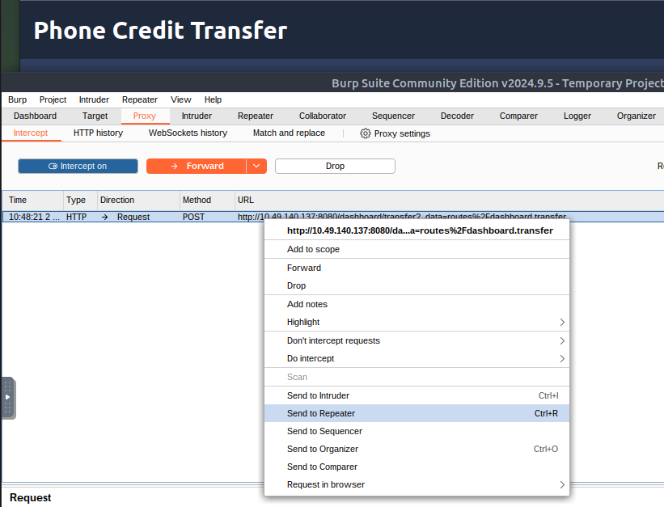

send to Repeater

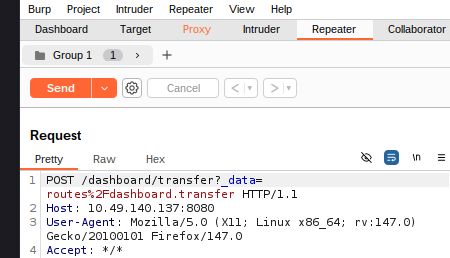

Create tab Group

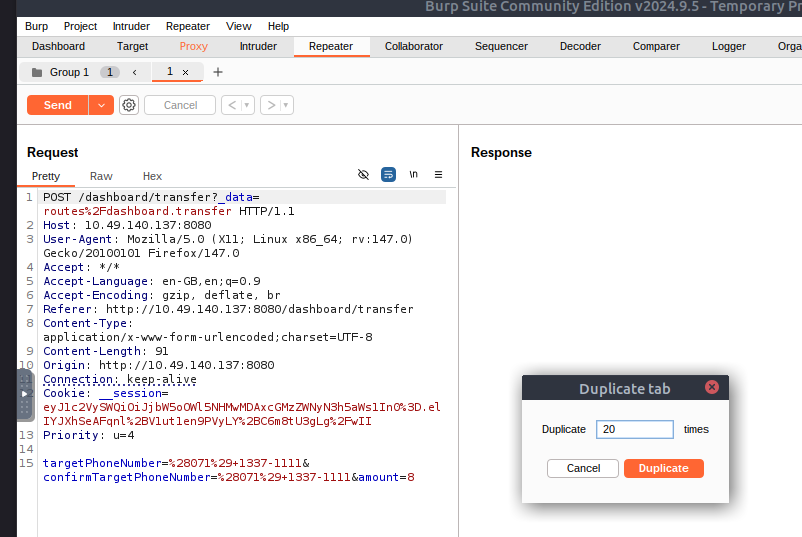

Then right click and duplicate the tab. You can fill it with the number 20 because 20 x 8 is 160.

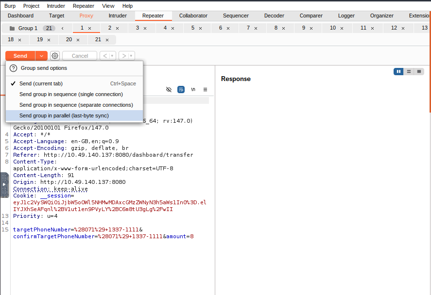

And look at the response, here we can see whether the transaction was successful or not.

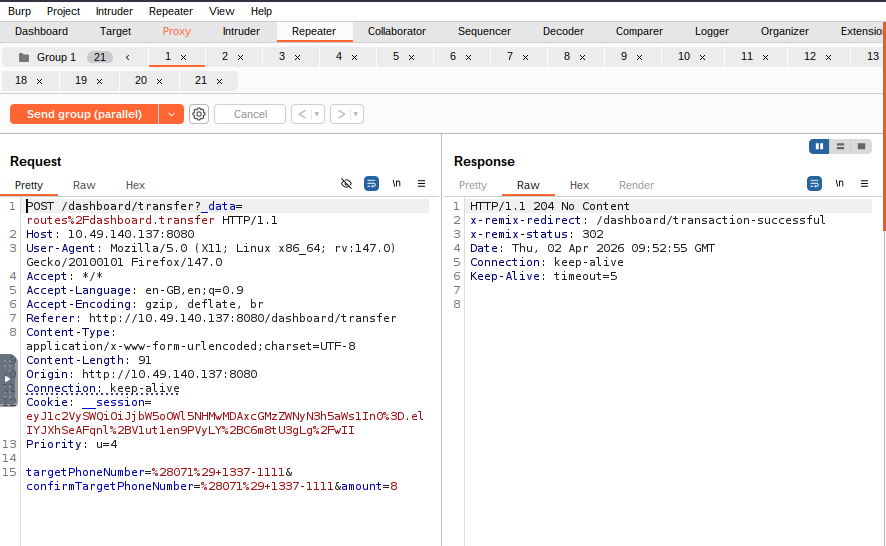

Yes, the transaction was successful, then let's validate it.

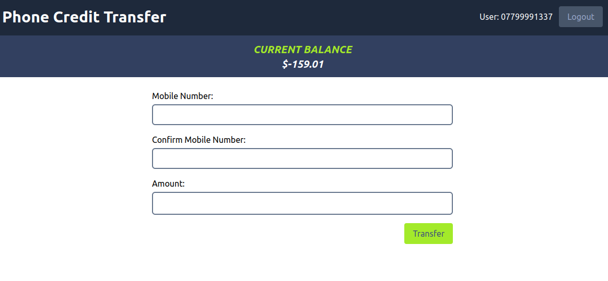

For user 07799991337, we can see that they have a negative balance due to a large number of transactions. Now, let's check the other accounts (07113371111).

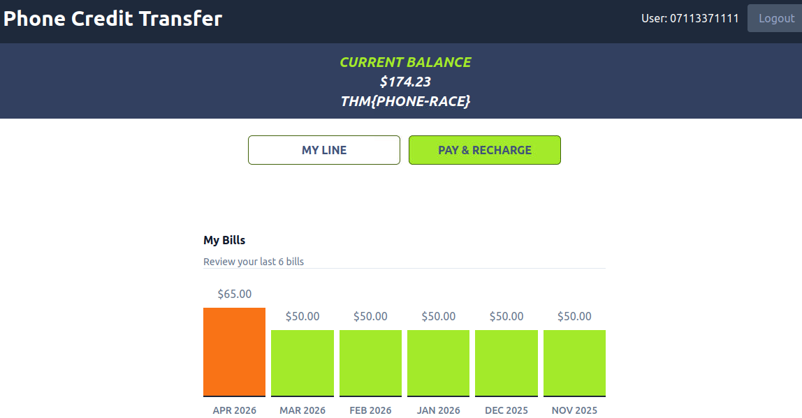

Yes, the transfer was successful and we have got the flag.

> THM{PHONE-Race} *(Note: You will need to run the target VM and perform the attack to get the dynamic flag value)*

## Task 6: Detection and Mitigation

Detecting race conditions strictly from business logs is difficult because the malicious actions often look like standard user behavior, making penetration testing crucial. To mitigate these vulnerabilities, developers should use **Synchronization Mechanisms** (like thread locks), **Atomic Operations** (grouping instructions so they cannot be interrupted), and **Database Transactions** (ensuring all operations either succeed completely or fail completely as a single unit).

**Make sure you have taken note of the above.**
> No answer needed

## Task 7: Challenge Web App

This is the final unguided challenge. You are tasked with logging into a vulnerable banking application using provided credentials. Using the parallel request techniques learned in Task 5 via Burp Suite, you must exploit a race condition during a money transfer to bypass the normal balance limits and amass over $1000 in a single account.

**What flag did you obtain after getting an account’s balance above $1000?**

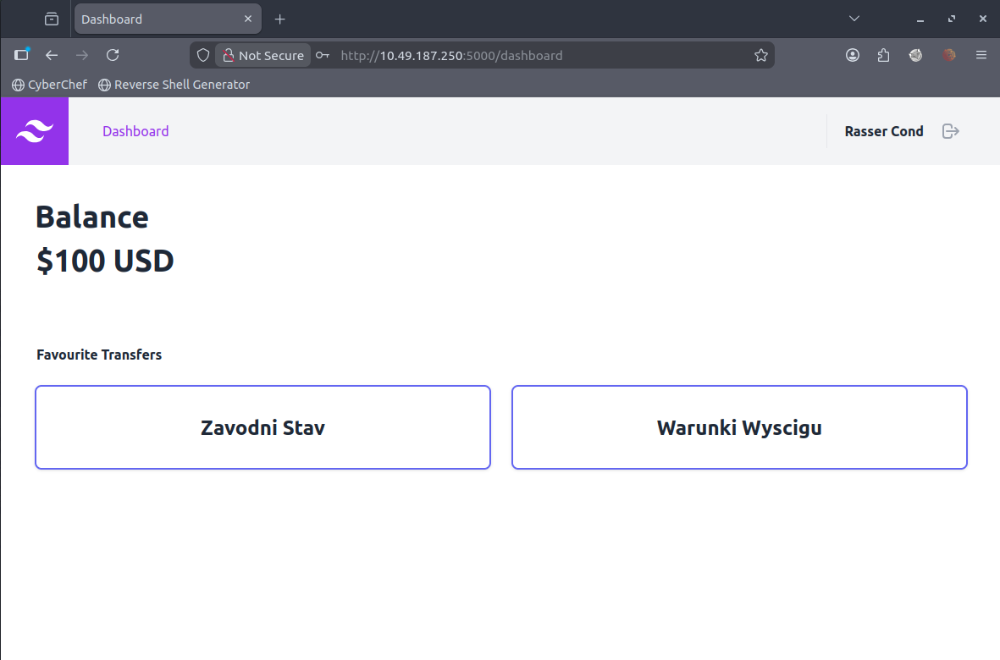

I'll try logging in as Rasser Cond first. Let's see.

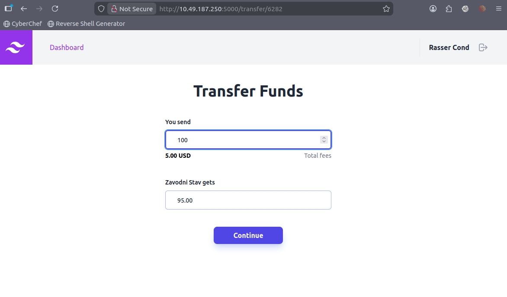

Let's try transferring $100. In this scenario, the target amount would only be $95 due to the $5 transfer fee. Let's enable FoxyProxy for Burp, then enable the intercept feature in Burp Suite, don't forget.

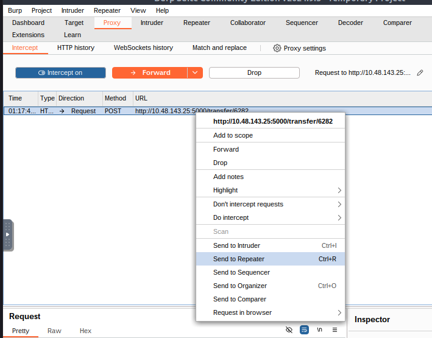

Send to repeater like before.

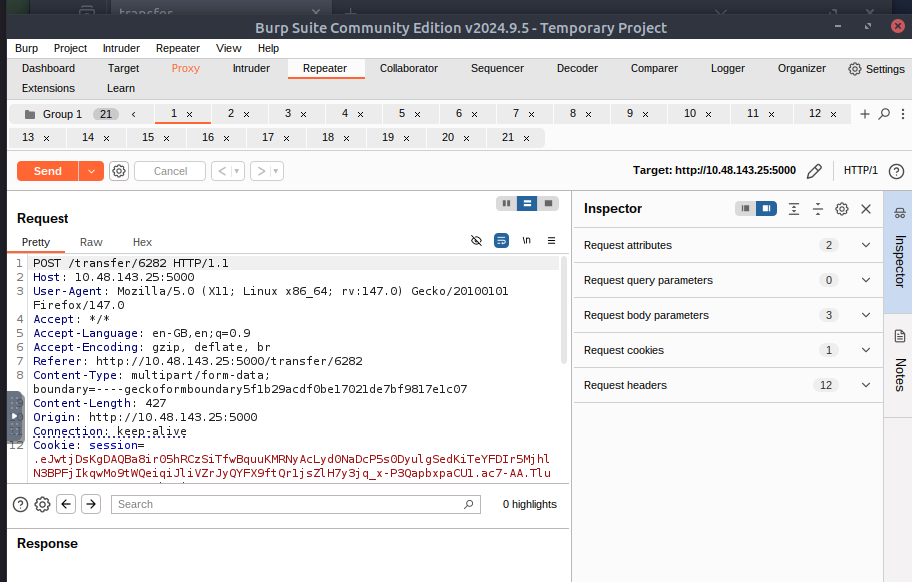

Create a text group as before, then duplicate the tab as before as well and multiply it to 20 as before as well.

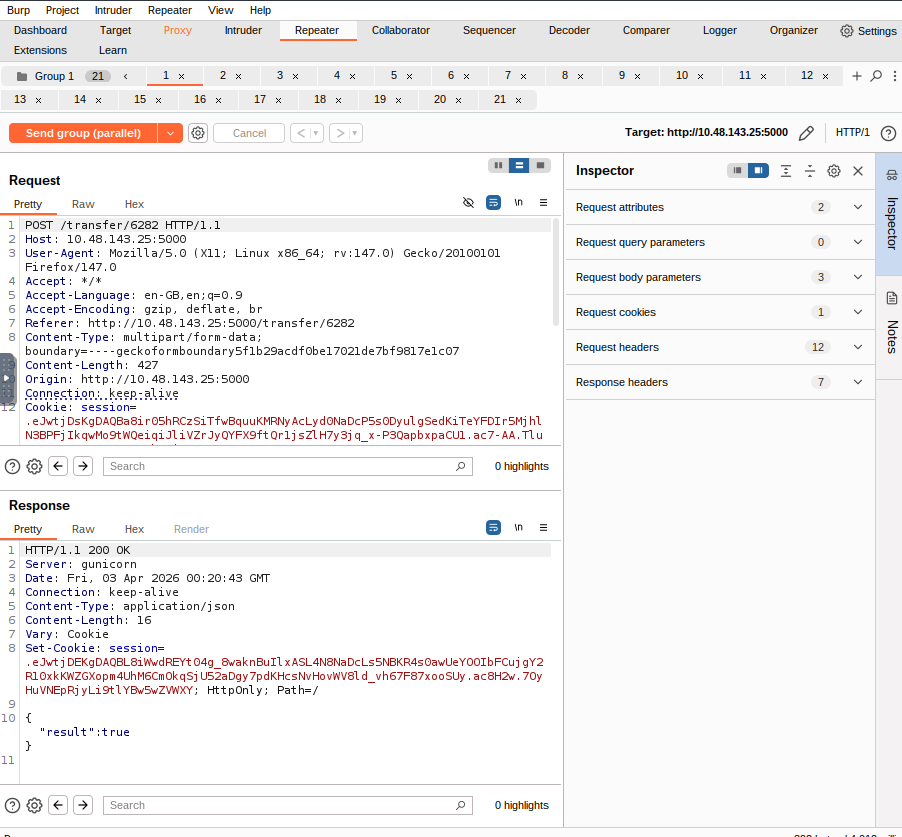

Then send the group in parallel and check one by one what is the status of each transaction.

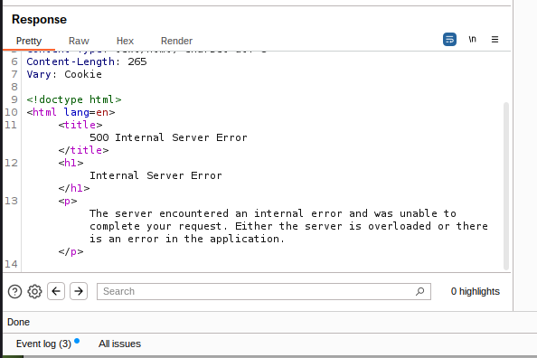

Because when I checked each transaction, there were some transactions that experienced internal server errors, but this was not a problem because some of them were successful.

Then we need to check and validate the transaction. Is the balance correct?

To validate this, we need to log in to the other account that was used to send the balance previously. That account is the Zavodni Stav account. Let's get started.

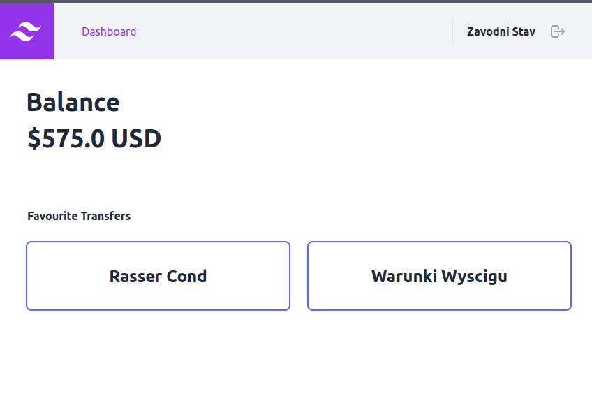

We can check whether some transactions were successful and the rest failed. We just need to send this balance to another account such as Warunki Wyscigu user account. let's do it like before.

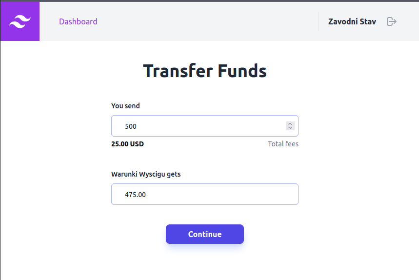

- Send to Repeater
- Create gorup tab
- Duplicate tab
- Send group (parallel)

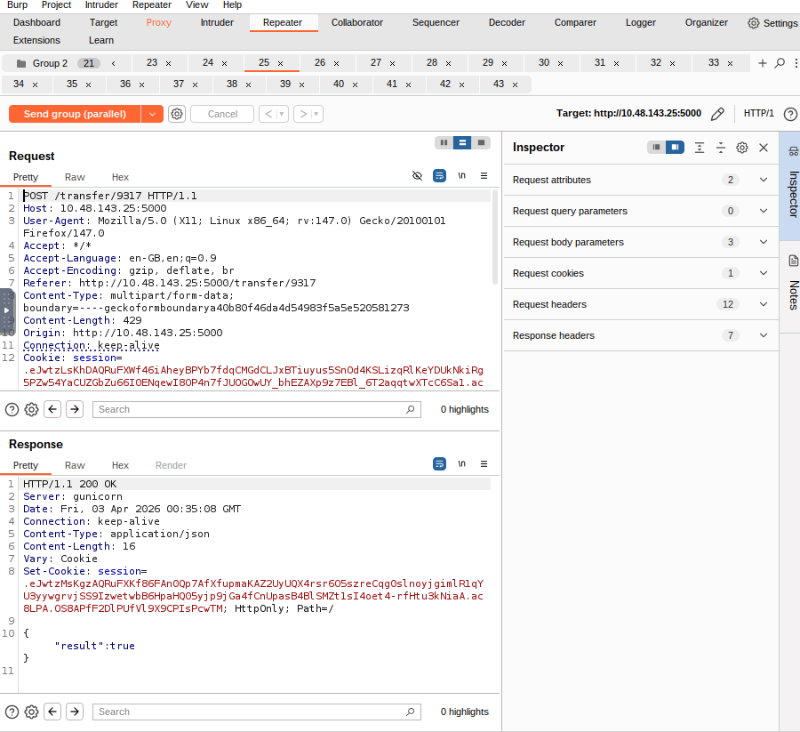

Because some transactions are true and then we just need to check Warunki Wyscigu.

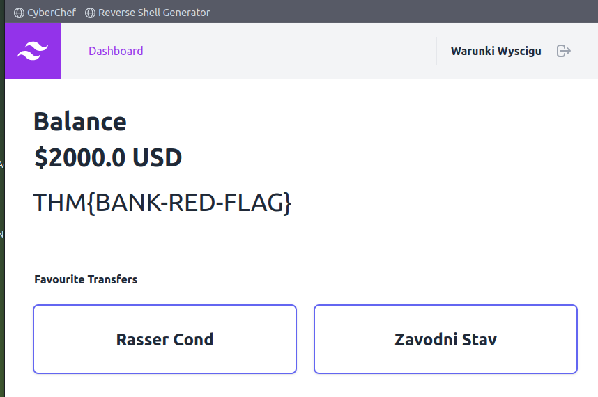

> THM{BANK-RED-FLAG}

Thanks for reading. See you in the next lab.
