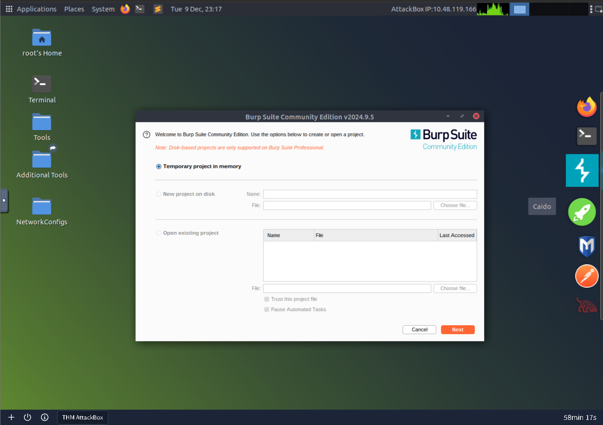
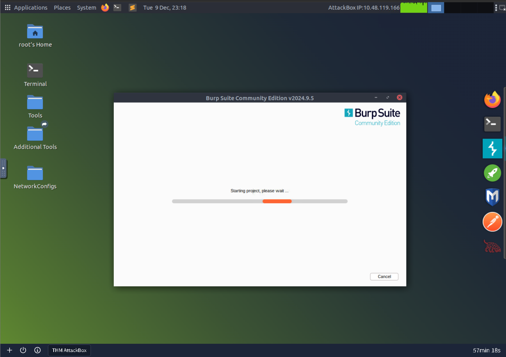
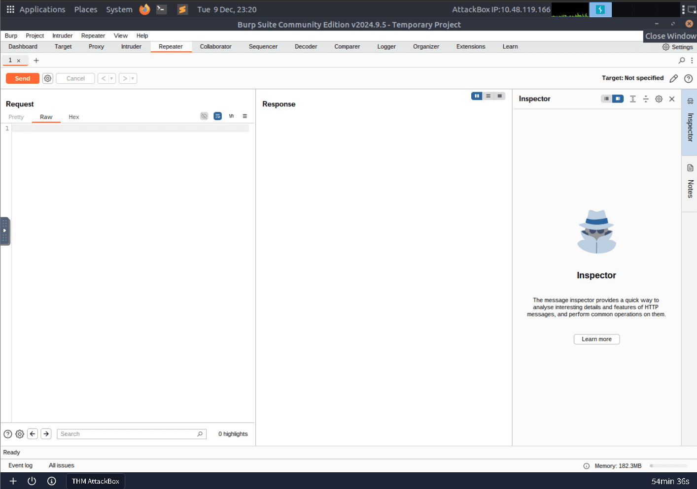
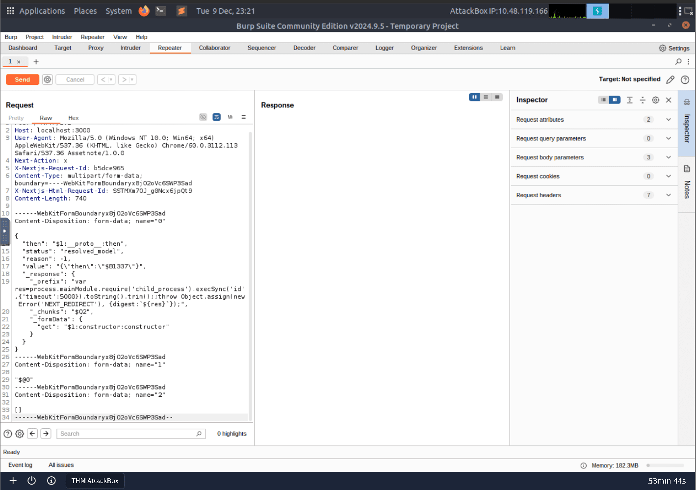
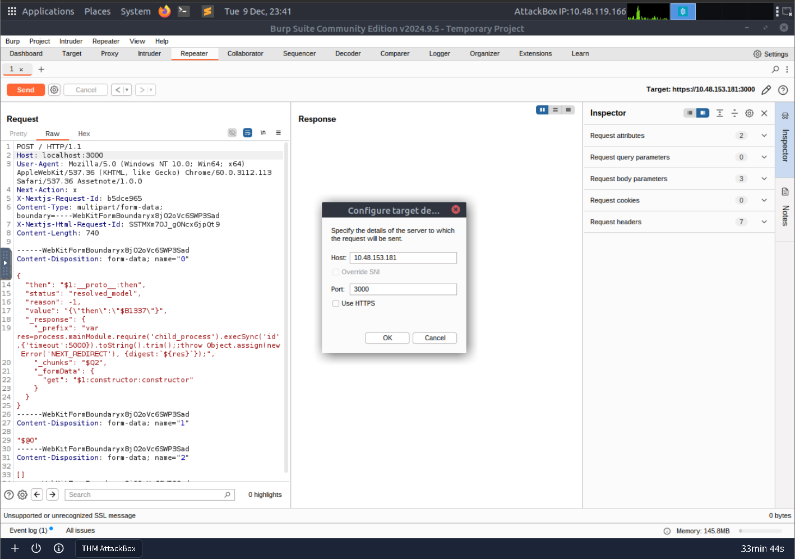
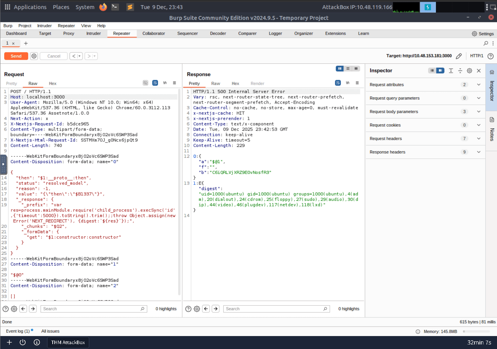
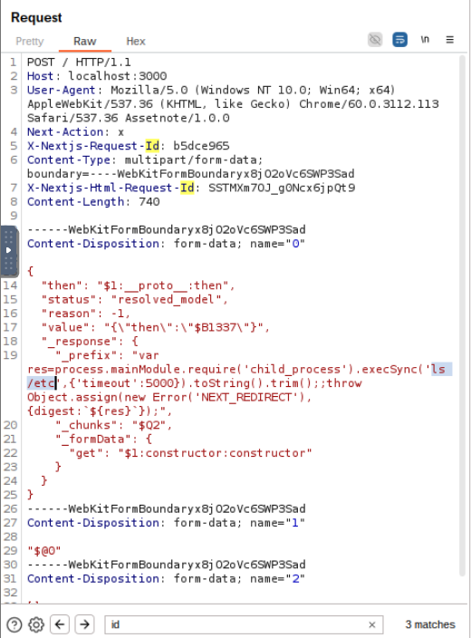
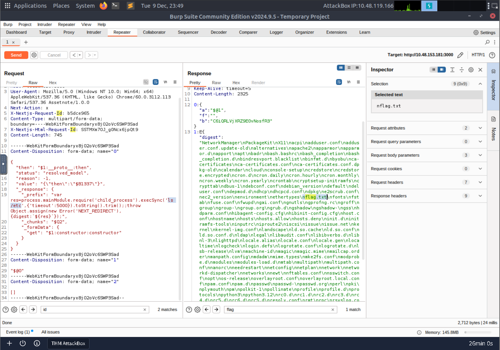
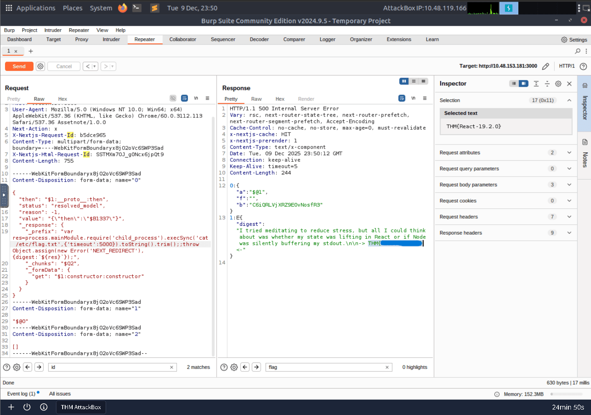

Here i want to share about my write-up for the room [React2Shell: CVE-2025-55182](https://tryhackme.com/room/react2shellcve202555182), explore the CVE-2025-55182 vulnerability in React server components. I wrote this in 2025 and hope it is useful for learning about cybersecurity.

## Task 1: Introduction

This task introduces CVE-2025-55182, dubbed "React2Shell," a critical vulnerability (CVSS 10.0) affecting React Server Components (RSC) and frameworks like Next.js. The flaw allows unauthenticated remote code execution via a specific HTTP request due to an unsafe deserialization issue. To mitigate this, users must update vulnerable packages (like `react-server-dom-webpack`) to patched versions (e.g., 19.0.1+).

**Having outlined the basics, let’s now dive into the key technical notes.**
> No answer needed

---

## Task 2: Understanding React Server Components and the Flight Protocol

This section explains the architecture of React Server Components (RSC), where components are rendered on the server for performance. The server-client communication relies on the **React Flight** protocol, which handles data serialization using specific markers like `$@` (for chunk references) and `$B` (for Blob references). The vulnerability stems from the server processing these references without properly validating if the requested properties are legitimate exports.

**What is the symbol that denotes a Blob reference?**
> $B

---

## Task 3: The Core Vulnerability: Unsafe Deserialization

CVE-2025-55182 is identified as an *unsafe deserialization vulnerability* located in the `requireModule` function of the `react-server-dom-webpack` package. The flaw exists because the code uses bracket notation (`moduleExports[metadata[2]]`) without validation. This allows an attacker to traverse the prototype chain (e.g., accessing `.constructor`) and obtain a reference to the global `Function` constructor, enabling arbitrary code execution.

**To deepen our understanding, let’s now study the exploitation chain through a proof-of-concept code analysis.**
> No answer needed

---

## Task 4: The Exploitation Chain: From Deserialization to Remote Code Execution

This task breaks down the exploit into three stages:

1. **Creating a Fake Chunk:** The attacker constructs a malicious object that references itself via the `then` property.
2. **Exploiting the Blob Handler:** Using the `$B` reference, the exploit triggers a function call (`_formData.get`) on the malicious object, which has been polluted to point to the `Function` constructor.
3. **Achieving Code Execution:** The payload (e.g., a Node.js `execSync` command) is passed to the `Function` constructor, executing the arbitrary command on the system.

**Let’s analyse an actual proof-of-concept exploit in the next task.**
> No answer needed

---

## Task 5: Analysing an Actual Proof-of-Concept

The content analyzes the raw HTTP POST request used for the attack. It requires the `Next-Action: x` header to trigger server-side processing. The body uses `multipart/form-data` containing three specific parts: the fake chunk object with the payload, a reference to that object (`$@0`), and an empty array. This vulnerability is highly critical because it affects default Next.js configurations and requires no authentication.

**It’s time to see the exploit in action.**
> No answer needed

---

## Task 6: Exploitation

In this practical task, users are instructed to use Burp Suite to attack a target VM on port 3000. The goal is to send the malicious payload to execute remote commands. The provided payload uses `execSync` to run the `id` command and returns the output in the server's response. The user must then modify the payload to read a flag located in `/etc`.

Burp Suite is launched using a temporary project.

Burp Suite initializes and loads the project environment.

You can confirm that you can view the app’s home page by visiting [IP_ADRESS]:3000. Now, it is time to exploit it. At the time of writing, our preferred choice is a payload that allows us to view the command execution result in the server’s response, as obtained from <https://github.com/Malayke/Next.js-RSC-RCE-Scanner-CVE-2025-66478>

A new Repeater tab is opened to craft the exploit request.

The malicious RSC payload is inserted into the request body.

The payload is modified to run ls /etc to search for the flag file.

The target IP and port (10.48.153.181:3000) are configured correctly.

**What is the name of the user running the vulnerable app?**
> ubuntu

The server response reveals the user information from the id command.

Listing /etc shows the presence of flag.txt.

Reading the file with cat /etc/flag.txt reveals the final flag.

**What is the flag in /etc?**
> THM{}

---

## Task 7: Detection

This section provides methods for detecting React2Shell attacks. The primary indicators are the presence of the `Next-Action` header combined with `multipart/form-data` containing specific suspicious JSON keys (like `"status": "resolved_model"` or `"$1:__proto__:then"`). A **Snort** rule is provided to detect these network signatures, and an **OSQuery** snippet is offered to scan endpoints for vulnerable versions of `react-server-dom-*` packages.

**I've read and am aware of the various elements that can be used to detect this vulnerability within my environment.**
> No answer needed

---

## Task 8: Conclusion

The conclusion reminds users to only perform penetration tests with explicit permission. It notes that many PoCs found online for this CVE are fake or broken. A valid PoC requires the specific vulnerable library versions (e.g., React 19.2.0, Next 16.0.6). The recommended mitigation is to run `npm audit` and upgrade servers to patched versions immediately.

**If you enjoyed this room, consider checking other rooms in the Recent Threats module.**
> No answer needed
