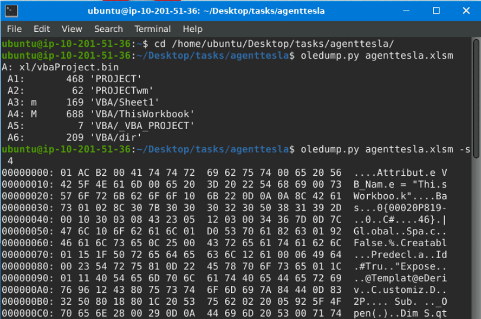
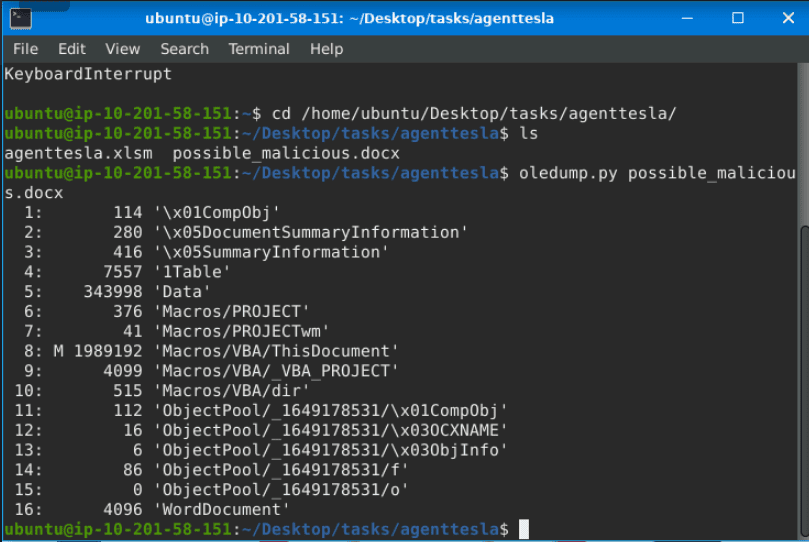
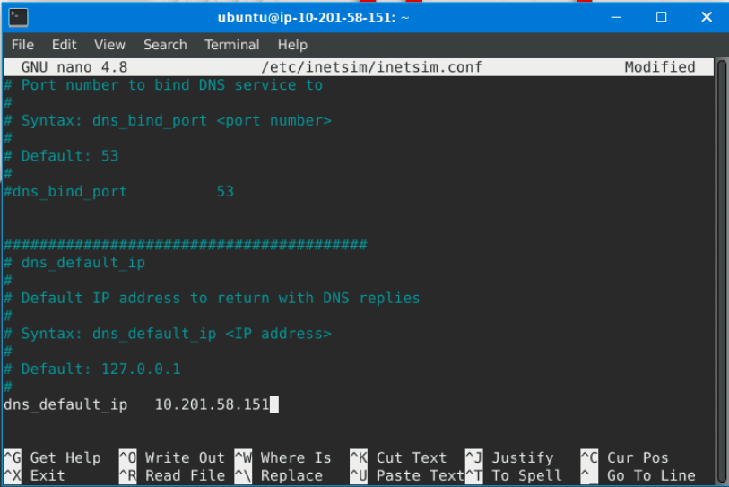
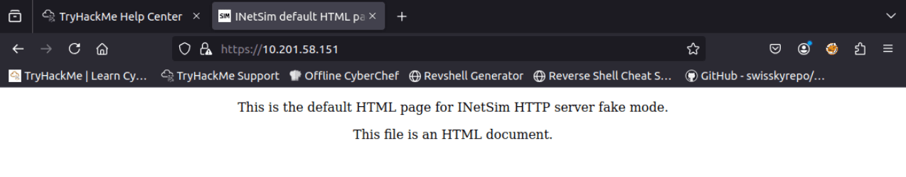
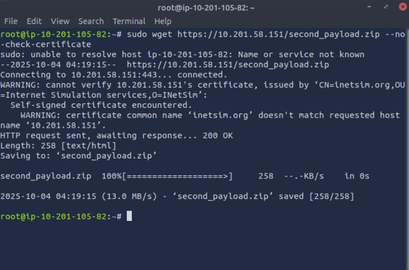
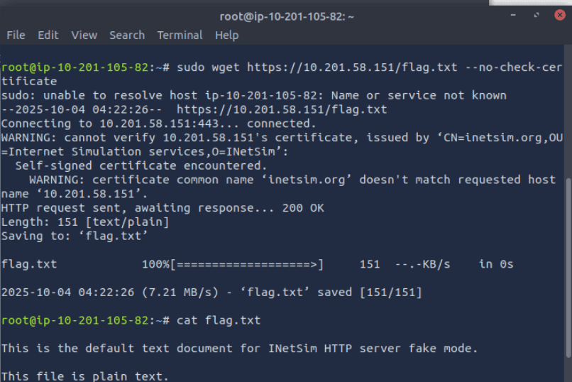
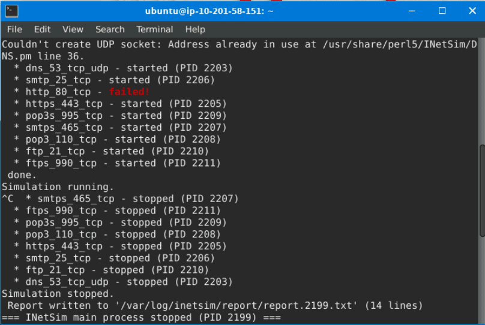
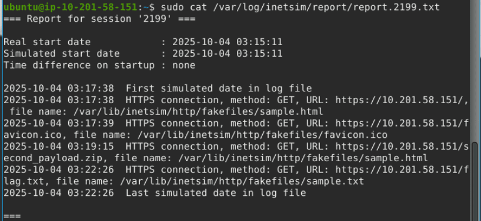
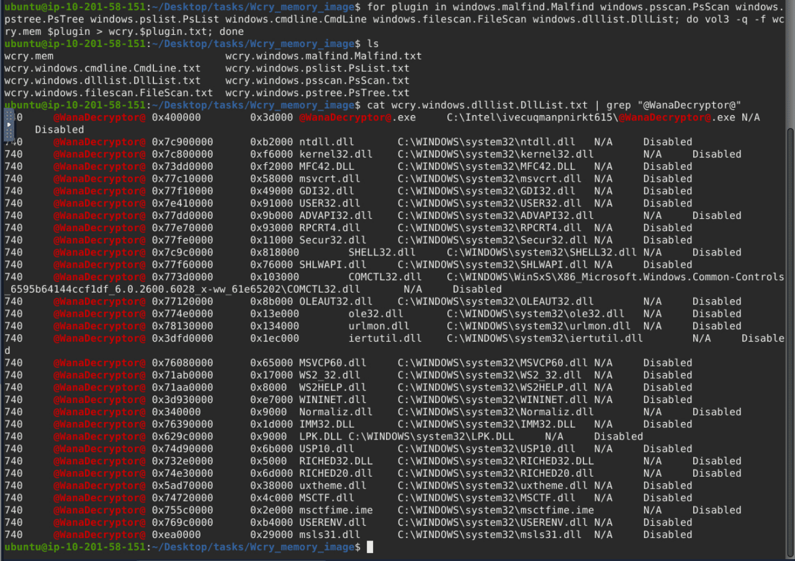

Here i want to share about my write-up for the room [REMnux: Getting Started](https://tryhackme.com/room/remnuxgettingstarted) (Premium Room), learn how you can use the tools inside the REMnux VM. I wrote this in 2025 and hope it is useful for learning about cybersecurity.

## Task 1: Introduction

The REMnux VM is a specialised Linux distro that provides a sandbox-like environment for dissecting potentially malicious software without risking your primary system. It already includes tools like Volatility, YARA, Wireshark, oledump, and INetSim.

Proceed with the next tasks to learn more!
>No answer needed

## Task 2: Machine Access

To complete this task, we will use the AttackBox and the attached virtual machine.

I'm excited to learn more about the tools inside the REMnux VM!
>No answer needed

## Task 3: File Analysis

Running `oledump.py agenttesla.xlsm` shows the file's data streams. A stream marked with a capital **M** indicates a Macro. To view the macro in a readable format, the command `oledump.py agenttesla.xlsm -s 4 --vbadecompress` is used.

Inside the decompressed script, a variable named **Sqtnew** contains an obfuscated PowerShell command. This command is deobfuscated using **CyberChef's Find/Replace** operation to remove the `*` and `^` characters.

The final, deobfuscated PowerShell command uses **Invoke-WebRequest** to download a file named `Doc-3737122pdf.exe` from the IP address. It then uses **Start-Process** to execute the downloaded file.

What Python tool analyzes OLE2 files, commonly called Structured Storage or Compound File Binary Format?
>oledump.py

What tool parameter we used in this task allows you to select a particular data stream of the file we are using it with?
>-s

During our analysis, we were able to decode a PowerShell script. What command is commonly used for downloading files from the internet?
>Invoke-WebRequest

What file was being downloaded using the PowerShell script?
>Doc-3737122pdf.exe

During our analysis of the PowerShell script, we noted that a file would be downloaded. Where will the file being downloaded be stored?
>$TempFile

Using the tool, scan another file named possible_malicious.docx located in the /home/ubuntu/Desktop/tasks/agenttesla/ directory. How many data streams were presented for this file?
>16

Using the tool, scan another file named possible_malicious.docx located in the /home/ubuntu/Desktop/tasks/agenttesla/ directory. At what data stream number does the tool indicate a macro present?
>8

## Task 4: Fake Network to Aid Analysis

This uses **INetSim** (Internet Services Simulation Suite) to simulate a real network for dynamic analysis. It involves two machines: a **REMnux VM** running INetSim and an **AttackBox** to act as the client.

First, INetSim is configured by editing `/etc/inetsim/inetsim.conf` and changing the `dns_default_ip` value to the REMnux machine's IP address. The simulation is then started with the command `sudo inetsim`.

From the AttackBox, malware behavior is mimicked by downloading a secondary file from the INetSim server using the `wget` command, for example: `sudo wget https://10.201.58.151/second_payload.zip --no-check-certificate`.

Finally, after stopping INetSim, it creates a **connection report** in the `/var/log/inetsim/report/` directory. This report can be read using the `cat` command and shows all the connections made, including the requested URL, protocol, and the fake file that was served.

Download and scan the file named flag.txt from the terminal using the command sudo wget <https://10.201.58.151/flag.txt> --no-check-certificate. What is the flag?
Tryhcakme{______________}

After stopping the inetsim, read the generated report. Based on the report, what URL Method was used to get the file flag.txt?
>get

## Task 5: Memory Investigation: Evidence Preprocessing

This task covers the preprocessing of evidence from a memory image named `wcry.mem` using the **Volatility 3** tool.

Several individual plugins are demonstrated, including:

* `windows.pstree.PsTree`: Lists processes in a tree.
* `windows.pslist.PsList`: Lists all currently active processes.
* `windows.cmdline.CmdLine`: Lists process command line arguments.

To process the evidence in bulk, a **`for` loop** is used in the terminal to run multiple plugins at once and save each output to a separate text file. The command used is:
`for plugin in [plugin_list]; do vol3 -q -f wcry.mem $plugin > wcry.$plugin.txt; done`

What plugin lists processes in a tree based on their parent process ID?
>PsTree

What plugin is used to list all currently active processes in the machine?
>PsList

What Linux utility tool can extract the ASCII, 16-bit little-endian, and 16-bit big-endian strings?
>Strings

By running vol3 with the Malfind parameter, what is the first (1st) process identified suspected of having an injected code?
>csrss.exe

Continuing from the previous question (Question 4), what is the second (2nd) process identified suspected of having an injected code?
>winlogon.exe

By running vol3 with the DllList parameter, what is the file path or directory of the binary @<WanaDecryptor@.exe>?
>C:\Intel\ivecuqmanpnirkt615

## Task 6: Conclusion

Fantastic room indeed!
>No answer needed
