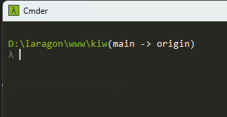
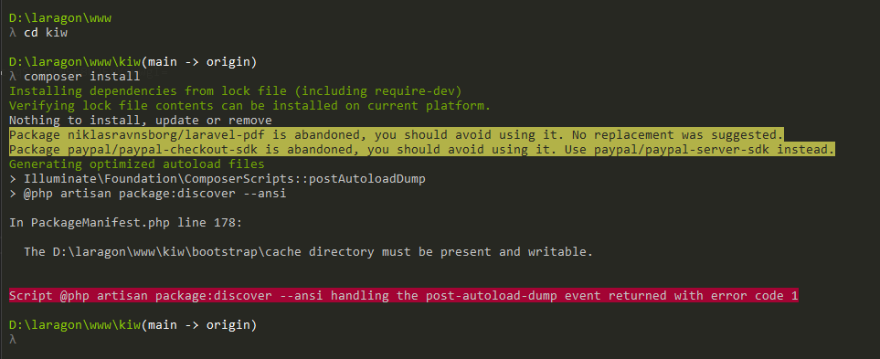
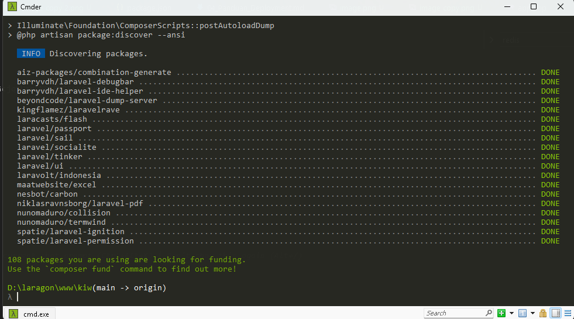
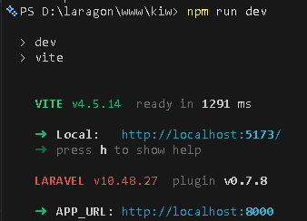

**Note:** This guide is based on a custom Laravel + Vue.js + MySQL project setup. Your configuration may differ depending on your Laravel version, infrastructure, or environment (e.g., Docker, Sail, Redis, queue workers, etc.)

## 1. Clone and Prepare the Project

First, get the source code and initialize the environment file:

```bash
git clone repository-url
cd project-folder
cp .env.example .env
composer install
php artisan key:generate
```

### Why Generate APP_KEY?

The `APP_KEY` is used by Laravel to encrypt user sessions and other sensitive data (like cookies and encrypted strings). Without it, your application will throw a 500 error or display:

> No application encryption key has been specified.

Running `php artisan key:generate` automatically adds a secure random string to your `.env` file.

## 2. Initial Directory Preparation

Before running any commands, ensure that the following core directories exist in your project root. These are often excluded from version control but are vital for the application to function:

- `public`
- `storage`
- `bootstrap`

## 3. Verify Environment Runtimes

Ensure your local environment has the necessary versions of PHP, Node.js, and NPM. Checking Composer is also crucial as it manages all your PHP dependencies.

```bash
php -v; composer --version; node -v; npm -v
```

Checking Composer ensures that the dependency manager is globally accessible and compatible with your PHP version.

## 4. Environment Configuration (.env)

Configure your `.env` file to point to your local development server:

```env
APP_URL="http://localhost:8000"
ASSET_URL="http://localhost:8000"
```

Next, ensure your MySQL service is active and the database credentials match your local setup:

```env
DB_CONNECTION=mysql
DB_HOST="localhost"
DB_PORT="3306"
DB_DATABASE="db"
DB_USERNAME="root"
DB_PASSWORD=""
```

## 5. Database Migrations and Data Seeding

Once your database is configured, you need to set up the tables and initial data.

If the project is new or has a clean migration history, run:

```bash
php artisan migrate
php artisan db:seed
```

### Handling Complex Databases

If the database is complex or migration files are missing/broken, it's often easier to import a SQL dump from a working environment.

**Exporting (from source):**

```bash
mysqldump -u username -p database_name > backup.sql
```

**Importing (to local):**

```bash
mysql -u root -p sql_kiw < backup.sql
```

## 6. Installing Dependencies

Open your terminal (e.g., Laragon's built-in terminal) and navigate to your project directory.



Install the PHP dependencies using Composer (if you haven't already in step 1):

```bash
composer install
```

## 7. Troubleshooting Common Issues

### Storage & Bootstrap Permission Issues

If you encounter "Permission denied" errors when Laravel tries to write logs or cache, you may need to grant write access to specific directories:

```bash
chmod -R 775 storage
chmod -R 775 bootstrap/cache
```

### Bootstrap Cache Errors

If you encounter errors related to the bootstrap directory during installation:



A common fix is to ensure the `bootstrap/cache` directory exists and is writable. In some cases, copying the `bootstrap` folder structure from a fresh Laravel installation or a known working environment can resolve initialization issues.

### Redis Connection Issues

If your local environment (like a default Laragon setup) does not have Redis installed, you might see the following error during `package:discover`:

```bash
Script @php artisan package:discover --ansi handling the post-autoload-dump event returned with error code 1
```

To fix this, switch your drivers to use the `file` or `database` system in your `.env` file:

**From:**

```env
CACHE_DRIVER=redis
SESSION_DRIVER=redis
QUEUE_CONNECTION=database
```

**To:**

```env
CACHE_DRIVER=file
SESSION_DRIVER=file
QUEUE_CONNECTION=sync
```

After updating the configuration, run the installation again to confirm success.



## 8. Serving the Application

Start the local development server:

```bash
php artisan serve
```

If the application fails to load, enable debug mode in `.env` to see detailed error messages:

```env
APP_DEBUG=true
```

To ensure you are not seeing stale configurations, run the following maintenance commands:

```bash
php artisan config:clear
php artisan cache:clear
php artisan view:clear
php artisan route:clear
```

## 9. Frontend Development (Vite & Vue.js)

For projects using Vue.js and Vite, you must install the Node dependencies and start the development server.

Install dependencies:

```bash
npm install
# Use --legacy-peer-deps if you encounter version conflicts
# npm install --legacy-peer-deps
```

### Vite Environment Variables

Some projects rely on specific environment variables in the frontend. You might need to add:

```env
VITE_APP_NAME="${APP_NAME}"
```

This allows Vite to access your Laravel application name during the build process or development.

Run the Vite development server:

```bash
npm run dev
```



The frontend source files are primarily located in `resources/js`. With Vite running, any changes you make to these files will be reflected instantly in your browser.

## Quick Setup Checklist

- [ ] Clone repository
- [ ] Create `.env` from `.env.example`
- [ ] Run `composer install`
- [ ] Run `php artisan key:generate`
- [ ] Configure `DB_*` in `.env`
- [ ] Run `php artisan migrate --seed` (or import SQL)
- [ ] Run `npm install`
- [ ] Run `npm run dev`
- [ ] Run `php artisan serve`
