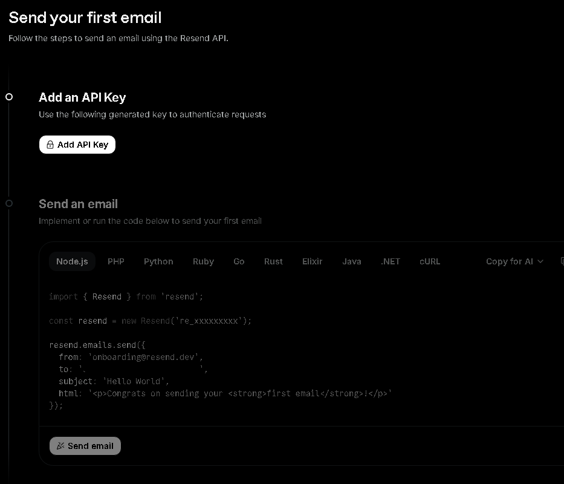
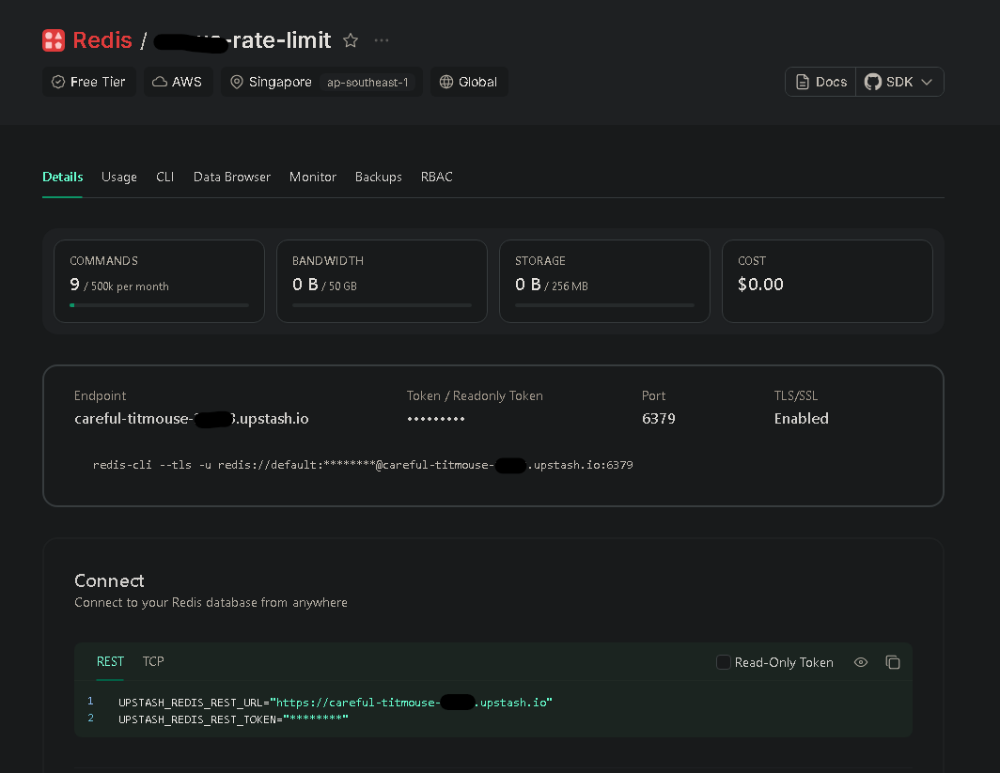
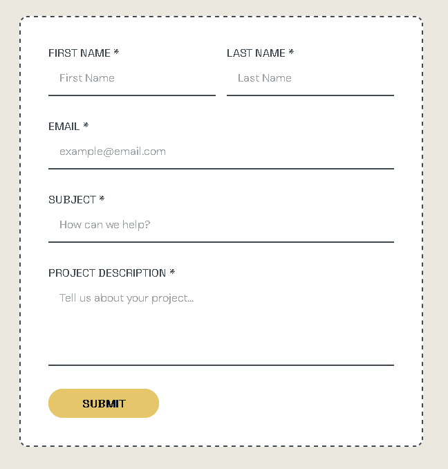

A contact form might look simple on the surface, but in production it carries real responsibility. It handles user data, triggers emails, and becomes a direct entry point to your system.

That’s why it needs three things from day one: **reliability**, strong **security**, and proper **spam protection**.

I’ve recently been setting up a solar energy website, and the shift from "Demo Mode" to "Production Mode" required a complete architectural pivot. Here is exactly how to do it.

## The Stack: Why Resend + Upstash?

Modern web development demands serverless-friendly solutions:

1. **Resend:** It’s built for developers. The API is clean, the dashboard is beautiful, and the deliverability is top-tier.
2. **Upstash Redis:** Client-side validation is a joke for bots. You need a server-side shield. Upstash gives you a serverless Redis instance that handles rate limiting with zero cold starts.

## Step 1: Setting Up the Email Engine (Resend)



First, forget about configuring SMTP ports. With Resend, you just need an API Key.

* **The Trap:** When you first sign up, you are restricted to `onboarding@resend.dev`.
* **The 403 Error:** Many devs hit a wall here. You cannot send emails to any recipient other than yourself until you verify your domain.

**Pro Tip:** If you need to send to a business email (e.g., `admin@example.com`) before your DNS propagates, just forward your Resend-verified personal email to the office inbox. It’s a 2-minute hack that saves hours.

## Step 2: Implementing the Rate Limiting Shield

Bots love contact forms. If you don't rate limit, you'll wake up to 10,000 spam emails and a suspended API account.



We use **Upstash Redis** to track IP addresses. By setting a 30-second window for each submission, we ensure that a single user (or bot) can't spam the "Submit" button. It’s the difference between a professional site and an expensive mistake.

## Step 3: Leveraging Astro Actions for Type Safety

Astro 5 introduced **Actions**, and it changed many thing. Instead of manually handling API routes and parsing JSON, Actions allow you to:

* Define a strict schema using Zod.
* Handle form data directly on the server.
* Get full type safety on the client side.

It makes the "Loading" and "Error" states easy to manage. No more messy `fetch()` calls with nested `try/catch` blocks.

## Dealing with the "Cross-site POST" Error in Production

When you move your Astro site to a VPS or a specific hosting provider, you might encounter a frustrating error: `Cross-site POST form submissions are forbidden`.

This is Astro's built-in CSRF protection. If the `Origin` header doesn't match your `site` configuration in `astro.config.mjs`, Astro blocks the submission. This often happens when you're behind a proxy (like Nginx) or using a custom domain that doesn't perfectly match your config.

**The Fix:**
You can ensure your `site` property in `astro.config.mjs` matches your production URL exactly. Alternatively, if you're behind a proxy that strips or modifies headers, you can disable this check:

```javascript
// astro.config.mjs
export default defineConfig({
  // ...
  security: {
    checkOrigin: false
  }
});
```

## The "Honeypot" Technique: Invisible Security

One of my favorite tricks included in this setup is the **Honeypot field**. We add a hidden input that is invisible to humans but visible to bots. If a bot fills it out, the server immediately rejects the request without even calling the email API. It's a silent, effective killer for 90% of automated spam.

## The Implementation: From Client to Inbox



To understand how this template works, here is the journey of a single form submission:

1. **User fills the form:** Client-side validation (HTML5) does a quick check.
2. **JavaScript Interception:** The browser prevents a full-page reload and sends data via **Astro Actions**.
3. **Honeypot Check:** The server checks if the "hidden" field is filled. If yes -> Reject.
4. **Rate Limit Check:** Redis (Upstash) checks the user's IP. If too many requests -> Reject.
5. **Zod Validation:** Server-side schema validation ensures data is clean.
6. **Email Dispatch:** Resend API sends the data to your inbox.
7. **UI Feedback:** The user sees a success message without the page flickering.

### 1. The Server Action (The Brain)

```typescript
// src/actions/index.ts
import { Resend } from "resend";
import { Redis } from "@upstash/redis";

const resend = new Resend(import.meta.env.RESEND_API_KEY);
const redis = new Redis({
  url: import.meta.env.UPSTASH_REDIS_REST_URL,
  token: import.meta.env.UPSTASH_REDIS_REST_TOKEN,
});

export const server = {
  send: defineAction({
    accept: "form",
    input: z.object({
      name: z.string().min(3),
      email: z.string().email(),
      company: z.string().optional(), // Honeypot
    }),
    handler: async ({ name, email, company }, context) => {
      // 1. Honeypot check
      if (company) throw new ActionError({ code: "BAD_REQUEST" });

      // 2. Rate limiting (Upstash Redis)
      const ip = context.request.headers.get("x-forwarded-for") || "unknown";
      const { success } = await redis.incr(`limit:${ip}`);
      // (Add logic to check count and set expiry here)

      // 3. Send email (Resend)
      await resend.emails.send({
        from: import.meta.env.RESEND_EMAIL,
        to: import.meta.env.FROM_EMAIL,
        subject: `New Message from ${name}`,
        text: `Sender: ${email} \nMessage: ...`,
      });

      return { success: true };
    }
  })
};
```

### 2. The Form UI (The Face)

```html
<!-- src/components/sections/contact/ContactForm.astro -->
<form id="contact-form">
  <!-- Invisible to humans -->
  <input name="company" style="display:none" tabindex="-1" />
  
  <input name="name" required />
  <input name="email" type="email" required />
  
  <button id="submit-btn">Submit</button>
</form>
```

### 3. The Submission Logic (The Bridge)

```javascript
// Client-side Script
const { error } = await actions.send(new FormData(form));

if (error) {
  // Show error in UI
} else {
  // Show success and reset form
}
```

## Conclusion

By combining **Astro 5 Actions**, **Resend**, and **Upstash**, we’re building more than a form. We’re building a secure, reliable gateway for your business.

If this helped you level up your production mindset, give it a clap, share it with fellow devs, and follow for more practical, security-focused breakdowns.
