Here i want to share about my write-up for the room [Security Principles](https://tryhackme.com/room/flarevmarsenaloftools), learn about the security triad and common security models and principles. I wrote this in 2025 and hope it is useful for learning about cybersecurity.

## Task 1: Introduction

It is impossible to achieve perfect security, as no solution is 100% secure; therefore, the goal is to make it more difficult for adversaries to gain access.

Think how you would describe something as secure.
>No answer needed

## Task 2: CIA

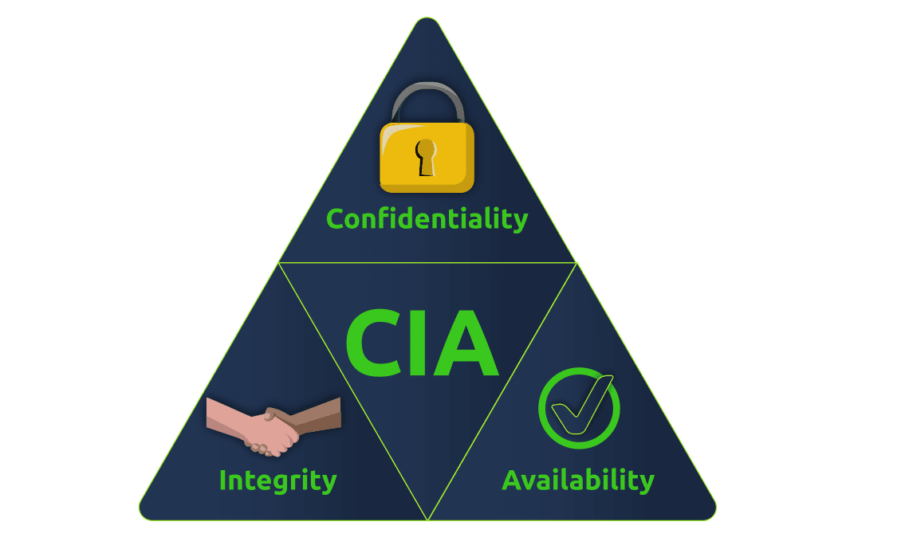

* **Confidentiality** ensures that only the intended persons or recipients can access the data.
* **Integrity** aims to ensure that the data cannot be altered, and that any alteration can be detected.
* **Availability** aims to ensure that the system or service is available when needed.

Beyond the CIA security triad, two additional concepts are:

* **Authenticity**: Ensuring that the data is from the claimed source.
* **Nonrepudiation**: Ensuring that the original source cannot deny that they are the source of the data.

Donn Parker proposed the **Parkerian Hexad**, a set of six security elements that includes the above and adds two more:

* **Utility**: Focuses on the usefulness of the information.
* **Possession**: Requires that we protect information from unauthorized taking, copying, or controlling.

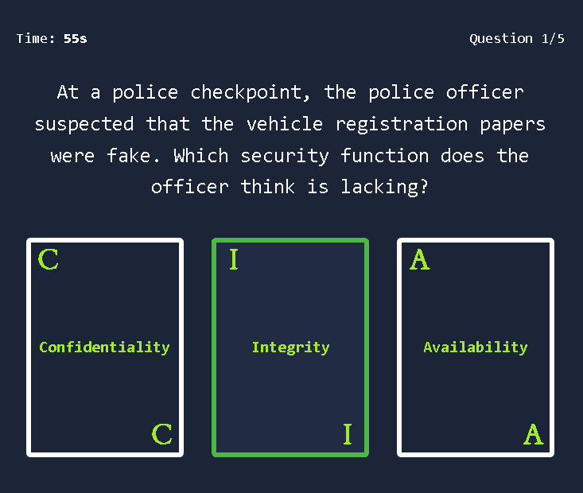

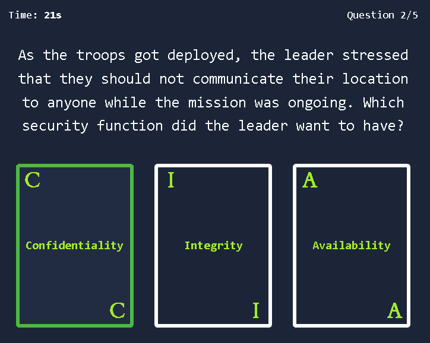

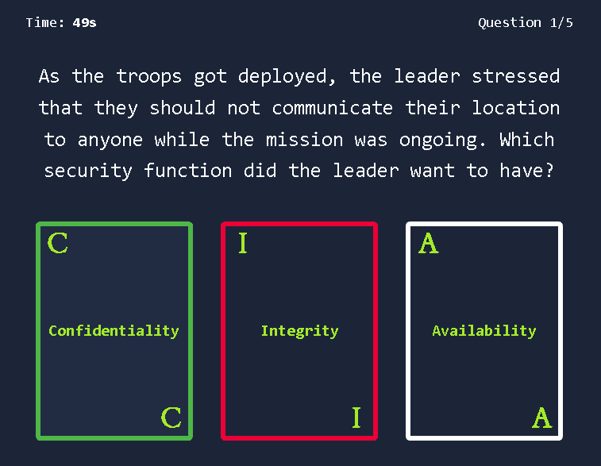

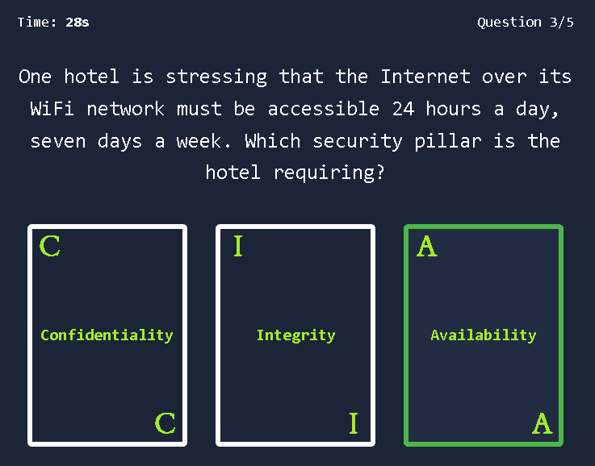

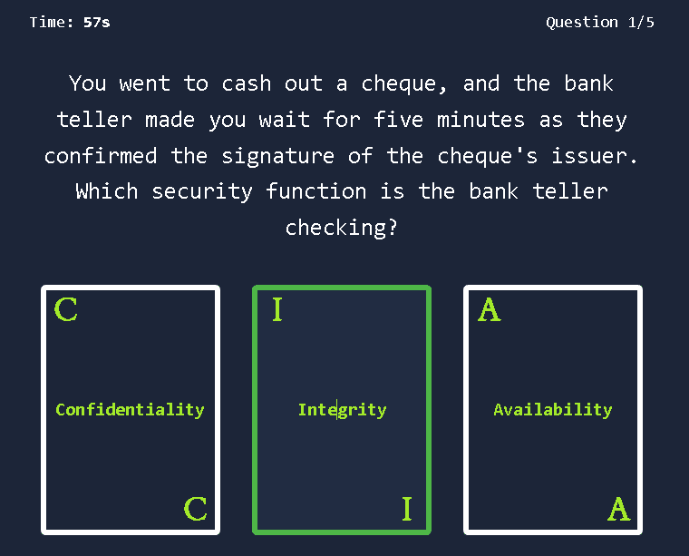

Click on "View Site" and answer the five questions. What is the flag that you obtained at the end?
>THM{________}

## Task 3: DAD

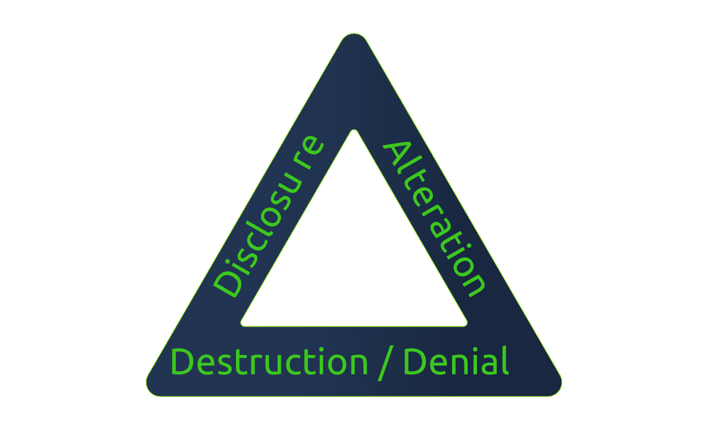

The opposite of the CIA Triad (Confidentiality, Integrity, Availability) is the **DAD Triad**: **Disclosure, Alteration, and Destruction**.

* **Disclosure** is the opposite of confidentiality. An example is an attacker stealing medical records and dumping them online.
* **Alteration** is the opposite of Integrity. An example is an attacker modifying patient medical records, which could be life-threatening.
* **Destruction/Denial** is the opposite of Availability. An example is an attacker making database systems unavailable, stalling a whole facility.

The attacker managed to gain access to customer records and dumped them online. What is this attack?
>Disclosure

A group of attackers were able to locate both the main and the backup power supply systems and switch them off. As a result, the whole network was shut down. What is this attack?
>Destruction/Denial

## Task 4: Fundamental Concepts of Security Models

Three foundational security models used to create systems that ensure security functions.

* **Bell-LaPadula Model**: Aims to achieve **confidentiality**. Its primary rules are the "Simple Security Property" (**no read up**), which states a subject at a lower security level cannot read an object at a higher level, and the "Star Security Property" (**no write down**), which states a subject at a higher level cannot write to an object at a lower level.

* **Biba Model**: Aims to achieve **integrity**. Its primary rules are the "Simple Integrity Property" (**no read down**), where a higher integrity subject should not read from a lower integrity object, and the "Star Integrity Property" (**no write up**), where a lower integrity subject should not write to a higher integrity object.

* **Clark-Wilson Model**: Also aims to achieve **integrity**. It uses concepts like the **Constrained Data Item (CDI)**, **Unconstrained Data Item (UDI)**, **Transformation Procedures (TPs)**, and **Integrity Verification Procedures (IVPs)**.

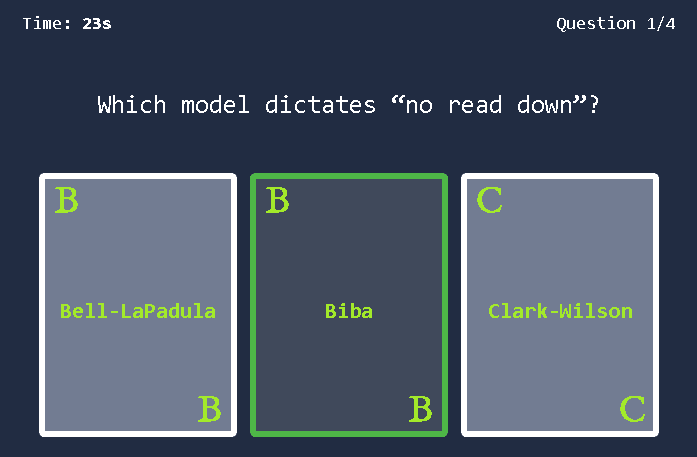

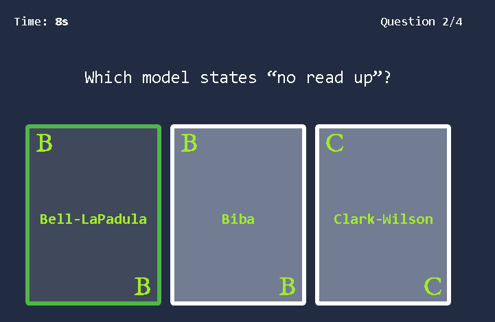

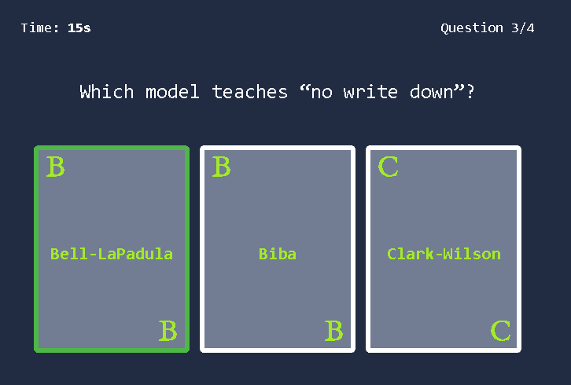

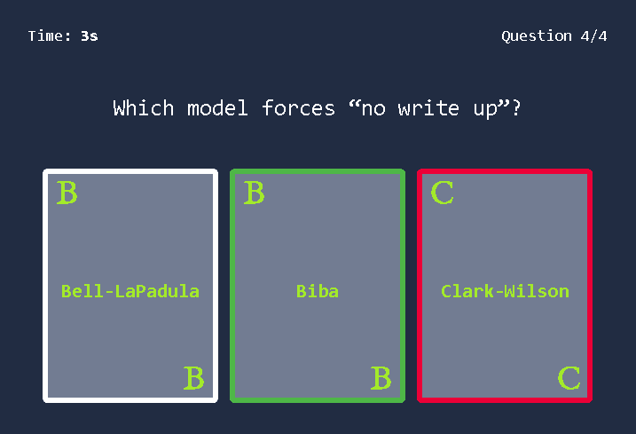

Click on "View Site" and answer the four questions. What is the flag that you obtained at the end?
>THM{_______________}

## Task 5: Defence-in-Depth

Defence-in-Depth refers to creating a security system of multiple levels; hence it is also called Multi-Level Security.

Make sure you have read the above.
>No answer needed

## Task 6: ISO/IEC 19249

Lists five **architectural principles**:

* **Domain Separation**: Every set of related components is grouped as a single entity or domain.
* **Layering**: A system is structured into many abstract levels or layers, making it possible to impose security policies at different levels.
* **Encapsulation**: Hiding low-level implementations and preventing direct manipulation of data.
* **Redundancy**: This principle ensures availability and integrity.
* **Virtualization**: Sharing a single set of hardware among multiple operating systems, which provides sandboxing capabilities.

It also lists five **design principles**:

* **Least Privilege**: Should provide the least amount of permissions for someone to carry out their task and nothing more.
* **Attack Surface Minimisation**: Aim to minimize vulnerabilities that an attacker might use, for example, by disabling any service we don’t need.
* **Centralized Parameter Validation**: The validation of parameters should be centralized within one library or system.
* **Centralized General Security Services**: As a security principle, we should aim to centralize all security services.
* **Preparing for Error and Exception Handling**: Systems should be designed to fail safe, and error messages should not leak confidential information.

Which principle are you applying when you turn off an insecure server that is not critical to the business?
>2 **Attack Surface Minimisation**

Your company hired a new sales representative. Which principle are they applying when they tell you to give them access only to the company products and prices?
>1 **Least Privilege**

While reading the code of an ATM, you noticed a huge chunk of code to handle unexpected situations such as network disconnection and power failure. Which principle are they applying?
>5 **Preparing for Error and Exception Handling**

## Task 7: Zero Trust versus Trust but Verify

The **Trust but Verify** principle teaches that we should always verify an entity and its behavior, even when we trust it. Verifying requires setting up proper logging and using automated security mechanisms like intrusion detection systems.

The **Zero Trust** principle treats trust as a vulnerability and tries to eliminate it, teaching, “never trust, always verify.” Every entity is considered adversarial until proven otherwise, and it does not grant trust based on location or ownership. Authentication and authorization are required before accessing any resource. **Microsegmentation**, where a network segment can be as small as a single host, is one of its implementations.

Make sure you have read the above.
>No answer needed

## Task 8: Threat versus Risk

* **Vulnerability**: In information security, a vulnerability is a weakness.
* **Threat**: A threat is a potential danger associated with this weakness or vulnerability.
* **Risk**: The risk is concerned with the likelihood of a threat actor exploiting a vulnerability and the consequent impact on the business.

An example is given of a showroom with glass doors (vulnerability). There is a threat that the glass can be broken, and the owners must consider the risk, which is the likelihood of the glass breaking and the resulting impact on the business.

Make sure you have read the above.
>No answer needed

## Task 9: Conclusion

Make sure you have taken notes of all the key terms and acronyms we covered in this room.
>No answer needed
