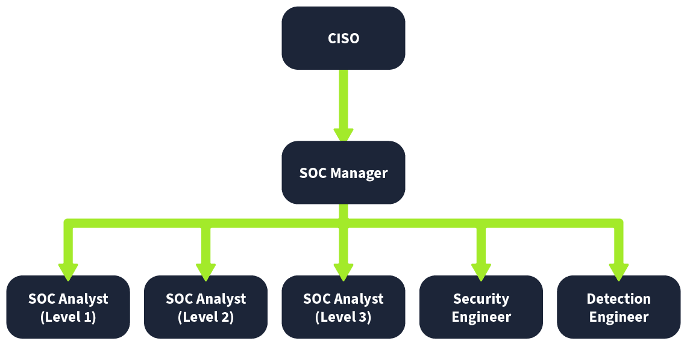
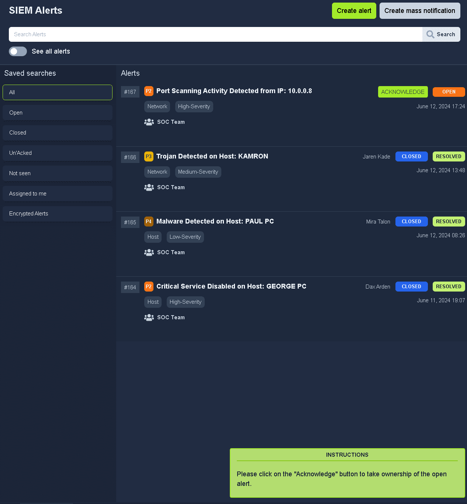

Here i want to share about my write-up for the room [SOC Fundamentals](https://tryhackme.com/room/socfundamentals), learn about the SOC team and their processes. I wrote this in 2025 and hope it is useful for learning about cybersecurity.

## Task 1: Introduction to SOC

This room will delve into some key concepts of SOC, one of the most important fields in defensive security.

### Learning Objectives

- Building a baseline for SOC (Security Operations Center)
- Detection and response in SOC
- The role of People, Processes, and Technology
- Practical exercise

What does the term SOC stand for?
>Security Operations Center

## Task 2: Purpose and Components

### Detection

- Detect vulnerabilities
- Detect unauthorized activity
- Detect policy violations
- Detect intrusions

### Response

- Support with the incident response

The SOC team discovers an unauthorized user is trying to log in to an account. Which capability of SOC is this?
>Detection

What are the three pillars of a SOC?
>People, Process, Technology

## Task 3: People

Alert triage and reporting is the responsibility of?
>SOC Analyst (Level 1)

Which role in the SOC team allows you to work dedicatedly on establishing rules for alerting security solutions?
>Detection Engineer

## Task 4: Process

At the end of the investigation, the SOC team found that John had attempted to steal the system's data. Which 'W' from the 5 Ws does this answer?
>who

The SOC team detected a large amount of data exfiltration. Which 'W' from the 5 Ws does this answer?
>what

## Task 5: Technology

Which security solution monitors the incoming and outgoing traffic of the network?
>Firewall

Do SIEM solutions primarily focus on detecting and alerting about security incidents? (yea/nay)
>yea

## Task 6: Practical Exercise of SOC

We can follow the instructions below.

The answer is a false positive because that is part of normal operation.

What: Activity that triggered the alert?
>Port Scan

When: Time of the activity?
>June 12, 2024 17:24

Where: Destination host IP?
>10.0.0.3

Who: Source host name?
>Nessus

Why: Reason for the activity? Intended/Malicious
Intended

Additional Investigation Notes: Has any response been sent back to the port scanner IP? (yea/nay)
>yea

What is the flag found after closing the alert?
>THM{000_INTRO_TO_SOC}

## Task 7: Conclusion

I understand the fundamentals of a SOC.
>No answer needed
