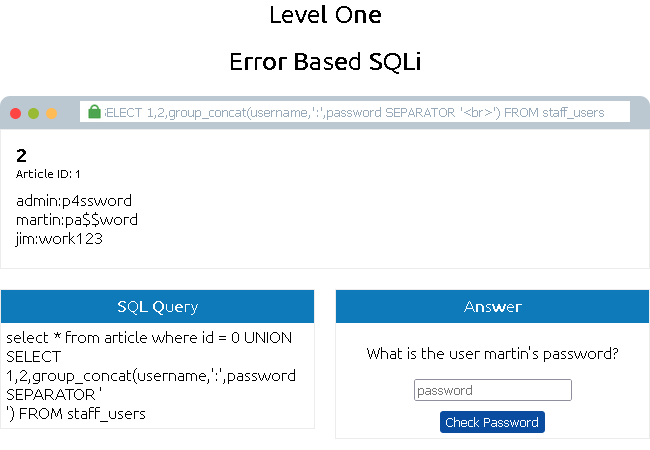
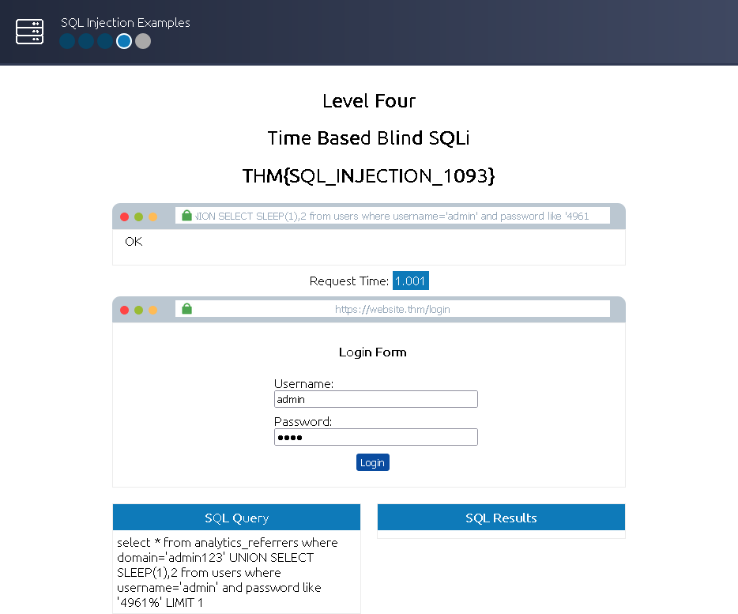

This is my write-up for the TryHackMe room on [SQL Injection](https://tryhackme.com/room/sqlinjectionlm). Written in 2026, I hope this write-up helps others learn and practice cybersecurity.

## Task 1: Brief

SQL (Structured Query Language) Injection (SQLi) is one of the oldest and most damaging web application vulnerabilities. It occurs when a web application passes unvalidated user input into a database query, allowing an attacker to execute malicious commands. This can lead to the theft, deletion, or alteration of private customer data and bypass authentication mechanisms.

**What does SQL stand for?**
> Structured Query Language

## Task 2: What is a Database?

A database is an electronic system for storing organized collections of data, controlled by a Database Management System (DBMS). In relational databases (like MySQL or PostgreSQL), data is stored in tables consisting of columns (fields with specific data types like integers or strings) and rows (records). Tables often share information using unique primary keys. Non-relational databases (NoSQL, like MongoDB) offer more flexibility by not strictly requiring a table, row, and column structure.

**What is the acronym for the software that controls a database?**
> DBMS

**What is the name of the grid-like structure which holds the data?**
> Table

## Task 3: What is SQL?

SQL is the language used to query and interact with relational databases. Key statements include:

* `SELECT`: Retrieves data (e.g., `SELECT * FROM users`). You can use `LIMIT` to restrict results and `WHERE` or `LIKE` (with `%` wildcards) to filter for specific data.
* `UNION`: Combines the results of two or more `SELECT` statements, provided they have the same number of columns and data types.
* `INSERT`: Adds new rows of data into a table.
* `UPDATE`: Modifies existing data within a table based on specified conditions.
* `DELETE`: Removes rows of data from a table.

**What SQL statement is used to retrieve data?**
> SELECT

**What SQL clause can be used to retrieve data from multiple tables?**
> UNION

**What SQL statement is used to add data?**
> INSERT

## Task 4: What is SQL Injection?

SQL Injection is introduced when unvalidated user input is directly appended into a database query. For example, if an application blindly trusts a URL parameter like `id=1`, an attacker can change it to `id=2;--`. The semicolon (`;`) tells the database that the current SQL statement has ended, and the double dashes (`--`) treat the remainder of the legitimate query as a comment, allowing the attacker's injected logic to execute instead.

**What character signifies the end of an SQL query?**
> ;

## Task 5: In-Band SQLi

In-Band SQLi is the easiest to detect and exploit because the attacker uses the same communication channel to launch the attack and gather the results. There are two main types:

* **Error-Based:** The attacker injects characters (like `'` or `"`) to intentionally break the query. The resulting database error messages are displayed on the webpage, revealing the database structure.
* **Union-Based:** The attacker uses the `UNION SELECT` operator to append additional results to the page, making it the most common way to extract large amounts of data (such as querying `information_schema` to find table and column names).

**What is the flag after completing level 1?**

Actually, you just need to run the script that has been given from the task, and the last script is the script to get all the user passwords.

```bash
0 UNION SELECT 1,2,group_concat(username,':',password SEPARATOR '<br>') FROM staff_users
```



> THM{SQL_INJECTION_3840}

## Task 6: Blind SQLi - Authentication Bypass

Blind SQLi occurs when the application is vulnerable, but error messages are disabled, meaning the attacker gets little to no direct feedback. One of the simplest forms is Authentication Bypass. Login forms often just ask the database if a username and password match (true or false). By entering a payload like `' OR 1=1;--` into the password field, the attacker forces the database to evaluate the query as "true," bypassing the login entirely without needing valid credentials.

**What is the flag after completing level two?** (and moving to level 3)

Just use this script: `' OR 1=1;--` .Where the SQL query is: `select * from users where username='' and password='' OR 1=1;--' LIMIT 1; and get success to pass`

> THM{SQL_INJECTION_9581}

## Task 7: Blind SQLi - Boolean Based

Boolean-based SQLi relies entirely on the application's response changing based on a true or false outcome (e.g., a "username taken" vs. "username available" message). By injecting conditional statements and wildcard operators (like `database() like 'a%'`), an attacker can observe if the condition is true or false. Through a process of elimination, they can enumerate the database name, tables, columns, and data character by character.

**What is the flag after completing level three?**

In this section, you just need to understand the explanation in the assignment where we need to try various ways one by one for each character, starting from the database name, column name, field name, username, and password.

This enumeration process leads us to get the admin user and the password is 3845 and you will get the flag.

> THM{SQL_INJECTION_1093}

## Task 8: Blind SQLi - Time Based

Time-Based Blind SQLi is used when the application gives absolutely no visual indicators—no error messages and no true/false behavior differences. Instead, the attacker infers success based on the time the server takes to respond. By injecting time delay commands like `SLEEP(5)`, if the server pauses for 5 seconds before loading the page, the injected condition evaluated to true. This allows the same character-by-character enumeration used in Boolean-based SQLi.

**What is the final flag after completing level four?**

This is another enumeration process, but time-based. In this method, I reduced the time from 5 to 1 second to speed up the process. Okay, so since we're on task 4 and already predicted the database name is sqli_four,

So, you can validate with this payload to get the correct response: `referrer=admin123' UNION SELECT SLEEP(5),2 where database() like 'sqli_four';--`

Okay, since this method is the same as level three, I assume the other fields are the same. And when tested with the admin username, the response remains correct. Then we can verify whether the difference lies in the admin user's password.

`referrer=admin123' UNION SELECT SLEEP(1),2 from users where username='admin' and password like '4%`

The answer is correct. You can continue numbering up to 4 digits.



And this is the correct password that I found

> THM{SQL_INJECTION_MASTER}

## Task 9: Out-of-Band SQLi

Out-of-Band SQLi is less common and relies on two different communication channels. The attacker uses one channel (like a standard web request) to inject the malicious payload, and the database uses a second channel to send the stolen data back to the attacker. This often involves forcing the database server to make an external network call, such as an HTTP or DNS request, to a machine controlled by the attacker.

**Name a protocol beginning with D that can be used to exfiltrate data from a database.**
> DNS

## Task 10: Remediation

Developers can protect web applications from SQL Injection by implementing the following practices:

* **Prepared Statements (Parameterized Queries):** The SQL structure is defined first, and user inputs are treated strictly as parameters/data, preventing them from modifying the query structure.
* **Input Validation:** Employing allow-lists to strictly restrict input to expected strings, or filtering out malicious characters.
* **Escaping User Input:** Adding a backslash (`\`) before special characters (like `'` or `"`) so the database reads them as normal string text rather than executable commands.

**Name a method of protecting yourself from an SQL Injection exploit.**
> Prepared Statements

Thanks for reading. See you in the next lab.
