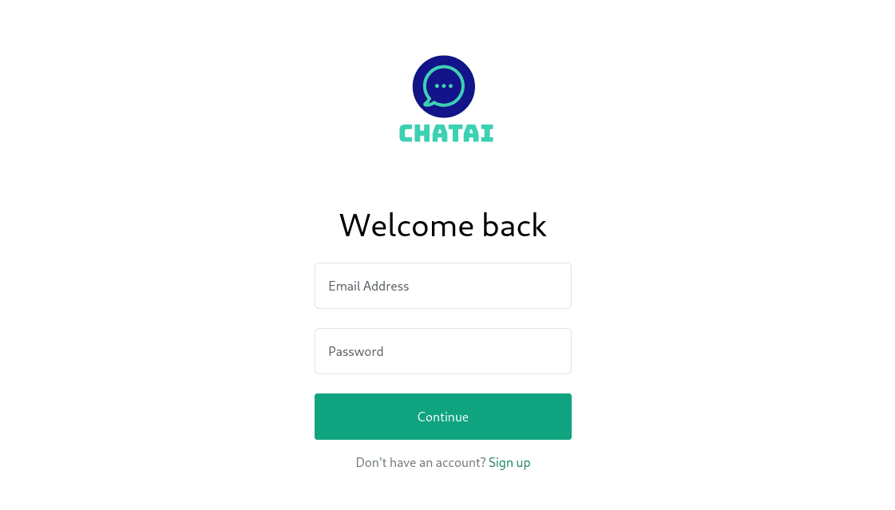
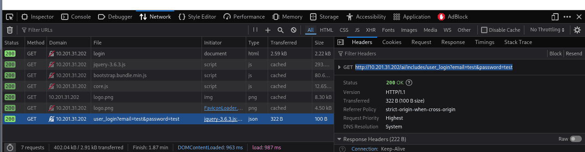
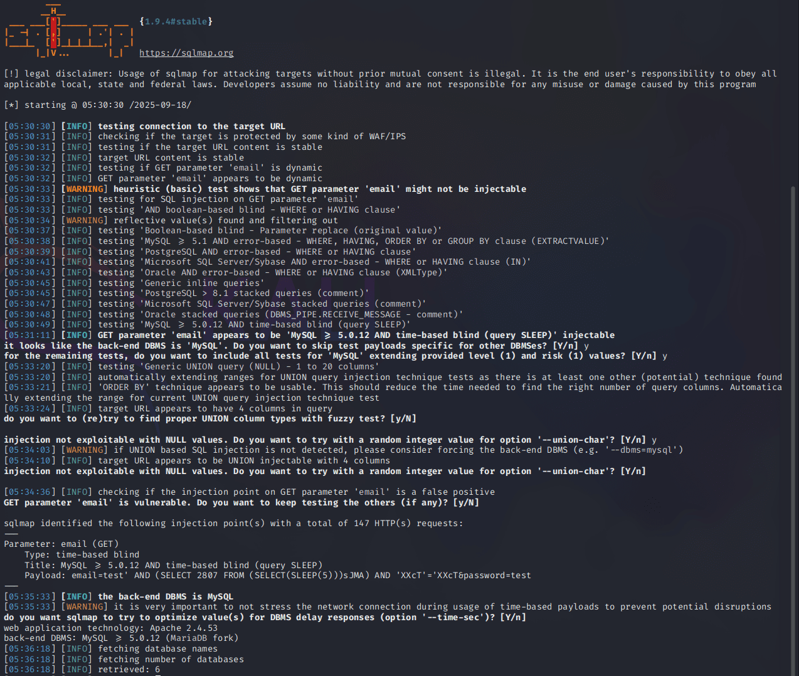
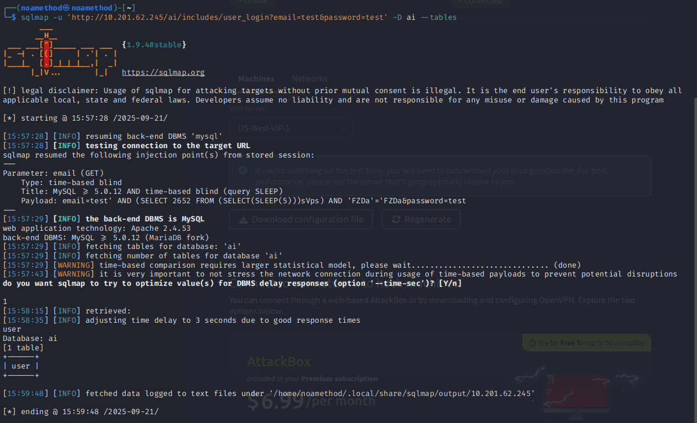

Here i want to share about my write-up for the room [Shells Overview](https://tryhackme.com/room/shellsoverview), learn about the different types of shells. I wrote this in 2025 and hope it is useful for learning about cybersecurity.

## Task 1: Introduction

### Learning Objectives

- SQL injection vulnerability
- Hunting SQL injection through the SQLMap tool

### Room Prerequisites

While having a solid [SQL Fundamentals](https://tryhackme.com/room/sqlfundamentals) knowledge is helpful, it is not required to complete this room.

Which language builds the interaction between a website and its database?
>Sql

## Task 2: SQL Injection Vulnerability

When input is improperly sanitized, attackers can manipulate the input and write SQL queries to perform SQL injection attacks.

For example, on a login page, an attacker can change the query from `SELECT * FROM users WHERE username = 'John' AND password = '...'` to the following by entering `abc' OR 1=1;-- -` as the password:

```sql
SELECT * FROM users WHERE username = 'John' AND password = 'abc' OR 1=1;-- -';
```

Because `1=1` is always true, it will ignore the random password and successfully execute the query, logging the attacker into John's account. The `-- -` comments out the rest of the original query.

Which boolean operator checks if at least one side of the operator is true for the condition to be true?
>OR

Is 1=1 in an SQL query always true? (YEA/NAY)
>YEA

## Task 3: Automated SQL Injection Tool

SQLMap is an automated tool for detecting and exploiting SQL injection vulnerabilities in web applications. For beginners, the `--wizard` flag will guide us through each step.

We can test a URL that uses GET parameters with the `-u` flag. After finding a vulnerability, we can use other flags to extract information:

- `--dbs` to extract all the database names.
- `-D [database_name] --tables` to extract tables from a specific database.
- `-D [database_name] -T [table_name] --dump` to extract records from a table.

For POST-based testing, we can use the command `sqlmap -r [intercepted_request.txt]`.

Which flag in the SQLMap tool is used to extract all the databases available?
>--dbs

What would be the full command of SQLMap for extracting all tables from the "members" database? (Vulnerable URL: <http://sqlmaptesting.thm/search/cat=1>)
>sqlmap -u <http://sqlmaptesting.thm/search/cat=1> -D members --tables

## Task 4: Practical Exercise

This task is to test SQL injection vulnerabilities on a login page hosted at `http://MACHINE_IP/ai/login`.



Since the GET parameters are not visible in the URL, we need to use the browser's inspect option and the Network tab to find the complete URL after a test login attempt. Alternatively, we can use the URL: `http://MACHINE_IP/ai/includes/user_login?email=test&password=test`.



We can run this following command `sqlmap -u 'http://MACHINE_IP/ai/includes/user_login?email=test&password=test' --dbs`



How many databases are available in this web application?
>6

We can run this following command `sqlmap -u 'http://MACHINE_IP/ai/includes/user_login?email=test&password=test' -D ai --tables`



What is the name of the table available in the "ai" database?
>user

We can run this following command `sqlmap u '<http://MACHINE_IP/ai/includes/user_login?email=test&password=test>' --dbs --tables -D ai -T user --dump


What is the password of the email <test@chatai.com>?
>12345678
