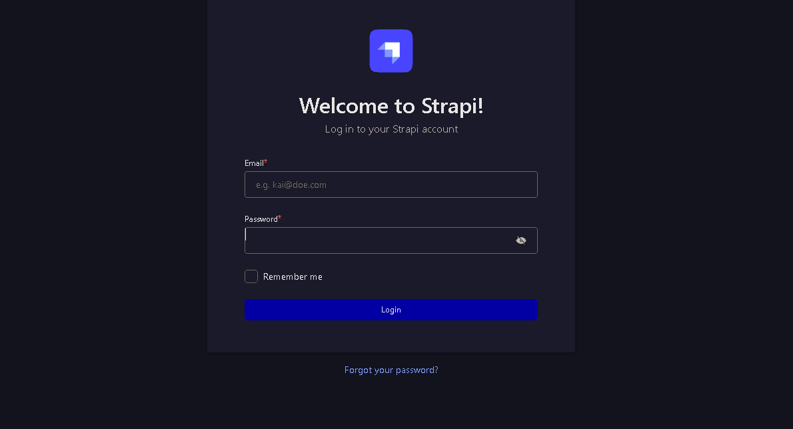
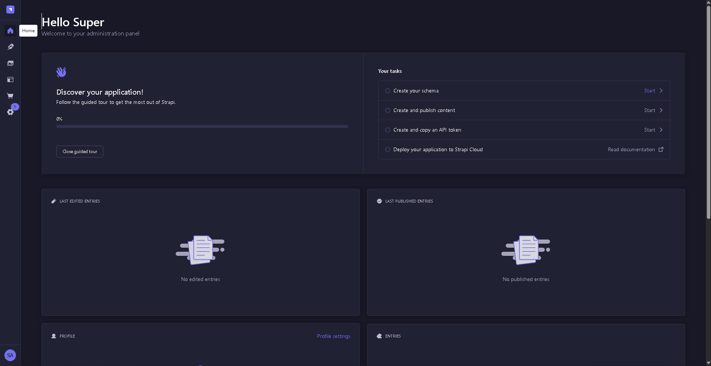

## Bismillah

This article shares an my experience in installing Strapi on a server. Strapi is a popular open-source headless CMS, offering a lot of freedom to build APIs.

The technology foundation used for this setup is a VPS with aaPanel.

## Phase 1: Preparation

1. **Preparing the Database:** Creating a new MySQL database via the "Databases" menu in aaPanel, complete with a user and password.

2. **Preparing the Node.js Environment:** Through the "App Store" in aaPanel, the "Node.js version manager" can be installed to select the latest LTS version.

3. **Strapi Installation:** Using the standard terminal command:

    ```bash
    npx create-strapi-app@latest api.domain-name
    ```

    An installation wizard appears and gives the following options:

      * Installation type: Custom (manual settings), to use the previously created MySQL database.
      * Database Client: MySQL
      * Example Data: No, due to a specific preference for product data.
      * TypeScript: Yes, for maintainability and type safety.
      * Git Initialization: Yes, to have version control from the very beginning.

Up to this point, there were no issues.

## Phase 2: Git

For developer portfolio purposes, contributions should be credited to the personal account (My username is `farrosfr`) even if the repository is in an organization. The solution is:

1. **Git Author Configuration:** Before the first commit, set the Git identity on the VPS with the command:

    ```git
    git config --global user.name "farrosfr"
    # Using the noreply email from GitHub for privacy
    git config --global user.email "ID+farrosfr@users.noreply.github.com"
    ```

2. **Authentication with Personal Access Token (PAT):**
    GitHub no longer accepts regular passwords for Git operations via HTTPS, so using a PAT is necessary.

After this, the first push to the organization's repository was successful, with the commit correctly displaying the personal account.

## Phase 3: Apache Configuration (Encountering 404 & 403 Errors)

After registering the Node.js project in aaPanel, I try to access `api.domain-name/admin` resulted in a "404 Not Found" error from the Apache Server.

**Incorrect Diagnosis:** Initially, my thought was to shut down Apache, as the aaPanel project should use Nginx. This was a wrong and dangerous assumption.

**Correct Diagnosis:** After checking the "Website" menu in aaPanel, it became clear that the VPS is an environment with many PHP-based websites, all running on Apache. Shutting down Apache would disable all those websites. The issue was a port conflict with Apache.

### Solution: Reverse Proxy

1. Deleting the project configuration from the "Node Project" menu to avoid overlaps.
2. Adding a new website in the PHP Project section with a static configuration.
3. Accessing the "Reverse Proxy" config.
4. A new reverse proxy rule was added there, targeting the internal Strapi application URL: `http://127.0.0.1:1337`.

The result was a success. The Strapi admin registration page finally appeared, allowing for account creation there.





## Phase 4: DNS, SSL, and PM2

1. **Setting up DNS:** Logging into the domain registrar to create the A record needed for SSL verification.
2. **Installing SSL:** Using Let's Encrypt to enable SSL.
3. **Running Permanently:** Re-registering the Strapi project in the "Node Project" menu. This ensures the application is managed by PM2.

> Alhamdulillah. Hopefully, this is useful.
