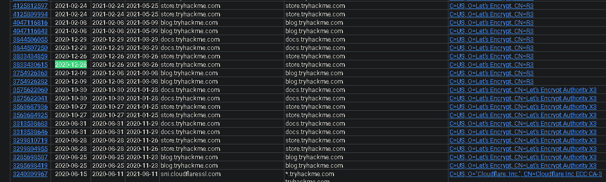
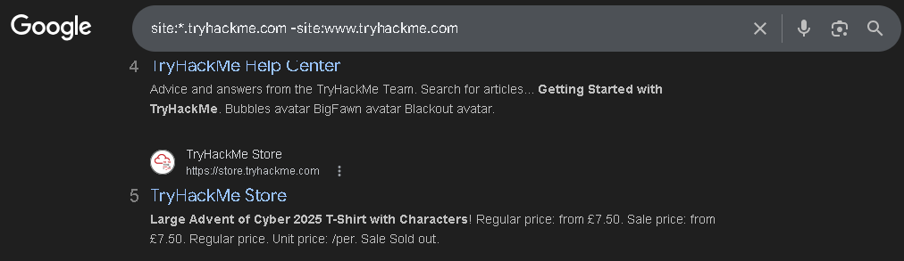
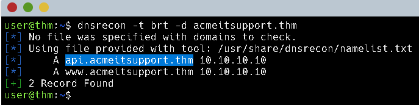
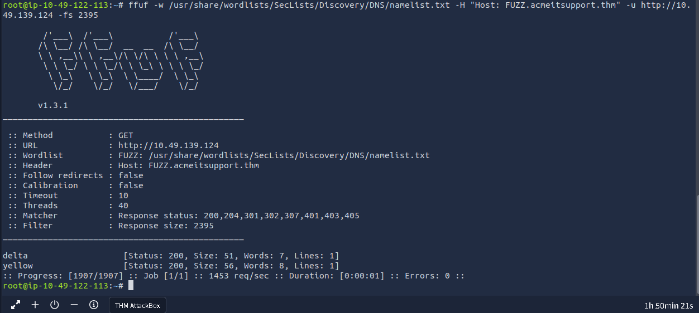

This is my write-up for the TryHackMe room on [Subdomain Enumeration](https://tryhackme.com/room/subdomainenumeration). Written in 2026, I hope this write-up helps others learn and practice cybersecurity.

## Task 1: Brief

Subdomain enumeration is the process of discovering valid subdomains for a specific domain to expand the attack surface and identify potential vulnerabilities. This module explores three main methods for finding these subdomains: Brute Force, OSINT (Open-Source Intelligence), and Virtual Host enumeration.

**What is a subdomain enumeration method beginning with B?**

> Brute Force

**What is a subdomain enumeration method beginning with O?**

> OSINT

**What is a subdomain enumeration method beginning with V?**

> Virtual Host

---

## Task 2: OSINT - SSL/TLS Certificates

When Certificate Authorities (CAs) create SSL/TLS certificates, they record them in publicly accessible databases known as Certificate Transparency (CT) logs. Designed to prevent the misuse of malicious or accidental certificates, these logs can be queried using services like crt.sh to uncover current and historical subdomains associated with a target domain.

**What domain was logged on crt.sh at 2020-12-26?**

kita bisa buka url ini yang mencari tryhackme.com <https://crt.sh/?q=tryhackme.com>



> store.tryhackme.com

---

## Task 3: OSINT - Search Engines

Search engines index a massive amount of links and can be leveraged to find new subdomains using advanced search modifiers. By utilizing operators like the `site:` filter (for example, `site:*.domain.com -site:www.domain.com`), you can exclude the main website and narrow down the search results to expose hidden subdomains.

**What is the TryHackMe subdomain beginning with S discovered using the above Google search?**



> store.tryhackme.com

---

## Task 4: DNS Bruteforce

DNS Bruteforce enumeration is a technique that involves testing thousands or millions of possible subdomains from a pre-defined wordlist. Because of the sheer volume of requests required, this method is automated using specialized tools like `dnsrecon` to quickly identify active subdomains.

**What is the first subdomain found with the dnsrecon tool?**



> api.acmeitsupport.thm

---

## Task 5: OSINT - Sublist3r

To make OSINT subdomain discovery faster and more efficient, you can automate the process using aggregation tools. Tools like Sublist3r pull data from multiple open-source intelligence engines and databases simultaneously, significantly speeding up the enumeration phase.

**What is the first subdomain discovered by sublist3r?**

> web55.acmeitsupport.thm

---

## Task 6: Virtual Hosts

Some subdomains (like development or admin portals) are kept private and aren't accessible via public DNS records. Instead, they rely on the server's `Host` header to serve the correct site from a single IP address. You can discover these hidden virtual hosts by automating Host header manipulation using fuzzing tools like `ffuf` (e.g., using the `FUZZ` keyword in the Host header) and filtering out false positives using the page size filter (`-fs`).

**What is the first subdomain discovered?**

run this script

```bash
ffuf -w /usr/share/wordlists/SecLists/Discovery/DNS/namelist.txt -H "Host: FUZZ.acmeitsupport.thm" -u http://10.49.139.124 -fs 2395
```



> delta

**What is the second subdomain discovered?**

> yellow

Thanks for reading. See you in the next lab.
